# Introduction

XPSWMM has advanced support for modeling dam break using a 2D model. In
this article, you will recreate the part 1 and part 2 of the [Tuflow dam
break tutorial](https://wiki.tuflow.com/index.php?title=Tutorial_M10#Introduction) in XPSWMM.

-   Part 1: 2D Variable Geometry Time Trigger - the dam break begins at
    0.5 hour and develops over 15 minutes.

-   Part 2: 2D Variable Geometry Water Level Trigger - the dam break
    begins when the water level at a point is triggered.

In this exercise, you will learn to

-   Build a dam behind the road

-   Add a breach

-   Simulate the inundation extent of the breach

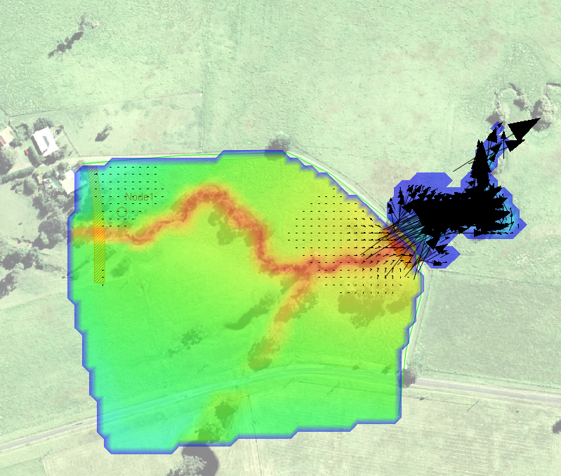

# Starter Model

1.  Open the **model\starer_model.xp**

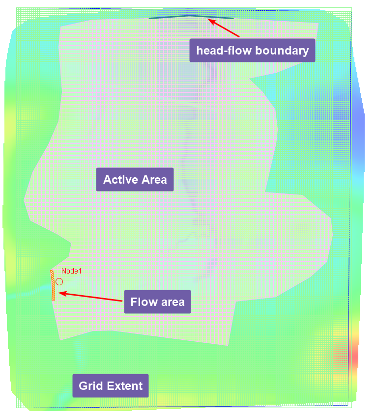

The 2d grid uses 5-meter cells.

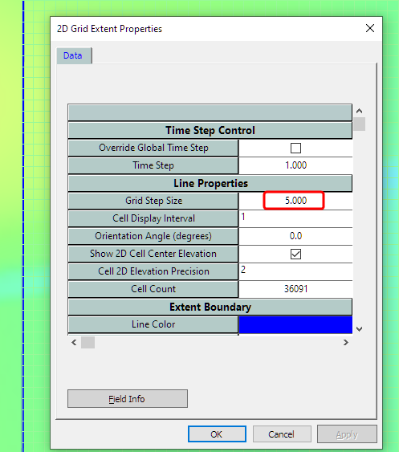

The boundary condition is 0.01 slope.

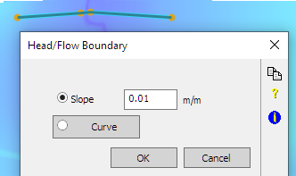

For inflow, we use a polygon rather than a single flow boundary for improved stability.

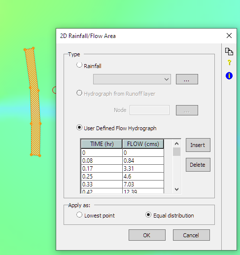

2.  Update the 2D settings to reference the grid in **model\grid\DEM.asc**

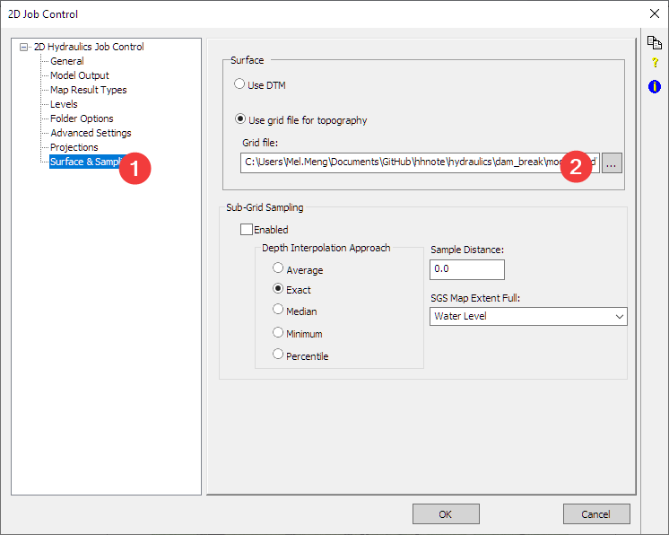

3.  Run the model and review the results. The road is serving as a dam that blocks the water behind it.

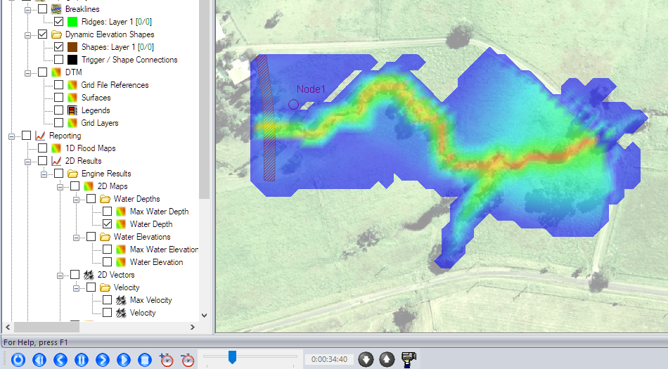

# Build a dam

Refer to model\build a dam.xp for the final model.

4.  Build the dam. We need to add a ridge line

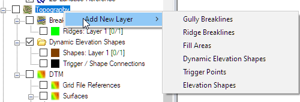

The dam will be built at where the current roads are. After drawing the line, (1) set the elevation to 65 m, and it needs to be a thick line.

NOTE: “thick” means the elevation of the cell will be modified by the ridge line, in this example, you are raising the whole road to 65m. “Thin” means only the side of the cell will be modified by the ridge line, it is more like a fence or thin wall installed along the road.

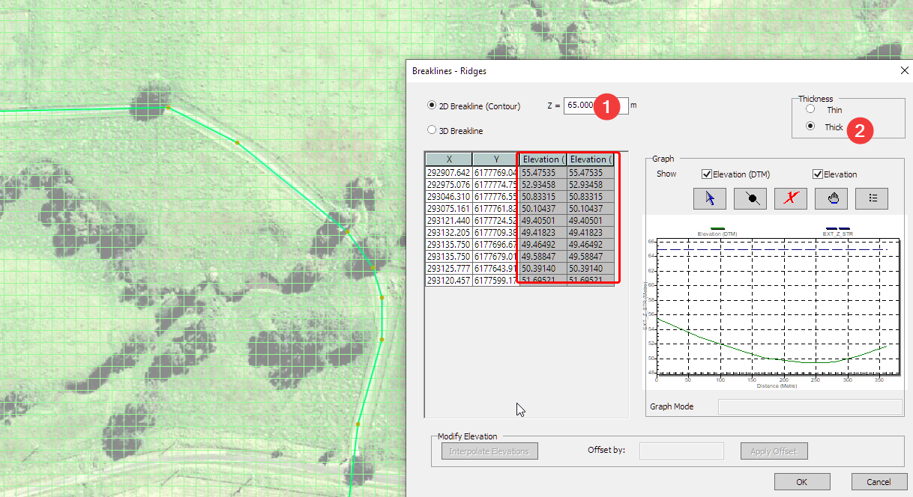

5.  Fill the pond behind the dam will some water.

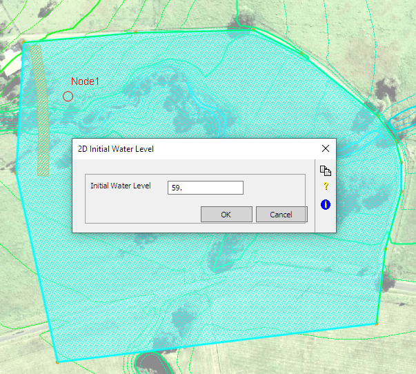

6.  Run the model and review the results. At the beginning of the model, we have water ponded behind the dam.

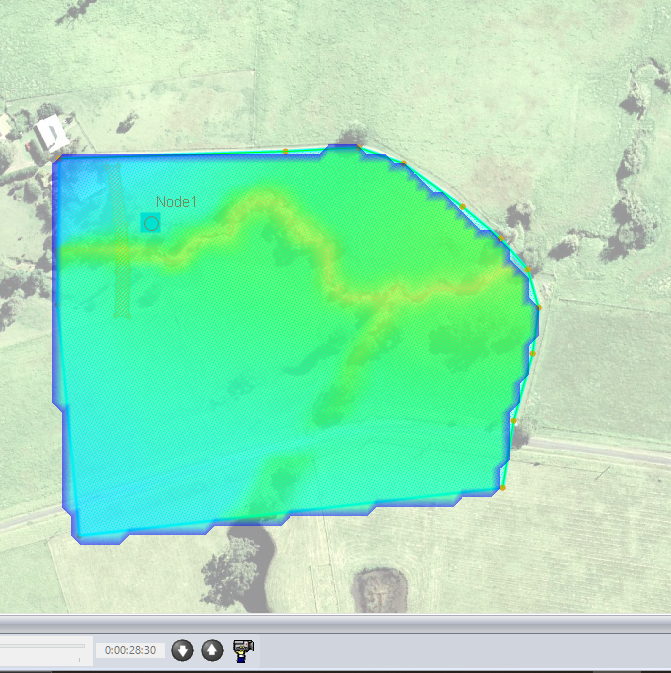

# Part 1 Dam break triggered by time

See **model/part1 dam break by time.xp** for the final model

7.  Add the dam break

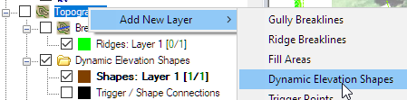

Then define the dam break: 
(1) the dam break will start 0.5hr after the simulation
(2)by the end of the break, the elevation of this polygon will be at 43m. 
(3) It will take 0.25hr for the breach to complete.

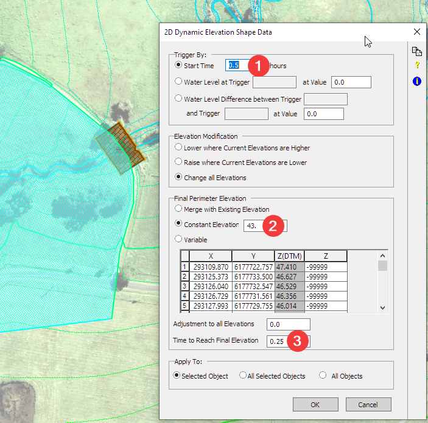

8.  Run the model and review the results. A little pass 30min the dam started to breach.

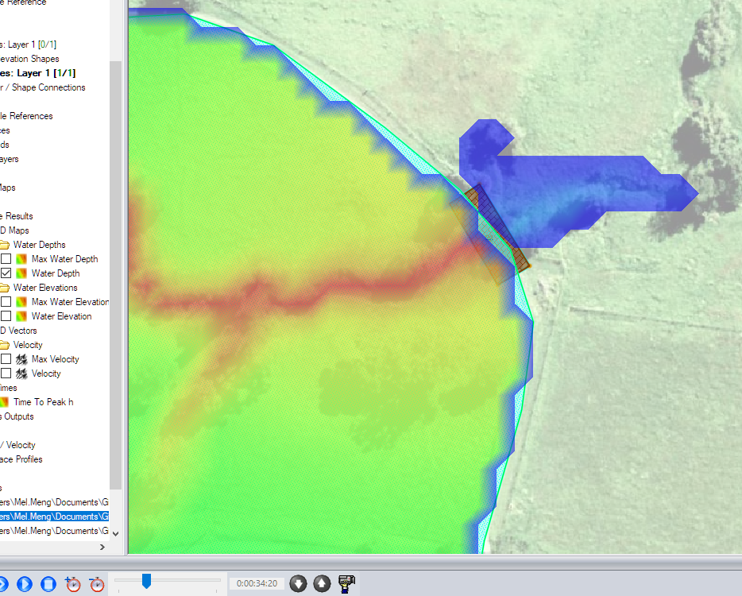

# Part 2: Dam break triggered by water level

A more common trigger for the dam break is the water level behind the dam. You need to add a trigger point to monitor the water level.

9.  Add trigger point.

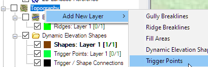

You (1) create the trigger point (2) hover the mouse at the center of the dam break polygon and drag it to the trigger point to associate them together.

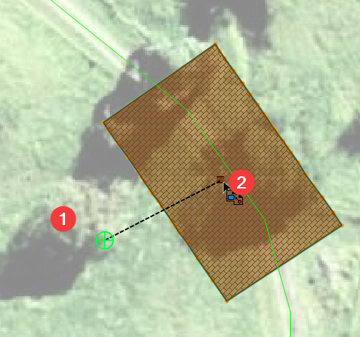

10. Now edit the dam break polygon. You can set the trigger at 60m, once the water level hits 60m at point 0, it will trigger the start of the dam break. Everything else works the same as the previous example.

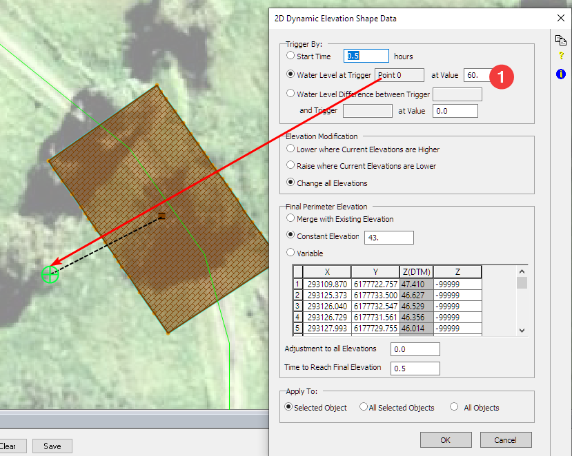

11. Get the level time series inside the dam

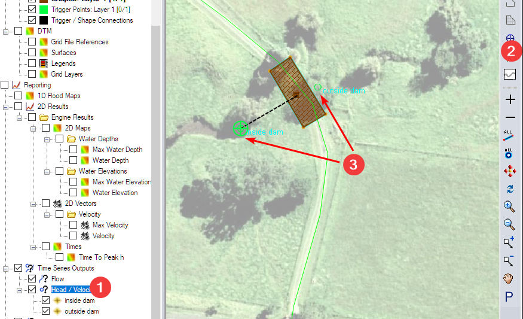

12. Run the model and review the results. Check the water level inside and outside of the dam.

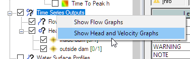

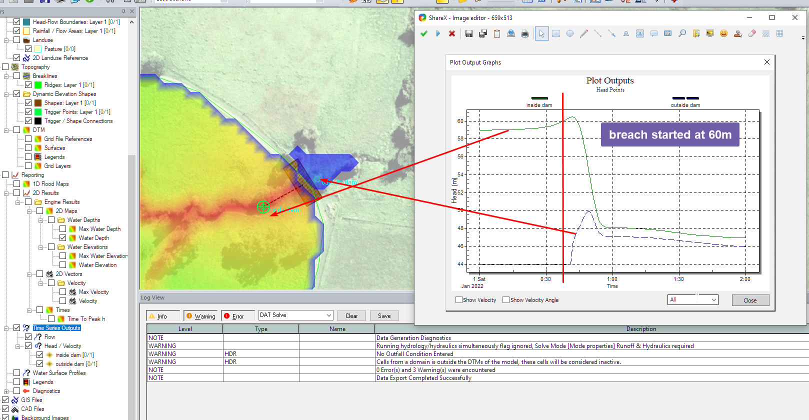

# Conclusion

In this article, you built a model to simulate dam break using a 2D model. The key steps include,

-   Model the dam

-   Setup the initial water depth inside the dam

-   Setup a dynamic elevation shape to simulate the dam break

-   Trigger the dam break using time, and water level

-   Review the dam break results using time series output
