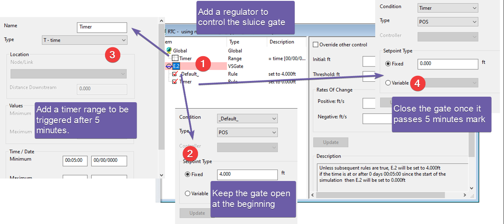

# Introduction

When modeling a storage tank in InfoWorks ICM, you’ll notice the storage tank is filled to the overflow elevation when the simulation starts. This is the result of initialization, a crucial step designed to prime the system with a thin layer of water. This is accomplished by injecting constant flows into the model until it attains a steady state.

While initialization ensures a smooth running of the model, it presents a challenge - the constant flow fills up the storage node.

# The Solution

One solution is shown in the following figure, the highlighted branch from E to the dummy_outfall diverts the flow away from storage node F at the beginning of the simulation, and once the simulation starts, the sluice gate closes to direct the water back to F.

With this setup, we can see at time 0, the water level in Node F is at the bottom.

# Setting up the dummy bypass

For the dummy bypass to work, the bypass pipe needs to be lower than the pipe flowing into F,

1.  Lower the upstream node E, so that the flow will be diverted to the dummy outfall.

2.  Add a sluice gate which will be closed using RTC after a few minutes.

3.  Add a gravity pipe and outfall to divert the flow

# Setting up the RTC (real time control) rules

Here is how to keep the sluice gate open at the beginning, and then closed once the simulation starts,

- Change the sluice gate “link_type” to VSGate so that we can apply RTC rules

<!-- -->

- Add a timer range to be activated after 5 minutes (make sure it is multiples of the simulation time step)

- Add a regulator for the sluice gate to close after 5 minutes

# Conclusion

Initialization is a crucial step in InfoWorks ICM, serving to prime the system with a thin layer of water for smooth simulations. However, this process can lead to unexpected initial conditions, such as a filled storage node. This article has provided a solution to circumvent this issue. By using a bypass outfall controlled with a Real Time Control (RTC) timer, we can ensure that structures that should initially remain dry are not prematurely filled.
