# Introduction

When modeling a dual drainage (also called major/minor) systems in a 1D model, you need to use an [inlet](https://help.autodesk.com/view/IWICMS/2025/ENU/?guid=GUID-3FAD07F7-2B29-4B60-888E-AB7FD41E7B2E). A typical set up includes,

- Overland flow on the street

- An inlet captures some of the flow into the underground pipes

- The bypass flow continues down the street

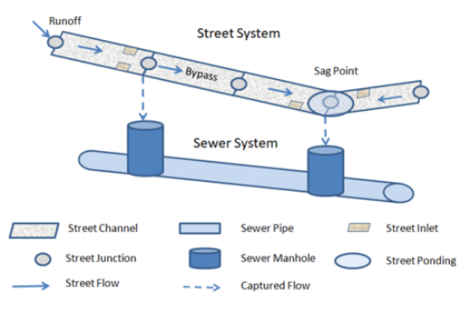

Image source: [SWMM5.2.0 Features](https://github.com/USEPA/Stormwater-Management-Model/blob/develop/doc/New%20SWMM%205.2%20Features.md)

InfoWorks ICM models such a system with,

- Streets as overland channels, the system type must be set as “overland”

- The node that connects to both the overland and underground pipes need to have a flood type set as either “inlet” or “gully”.

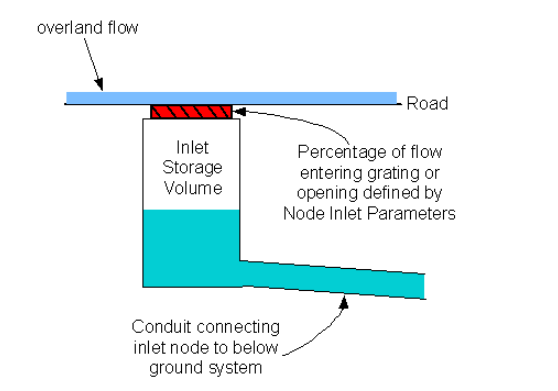

Here is an example, a gully is the same as an inlet with “head” input type.

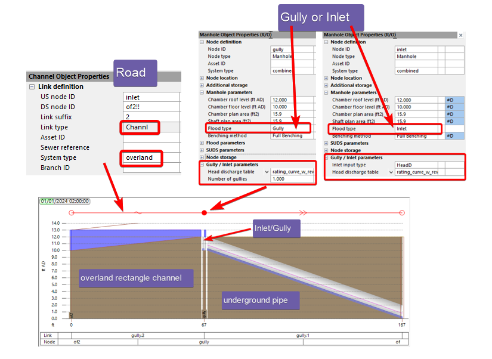

# Best practice

The flow conditions at the inlet are quite complicated to model directly. They are commonly estimated as simple correlations of the approaching flow conditions. A head discharge curve is commonly used to determine the flow captured from the approach flow depth on the road.

The head discharge curve uses,

- **inflow** as the discharge

- **Flood depth** as the head

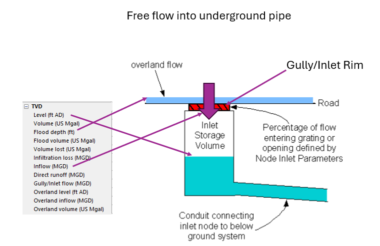

It should be noted the flood depth differs for inlet nodes and manholes without overland connections,

- For inlets: flood depth = Overland level – Ground level

- For manholes: flood depth = Level – Flood level (usually ground level)

Advanced inlet flow capture will be covered in another article. This article only focuses on using the head discharge curve.

# Overflow

When the underground pipes are full, water can overflow from the inlet onto the road. The same head discharge curve is applied to overflows. If the curve doesn’t define explicitly what happens when the flow is negative, interpolation will be used.

When overflow occurs, the water level in the manhole is higher than the water level on the street.

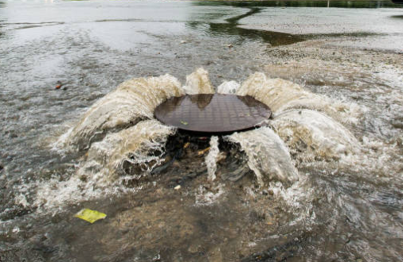

Since the water is coming out of the manhole, both the head and flow are negative. The head is the difference of,

- Street water level is “flood depth”

- Manhole water level is “Level – ground elevation”

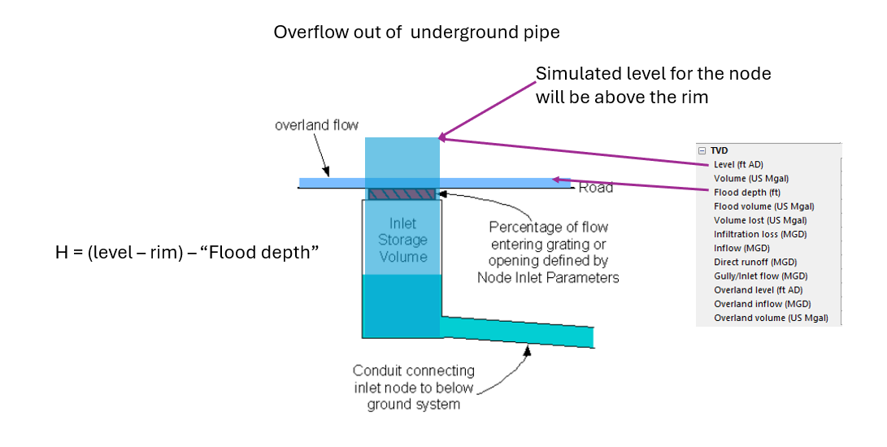

You can explicitly define the overflow in the curve,

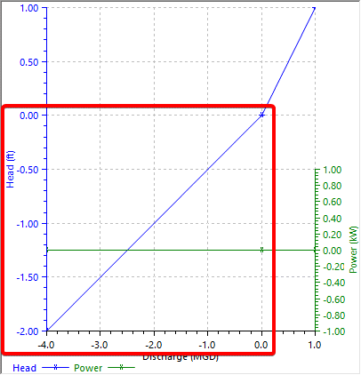

One trick to make an inlet that doesn’t overflow is to keep the flow at 0 for negative head.

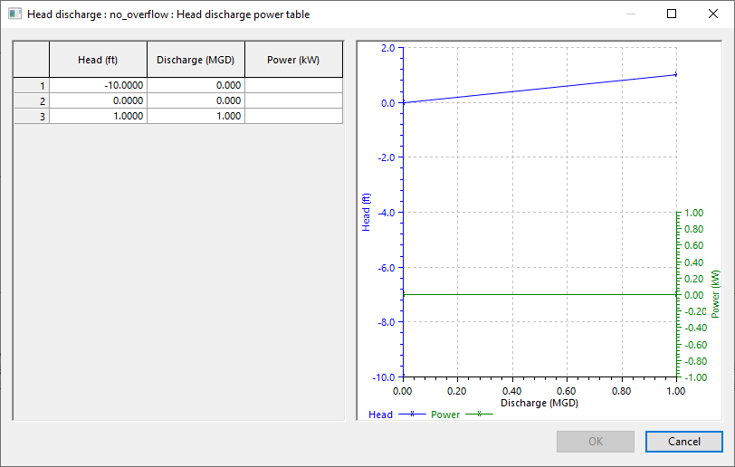

# Example

In this example, we compare 3 setups for an inlet

- The top one uses a gully

- The middle one uses an inlet

- The bottom one uses a screw pump to mirror the inflow into the inlet

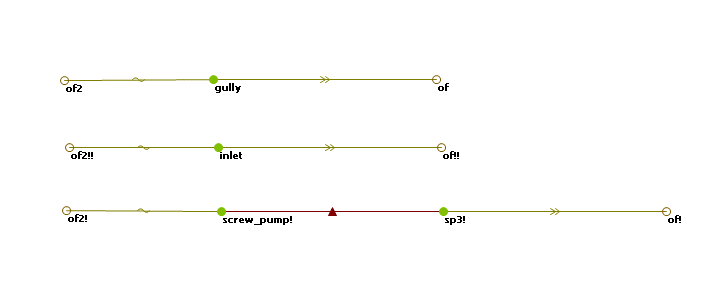

All 3 setups share the same profile,

- By raising the water level on the left side, the water level on the street increases, allowing flow into the inlet.

- Once the water level on the street subsides, we raise the water level in the underground pipe to cause overflow in the middle node.

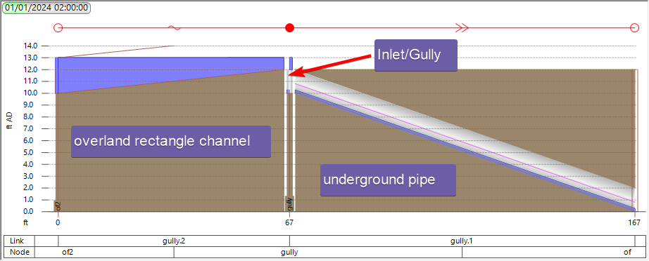

The results are shown below,

- For the flow through the links, when it is going into the underground pipe, they all show the results. However, when it is overflowing onto the street, screw pump has no flow.

- The water depth on the street shows similar pattern.

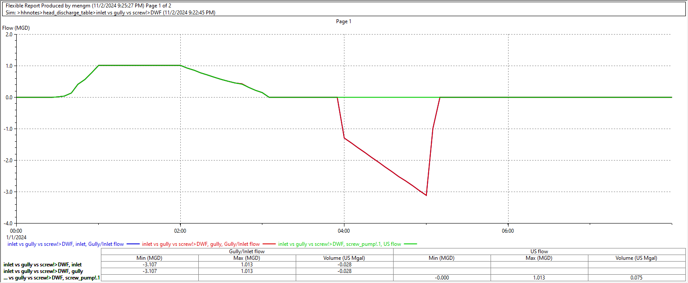

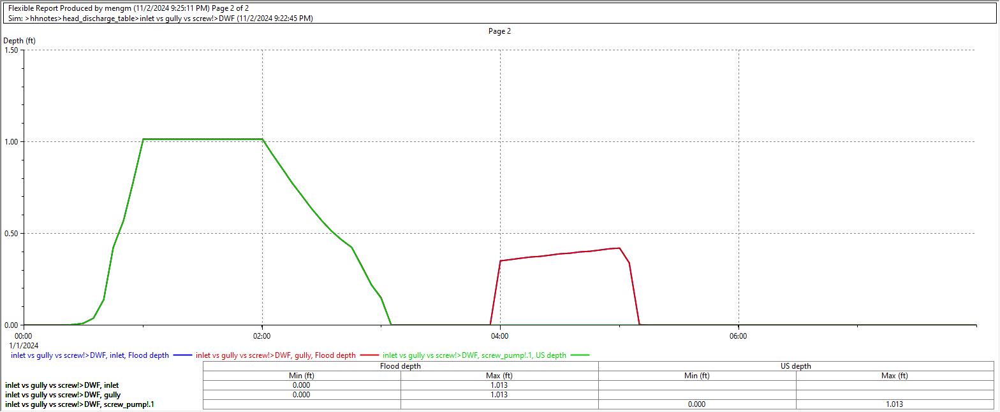

Therefore, when controlled by the same curve, inlet, gully and screw pump all show the same results except when there is reverse flow, that screw pump doesn’t allow reverse flow. A closer review shows that inlet, gully and screw pump all follow the head discharge curve.

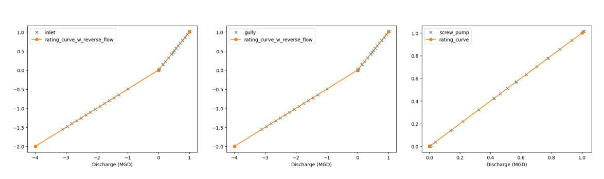

# Conclusion

When modeling dual drainage systems in InfoWorks ICM, you can capture flow from the road into an inlet by connecting an overland channel and an underground pipe to the same manhole with a gully. By using a head discharge curve, you can define both the flow into the inlet and overflow onto the road as a function of the water depth on the road, and the overflow head.
