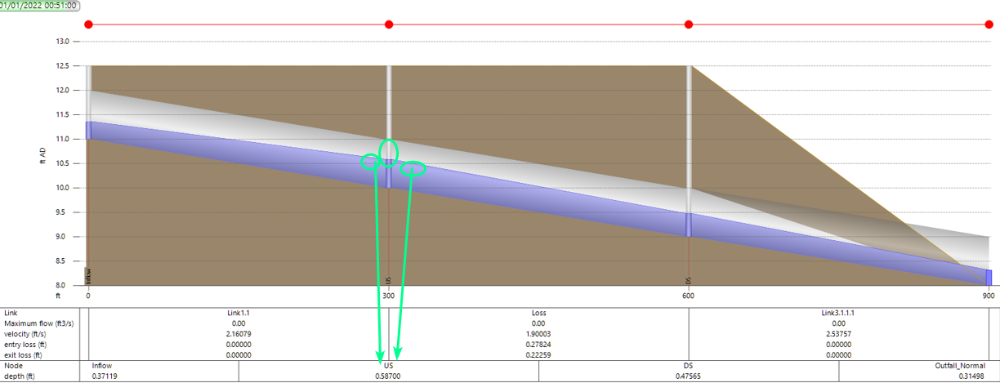

# Introduction

Modeling the head losses through a junction can be tricky because the losses are not directly captured by the differential equations that govern the flow through pipes. Therefore, it is up to each software package to decide how the losses are accounted for.

As shown in the [SWMM5 hydraulics manual](https://www.epa.gov/water-research/storm-water-management-model-swmm) and the ICM help file, the governing equations for the flow routing consists of two equations. Interestingly, there is no equation that conserves energy. And the only loss term is Sf, which is the friction slope (head loss per unit length). Therefore, the losses through the junctions must be handled outside of the standard equations.

ICM uses a very similar form of the same equations (from help file),

In this article, we’ll start with a quick review of the calculation of losses found in FHWA HEC-22, and then we’ll compare how SWMM5 and ICM accounts for the losses.

# HEC-22

One of the most widely used method is documented in Federal Highway Administration (FHWA) hydraulic Engineering circular No. 22 ([HEC-22](https://www.fhwa.dot.gov/engineering/hydraulics/pubs/10009/10009.pdf)) Chapter 7.1.6 Energy Losses.

For pipes, it consists of friction losses, exit losses, bend losses and transition losses.

-   The friction losses for open channel flow are already accounted for by the governing equations in SWMM and ICM, which can be derived from manning’s equation.

-   The exit losses referred in HEC-22 is for the situation discharging to a channel instead of a junction.

-   Bend losses is just a function of one velocity in the pipe. However, transition losses and exit losses will require two velocities.

For the losses through a junction, it is quite complicated. There are three losses,

-   The entrance loss: Eai – Ei

-   The junction loss: Ea – Eai

-   The exit loss: E0-Ea

You can refer to HEC22 on details how each loss is calculated through the junction.

# SWMM5

According to the SWMM5 reference manual, the two governing equations are applied to the network in this manner.

-   The continuity equation is done for each manhole and two half pipes

-   The momentum equation is applied to each pipe

The implication for this scheme is that SWMM5 assumes the flow throughout the pipe is the same. For example, if you have a long pipe, and you send a pulse of flow through the pipe, you won’t be able to see the flow on the upstream end shows the peak of the flow earlier than the downstream pipe. Because spatially, the pipe is the smallest unit, there is a single flow through the pipe no matter where you look at it.

When it comes to estimate the losses through the junctions, SWMM5 totally ignores the fact that the losses are happening inside the junction. It approximates the losses similar to friction losses through the pipe as shown in the manual below, the result is that it will push the level on the upstream junction higher.

To summarize, the SWMM5 engine doesn’t have the spatial resolution to differentiate the details of the flow in/out of a junction, and it lumps the losses through a junction into friction losses.

-   The junction has only one depth

-   The connected pipes share the same depth as the junction

-   The losses through a junction will result higher level in the pipe on the upstream end (the same as the junction depth)

As shown in the figure below, there is only one depth for the upstream, downstream pipes connecting to the manhole.

Due to this simplification, SWMM5 only supports losses that can be expressed as the form of

H = K\*V^2/2g

This limitation makes it hard to incorporate HEC-22 junction loss calculations.

One exception is for culverts, which can be calculated using the FHWA culvert method.

# ICM

In comparison, ICM has more spatial resolution. Each pipe is divided into smaller segments, as a direct result, for each pipes the upstream and downstream end has different flow and depth values.

In ICM, losses through the junction are calculated consistent with the HEC22 approach, as shown in the figure below. The only thing that is different in ICM is that there is a single level in the manhole. If the FHWA method is used, the level is corresponding to Ea, the highest point in the junction. See the [example](https://innovyze-us01.s3-us-west-2.amazonaws.com/salesforce-knowledgebase/Worked+examples+of+FHWA+headloss+type+from+HEC22.pdf) for more details on how FHWA losses are calculated in ICM.

# Examples

To illustrate how losses are calculated in ICM/SWMM5, here is a simple example.

Since SWMM5 doesn’t model head losses explicitly, the actual head loss can only be inferred from modeling results. Once the water is backed up in the pipe, sorting out which part of the head is due to minor losses and which part is due to the backup can be quite hard for SWMM5.

The example include three 300ft pipes with 1/300 slope, the outfall is a free fall at normal depth. Two scenarios were compared for the pipe in the middle (Loss).

-   No Loss: no loss for any of the pipes

-   EN5EX4: only the middle pipe (Loss) has losses, entrance: 5, Exit 4

## SWMM5 Results

For the no loss scenario, it reaches steady state with a depth of 0.443 ft at all junctions.

For the EN5EX4 scenario, the level at DS node is still 0.443ft, but the US node is pushed up to 0.61ft

Friction Loss:

> Pipe depth: (0.61+0.43)/2=0.52ft (average the node depth)
>
> Area: 1\*0.52=0.52sf
>
> R = Area/WP = 0.52/(1+0.52\*2)=0.2549ft
>
> Sf = (n/1.486)^2\*Q\*V/A/R^(4/3)=(0.014/1.486)^2\*1\*1.93/0.52/0.2549^(4/3)=0.002038
>
> Loss = 300\*Sf=0.611ft

Minor Loss:

Entry: 1.93^2/2/32.17\*5=0.289ft

Exit: 1.93^2/2/32.17\*4=0.231ft

Total loss: 0.611+0.289+0.231 = **1.131ft**

Based on the simulation results:

US Node – DS Node = (0.610 + 10) – (0.433 + 9) = **1.177ft**

As shown above, since SWMM5 combined both the friction loss and minor losses into the calculation, it is not very easy to separate the two parts. ICM SWMM does report the losses in the simulation results. However, visually you cannot see where the losses happen.

## ICM Results

For ICM it is much easier to check the calculations because the entrance and exit losses are calculated for each junction, and it can be estimated from the modeling results by comparing the junction level and the connection pipe depth. The calculation is straightforward as shown below, the level difference between the node and the pipe is the minor losses.

## XPSWMM Results

XPSWMM shows similar results as SWMM5.

US depth: 10.566 ft vs 10.611 fps (SWMM5)

Velocity: 1.809 fps vs 1.93 fps (SWMM5)

# Conclusion

Calculating the losses through a junction can be tricky. ICM has clear advantage over SWMM5 and XPSWMM, as ICM explicitly calculates head losses through the junction, which can be visually shown on a profile. While XPSWMM/SWMM5 lumps the head losses into the friction loss of the pipe, therefore, there is no head loss calculated on the entrance and exit side of the manholes.

Due to the different approaches used by SWMM5/XPSWMM/ICM, the results are slightly different.
