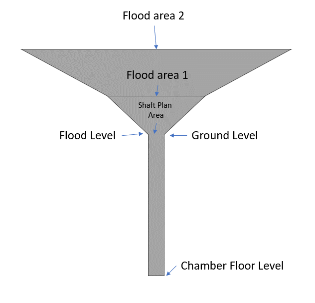
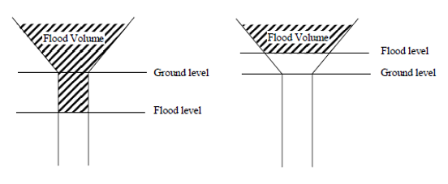
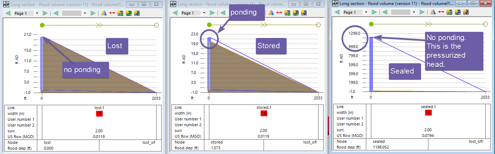
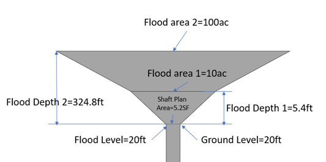
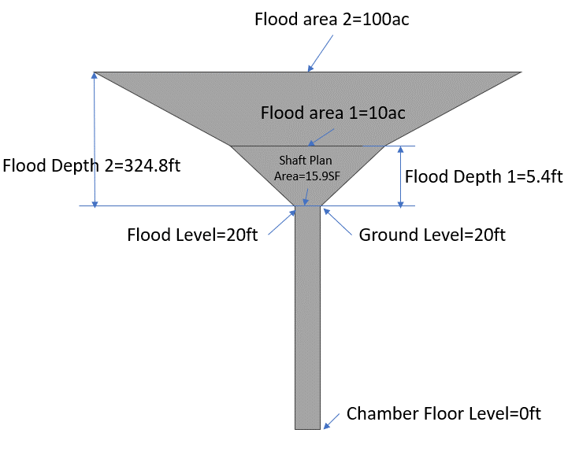
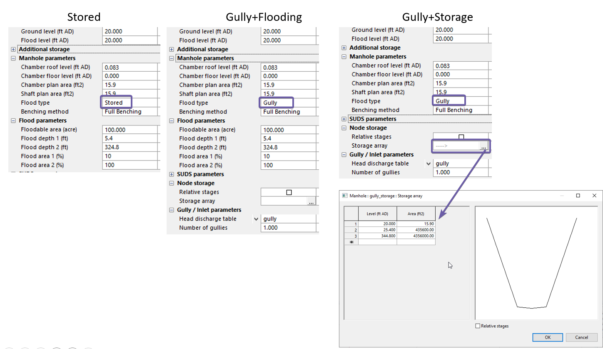
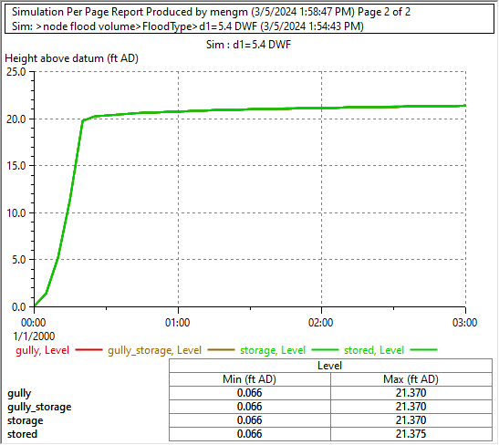
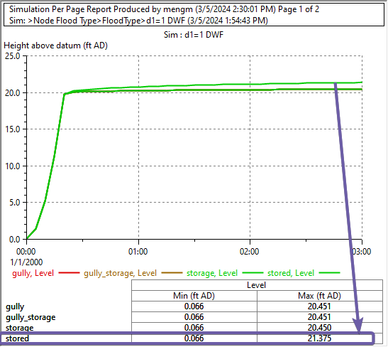

# Introduction

In hydraulic modeling, the behavior of overflowing manholes can vary depending on their location and the surrounding topography. For instance, water will be lost if the manhole is located at the top of a hill, stored if at the bottom of a pond, or flow downstream if on a slope. The outcome is less predictable for a manhole on a flat parking lot, requiring detailed topographic assessment.

When dealing with large system models, it can be time-consuming to evaluate each overflowing node individually. A pragmatic initial approach can be to model all nodes with a flood type of "lost". This helps to quickly identify flooding nodes and the most critical flooding locations by examining the cumulative flooding volume.

Once these locations are identified, you can then review the flooding manholes. If you anticipate water ponding at certain locations, select the "stored" option with the default ponding settings to ensure overflow is not lost. This allows the system to continue to experience stress as it drains after the peak of the storm.

This "conservative" approach can help identify the most critical flooding spots requiring more detailed analysis. For more accurate storage, use the contours around the flooding nodes to model the node as a "gully" with storage and flow exchange curves. If significant overflow is expected to flow overland and re-enter the system at different locations, overland flow may need to be modeled in 2D.

# Flood Types

InfoWorks ICM allows [node](https://help.autodesk.com/view/IWICMS/2024/ENU/?guid=GUID-4625AD3F-710E-4733-99CD-9574B7E6BD3B) to be modelled with the following flood types for 1D simulations:

- Gully: overflow will be stored in a above ground storage, user defines the storage shape and flow exchange curve

- Sealed: no overflow, the head of the manhole will keep rising if surcharged.

- Lost: overflow will be lost and reported

- Stored: overflow will be stored in a cone shaped storage above ground. In most cases, default values will be used.

Alternatively, you can also model a node as a storage node for both the below and above ground parts in one storage curve.

For the “lost” type, the cumulative overflow volume out of the node is tracked every reporting step as “Volume Lost”. For the options of “gully”, “Stored” and a storage node, the flooding volume in the storage above the top of the node is reported.

The storage volume at each reporting time step is the “Flood Volume”, which is the volume above the flood level. Typically, the flood level is the ground level, however, you can move it up or down to meet different needs.

# Flooding Results

Flooding level is calculated as water level minus flood level, it is a negative number when water level is below flood level. When processing simulation results, be aware of the negative flood depth and volumes.

Unlike an overflow pipe into the river, the overflow flow rate is not reported.

| Flood Type     | Overflow Rate | Cumulative Overflow volume | Flood Storage Volume       |
|----------------|---------------|----------------------------|----------------------------|
| Gully          | Not reported  | Not reported               | Flood Volume (FloodVolume) |
| Sealed         | No overflow   | No overflow                | No overflow                |
| Lost           | Not reported  | Volume Lost (FLVOL)        | No storage                 |
| Stored         | Not reported  | Not reported               | Flood Volume (FloodVolume) |
| Storage Node\* | Not Reported  | Not Reported               | Flood Volume (FloodVolume) |

# Comparison of different flooding types

To illustrate the differences among the flood types, we setup an example model with the same layout but the flood types. The same inflow is introduced into a node and causes flooding,

- Lost: the level will stay at the ground level, no ponding

- Stored: water will pond on top of the node

- Sealed: water will not pond, but the node is pressurized, and the reported level is the head NOT the actual water level

# Stored option special notes

The stored option is often used as a quick way to define a storage curve, which is meant to automatically add a storage from subcatchment size. If you would like to have more control of the storage curve, using a “gully” or storage node is a much better choice because the calculation of the storage curve in the “stored” option is complicated.

InfoWorks ICM will modify the “flood depth 1” and “flood depth 2” if the storage shape if it is too “flat”. This can be very confusing because the change will not be reflected in your input parameters.

Using the example here, for flood depth 1, the minimum depth d is defined as

d (ft) = (flood area 1/shaft plan area)^0.5/100\*3.281

d = (10/(5.2/435600))^0.5/100\*3.281=9.5 ft, therefore, the actual flood depth is not 5.4ft, but 9.5ft.

Similarly for flood depth 2, the minimum depth d2 is defined as,

d2(ft) = flood depth 1 + (flood area 2/flood area 1)^0.5/100\*3.281

d2 = 30.03 + (100/10)^0.5/100\*3.281 =30.13ft, since flood depth 2=324.8 ft which is greater than d2, there is no need to change that value.

Refer to the Jupyter notebook and the model for more in-depth analysis.

# Define the storage

InfoWorks ICM offers several ways to define the storage of a node.

- A storage node will explicitly define the storage in a single curve.

- A node with a flood type of gully: the above ground storage is defined in the gully attributes, and the underground storage is defined by the node attributes.

- A node with a flood type of stored: the above ground storage is defined in the flooding attributes, and the underground storage is defined by the node attributes.

In this example, we’ll model the storage shown in this figure using the above options.

For the stored option, the above ground storage is defined in the flooding parameters as two cones stacked on top of each other. When using the gully option, you can either define the two cones using the same flood parameters or using the storage array.

For a storage node, you define the curve from the invert of the manhole all the way to the top.

As expected, when the stored option doesn’t need to increase flood depth 1, the results are the same among all options.

However, when we set the flood depth 1=1ft, the “Stored” option will change the shape of the bottom cone and therefore, gives higher water level in the node. It is interesting to see for the “Gully” node which uses the same flooding parameters, it seems to use the 1ft without any adjustment.

# Conclusion

The choice of flood type—whether Gully, Stored, Lost, or a Storage Node—largely hinges on the degree of accuracy required for the storage curve. For a design project, the use of a 'Gully' or 'Storage Node' with a defined storage curve is recommended. On the other hand, for a high-level system planning analysis where data collection may be limited, 'Stored' or 'Lost' options can be great time saving option to identify the flooding hot spots.

Ultimately, InfoWorks ICM gives engineers a flexible and robust platform for tackling complex flood modeling tasks.
