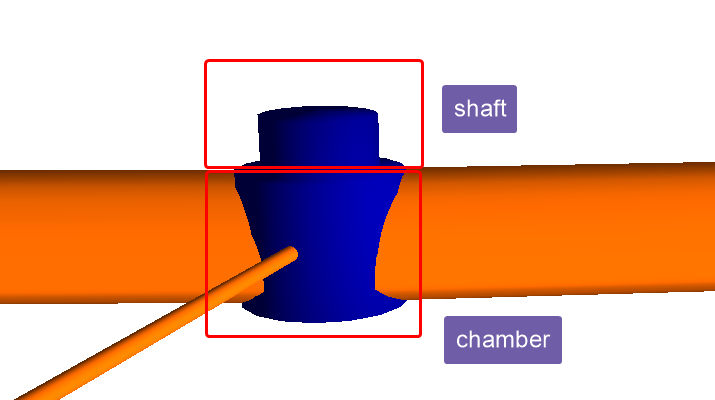
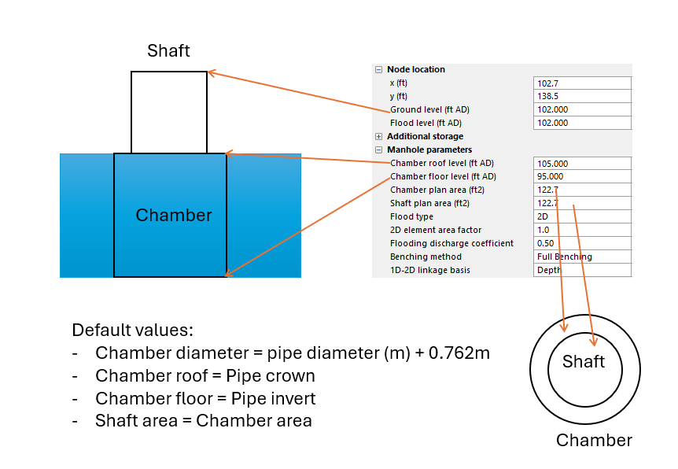
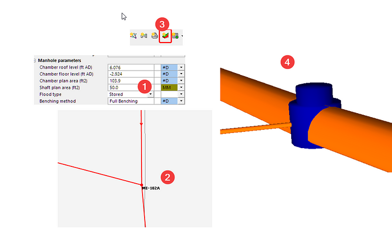
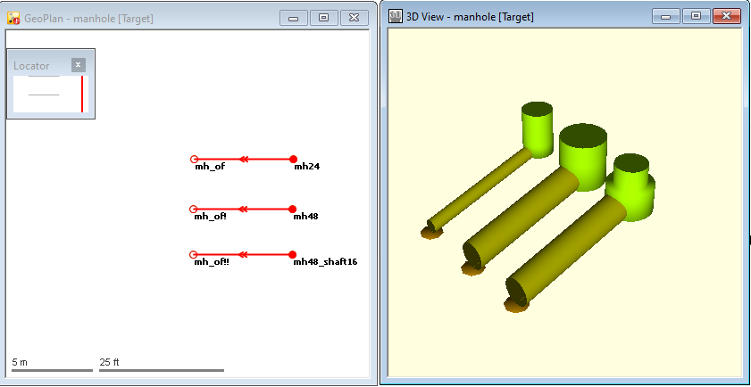
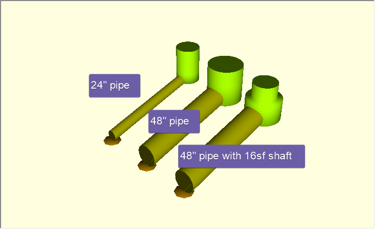
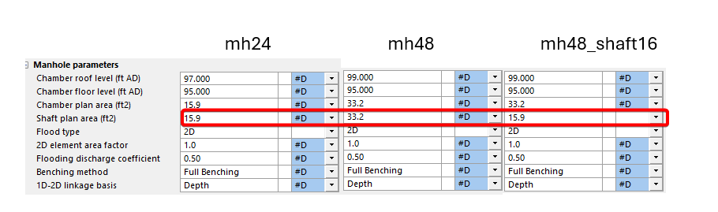
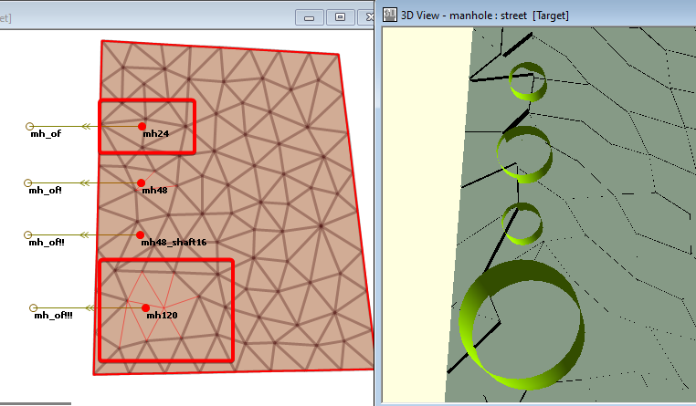

# Introduction

Manholes in InfoWorks ICM have two stacked cylinders:

- A chamber sits at the bottom that connects the pipes

- A shaft on the top that provides access

In most cases, InfoWorks ICM automatically calculates the shapes based on the connected pipe sizes, if the “#D flag” are set for the input parameters.

However, for large diameter pipes, you may overwrite the default shaft area.

# Example

Consider 3 similar manholes that differ in the size of the pipe,

- mh24: 24” pipe

- mh48: 48” pipe

- mh46_shaft16: 48” pipe with a shaft area of 16sf

For fields with the \#D flags, the default values are calculated by InfoWorks ICM:

- chamber floor is 95, the invert of the connecting pipe

- chamber roof is the crown of the pipe, for 24” pipe 95+2=97, and 48” pipe 95+4=99

- chamber and shaft area is the same: for 24” pipe pi\*(1 +0.762/2/3.281)^2=15.9SF, for 48” pi\*(2 +0.762/2/3.281)^2=33.18SF

# 2D Meshing for manhole

When a manhole is connected to the 2D surface, InfoWorks ICM will aggregate the triangles around the manhole if needed to make sure the element has an area larger than the shaft area. For example, for the shaft with a 10ft diameter pipe, 9 triangles are merged for the element to contain the large shaft. If the shape of the element is critical, considering using break lines and mesh zone to refine the element.

# Conclusion

InfoWorks ICM automatically determines the manhole shape based on the pipe diameters. For large diameter manholes, the shaft size should be reviewed and reduced if needed. When modeling manholes in a 2D model, review the mesh element at the manhole to ensure it is correctly sized to match the manhole shaft.
