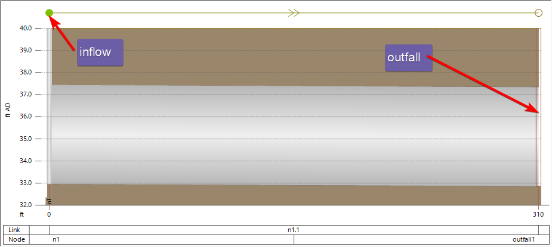
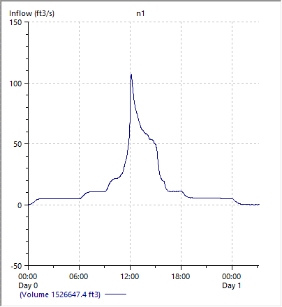
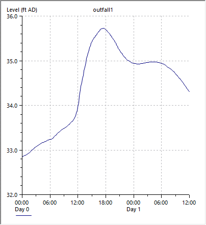
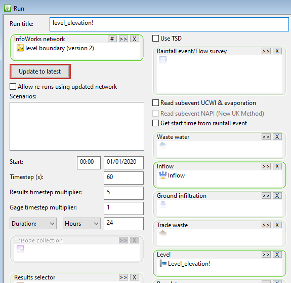
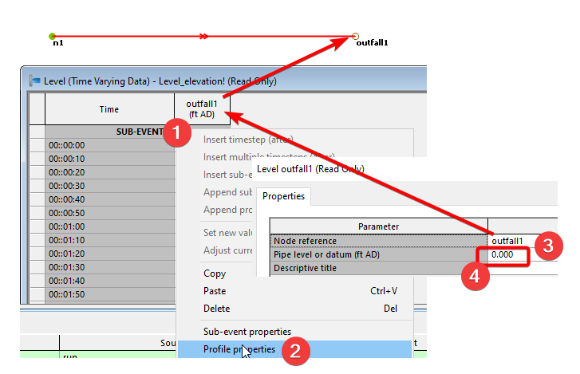
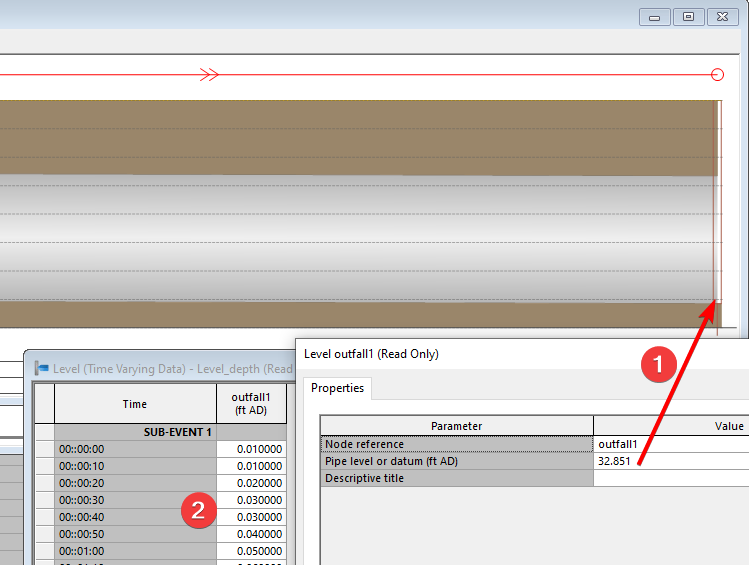
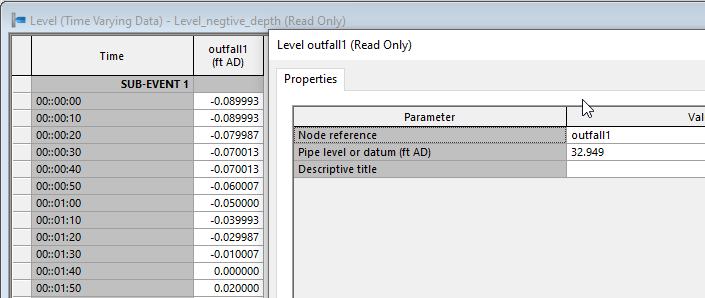
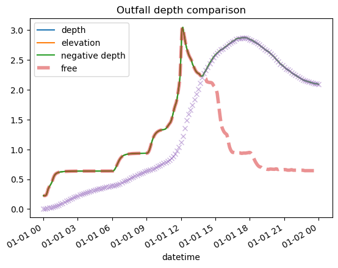

# Introduction

For 1D models, flow leaves the system through outfalls. In InfoWorks ICM, you can set the boundary conditions for the outfall as,

- Free outfall

- A time series for the level

In most cases, a free outfall is found at the end of the system, which sets the water level as the smaller of the normal and critical depth at the end of the pipe. For systems discharging into rivers or lakes (which can be submerged), a level event can define the water level at the outfall.

# Example

Consider a system with a single outfall pipe. On the upstream end, there is an inflow hydrograph, and on the downstream end, a level boundary condition is applied.

- A 310 ft long 54” circular pipe with a n=0.013, and a slope of 0.032%

- An inflow hydrograph with a peak of 105cfs

- A level boundary with a high level at 35.72ft AD (outfall invert at 32.85ft AD)

- Simulation with inflow and level

## Scenarios

To understand how the different parameters impact the results, we developed a few scenarios.

- Free outfall: If the “level” box is blank in the run object, the outfall is a free outfall.

- Level boundary can be defined as,

  - Elevation: this is the most common situation. Just measure the water level in elevation. As shown in step (4), leaving the value as 0 assumes the values entered is elevation.

> 

- Depth measured from pipe invert. By entering the datum as the elevation of the pipe invert (1), we can enter the water depth at the outfall in the pipe as the level.

- Arbitrary datum, if we move the datum 0.1ft above the pipe invert, you’ll see negative values in the level table.

## Results

The results of the scenarios are shown below,

- The y axis is the depth above the pipe invert at the outfall for the scenarios

- The “x” is the level boundary condition

- The red dashed line is the free outfall condition

- “depth”, “elevation”, “negative depth” are the 3 scenarios using level boundary conditions using different datum parameters.

Comparing the free outfall and the level boundary condition,

- Before hour 15, free outfall depth is higher than the level boundary condition.

- After hour 15, the level is higher than the free outfall depth.

- All 3 runs with level boundary condition show the same results, they all follow the higher level of the free outfall and the boundary condition.

# Conclusion

When using a level boundary condition for an outfall,

- By default, you use the water elevation. To use water depth, set the level event datum at pipe invert and calculate the depth.

- If your boundary level is lower than the free outfall level, the outfall level will be the free outfall level. (This makes sense because lowering the level to the boundary wouldl be the equivalent of pumping the water out of the outfall.)
