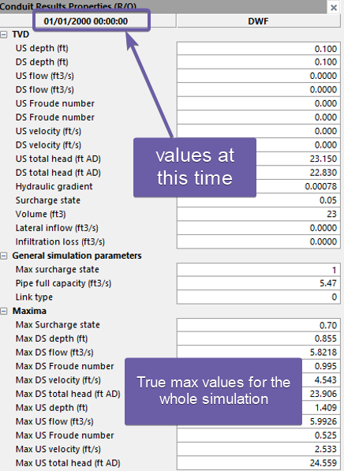
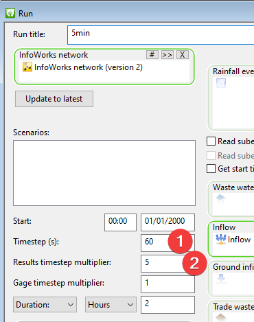
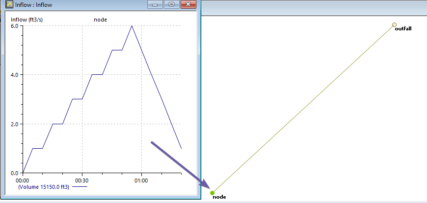
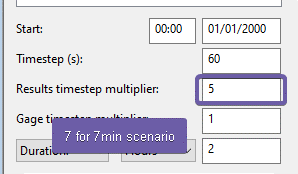
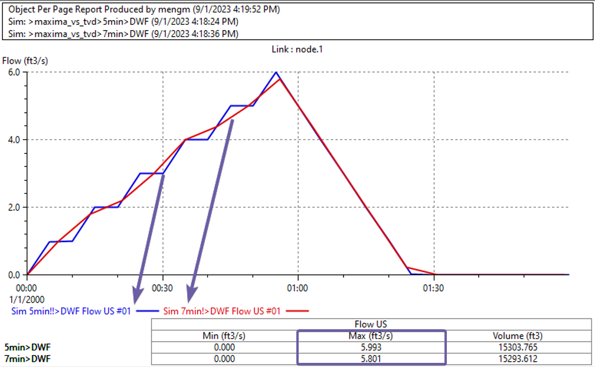
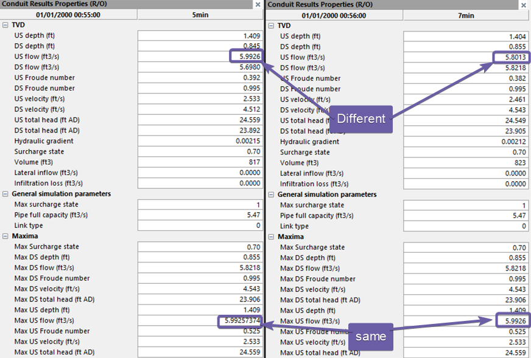

# Introduction

When reviewing the simulation results, there are two sections TVD and Maxima.

- Maxima is generated during the simulation, the simulation engine will keep track of the maxima for all the result parameters at every computation time step.

- TVD is the saved time series which reports the values at the interval defined in the run object. The values shown in this section is for the time displayed on the top

As shown below,

1.  Timestep is the computational timestep (The InfoWorks ICM engine might half the time step if the desired convergence is not achieved, therefore, the true timestep can be smaller for some part of the simulation.)

2.  Results timestep multiplier, if it is 5, it means write the results every 5 computation timestep, in this example it is 5\*60s=5min.

Essentially, the TVD results are observations of the simulation, which is only accurate at the time of observation. When calculating max, min and average from the TVD results, we are ignoring all the data points between the observations, which could give us different values from the maxima. We’ll show the impact in the example below.

# Example

A hydrograph is loaded into a node, the TVD results will look different using 5min vs 7 min reporting timestep.

As shown in the following plot, the upstream flow of the pipe should be the same as the inflow,

- When using 5min reporting time, which is the same as the inflow timestep, we can see there is a perfect match of the inflow.

- When using the 7min reporting time, which doesn’t capture all the important turning points, the TVD is only accurate at the 7min intervals, and the interpolation between these points are mostly off.

- 

If we check the maxima for both the 5min and 7 min,

- The maxima values are the same : 5.99

- However, the TVD at the peak is different

  - 5min is the same as the maxima

  - 7min is 5.80 lower than the maxima

# Conclusion

In conclusion, it is important to understand the difference between TVD and Maxima when reviewing simulation results. TVD results are only accurate at the time of observation, while maxima values are the true maxima values. Therefore, it is important to choose an appropriate reporting time step to capture all the important turning points in the simulation. For collection systems, a reporting time of 5 min to 15 min are often used, if the TVD maxima is significantly different from the simulation maxima, it is a sign that the modeling results are not stable, and further investigation might be needed.
