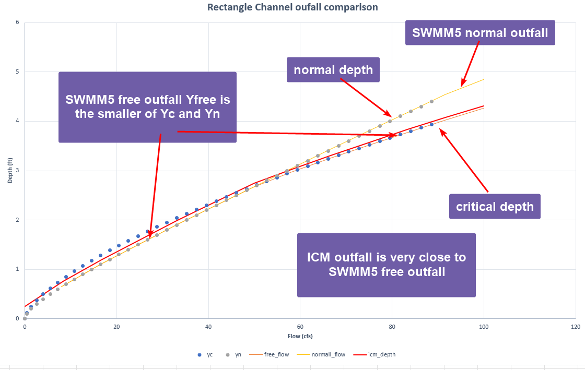

# Introduction

Outfall nodes are terminal nodes where water leaves the simulated system. You can define the boundary conditions of outfall in SWMM5 as,

- Critical or normal flow depth in the connecting conduit

- A fixed stage

- A tidal stage

- A user defined stage vs time series

XPSWMM provides similar options, and ICM only supports the free outfall and user defined time series.

# SWMM5

SWWM5 supports 5 outfall boundary conditions, “free” is the minimum of normal and critical depth and “normal” is the normal depth.

You can manually calculate the free and normal outfall boundary conditions for the example below,

| B(width) | 2     | ft  |
|----------|-------|-----|
| n        | 0.01  |     |
| slope    | 0.006 |     |

The figure below shows,

- Free outfall matches the minimum of Yn/Yc. It starts using Yn, then switches to Yc

- Normal outfall follows Yn all the time

# ICM

ICM doesn’t report the water level at the outfall, it is reported as the downstream water depth for the pipe.

The same rectangle channel is modeled in SWMM5 with varying slopes and outfall options. The ICM model imported from SWMM5 will use the “free” outfall since “normal” outfall option is not supported.

For steep slope, normal depth is lower than critical depth, therefore, both free/normal outfall uses the normal depth in SWMM5. ICM is very close to the normal depth.

For flat slope, the critical depth is lower than normal depth, and ICM depth is close to critical depth.

For a slope the critical depth and normal depth relationship switches, SWMM5 works as expected, and ICM is close to the free outfall condition in SWMM5.

# Conclusion

SWMM5 has more options for outfall depth. ICM outfall is very similar to the free outfall option in SWMM5.
