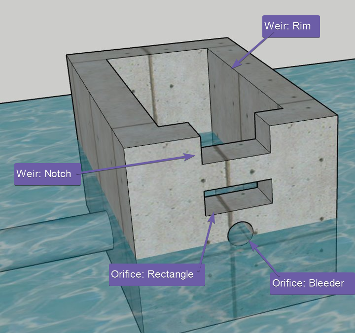
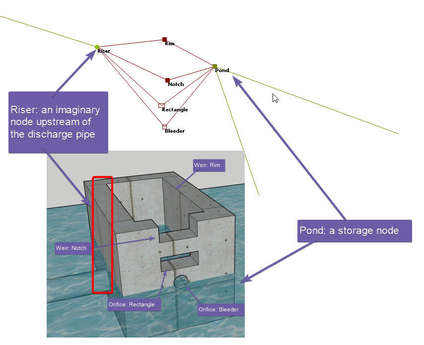
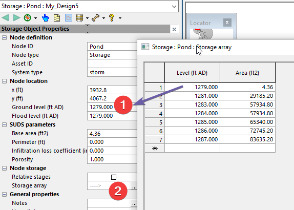
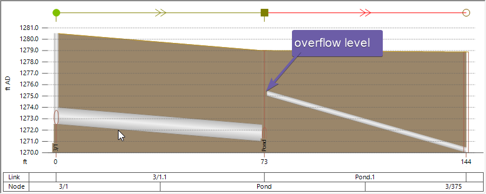
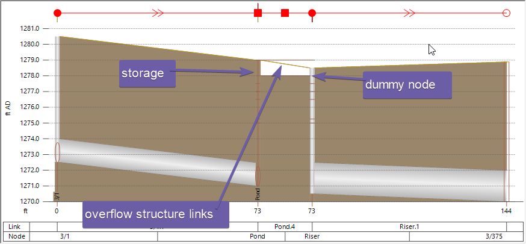

# Introduction

Modeling pond overflow structures can initially seem complex because it is not immediately obvious how to fit the pond (an area), the overflow structure(a point) into connected dot and lines in an InfoWorks ICM model.

InfoWorks ICM models this structure shown in the figure as the following,

- the pond is a storage node, it controls the water level at the overflow structure.

- an imaginary node at the starting point of the discharge pipe or pipes, which determines the downstream end condition of the overflow structures.

- links that represent the openings as weir, orifice and sluice gate

# Storage node

You define a level vs area curve for the storage [node](https://help.autodesk.com/view/IWICMS/2024/ENU/?guid=GUID-4625AD3F-710E-4733-99CD-9574B7E6BD3B).

# Discharge pipe

For simple overflow structures, you can add an overflow pipe directly to the storage node.

For more complicated situations, you need to add a dummy node on the upstream end of the discharge pipe so that overflow structures can be added. Make sure the dummy node has a ground elevation high enough to match the overflow structures.

# Weir, orifice, and structures

The openings of the overflow structures are commonly modeled as,

- [Weirs](https://help.autodesk.com/view/IWICMS/2024/ENU/?guid=GUID-6A47B0A6-D57A-4FF7-AFBC-C0433A9151C4)

- [Orifice](https://help.autodesk.com/view/IWICMS/2024/ENU/?guid=GUID-46891715-2309-4D84-B28F-50C9BDAC99D5)

- [Sluice Gates](https://help.autodesk.com/view/IWICMS/2024/ENU/?guid=GUID-5992044A-21E6-41AA-882E-4C7AA28A15B3)

- and other [Ancillaries](https://help.autodesk.com/view/IWICMS/2024/ENU/?guid=GUID-26CAD519-4B85-4767-881B-232CBF4DF690)

The openings of the overflow structures are commonly modeled as weirs, orifices, sluice gates, and other ancillaries. These ancillaries are zero-length links. Unlike gravity pipes, which have a volume and can operate on a wide range of flow conditions, ancillaries operate more like pumps and can only function within a narrow band of curves. As a result, they may experience more instability issues and require careful evaluation of their parameters.

Ancillaries can be divided into two groups:

- Those that operate based on upstream head, such as weirs and orifices with free flow downstream.

- Those that operate based on the difference between upstream and downstream head, such as pumps and vortex user control.

When an ancillary operates solely on the upstream head, it can be considered a boundary condition. This simplifies the situation as the downstream condition does not impact the upstream system. However, when an ancillary operates based on the difference of the head, it becomes more complex as the downstream condition can affect upstream areas.

It's important to note that most ancillaries can be drowned, meaning the free flow condition downstream can stop if the water level rises. At this point, the flow will be impacted by the downstream conditions. Additionally, ancillaries are governed by equations derived from experiments, often using parameters that cannot be directly measured.

# Conclusion

Modeling pond overflow structures requires careful consideration of various elements and their interactions. By understanding the role and operation of each component, you can create accurate and effective models in InfoWorks ICM.
