# Introduction

For a node with multiple incoming and outgoing links, getting the peak
flow in and out of the node can be a little tricky for new modelers. In
this article, we’ll explain how we should calculate the peak flows.

For modelers coming from steady state modeling, there are a few common
mistakes which are true to steady state, but won’t apply for unsteady
state modeling,

-   the peak flow **is not** the sum of the peak flow of the incoming
    pipes

-   the peak flow into the node **is not** the same and the peak flow
    out of the pipe

# Steady state model

For a steady state model, the flow doesn’t change over time. This is the
type of hydraulic analysis that can be easily done with a pencil, and
commonly used in sewer and other hydraulic designs.

As shown in the example below, if we load 1 cfs of constant flow through
this system, after a while it will achieve steady state, meaning the
flow is the same regardless of the time.

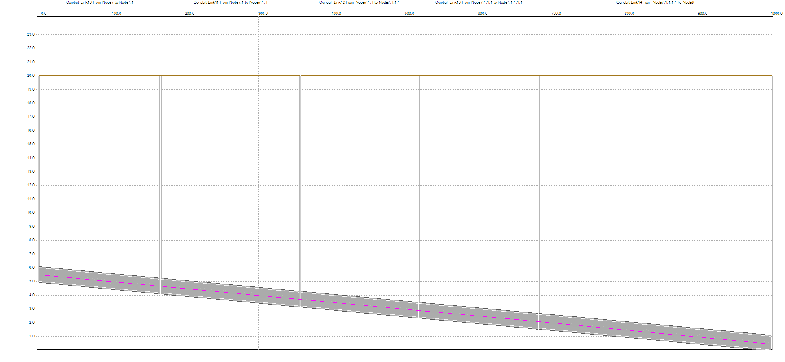

As shown below, Link10 is the upstream pipe, link14 is the downstream
pipe. Once it reaches steady state, the flow is 1 at any time.

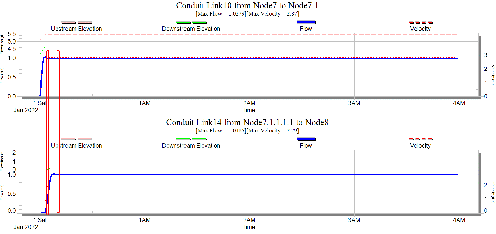

# Unsteady state model

Steady state model is very simple, and in many situations can be easily
solved with a pencil. However, it has some serious limitations when it
comes to evaluating sewer capacities. Steady state model tends to
oversize and ignores storage. A few obvious reasons:

-   the timing of the peak in different sewer branches can be different,
    therefore, the peak flow in the trunk line is usually less than the
    sum of the peak flow of all upstream branches

-   steady state ignores the storage of a sewer system, since the level
    doesn’t change over time, no storage of the system will be utilized

-   flow through pipe will attenuates, therefore, lower the peak and
    change the timing of the peak downstream

Here is another example, for the same model, if we load a triangular
hydrograph through the pipes. The top graph is link10 on the upstream
end, and the bottom one is link14 on the downstream end. It is very
clear the shape of the hydrographs is different, in general, on the
downstream end, the peak is lower, and the area is wider. It is like a
pile of snow is melting.

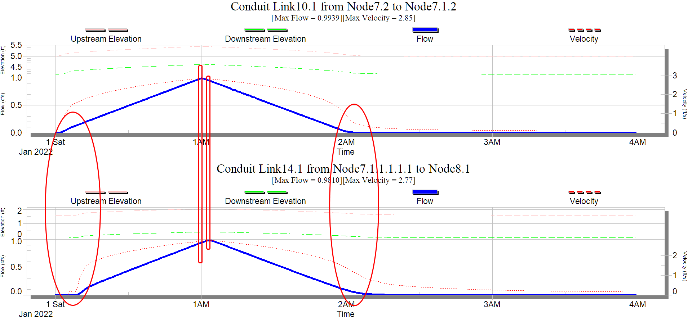

Next, let’s see the impact of storage. We added a storage in the middle
of the system.

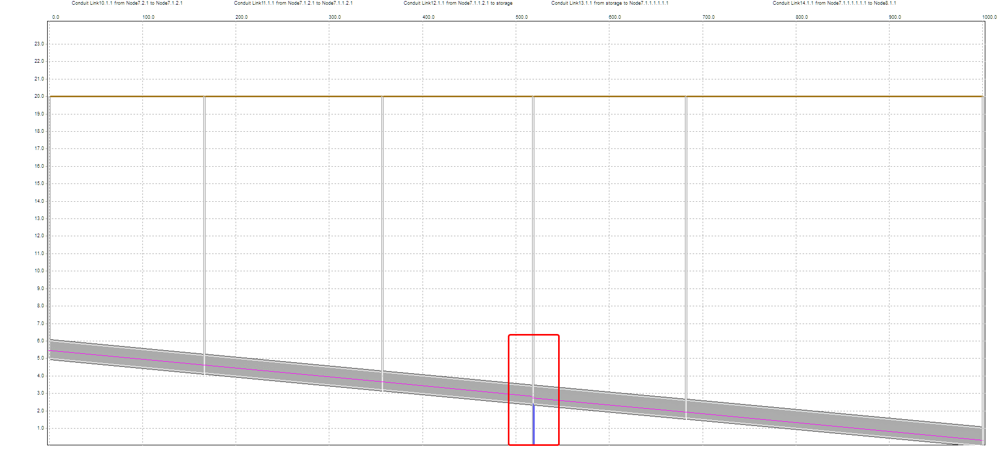

For the downstream pipe, the hydrograph looks totally different. The
storage greatly changed the shape and peak flow of the out flow.

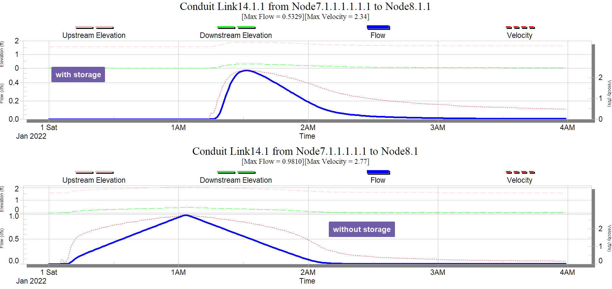

# Unsteady state model with multiple inlets and outlets

Here is a more realistic example to understand the benefits of an
unsteady state model. A model with multiple inlets and outlets for a
storage node. The question is what is the peak flow in and out of the
storage node.

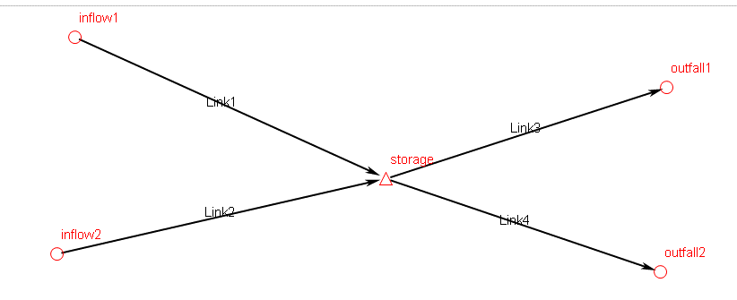

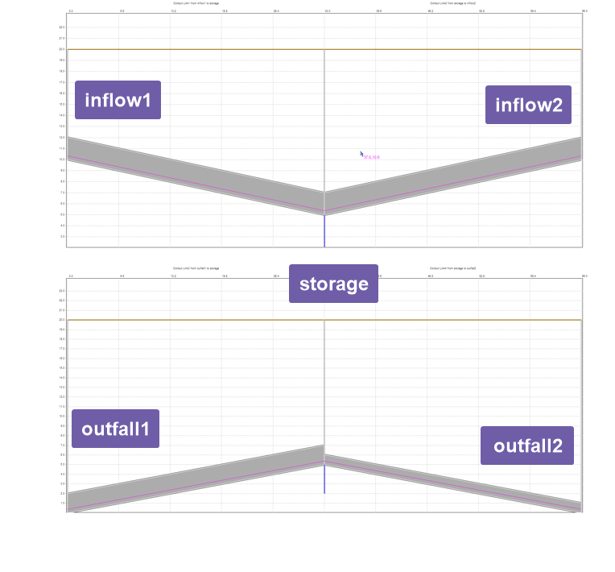

If we load 5cfs constant flow into inflow1, inflow2. The results for the
flow in the 4 pipes are shown below.

The two graphs on the left side are from the inlet pipes, and the two
graphs on the right side are from the outlets pipes

1.  inflow pipes show no delay for the flow to reach steady state

2.  it takes the outlet pipes sometime to show flow before the storage
    is filled up, after that, they both reached steady state

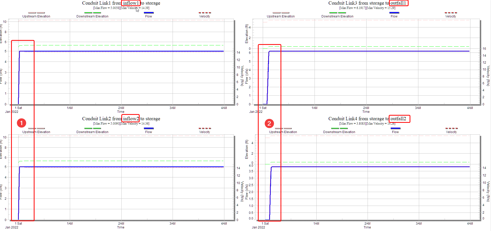

Therefore, when using steady state modeling, we ignore storage in the
system. And the peak flow in and out of the node is simply the sum of
the peak flow of the inlet pipes and outlet pipes.

-   Inflow =5+5= 10 cfs

-   Outflow=6.2+3.8=10 cfs

Next we load triangular time series into inflow1, inflow2. As shown in
the figure below,

-   The two graphs on the left are the flows in the inflow pipes, both
    has 5cfs as peak flow, but one peaked at hour1, and another at hour
    3

-   The two graphs on the right are the flows in the outflow pipes.

    1.  It takes some time for the storage to fill up

    2.  The first peak from inflow1 showed up

    3.  The second peak as a results of inflow2+inflow1 showed up

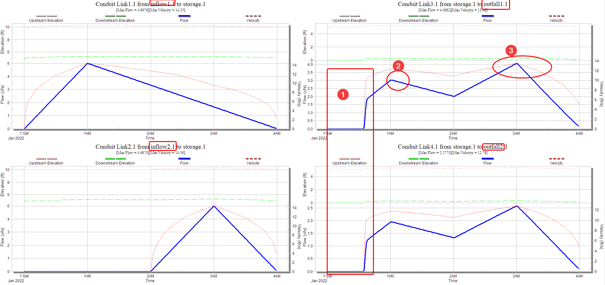

So what is the peak flow in/out of the storage node? If we sum up the
peak flows: inflow=5+5=10 cfs, outflow=2.6+4.1=6.7cfs. Apparently, that
is not correct. The right way to do it, is to export the time series of
both inlet pipes, then sum up the time series.

As shown in the figure below, we sum up the inflows and outflows to get
the combined inflow and outflow for the storage node, and we can read
the peak flow from the combined graph

-   Inflow = 6.66 cfs (10cfs if we sum the peak)

-   Outflow = 6.64 cfs (6.7cfs if we sum the peak, for this one is
    actually quite close, because the timing of the peak is the same for
    both outlet pipes)

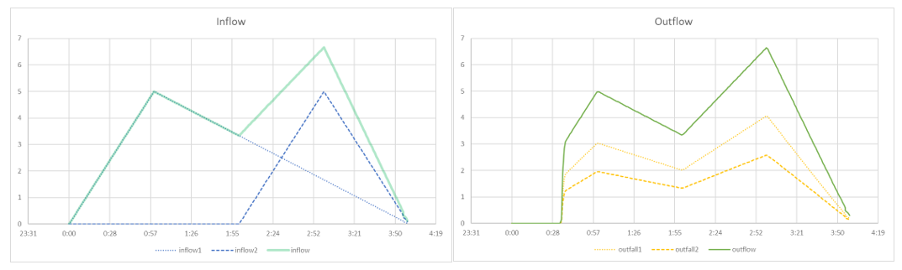

# Extract values

Depending on the software you are using, getting the peak values can be
different. Some software packages report the routing flow time series in
and out of a node, which will make it much easier to get the peak
values. For the software that doesn’t report such data, flow time series
will need to be exported for additional calculations.

## XPSWMM

Since XPSWMM doesn’t report node inflow/outflow time series, the method
shown above will be needed to get the peak flow in/out of a node. Refer
to this
[article](https://mel-meng-pe.medium.com/how-to-export-hydrograph-in-xpswmm-2421706e79a2)
for more information on extracting time series out of an XPSWMM model.

## SWMM5

SWMM5 reports total inflow as time series, therefore, it can be directly
accessed in the model.

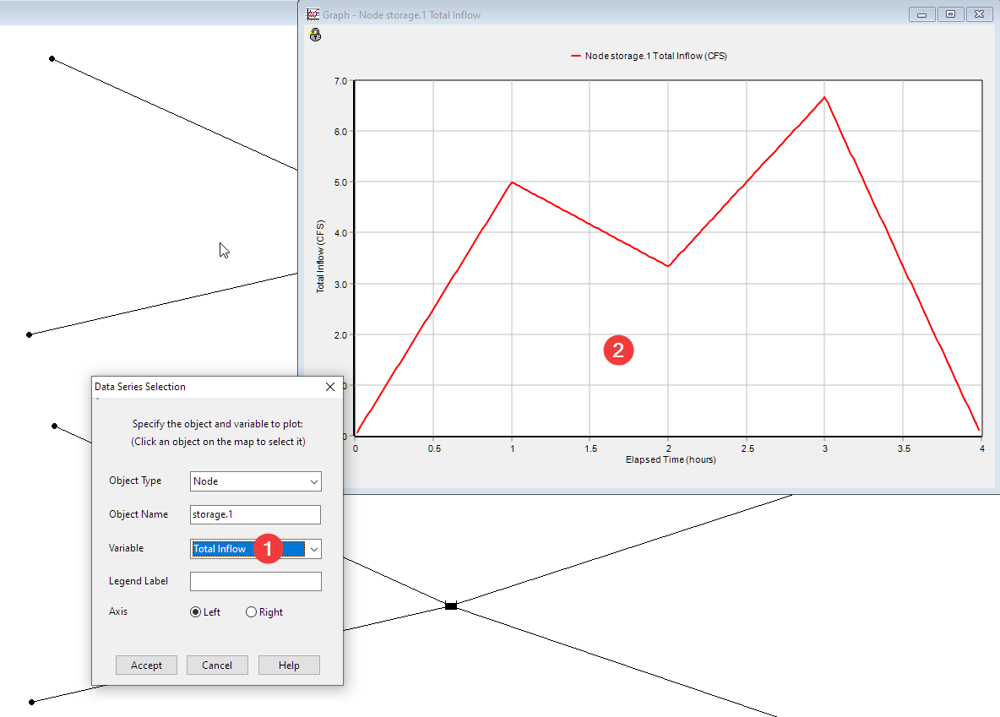

However, for the outflow, we’ll need to do the same calculation as shown
in previous section.

## ICM

ICM doesn’t report total inflow. However, ICM has more tools to export
time series out of the model.

-   We can plot all the inflow time series, then export the data as a
    csv file

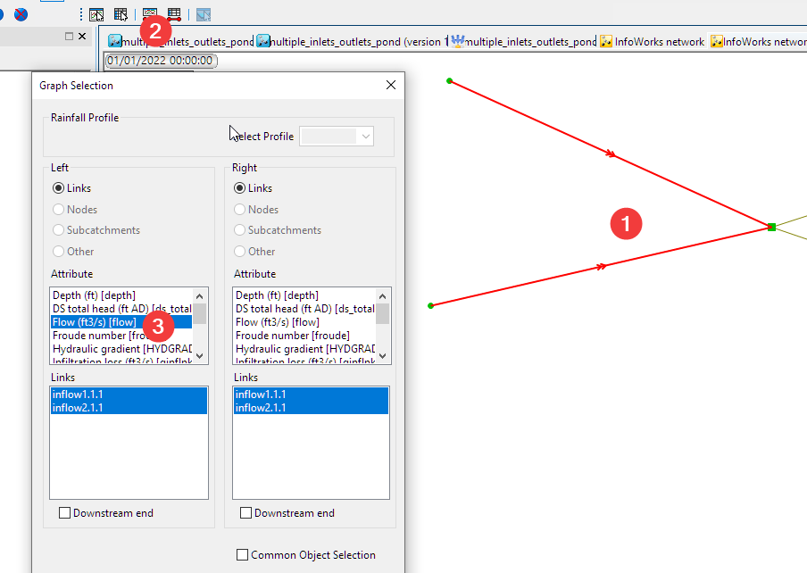

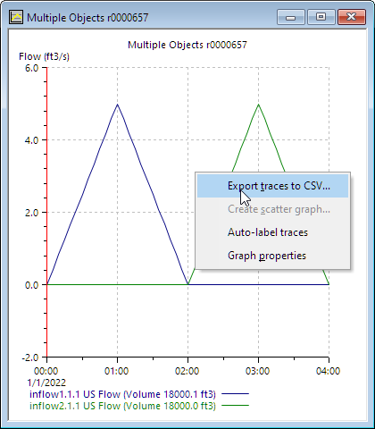

-   Or we can export all the time series using the CSV export tool.

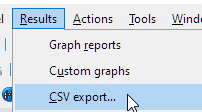

## ICM SWMM5

ICM SWMM5 works very similar to ICM.
