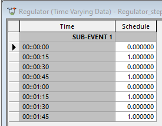
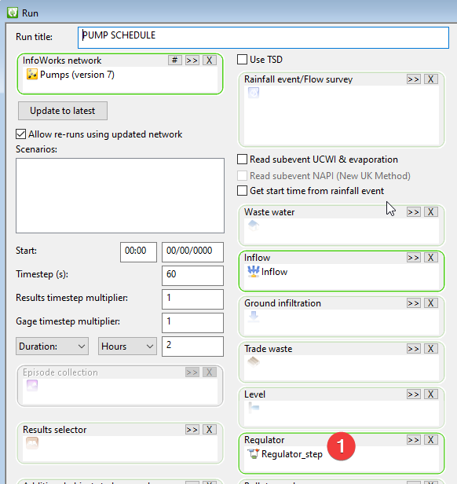

# Introduction

Pumps are often controlled by basic rules related to the water level in a wet well. But for real-time control (RTC) applications aiming to reduce power consumption or prepare a storage tank for a storm, more sophisticated control rules are required. This tutorial will demonstrate how to regulate a pump using a schedule table in InfoWorks ICM. You can find the model in the “model” folder.

# Problem statement

For pump K.1, we would like to control its on and off using a table.

The table represents a step function switching between two states ON (1) and OFF (0).

| minute | status |
|--------|--------|
| 0      | 0      |
| 15     | 1      |
| 30     | 0      |
| 45     | 1      |
| 60     | 0      |
| 75     | 1      |
| 90     | 0      |
| 105    | 1      |

# Control a pump with a regulator event

A regulator event is a time series that defines a controllable state of a model object. In InfoWorks ICM, you cannot directly control the pump using a regulator event. However, we can use the regulator event table as sensor data to set pump on and off levels.

We can set pump on and off levels using this the on and off table data to turn on the pump when value \> 0.9, and off when value \< 0.8.

# RTC rules to turn pump on and off at set values

Translating the rules into RTC settings involves several steps, let’s dive in.

1.  The description is what we get at the end.

    1.  “Schedule” is the table that defines when the pump is on and off

    2.  Pump on at 0.9 and off at 0.8

2.  The “rule” that turns on a pump using the range with the same name

3.  The range when the pump is on, values in schedule \> 0.9

4.  The “rule” that turns off a pump using the range with the same name

5.  The range when the pump is off, values in schedule \< 0.8

6.  Define the schedule table

To build the RTC, you need to start in the reverse order,

1.  create the schedule table

2.  create a range

3.  create a rule

# Schedule table

To create a schedule table,

1.  create a regulator event object

2.  paste the values into the event

3.  create an RTC time series table

4.  “replace” the RTC table with the regulator event table

## Create a regulator event object

Here are the steps to create a time series table with on and off data.

Create a regulator event object, and open it.

Fill in the information,

1.  Right click the cell

2.  First define the sub-event

3.  Start date, start time and time interval

4.  Next define the profile

5.  This step needs special attention.

    1.  “Schedule” needs to be the same as the RTC table name (see indirect profile example in [Regulator Events](https://help.autodesk.com/view/IWICMS/2025/ENU/?guid=GUID-4CECF0F7-FE80-46D0-BE2E-AC840F1362FE))

    2.  “None” means the table will be used as values not related to any model parameters.

    3.  “Indirect” means it is not directly controlling any object

    4.  “Extend” means it is a step function, so don’t interpolate between the values of 0 and 1

## paste the values into the event

Most likely you developed the schedule outside of InfoWorks ICM. Copy the column and paste it into the grid.

##  Create an RTC time series table

Next we’ll instruct the network to use the regulator event table to control the pump using RTC settings.

Open your network in GeoPlan, then open the “RTC editor”

Add all the RTC items in the order shown here.

1.  Create a time range

2.  Create a time series table

3.  Create a regulator for the pump link

4.  Create a pump on range which is returns TRUE when the value in the schedule table is above 0.9

5.  Create a rule to turns on the pump when the range is TRUE

## “replace” the RTC table with the regulator event table

There are a lot of steps involved to get it setup. It worth pointing out that the “Schedule” table in the RTC rule is replaced with the regulator event. See the indirect profile example in [Regulator Events](https://help.autodesk.com/view/IWICMS/2025/ENU/?guid=GUID-4CECF0F7-FE80-46D0-BE2E-AC840F1362FE) for more details.

To make this work, you need to provide an indirect regulator event profile that matches the RTC table name.

# Set up the run

To apply the regulator event, make sure the regulator event object is included in the run.

# Conclusion

By following these steps, you can control a pump using a schedule table in InfoWorks ICM.
