# Introduction

Modeling a pump can feel challenging if you are not familiar with the concept of how a pump works.

In this article, you’ll learn a very simple fix flow rate pump can be complicated, too.

Here is the model, we have a very simple model. We load a hydrograph into the wet well, and then we have a pump that is pumping at fixed 10cfs to empty it.

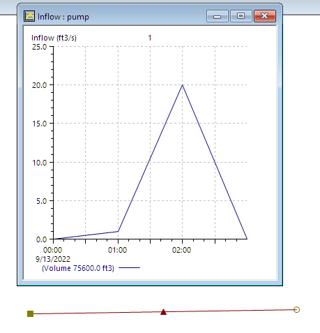

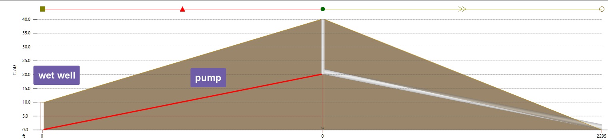

We modeled the constant pump using 3 settings: fixed pump, screw pump and rotary pump. And the results are shown below,

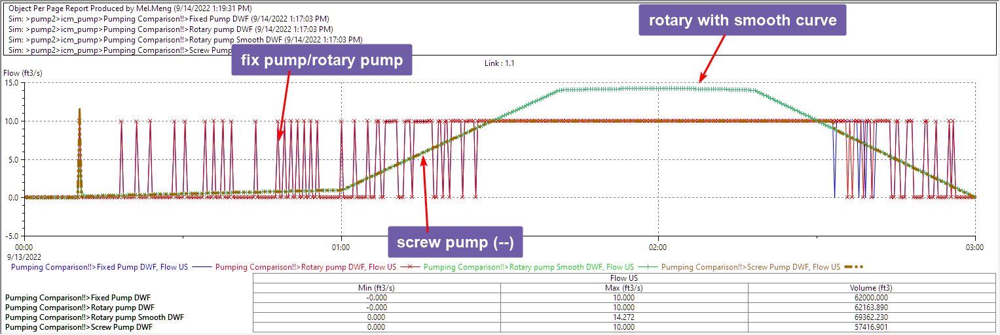

-   Blue: fixed pump

-   Red: Rotary pump

-   Green: screw pump

Fixed and rotary pump works very similar, both are trying to pump at a constant 10cfs flowrate when possible, which in turn created spikes, because the pump drained the wet well very quickly and need to wait for it to fill up to 5ft high.

Screw pump works very differently, most of the time it simply pumps whatever comes in and capped at the 10cfs we set.

We’ll dig deeper into the differences between the different type of pumps.

# Wet Well

Most of the pumps in the real world has a wet well. The reason we need a wet well is that we want to operate a pump at optimal efficiency to save energy and ensure a long service life. Therefore, when the flow is too low, we would like to collect enough water in the wet well to keep the pump on continuously for 10 mins, instead of kicking on every other minute.

From a modeling perspective, a pump can introduce instabilities into the model because when a pump is turned on or off, it causes abrupt changes in the flow, which tends to lead to instability issues.

Therefore, to ensure a smooth model run. We need to make sure when the pump is turned on, we should have enough water stored in the wet well, and when the water level is low, the pump should ramp up slowly without causing too dramatic a change in flow rate.

As shown below, you can setup the switch on value to ensure there is enough water stored in the wet well when a pump kicks in, then use the switch off level to control how much you would like to drain the wet well.

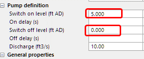

For ICM this also has some implications when the model initializes, which is the process to “prime” your model with constant flows within the system before simulation starts. Initialization can fail if the pump parameters were not carefully selected.

# Fixed Pump

The most obvious way to model it will be using a fixed pump.

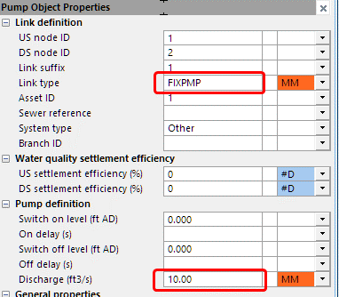

As the results show, the pump turns on and off very frequently. In the real world, usually we want to avoid such issues. When a model generates results like this, it can be a sign the pump was not modeled correctly, and more information of how the pump works might be needed to update the model.

Therefore, at the planning stage, a screw pump usually works much better because it can operate like an “ideal pump”, taking whatever comes into the wet well and pumping it out at the same rat.

# Screw pump

For a screw pump we define a curve, by setting the discharge at 10cfs, we are modeling a pump with a fixed pumping rate.

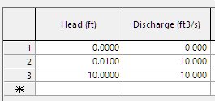

As the results below show, screw pump will decrease the pumping rate to what is feasible, and therefore produces something a lot more reasonable.

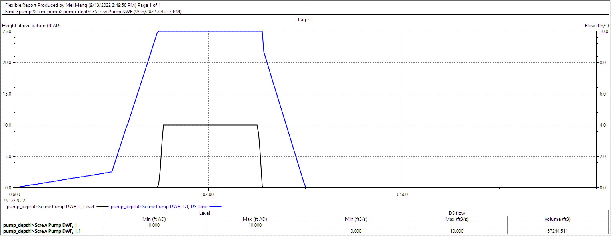

Below is a quote from SWMM5 hydraulics reference manual pg106, it explains how a pump will limit the flow to the maximum possible flow rate. Most likely ICM does something similar when screw pump is used.

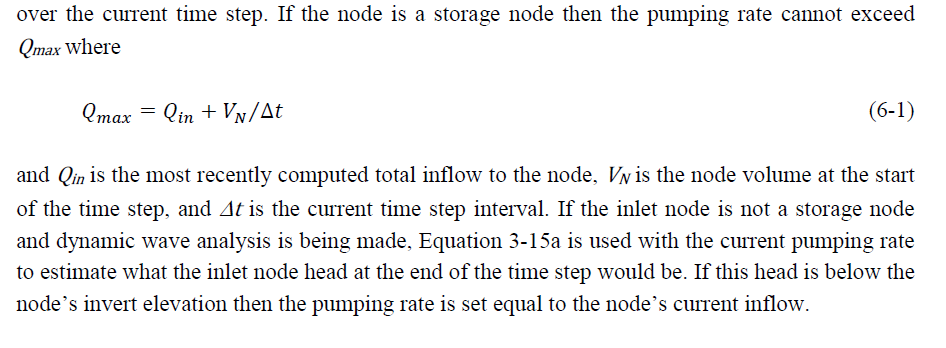

# Rotary pump

The most common type of pump is rotary pump, and we’ll see how to setup this up in ICM. I devised an imaginary pump curve, so that during the simulation the pump will pump 10cfs.

As shown below, the blue line is the pump curve, and the crosses are the simulated results.

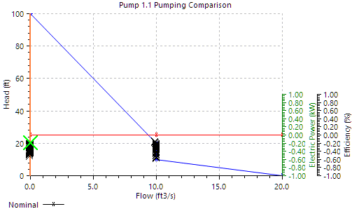

Since the pump is operating around 10cfs, the results are very similar to the fixed pump.

For the pump curve,

-   The head is ordered in descending order

-   And the discharge is in ascending order

In other words, the higher the head to pump against, the lower the flow rate.

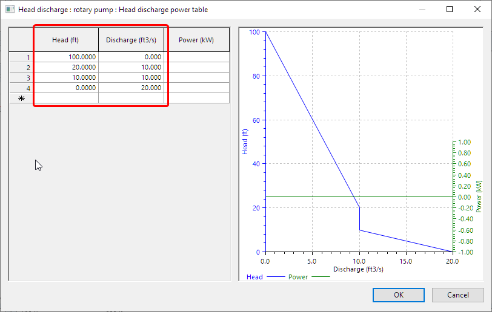

If we update the pump curve to match better how the water flows into the wet well, you will get a pump operates similar to the screw pump, pumping at the same flow rate of the incoming flow into the wet well.

# SWMM5

SWMM5 doesn’t have the fixed pump option. For screw pump, it is the type II pump.

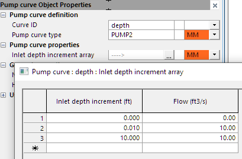

For rotary pump, it is a type III pump.

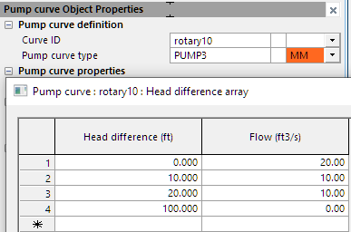

It does seem that SWMM5 will automatically limit the pump flow to the maximum flow that can be pumped from the wet well. Therefore, showing no spikes in the results, and the rotary pump and “screw pump” show the same results which is basically the inflow.

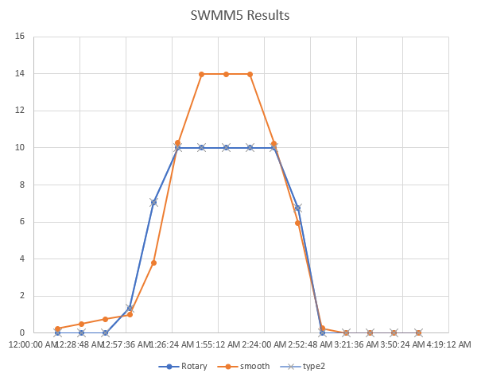

**NOTE:** As shown in Eq 6-1, the Qmax is dependent on the timestep used for the simulation. Therefore, the pump results can vary depending on the timestep value if Qmax is used instead of the pump curve values.

# XPSWMM

XPSWMM results are similar to SWMM5 results with a few exceptions,

-   The screw pump option is less stable than SWMM5

-   The peak flow of rotary pump seems to be different from SWMM5, most likely small differences between the models.

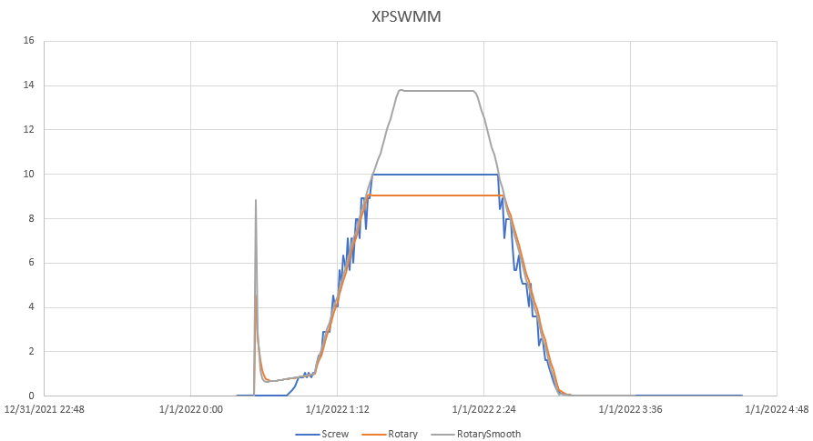

# Conclusions

Correctly setting up a pump can be tricky without accurate field data. As a modeler, you should be familiar with how the different type of pumps behave. As shown in the article, different software implements the pumps quite differently.

-   ICM seems try to stay true to the pump curve except when using a screw pump.

-   SWMM5 will automatically adjust the pumping rate to match the wet well condition, in a way working as an idea pump if the pump is too powerful while not enough water is stored in the wet well.

-   XPSWMM seems to work very similar to SWMM5
