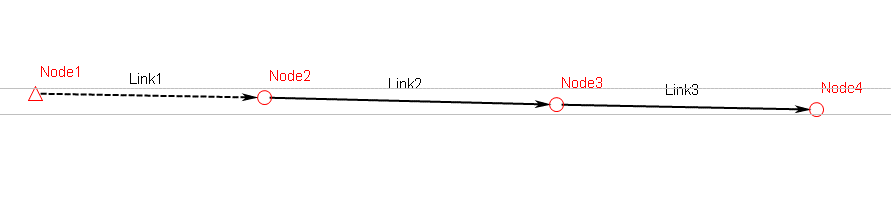
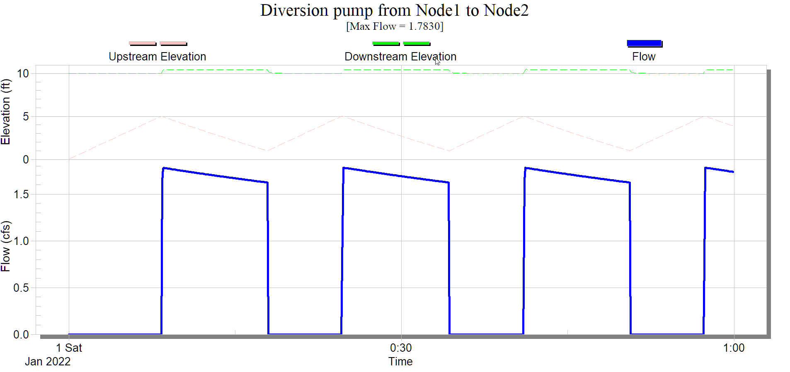
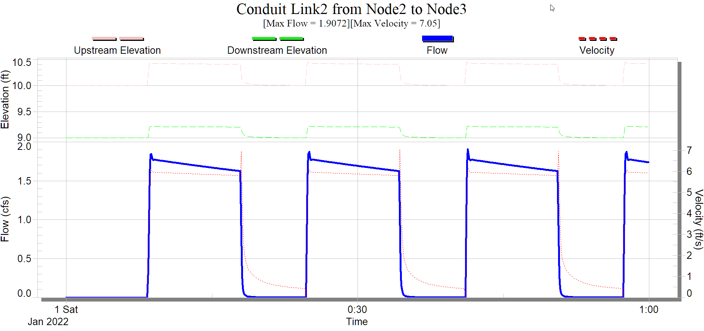
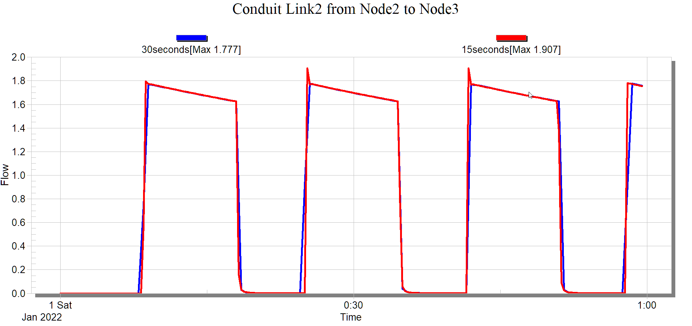
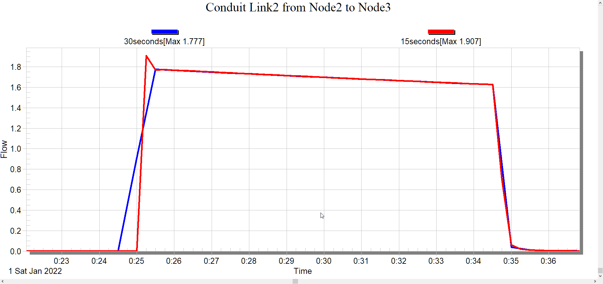
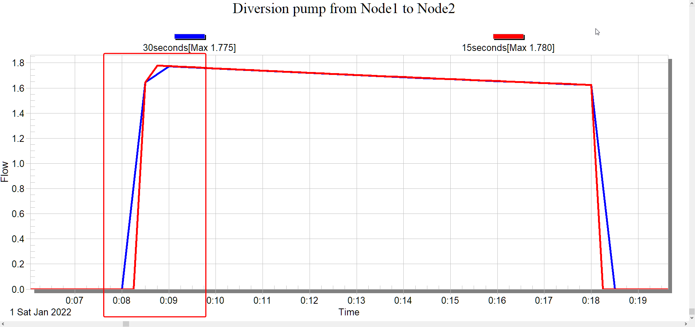

# Introduction

When a pump is turned on, it will take some time for the flow to ramp up from 0 to its pumping capacity. Just like it takes a car some time from stop to reach 60mph.

However, when we are modeling pump, that might not be the case. And it could create something quite puzzling.

Here is a simple model with a pump link (Link1). And it is feeding 1cfs to a 100sf wet well.

The pump flow is shown below with a peak flow of 1.783cfs

The pipe flow in Link2 is shown below, and has a peak flow of 1.9 cfs, higher than the pumped peak flow. How is that possible?

# Time step matters

What I found is that if I change the model timestep from 15 seconds to 30 seconds, the small bump is gone.

A closer look shows the timing of the flow in link2 is different.

And if you look at the pump, it shows the problem. The essence of the issue is that in our model, it takes literally no time for the pump to ramp up from 0cfs to its top speed. Therefore, all that matters is the timestep, if we use a 15 seconds timestep, then it will take 15 seconds to ramp up. And if we use a 30 seconds timestep, then it will take us 30 seconds to ramp up the flow.

If you follow car news, you’ll know the cars that can ramp up very quickly will cost a fortune. Therefore, although the top speed is the same, the acceleration is very different.

When using 15 seconds timestep, the downstream pipe is receiving a more forceful burst of flow into it, and that is why we see a bump at the beginning.

# Conclusion

In the mode, pumps are modeled in rather simplistic manner, and the way it can ramp up in no time is far from realistic. And this can cause a little bump when the flow is discharged into the downstream pipe.

In most of the applications, this very small bump will be quickly absorbed as it is routed downstream without causing any major errors. However, this is a great reminder the complexity involved in solving differential equations using numerical methods, it is just an approximation, and as a modeler, you need to be aware of its limits.
