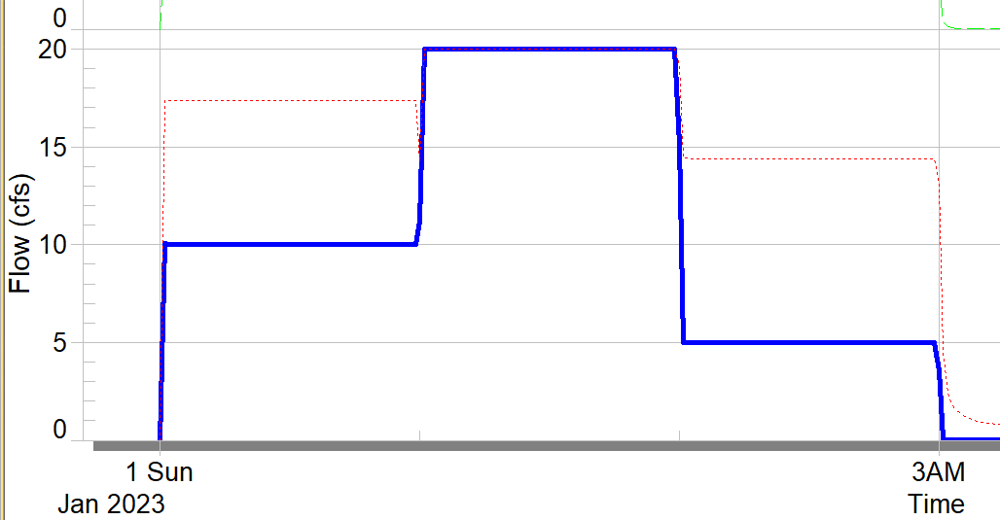
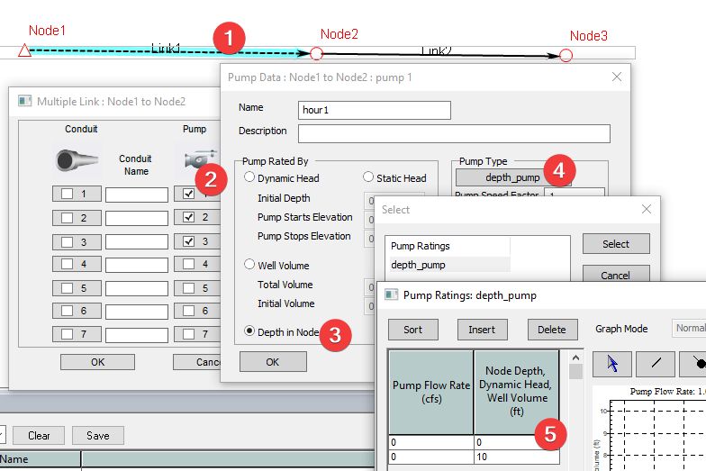
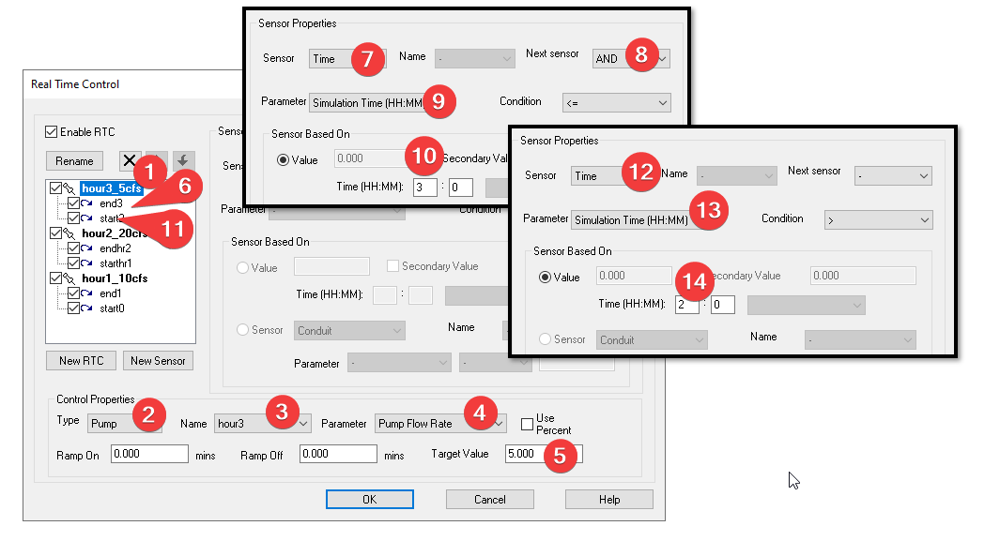
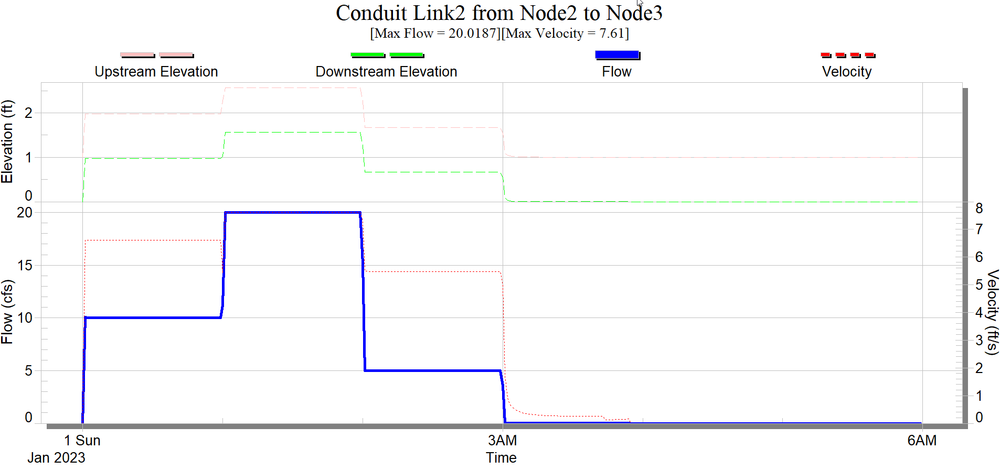

# Introduction

How to setup a pump that operates on a schedule like the following?

- 10cfs for the 1st hour

- 20cfs for the 2nd hour

- 5cfs for the 3rd hour

# Solution

In XPSWMM you can use RTC to setup the pump schedule using the following trick. You can setup a pump for each hour.

We don’t want to pump to pump any flow outside of the scheduled hour, using the “depth in node” pump with the following curve does just that.

For each hour, we need to create a pump in the multi-link.

Next we use the RTC to set the flow rate for each hour. As the following example shows,

- Create a new RTC for hour 3 (hour3_5cfs), steps 1-5 set the flow to 5cfs when it is activated

- Create two sensors, steps 6-10 set the end time at 3hrs into the simulation, and steps 11-14 set the start time at 2hrs

And here is what the results look like,

