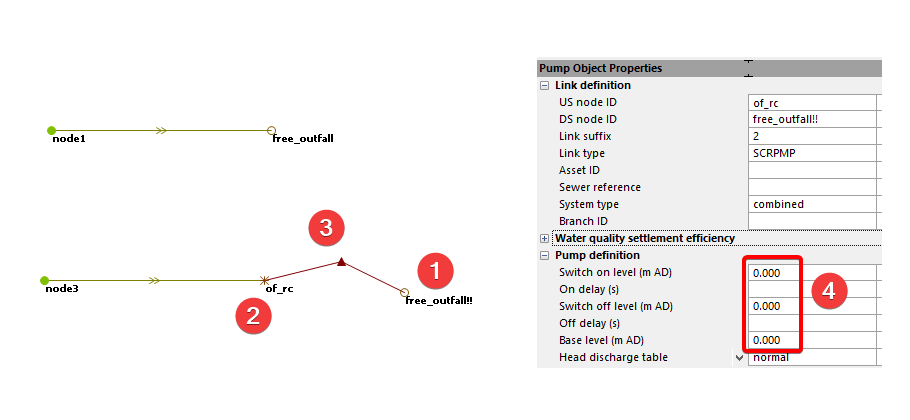
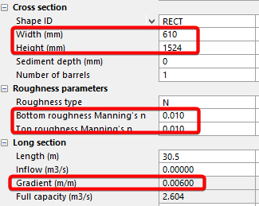
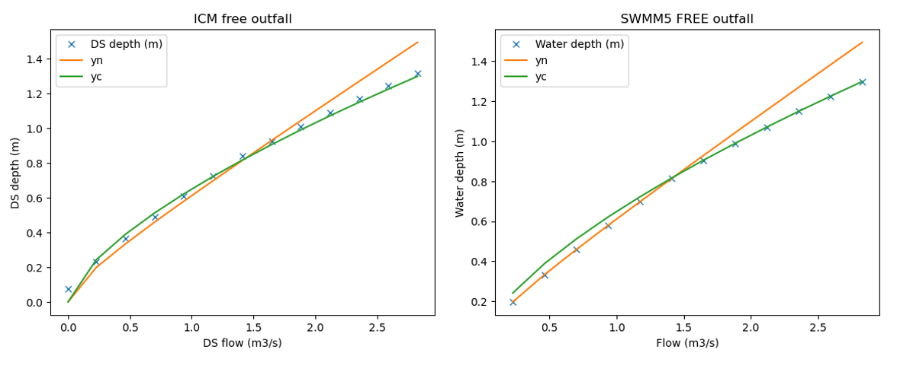
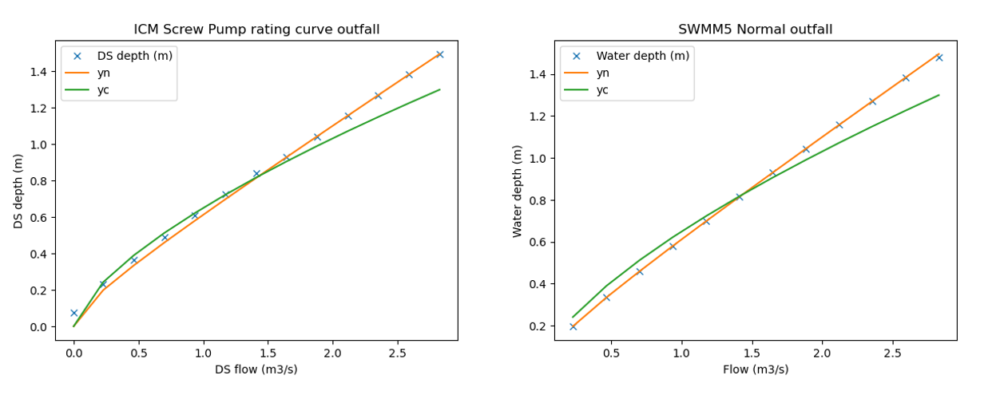

# Introduction

Rating curve defines the relationship between the depth and flow. It is often used to define the boundary condition of an outfall,

- Flow into a treatment plant

- Split a model into sub models, and model the flow condition at the split locations

In InfoWorks ICM, the easiest way to add a rating curve to an outfall is to convert it to a screw pump.

1.  Make a copy of the outfall

2.  Change the existing outfall to a break node

3.  Add a pump link

4.  Change it to screw pump and set the on/off base level the same as the break node

5.  Update the head discharge table with the rating curve

# Example Model

A simple model with rectangle outfall pipe is modeled in both InfoWorks and SWMM5.

The results are shown as a scatter plot of depth vs velocity as shown in the following figures,

- **Orange** is the normal depth calculated from Manning’s equation

Rating Curve

# Introduction

Rating curve defines the relationship between the depth and flow. It is often used to define the boundary condition of an outfall,

- Flow into a treatment plant

- Split a model into sub models, and model the flow condition at the split locations

In InfoWorks ICM, the easiest way to add a rating curve to an outfall is to convert it to a screw pump.

6.  Make a copy of the outfall

7.  Change the existing outfall to a break node

8.  Add a pump link

9.  Change it to screw pump and set the on/off base level the same as the break node

10. Update the head discharge table with the rating curve

# Example Model

A simple model with rectangle outfall pipe

It is modeled in both InfoWorks ICM, and SWMM5.

As shown in the following figures,

- **Orange** is the normal depth calculated from Manning’s equation

- **Green** is critical depth calculated from the flow

- **X** is simulated results from the model

For free outfall, InfoWorks ICM and SWMM5 show similar results, it is the lower of the Yn and Yc.

Since InfoWorks doesn’t have a normal outfall condition, a screw pump with a rating curve is used, and it shows similar results as SWMM5.

