# Introduction

Screen is modeled using the Kirschmer’s equation in ICM. Refer to this [Reference PDF](https://web.itu.edu.tr/~bulu/hyroelectic_power_files/lecture_notes_09.pdf) on pg 5 for more information.

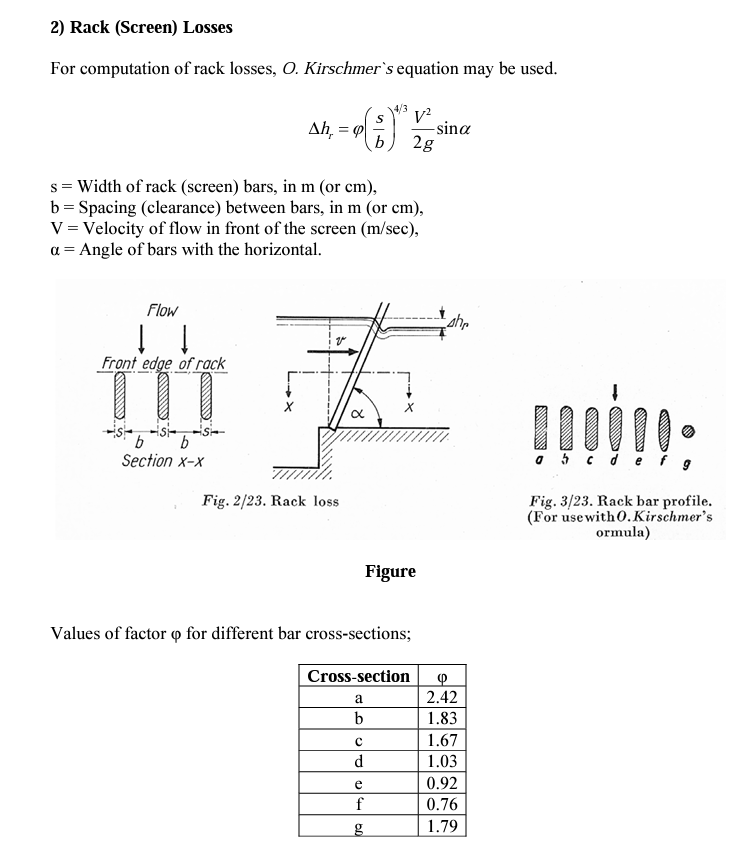

As shown above, it is an empirical equation based on the configuration of the screen.

ICM screen is a link with the following parameters,

-   invert of the screen. I found it a little confusing since it is called crest. It is the elevation

-   Width and height of the screen is not actually used for calculation

-   For the angle, it is measured from the vertical line

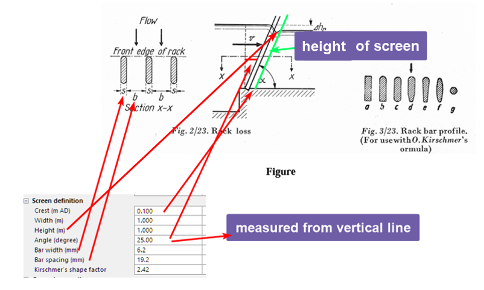

The opening in the profile is the height of the screen\*cos(angle). H1 and H2 are the depth before and after the screen, ICM will computer the headloss.

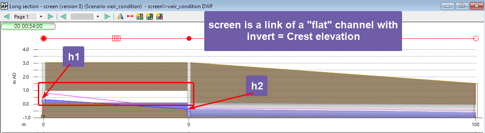

When h2 is below the invert of the screen, a weir equation will be used instead according to the help document. However, there seems to be an error in the formula. For width, it should be the channel width instead of the screen opening.

When the screen is drowned, there is an option in the simulation parameter to use Villemonte equation.

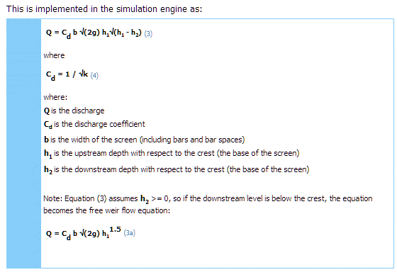

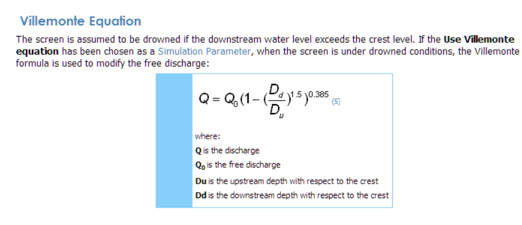

# ICM Model

Three simple ICM models were created to show how screen works. By adjusting the downstream node and pipe, 3 different conditions were tested.

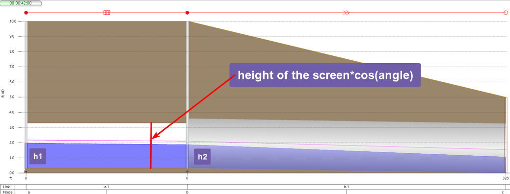

-   Normal: use Kirschmer’s equation

-   Weir: use weir equation

-   Drowned: use Kirschmer’s equation when Villemonte option is not ticked

The results are verified by comparing the ICM simulated results with manually calculated values.

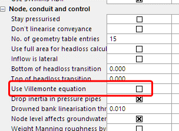

## Approaching Velocity

The US velocity reported by ICM is the approaching velocity in the channel, not the velocity through the openings of the screen. As shown in the calculation below, the velocity using both the channel width and screen opening were calculated. And ICM reports the approaching velocity (green matches orange).

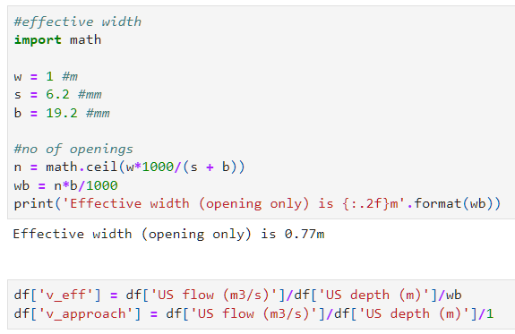

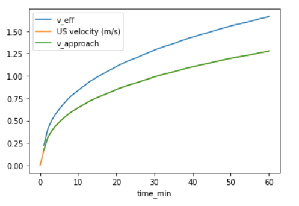

## Normal condition

For normal condition, we compared the headloss reported by ICM (dh), and calculated using the Kirschmer function. Very good match is observed (r2=0.999)

-   dh = h1 -h2

-   dh_eq = KirschmerFn(velocity)

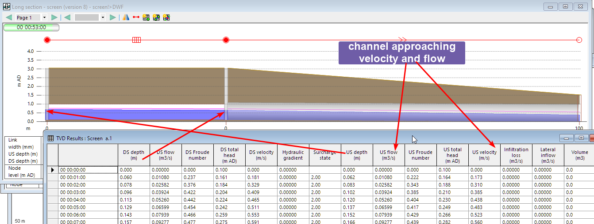

## Weir condition

For weir condition, we compared the flow reported by ICM, and calculated using the weir equation from H1.

-   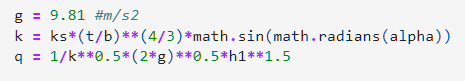

Good match was observed (r2=1)

## Drowned – use Kirschmer’s equation

Drowned condition should be the same as normal condition since the option was not checked (r2=0.97).

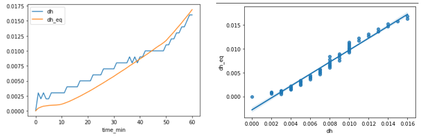

## Drowned – use Villemonte equation

When the weir is drowned, the flow through the weir is adjusted using a factor of the free weir flow as shown in the [source](https://cassiopee.g-eau.fr/assets/docs/en/calculators/structures/villemonte_1947.html) below.

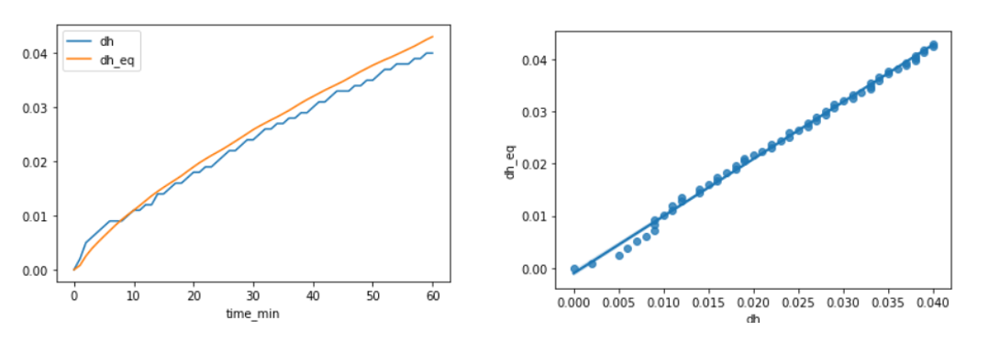

# Conclusion

In this article, we went through a few examples to verify the calculation of screens in ICM.

-   The Kirschmer’s equation is used for normal condition.

-   The angle is measured from the horizontal, not vertical.

-   The US velocity is the approaching velocity, not the through velocity of the screen opening.

-   When the downstream of the screen is below the screen invert (crest), the weir equation will be used.

-   When the screen is drowned, the situation is more complicated because of downstream restriction might play a more important role on the flow rate.
