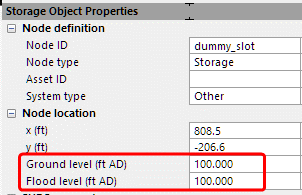

# Introduction

To model an underground storage unit shown below is straight forward, you just need to define the storage curve of the tank and the manhole. A more interesting question is what if the manhole is sealed, or there is no overflowing manhole, how should you model the underground unit?

It turns out modeling a sealed node is tricky in XPSWMM/SWMM5/ICM because there is no way to literally seal a node (ICM can model a sealed node as a break node, however, for a storage node, it cannot be sealed.)

SWMM5 acknowledges the limitation and lets you use the “surcharge depth” to model pressurized nodes. For a normal node, once the water rises above the ground, it gets lost the same way as going out of an outfall. With the surcharge depth, the water will rise until it goes above the surcharge depth before leaving the system. This workaround will maintain the pressure, and since the area of a manhole is typically small comparing to the flow through it, the error caused by the extra stored volume is very small.

Below is an example, you need to add a dummy slot above the top of the storage unit, very similar to how you would model a storage unit with a manhole.

The figure below shows what happens with this setup, as water rises and gets into the dummy slot, the water level will rise much faster corresponding to the pressure increase, and the flow into the storage will decrease dramatically. Very quickly the pressure build up will stop water from coming into the storage tank.

Unfortunately, most people are not aware of this limitation, and such models are usually not set up correctly. In the following sections, I’ll show a few common mistakes.

-   Model the storage without a dummy slot

-   Not sealing the node to keep it pressurized above the ground elevation

You will compare the results of the testing model shown below. Each storage node receives flow from an upstream node at 1cfs, the only difference is in the storage node parameters.

# XPSWMM

## Dummy Slot

To model a storage with a dummy slot,

1.  Seal the node. When a node is sealed, XPSWMM will keep the “surcharge elevation” as high as needed.

2.  Set it up as a storage

3.  Enter the storage curve

4.  No need to use the surcharge elevation (refer to next example for more details.)

5.  Add a dummy slot, make sure the last one matches the spill crest (XPSWMM will interpolate if water rises above the curve’s range)

The result below shows,

-   Once the water rises above 5ft it is in the dummy slot and water rises quickly

-   Since the node is sealed, after water rises above 15ft (spill crest), it continues to rise, and it uses the same area as the dummy node (XPSWMM interpolate the storage curve)

## Without dummy slot

A more likely setup is shown below, you might model the storage node with a spill crest at the top of the tank of 5ft (1), and only model the storage of the tank (2).

As the result shows there is no sharp increase of water level after water rises above 5ft. XPSWMM assumes the same storage area after the water rises above 5ft.

## Use the surcharge elevation

XPSWMM has a special feature [surcharge elevation](https://help.innovyze.com/display/xps/Hydraulics+Node+Data#HydraulicsNodeData-SurchargeElevation) for this particular type of problem, when water rises above the surcharge elevation the storage will turn into a manhole.

-   \(1\) set the spill crest at the ground level

-   \(4\) set the transition to manhole at the top of the tank

-   \(6\) only show the storage for the curve of the tank

The result is very similar to the dummy slot model.

However, I personally prefer the dummy storage curve method because surcharge elevation is a rarely used feature, and the reviewer of the model might not understand its purpose.

## Not sealed

Another possible mistake is to model the storage node without sealing it.

As the result below shows, overflow happens once water rises above 5ft, clearly not correct.

# SWMM5

To model a sealed storage in SWMM5,

-   To seal a manhole, set the surcharge depth to a large number (2)

-   Define the storage using the storage curve (3), (4)

As the result below shows, SWMM5 behaves similarly to XPSWMM

-   No surcharge (blue), water rises \> 5ft will be lost

-   Surcharge (pink), water rises \>5ft it will assume the same storage area as water continue to rise

-   Dummy slot (red), after water rises \>5ft, it will use the dummy slot area as water continue to rise

# ICM

There are some extra steps to get the same testing model running in ICM after importing from SWMM5,

-   Add outfall to all the storage nodes, by setting up the discharge pipe at 1in diameter, the outgoing flow is very small.

-   The inflow needs to ramp up from 0 to 1cfs, otherwise as ICM does the initialization, it will fill the storage tank.

-   Since ICM doesn’t support “surcharge depth”, that value is not transferred, and you need to manually update the ground elevation to the surcharge depth. (NOTE: flood depth = flood level – water level, flood level doesn’t impact the absolute flood level.)

The result below shows,

-   “No surcharge” behaves the same as SWMM5, it overflows at 5ft (ground level at 5ft, only define storage for the tank)

-   “Dummy slot” behaves the same as SWMM5, it transitions into slot after 5ft, then overflows at 10ft (ground level at 10ft, define storage with slot)

-   Interestingly, “surcharge model” behaves differently from SWMM5, it kinds of does the XPSWMM “surcharge elevation” trick. After water rises above the storage curve range (5ft), it transitioned into a manhole, then overflows at 10ft (ground level at 10ft, only define storage for the tank).

Since the storage overflows at the ground level (10ft), to keep it pressurized, you need to increase the ground level to the “surcharge depth”, let’s say, 100. As the result shows, once we increased the ground elevation level to 100ft, the node is “pressurized”.

