# Introduction

To design an efficient pump station, you need to understand what the system needs, represented as the system curve, then select a pump whose pump curve intersects the system curve at an optimal operating point. This optimal operating point will help minimize operating and maintenance costs.

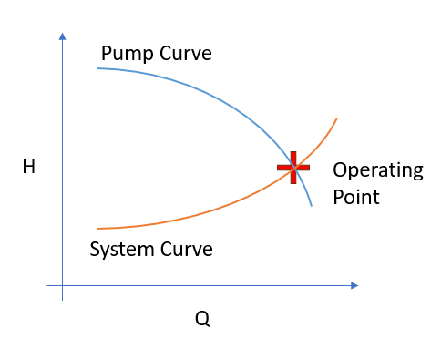

# System curve

To move water uphill, a pump overcomes two forces, gravity and friction.

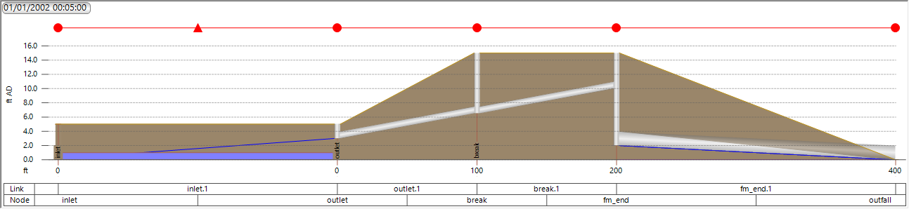

Friction loss shapes the curve, for system with long force mains and significant minor losses, the curve is steep, as the flow increases, the losses increase proportional to V^2. While for system consisted mostly static lift, the curve is rather flat.

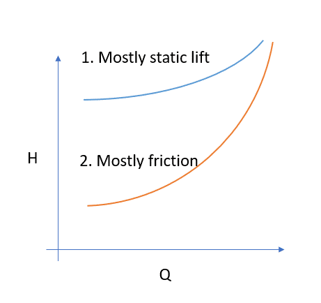

In the following exercises, we’ll build our intuition about how the shape of the curves drive the design decisions.

# Exercise 1 System Curve

With InfoWorks ICM, you can estimate the system curve using an ideal pump, an ideal pump simply pumps whatever comes into the wet well out.

We can approximate an ideal pump using screw pump. By providing a pump curve that can ramp up the flow from 0 to 10 mgd within 0.1ft, the pump will essentially pump out any flow in the wet well immediately.

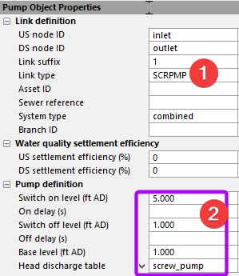 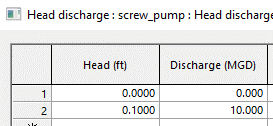

You can route the simulated flow through the pump station, but for simple situations, you can simply create an inflow that ramps from 0 to the expected maximum flow.

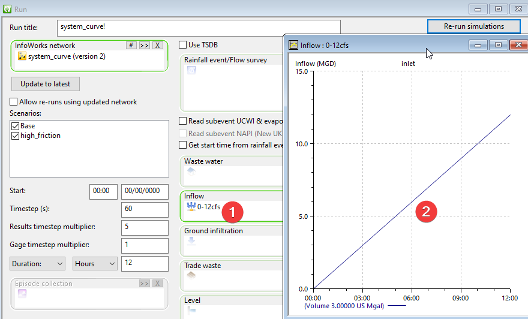

NOTE: screw pump curve operates on the water level in the wet well. The head is calculated as the water level – base level.

Next, we can plot the system curve from the pump link results table.

- Head = DS total head – us total head

- Flow = pump flow

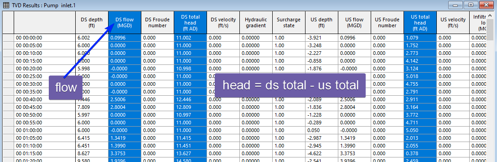

## High friction scenario

Next we will compare how adding more friction to the system will impact the curve.

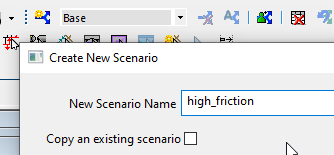

Change US/DS headloss coefficient for the force main from 0 to 4.

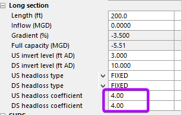

When plotting both system curves, the high friction curve increase at a much steeper rate as flow increases.

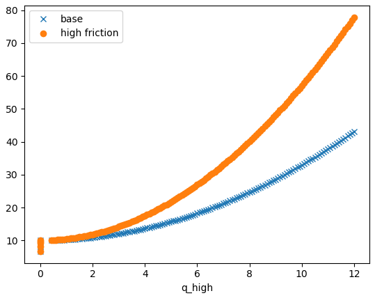

## Operating band

Depending on the boundary conditions and operation mode, the system curve can consist of a band rather than a single curve. For example, during high flow condition, the level in the wet well will be much higher.

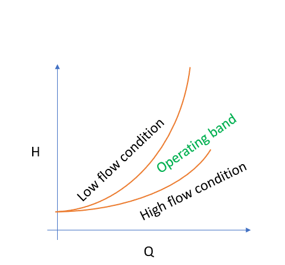

In general, the operating band is bounded by the maximum of static lift and head loss versus the minimum of the two.

Let’s create a new scenario,

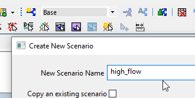

Update the base level from 1 to 4ft will turn on the pump at 4ft instead 1ft.

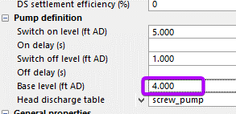

The operating bank is shown below,

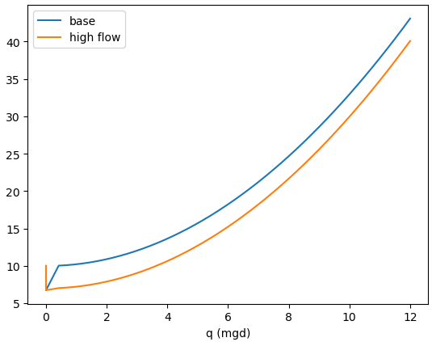

# Selecting a pump

Here are a few notes on selecting a pump,

- All the system curves fall inside the operating band.

- If pumps work at the boundaries, it will generally work inside the operating band.

- All pump operations will fall on the pump curve in between the operating band

For example, as shown below, the pump will operate along the curve between A and B. The pump won’t work if the H, Q is outside of that range.

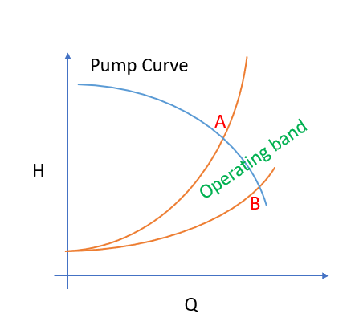

To extend the operating range of a pump station, common solutions are parallel pumps, variable speed pumps and pumps in series.

When using parallel pumps with the same pump curve, you can double the flow for the same head as shown below. And the pump station now can handle flow between AB along the system curve.

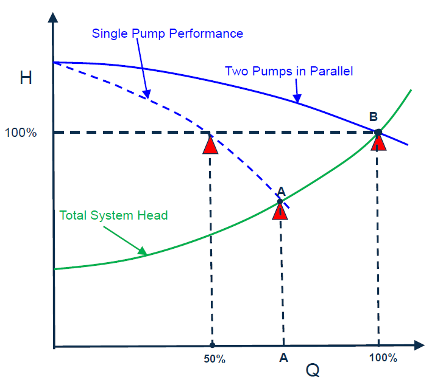

With variable speed pump, you can change the pump curve according to the affinity laws.

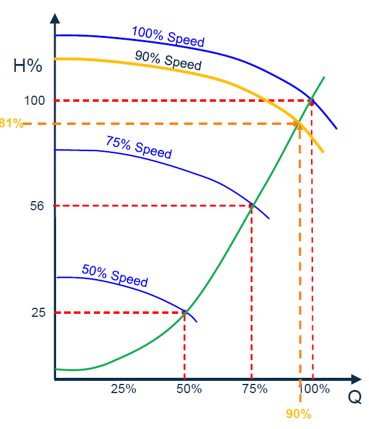

Pump in series, for the same flow, the two pump will double the head.

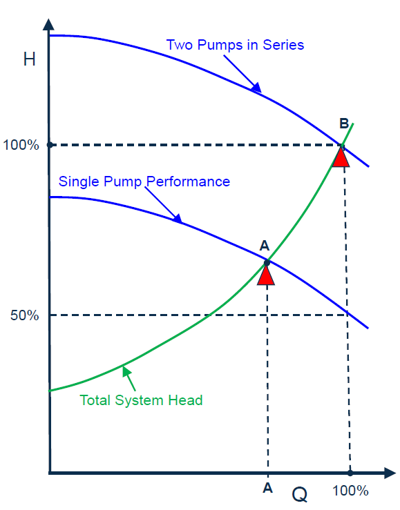

The next consideration is the efficiency of the pump, to save money on power and extend the life of the pumps, we would like the pump to be operated close to the high efficiency point. A general rule of thumb is to operate at the middle of the pump curve. Since a pump can operate on a wide range, it requires engineering judgement and historical operation data. For example, you might want to set the pump to operate 50% of the time near the more efficient operating point, and only 10% of the time operating at a much higher low point which is a lot less efficient.

# Exercise 2 Selecting a rotary pump

A pump can only operate at a single point where it intersects the pump station. Therefore, a fixed pump that pumps at the flow of the intersection will behave the same as the pump with a pump curve selected. In practice, since the condition changes during the simulation, the pump will operate inside the operating band instead.

Let’s start with a rotary pump curve, in general, you would like to let the pump operate close to the middle of the curve to ensure good efficiency.

As shown below, we created the pump curve where the middle part intersects the operating band. This curve is defined using 3 points,

- Low flow@(0, 15): the shut off point

- Design flow@(4, 13): the ideal operating point

- high flow@(8, 7): the highest flow to be pumped

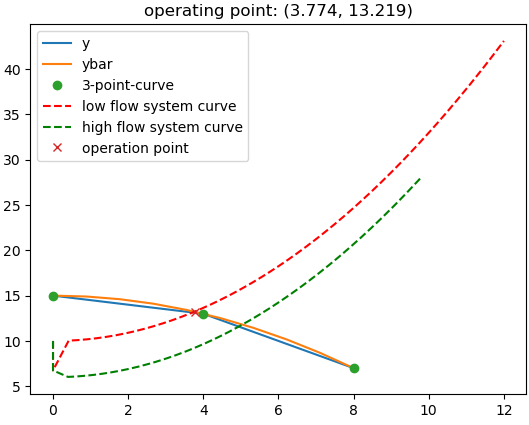

Using a polynomial curve fitting, we created a 10-point pump curve.

| H (ft)   | Q (mgd)  |
|----------|----------|
| 15       | 0        |
| 14.94444 | 0.666667 |
| 14.77778 | 1.333333 |
| 14.5     | 2        |
| 14.11111 | 2.666667 |
| 13.61111 | 3.333333 |
| 13       | 4        |
| 12.27778 | 4.666667 |
| 11.44444 | 5.333333 |
| 10.5     | 6        |

Create a new scenario,

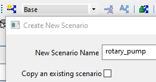

Update the pump,

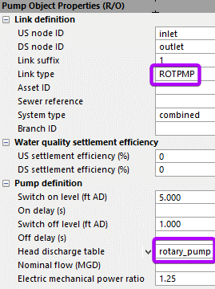 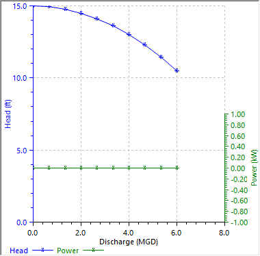

The results are shown below,

- as the figure to the left shows, most of the operating points are along the pump curve within the operating band

- we do have a few points that are in the operating band but outside of the pump curve, WHY is that?

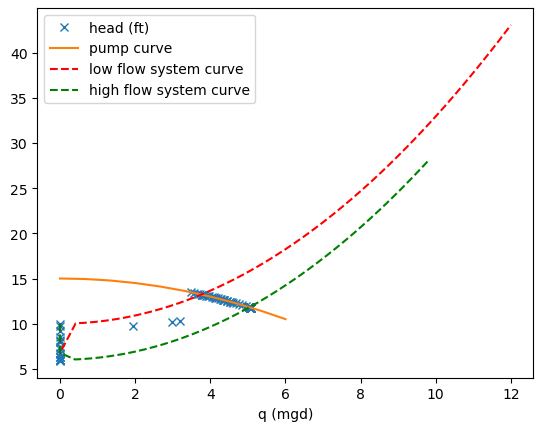 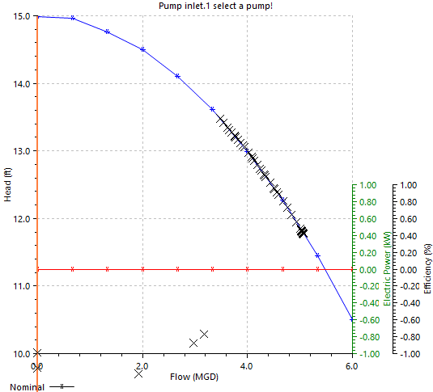

The pump can only pump around 5mgd, to pump more flows, we can add parallel pump.

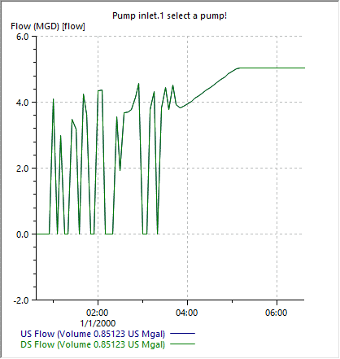

Create a new scenario,

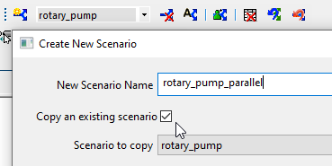

Add a parallel pump,

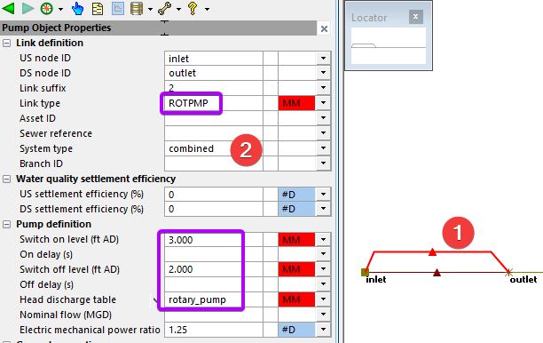

As shown below, with both pumps on, it can extend the flow range from around 5mgd to 6mgd.

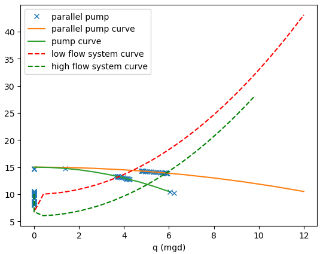

# Exercise 3 Selecting a fixed pump

As we have seen in the rotary example, the pump can only operate on a very narrow range for a given pump curve and system curve. For simplicity during the design phase, you can use a fixed pump to achieve very similar results without spending too much time selecting a pump.

For example, we know during high flow conditions,

- with one pump, it can 5mgd

- with two pumps, it can pump 6 mgd

Therefore, we can approximate the parallel pump with the same rotary setup and switch the pump type to fixed pump.

Copy the rotary_pump scenario,

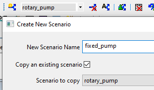

Then update the pump to fixed pump with 5MGD flow,

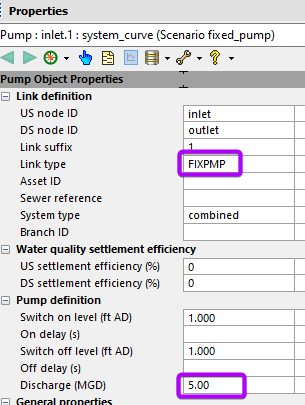

As shown below, the fixed pump ramps up a little differently from the rotary pump, but once it is at capacity, the results are very similar.

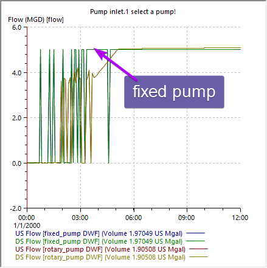

The comparison between the fixed and rotary pump is shown below,

- fixed pump is basically a vertical line

- if the rotary pump curve within the operation band is flat, it could operate at a larger flow range, and the fixed pump might not provide good estimates during lower flows.

- However, for planning purposes if only high flow condition is important for the final recommendations, fixed flow will produce the same flow and is a much simpler way to setup the pump

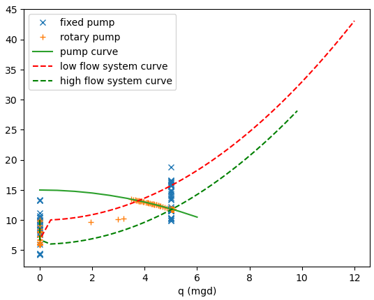

# Exercise 4 System Analysis

When designing a pump station, we need to optimize for energy efficiency and maintenance.

Using metering data, we can get some idea of the flow conditions.

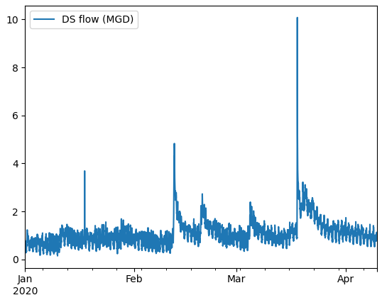

By overlaying the histogram of the flow data on top of the system operating band, we can see,

- Most of the flow data points are within 0-2mgd, with a peak of the histogram around 3 mgd

- Flow only reaches the high peaks above 4 mgd a handful of times

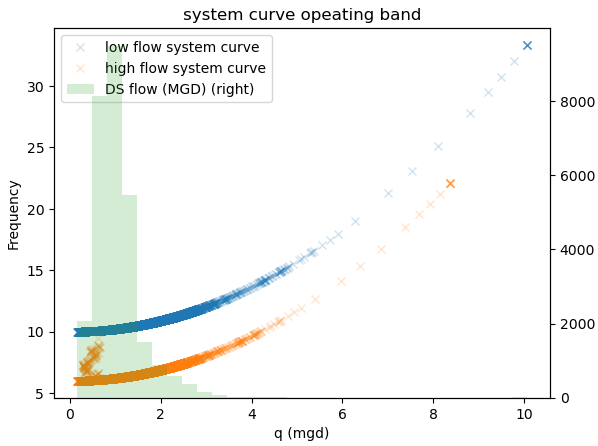

Therefore, when designing the pump station, we should optimize around the range between 0-2 mgd.

# Reference:

- [Water Talk System Curves](https://www.youtube.com/watch?v=WScO77w-iKw&ab_channel=AutodeskInnovyze)

- [58 Modelling sewage pumps – keep it simple stupid](https://www.linkedin.com/pulse/58-modelling-sewage-pumps-keep-simple-stupid-martin-osborne/?utm_source=share&utm_medium=member_ios&utm_campaign=share_via)
