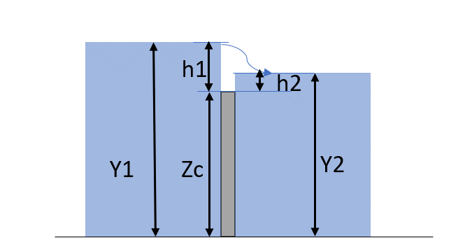
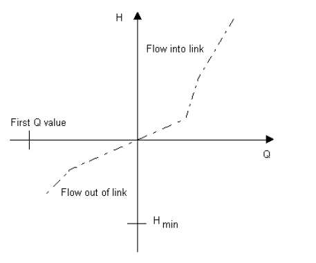
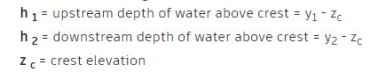
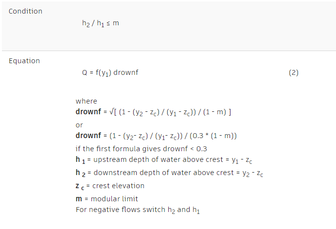
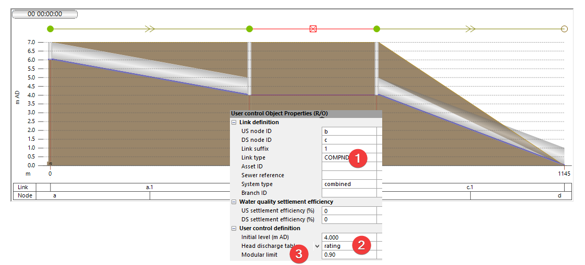
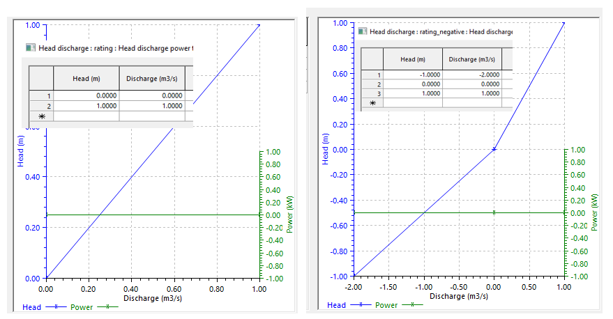
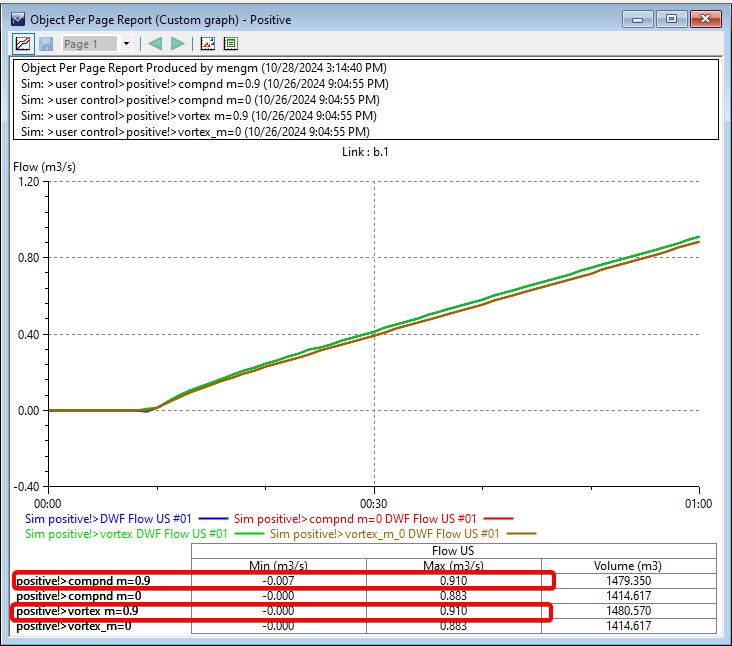
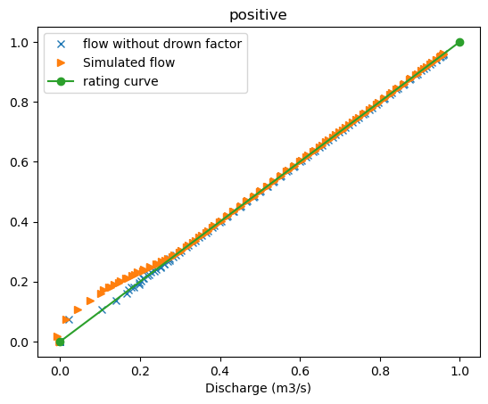
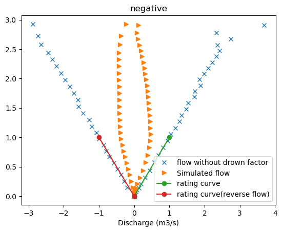
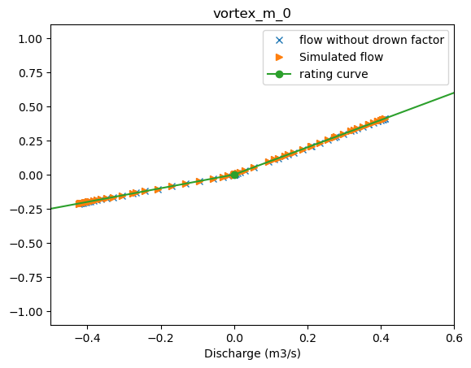

# Introduction

[User defined control](https://help.autodesk.com/view/IWICMS/2024/ENU/?guid=GUID-66F0B502-4BE9-428A-A2CD-D43047B2093C) is a zero-length link that regulates the flow using a user defined rating curve (head vs discharge curve, also called a rating curve). Here are a few examples,

- **Composite weir or orifice:** it requires a more complicated curve than the simple Q=a\*H^b equations.

- **Boundary conditions at WWTP headworks**: the curve can be developed from observed flow and depth data

- **Hydro-dynamic separator (Vortex):** complicated structures modeled as rating curve

As shown below, a user defined control can be visualized as a weir. Depending on the settings, the flow is defined as a function of h1 or (h1-h2) following the rating curve.

# Best practice

In most cases, you should model the user defined control as a “compound” type with a modular limit of 0.66.

- The flow is controlled the by the upstream water depth above the “weir” (h1).

- When the downstream tail water level (h2) increases h2/h1 \< 0.66, it is free flow, and the flow follows the rating curve exactly.

- When the downstream tail water level (h2) increases h2/h1 \> 0.66, the control enters drowning condition, and the flow will be restricted using a drowning factor.

- When the tail water is higher than the upstream level, flow will be reversed and using the same equations with h1, h2 switched to match the flow direction.

To model reverse flows using a different rating curve requires the use of a “vortex” type, and it is not common. Refer to the Reverse flow section for more information.

The following sections will get into more details of the user defined controls.

# User defined control vs Pumps

User defined controls act like pumps, you can think user defined controls pump downhill instead of uphill.

- **Screw pump:** the head is the water depth in the wet well regardless of the discharging side water depth. The pumping rate is a function of the wet well water depth.

- **Rotary and VFD pumps:** the head is the difference of the discharging side and the wet well. The pumping rate is the function of the elevation difference to move the water uphill.

- **Flow direction:** the flow can only go one way.

A user defined control adds more complexities,

- **Reverse flows**: can happen in user defined controls

- **Modular limit**: when the downstream level is getting high, flow decreases

# Depth vs Head in rating curve

The modular limit requires careful evaluation. One often overlooked aspect is that the definition of head in the rating curve changes when modular limit is set as 0 or leave blank.

- **Modular limit (m) = 0 or blank**: the head is the difference h = “upstream depth” – “downstream depth”. It operates more like a rotary pump

- **Modular limit (m) \> 0:** h = “upstream depth”, it operates like a screw pump.

# Drowning conditions

When modular limit is greater than 0, a user defined control will adjust the flow if downstream end water level is high.

If the ratio of h2/h1 is less than the modular limit (m), it is free flow. You get the flow from the rating curve directly.

However, if the ration is greater or equal to m, you’ll need to calculate the drowning factor.

As a result, when it is drowning, the flow will be less than what the rating curve reads.

# Recommended modular limit as 0.66

The updated recommended modular limit is 0.66, the old default value is 0.9 and we recommend using 0.66 if you see oscillations in simulation results.

A lower modular limit value slows down changes in flow. With a lower limit, the system is more likely to enter and remain in a drowning condition, which restricts the flow. This is similar to driving on a long stretch of rough surface that consistently slows you down, compared to a surface that alternates between rough and smooth patches.

# Reverse flow

Reverse flow will happen when the water level on the downstream end is higher than the upstream end, and the equation for the flow is defined by,

- **Compound user control**: it operates like a weir or orifice. Flow can go both ways use the same equations. When flow reverses, we simply switch the upstream and downstream sides and use the same equations. As a result, the rating curve for compound user control can only have positive heads.

- **Vortex user control**: it defines reverse flow in the rating curve. When the head is negative, reverse flow happens. And if negative head is not explicitly defined in the rating curve, it will be extrapolated.

Reverse flows can present some challenges. Generally, if you anticipate reverse flows, it's best to set the modular limit to 0. This will use the water depth difference to determine the flow, once the downstream side is higher, it will flow backward. However, if you need to control the flow based on the upstream water depth, it becomes complicated when the flow reverses. Since the rating curve does not account for the downstream water depth, meaning that when reverse flow occurs, it's controlled by the downstream side of the level. This assumption usually is not correct and should be avoided.

# Example

The model below shows how user defined controls work, refer to the Jupyter Notebook in the repo for more details.

The model has 3 links, and the user defined control is the middle pipe. Node A is the inlet, and node d is the outfall.

The head discharge table for compound and vortex,

There 4 scenarios of the same network as shown below,

| No  | Scenario       | Link Type | H-D table       | Modular limit |
|-----|----------------|-----------|-----------------|---------------|
| 1   | Compound m=0.9 | COMPND    | rating          | 0.9           |
| 2   | Compound m=0   | COMPND    | rating          | 0             |
| 3   | Vortex m=0.9   | Vortex    | Rating_negative | 0.9           |
| 4   | Vortex m=0     | Vortex    | Rating_negative | 0             |

Two set of runs with different flow conditions,

- Positive flow: we feed inflow at the upstream end from 0 to 1 m3/s

- Negative flow: no inflows, raise the water level on the outfall end from 0 to 7m, then back to 0m

## Positive flow results

The results using positive flow in shown below, for positive flows, vortex and compound types work the same. The only difference is when m=0, it uses head difference instead of upstream depth for the head in the rating curve.

- The two scenarios with m=0.9 show the same results regardless of the link type.

- The two scenarios with m=0 show the same results regardless of the link type.

- The m=0.9 scenarios show higher flow rate because it uses only the upstream water depth, while the m=0 scenarios use the head difference.

## Negative flow condition

For negative flow conditions, flow is backed up into the pipes when the outfall level increases from 0 to 7m, and then flows out of the outfall as the outfall level drops back to 0m.

As shown in the results above,

- Vortex m=0.9 and compnd m=0.9 show the same results. It is because both uses h1 as the head, and since it never goes below 0, therefore, they use the same rating curve all the time.

- Vortex m=0 and compnd m=0 show very different results because with reverse flow at the beginning, vortex has a different rating curve. But once the flow becomes positive, they use the same rating curve and the lines aligned toward the end.

## Drowning factor

To check the calculation of downing factors, simulated head vs discharge is plotted on top of the rating curve.

For scenario 1, compound type, m=0.9 with positive flows

- The orange triangles are the simulated points

- The green line is the rating curve

- The blue crosses are calculated as “simulated flow”/”drowning factor”

At low flow conditions, the drowning factor is playing a role, so for the same head (Y axis), simulated flow is lower than the rating curve. And after accounting the drowning factors, blue x points line up with the rating curve. Therefore, we confirmed the drowning equations.

For scenario 3, with reverse flow and m=0.9 compound type, it should simply mirror the positive flow conditions. As shown in the scatter plot below, after accounting for the drowning factor, the blue x points line up with the rating curves for positive flow, and negative flows with a mirroring rating curve.

For scenario 4, vortex m=0 with negative flows. With the water depth difference as the head, the simulated flow matches the rating curve on both flow directions.

# Conclusion

User defined controls provide a flexible to model complicated structures using rating curves. The modular limit setting is crucial, when set above zero, the control behaves like a screw pump, using only the upstream depth; when set to zero or left blank, it operates like a rotary pump, considering the upstream and downstream depth difference. Negative flow conditions introduce additional complexity using the drowning factor. The examples provided demonstrate the subtle impacts of each parameter under varying conditions.
