# Introduction

Weir equation is used in various InfoWorks ICM model building scenarios, such as special structures like weirs, orifices, and sluice gates in 1D networks. In 1D/2D networks, weir equations are used to regulate flow exchange between 1D objects and 2D elements, including 2D manholes, river bank lines, inline banks, and more.

In the United States, the [weir equation](https://en.wikipedia.org/wiki/Weir) is usually defined as below,

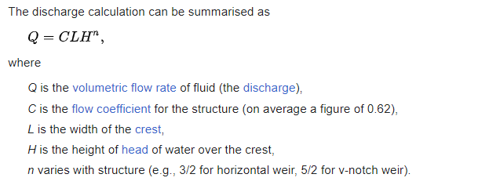

One issue with this format is that the units are not consistent on both sides of the equation. As a result, the coefficient (C) varies depending on the units used. The SWMM5 help file provides typical values for both SI and Imperial units.

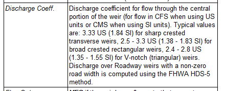

In InfoWorks ICM, the [weir equation](https://help.autodesk.com/view/IWICMS/2024/ENU/?guid=GUID-6A47B0A6-D57A-4FF7-AFBC-C0433A9151C4) is expressed as,

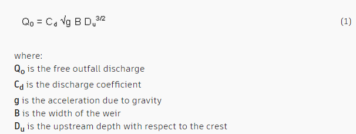

To ensure consistency regardless of the units used, InfoWorks ICM introduces the term \\g^{0.5}\\ in the equation. This makes the coefficient (Cd) a constant. The conversion between the commonly used coefficient (C) in the United States and Cd used in InfoWorks ICM is:

Cd = C/g^0.5 (where g=32.2 ft/s^2 for imperial, and g=9.81 m/s^2 for metric)

# Setup Weir in InfoWorks ICM

Let's walk through a few examples to demonstrate how to set up a weir in InfoWorks ICM. In InfoWorks ICM, Cd is used for most objects within the 1D only context.

When it comes to 1D/2D settings, C instead of Cd are used for 1D river bank lines and inline banks. Refer to the online [reference](https://help.autodesk.com/view/IWICMS/2024/ENU/?guid=GUID-50940862-CDB2-4364-A74D-004982072B63) for more information. In this case, the value is in metric.

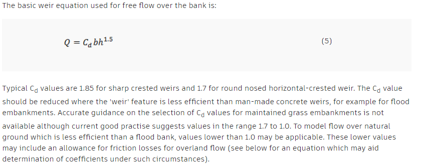

For bank lines in river reaches, refer to [help](https://help.autodesk.com/view/IWICMS/2024/ENU/?guid=GUID-1160B1F4-814A-4DB6-9897-22458AFDE039) for more information.

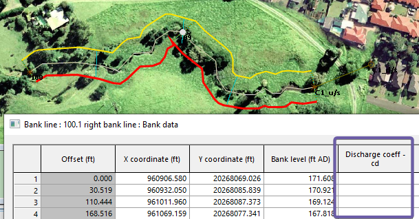

For inline banks refer to [help](https://help.autodesk.com/view/IWICMS/2024/ENU/?guid=GUID-15BB6CD3-E42B-446A-B3EF-817398C4F082) for more information.

# 1D Weir

Here is a typical weir setup. Refer to [help](https://help.autodesk.com/view/IWICMS/2024/ENU/?guid=GUID-2200B2A4-0C87-42C4-8A8A-4AE5C7C3E4B0) for more information. Notice that Cd is a constant regardless of the units of the model.

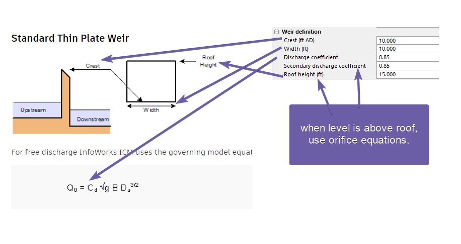

# 2D Manhole

When the flood type is set to "2D" for a 2D manhole, it utilizes the weir equation. To set the width, adjust the shaft area, and Cd is “flooding discharge coefficient”. Refer to [help](https://help.autodesk.com/view/IWICMS/2024/ENU/?guid=GUID-18DCDEB6-621C-4127-8C04-365D3CDC4C7E) for more information.

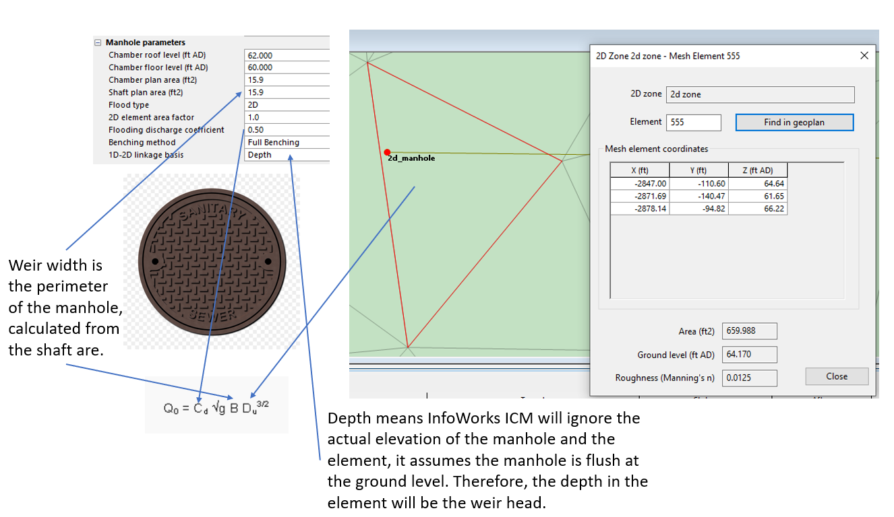

# Appendix

To validate InfoWorks ICM calculations, we compared the following, refer to the github notebook and example models for verifications.

- sim: weir depth vs flow curve from the InfoWorks ICM simulated results

- with g: flow calculated from simulated depth using equation: q = cd\*g^0.5\*b\*d^1.5

- without g: flow calculated from simulated depth using equation: q = c\*b\*d^1.5

The plots below show that for 1D weir, the equation with g is used regardless of the model units.

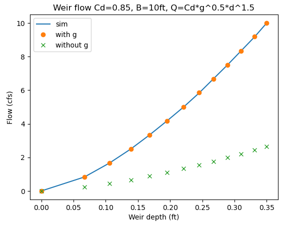

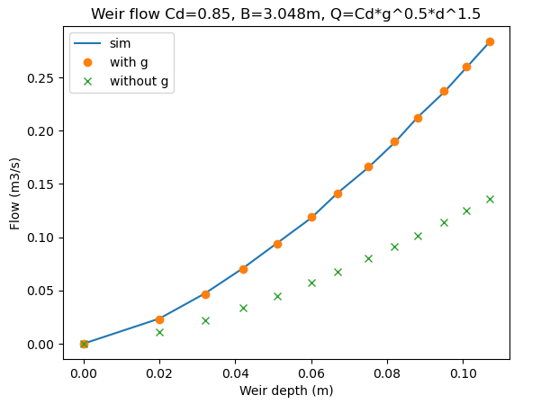

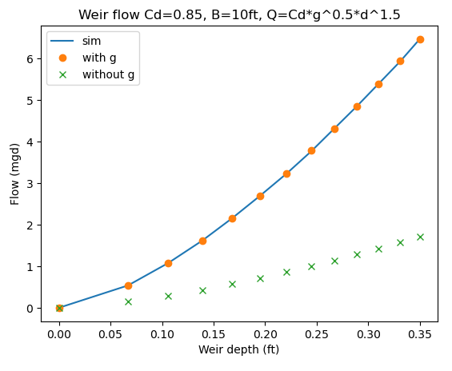

For the 2D manhole, the flow calculated from simulated depth using weir equation with g matched well to the simulated results. However, due to the complexity of 1D/2D interactions, there is noticeable differences between the two calculations.

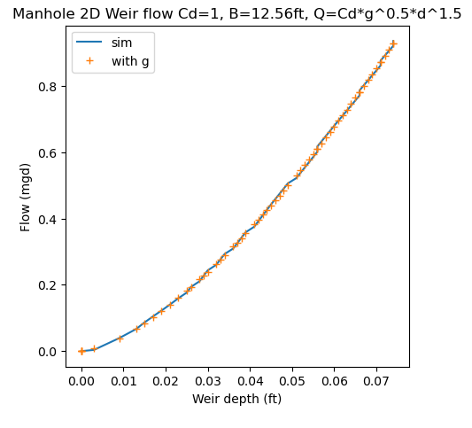
