# Introduction

Evaporation usually is not a significant source of loss for models running a single design storm for system capacity analysis. However, for continuous simulation with a focus on water volume and quality, it can have significant impact on the modeling results.

Evaporation happens when there is standing water on the subcatchment surface, therefore, the actual evaporation for a subcatchment might not be limited by the evaporation rate, but the time water is standing on the surface. Evaporation can also happen for open channel and subsurface if groundwater is modeled, in this article we only focus on subcatchment evaporation.

Commonly used evaporation methods include,

- a constant, e.g. 0.1 inch/day

- monthly average

- evaporation time series

We’ll review how to setup evaporation in XPSWMM, InfoWorks SWMM and InfoWorks ICM models.

# XPSWMM

In XPSWMM, evaporation is applied to the whole model regardless of the rainfall profiles used. The default is a 0.1 in/day value. The alternative is the use a monthly average.

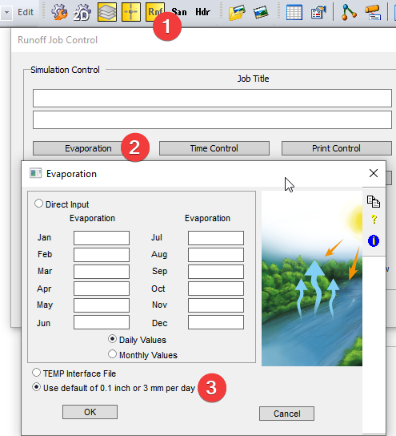 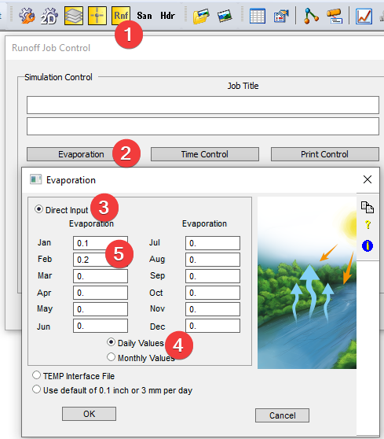

# InfoWorks SWMM

SWMM offers similar options, you can define a constant value in a SWMM climatology object.

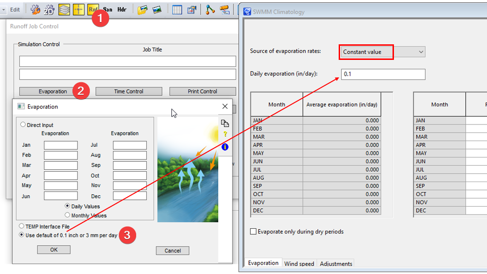

When using the monthly average, you need to setup the evaporation data in the rainfall object. Please note SWMM only support a single evaporation profile for the whole model. Only the first one will be used.

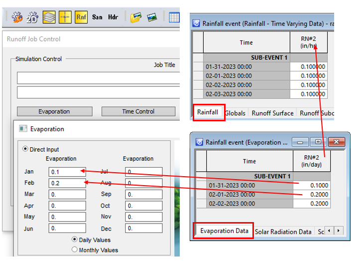

# InfoWorks ICM

The InfoWorks ICM network uses the same rainfall object with evaporation time series as InfoWorks SWMM. Different from SWMM, in InfoWorks ICM each rainfall profile will have its own evaporation profile, therefore, you need to define the evaporation profile in the subcatchment attribute.

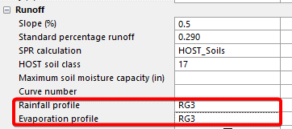

# Results Comparison

For a sample model setup,

- subcatchment RG1: 1 in/hr constant rainfall

- subcatchment RG2: 0.1 in/hr constant rainfall

- subcatchment RG3: 1 in/hr constant rainfall

For Evaporation,

- RG1 starts with 0.1 in/day then 0.2 in/day

- RG2 starts with 0.4 in/day then 0.2 in/day

- RG3 starts with 0.4 in/day then 0.2 in/day

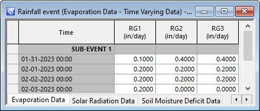

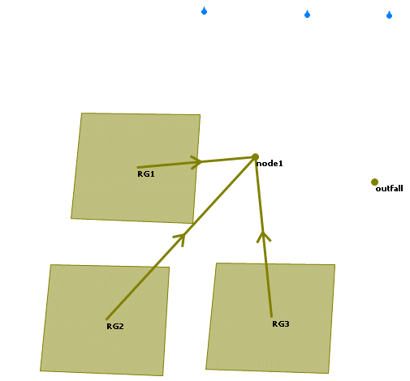

## XPSWMM

XPSWMM reports the same evaporation rate despite there is very little standing water on RG2.

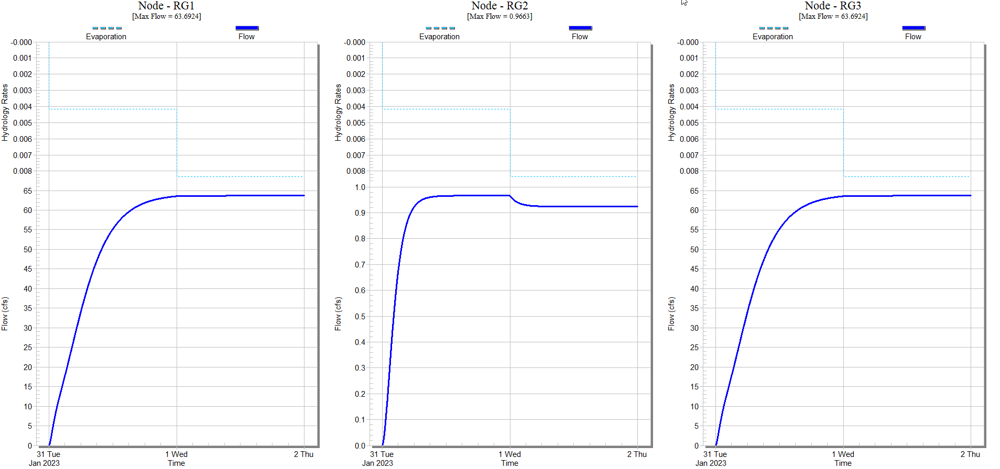

## InfoWorks SWMM

As shown below, the evaporation is almost 0 for RG2 because the rainfall is only 0.1 in/hr, and there is very little standing water on the surface. Although RG1 and RG3 has different evaporation rates, they show exactly the same results, that is because SWMM only uses the first evaporation profile for the whole model.

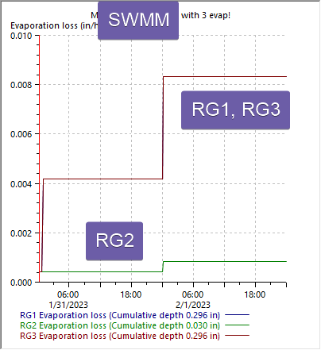

## InfoWorks ICM

InfoWorks ICM differs in two ways,

- InfoWorks ICM reports the evaporation rate defined in the rainfall rather than the actual evaporation.

- InfoWorks ICM interpolates the evaporation rates between to entries, while SWMM and XPSWMM assumes the same evaporation rate until the next reading

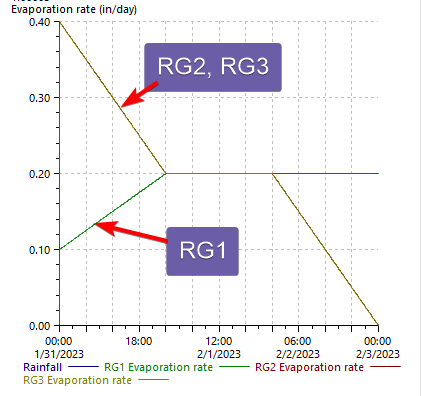

However, the sim engine linearly interpolates the evaporation between the data points. As shown below, SWMM/XPSWMM assumes the evaporation will stay the same until a new value is provided.

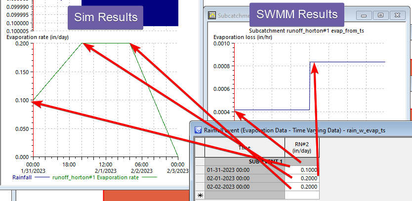

# Conclusion

XPSWMM, InfoWorks SWMM and InfoWorks ICM all support evaporation. XPSWMM and InfoWorks SWMM can only use one evaporation for all the rainfall profiles, while InfoWorks ICM can assign different evaporation profiles for each subcatchment. Additionally, XPSWMM and InfoWorks SWMM assumes the evaporation rate doesn’t change until there is a new reading, while InfoWorks ICM interpolates the rate between entries.
