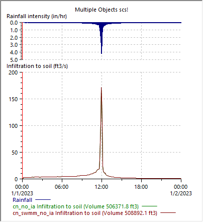

# Introduction

The runoff from pervious areas can be highly dependent on the infiltration settings used in models like SWMM. To ensure accurate results, SWMM infiltration methods have undergone several major updates. The choice of infiltration methods in SWMM5 are the modified Green Ampt, Modified Horton, and CN methods, all these methods support the recovery of infiltration capacity during dry periods between storms.

In this article, we will compare the matching SWMM5 infiltration methods found in XPSWMM, InfoWorks “sim” and “SWMM” engines.

|                                                                      |            |              |                 |                    |        |
|----------------------------------------------------------------------|------------|--------------|-----------------|--------------------|--------|
| SWMM5                                                                | Horton     | Green Ampt   | Modified Horton | Modifed Green Ampt | CN     |
| Sim                                                                  | HortonSWMM | Green Ampt   | Horton\*        |                    | CNSWMM |
| XPSWMM                                                               | Horton\*   | Green Ampt\* |                 |                    | CN\*\* |
| \*Similar results                                                    |            |              |                 |                    |        |
| \*\*SWMM doesn't support initial abstraction factors found in XPSWMM |            |              |                 |                    |        |

The infiltration methods used in InfoWorks SWMM and XPSWMM are called “Runoff volume” methods in InfoWorks Sim engine.

## Horton/Modified Horton

Horton’s method is empirical in nature. SWMM5 added a modified version of the Horton method to improve accuracy when the rainfall intensity is low, which uses the cumulative infiltration in excess of the minimum rate as its state variable (instead of time along the Horton curve).

As shown in the figure below, the infiltration rate decreases from the max. rate to the min. rate. The classic method calculates the potential infiltration rate based on the equivalent time along the curve while the modified method tracks the cumulative infiltration.

Source: [How Does Horton Infiltration Work in SWMM 5? – EPASWMM5, Autodesk Innovyze InfoWorks ICM SWMM & ICM InfoWorks, InfoSWMM , InfoDrainage, SWMM5+](https://swmm5.org/2013/08/08/how-does-horton-infiltration-work-in-swmm-5/)

As shown below, the modified Horton method has more infiltration capacity before the peak of the storm.

XPSWMM uses the classic Horton’s method, while SWMM5 supports both methods (Horton and Modified Horton). In InfoWorks ICM sim engine, the modified Horton method is called “Horton”, and the classic method is called “HortonSWMM”.

## Green Ampt/Modified Green Ampt

Green Ampt is often preferred over Horton method because it is more physically based. The choice of the method often depends on the availability of the soil parameters in the modeled area.

The modified Green Ampt method was added in SWMM5 to improve the accuracy during the initial low intensity period by not depleting moisture deficit in the top surface layer of soil during initial periods of low rainfall as was done in the original method. As shown in the figure below, the modified version will produce more infiltration during the peak of the storm.

## SCS CN

In SWMM5, the SCS CN infiltration method can also be used, although it does not support initial abstraction. In comparison, both XPSWMM and InfoWorks Sim support initial abstraction when using the CN method.

InfoWorks Sim offers two options: CNSWMM and CN. The CNSWMM doesn’t support initial abstraction but requires drying time. As shown in the figure below. When there are no initial abstractions, the results are very close.

# XPSWMM

XPSWMM supports RUNOFF routing methods with the following infiltration methods: Horton, Green Ampt, Uniform loss and SCS Curve number. XPSWMM doesn’t support infiltration recovering.

You can get infiltration parameters using the XPTables. The mapping of the XPTables columns is shown below.

# InfoWorks ICM SWMM

The mapping of the parameters from XPSWMM to ICM SWMM is shown below.

# InfoWorks Sim Engine

When using the InfoWorks Sim Engine, infiltration is defined in the Runoff surface. See the field mapping below for more details.

Horton and HortonSWMM uses the same input parameters,

Green Ampt

CN and CNSWMM

CNSWMM does not support initial abstraction.

# Results Comparison

The infiltration for the sample model of a single subcatchment shown below is setup in XPSWMM, InfoWorks ICM and InfoWorks SWMM.

## Horton

InfoWorks ICM and SWMM show very similar results, and XPSWMM shows slightly higher infiltration.

## Green Ampt

InfoWorks ICM and SWMM show very similar results, and XPSWMM shows slightly higher infiltration.

## Modified Horton

XPSWMM doesn’t support modified Horton method, the XPSWMM Horton method is shown for comparison. InfoWorks ICM and SWMM show very close results, both showed higher infiltration during the peak of the storm when comparing to XPSWMM Horton.

## Modified Green Ampt

Neither XPSWMM nor InfoWorks ICM supports Modified Green Ampt method. The InfoWorks SWMM modified method shows higher infiltration rate during the peak of the storm because during the lower intensity period the infiltration capacity was not depleted.

## CN initial abstraction

In XPSWMM, you can have initial abstraction. The figure below shows the difference with vs without IA.

Both InfoWorks ICM Sim “CN” and XPSWMM support initial abstraction. As shown below, XPSWMM shows the highest infiltration, Sim is the second highest since both have initial abstractions.

However, InfoWorks Sim “CNSWMM” doesn’t support initial abstraction. As shown below, the “CN” method showed higher infiltration, and the infiltration only starts when rainfall exceeds the initial abstraction (NOTE: in XPSWMM, the initial abstraction is also reported as infiltration).

Once the initial abstraction is set as 0, all the methods show very similar results.

# Recovery for Infiltration

For continuous simulation, infiltration capacity should regenerate between storm events. This advanced topic will be discussed in a separate article.

# Conclusion

Accurate modeling of infiltration is crucial for predicting runoff from pervious areas. This article compared the SWMM5 infiltration methods, including Modified Horton, Horton, Modified Green Ampt, Green Ampt, and CN, used in InfoWorks SWMM, InfoWorks Sim, and XPSWMM. The comparison revealed that,

- For the matching methods, all packages show similar results. InfoWorks Sim matches SWMM better than XPSWMM.

- For the CN method, only InfoWorks Sim CN and XPSWMM supports initial abstraction. SWMM and Sim CNSWMM doesn’t.

- Sim engine doesn’t support the modified Green Apmt method.

- More analysis is needed to understand how different packages handles recovery during dry periods between storms.
