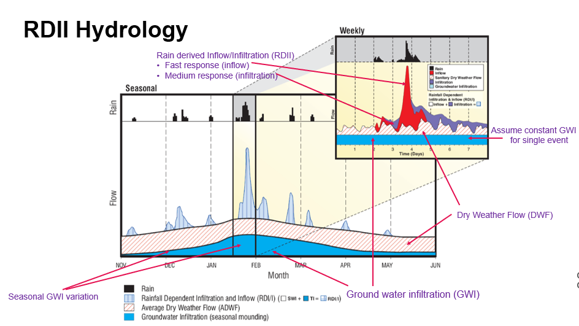
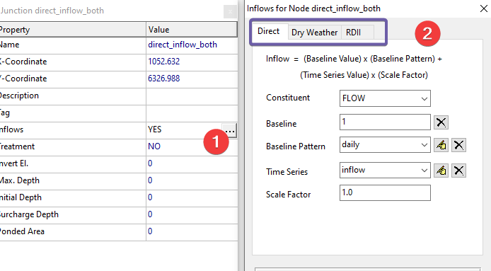
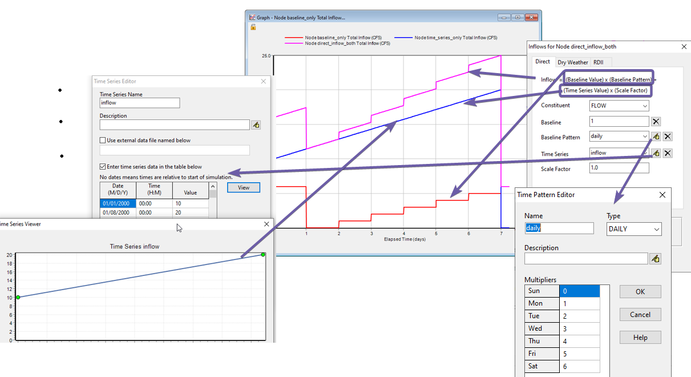
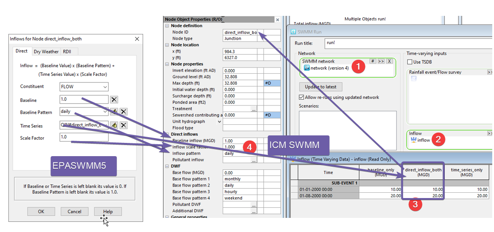
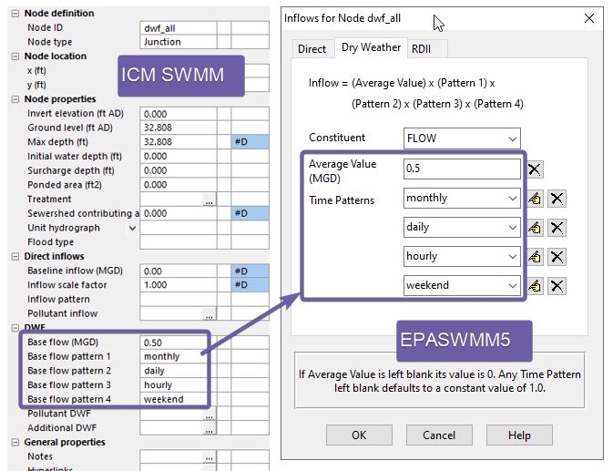
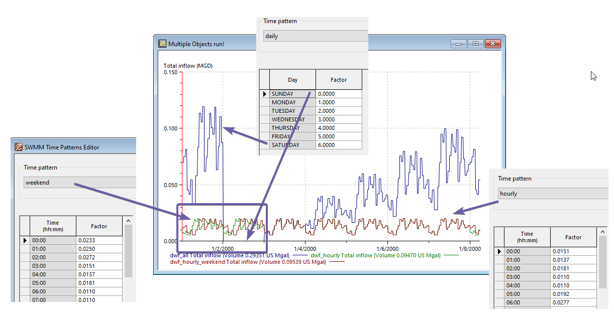

# Introduction

SWMM5 models separated sanitary sewer inflow using rain derived inflow and infiltration (RDII) hydrology.

Source: <https://www.cityoforoville.org/home/showdocument?id=9357>

RDII hydrology studies the behavior of a sewershed, typically a metered residential community with strong wastewater diurnal patterns. The metered flow has 3 main components,

- Ground water infiltration (GWI). Defects such as cracks in pipes allow groundwater into the sewer. Most of the flow in the early hours of a day is from ground water. GWI is considered a constant for within a day or two, however, over longer periods, you can see seasonal changes.

- Dry weather flow. For residential communities, that’s the flow into the sewer when flushing the toilet and taking a shower. At the community level, it shows very strong diurnal patterns, with higher usage around breakfast and dinner time.

- RDII. During rain events, you’ll see a spike of flow, often with a long tail. For combined sewer, SWMM5 models the storm water using the SWMM5 RUNOFF method from subcatchments. For separated sanitary, since RDII cannot be directly estimated and SWMM5 uses the RTK method so that RDII can be calibrated to metered flows.

SWMM5 defines separated sanitary sewer inflow components in a node.

- Direct: commonly used to represent the baseline flow such as ground water infiltration.

- Dry weather: wastewater discharged from customers usually with a strong diurnal pattern when metered for a sewershed.

- RDII: SWMM5 uses the RTK method to represent the RDII into a node.

In this article, we’ll focus on how to set up the direct and dry weather flows in ICM SWMM.

# Direct Inflow

SWMM5 calculates direct inflow with this equation:

Inflow = (Baseline Value) x (Baseline Pattern) + (Time Series Value) x (Scale Factor)

For example,

- Model the GWI for a 2-day storm event as a constant.

- Apply a monthly pattern to account for the seasonal changes of GWI.

- Load the metered flow for a historical simulation.

- Add an hourly pattern to show the discharge at 7am and 6pm for an industrial customer.

Note that when a time series is used for inflow in ICM SWMM, it's defined in an inflow object and referenced in a run object – not directly in the node as EPASWMM5.

# Dry Weather flow

SWMM5 models dry weather flow with 4 patterns. To avoid confusion, we recommend defining all 4 patterns rather than leaving any blank. The “Hourly” pattern only applies to weekdays, and “Weekend” pattern only applies to weekends.

The impacts of the different patterns are shown here,

- Daily patterns multiply the values for each day of the week when applied

- Weekend pattern is used for Sunday and Saturday when applied

# Conclusions

The article delves into how direct and dry weather flows are set up in ICM SWMM to model separated sanitary sewer inflow.
