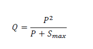
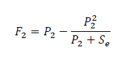
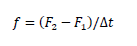
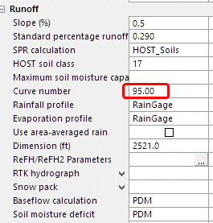
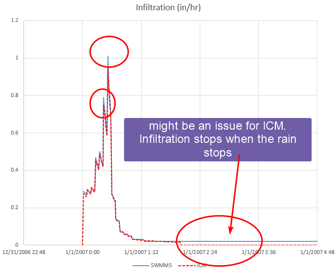

SWMM5 runoff method is widely used in the United States and many other
parts of the world for stormwater applications. Refer to the official
[hydrology
manual](https://www.epa.gov/water-research/storm-water-management-model-swmm)
for more details, most of the figures and materials here are from this
manual.

SWMM5 runoff did an excellent job simplifying the complex runoff
process. Unlike many other hydrology method, SWMM5 runoff method is
physics based, due to its simplicity, it is one of the best ways to
develop good understanding of the hydrological process.

As shown in the figure 3-1, SWMM5 makes thing simple by assuming every
subcatchment is a rectangle with uniform slope and cover.

  
Figure 3-1 captures the conceptual model of a subcatchment. We assume
uniform flow qL running along the slope to the channel in the middle, W
is called the width of the subcatchment, which is perpendicular to the
flow direction. When we take a cross section cut along the flow
direction, we get Figure 3-2, ds is the depressed storage depth, d is
the water depth. As you can see, the idea behind the method is to model
the overland flow, once the water is in the channel we assume the time
water flows in the channel to the outlet can be ignored.

The runoff process is modeled in two steps,

-   The runoff volume model: calculate the rainfall losses

-   The routing model: route the water through the subcatchment to
    calculate the shape of the runoff hydrograph

For the volume, it is a simple mass balance equation below, rainfall is
lost to evaporation and infiltration.

For the routing part, we are using an equation derived from the
manning’s equation, also referred to as non-linear reservoir equation.
See the manual for more details on how it is derived.

Q: runoff flow rate

n: manning’s n

W: width of a subcatchment

ds: depressed depth

S: slope of the subcatchment

For most of the statistical hydrology models, the volume lost to local
depression and interception of the vegetation is usually lumped in the
“volume” model part. However, in SWMM5 runoff method, it is accounted
for in the “routing” model instead of the volume model.

To model the mix of different type of land covers, within each
subcatchment, it is subdivided into 3 subareas of pervious, impervious,
and impervious without depression storage. For example, in a typical
residential area, the lawn will be pervious area, the roof will be
impervious area without storage, and the road is impervious area. By
default, each area is acting as an independent area that flows directly
into the outlet. However, sometimes that might not be the case, for
example if the flow from the grass area needs to flow through the
parking lot to get into the inlet, we have the option to route the
pervious area through the impervious area to more accurately account for
the timing and depressed storage.

# Example Model

The challenge with using the SWMM5 runoff method is that depending on
the software of choice, the user interface can look quite different.
Next, we’ll set up a sample model in SWMM5, XPSWMM, ICM and ICM SWMM.
The model is downloaded from the [official application
manual](https://www.epa.gov/water-research/storm-water-management-model-swmm).
Refer to the manual for more information about the predevelopment model
in example 1.

The predevelopment condition is modeled as a single subcatchment. The
manual has some great discussion on how to delineate and estimate the
subcatchment parameters for large areas.

The figure below shows how the data are entered in the EPA SWMM5.1
software.

As we have discussed, all the subareas share the same parameters of:
area, slope and width.

The areas for subareas are determined by,

-   % Imperv: 5% is impervious area

-   %Zero-Imperv: 25% of the impervious area is without depression
    storage

-   Pervious area is implied: 1-5%=95%

For pervious and impervious areas they can have different manning’s N
and depression storage.

Infiltration is defined in the “Infiltration data”, and Horton is used.

Evaporation is defined as a global model climatology setting,

The results are shown below,

-   Evaporation is 0

-   Infiltration seems to reach its limit during the peak of the storm

# XPSWMM

To setup the same hydrology in XPSWMM will require working through a few
windows.

Set the evaporation as 0,

The mapping between XPSWMM and SWMM5 is quite straightforward, the only
difference is the unit for the Horton decay constant, SWMM5 uses 1/hr,
and XPSWMM uses 1/sec.

The results are very similar,

-   The runoff is pretty much the same

-   XPSWMM shows slightly higher infiltration rate after the peak

# InfoWorks ICM

To setup the same hydrology in ICM will take some work and can be quite
confusing. We’ll first go through the general steps, then we’ll get into
the details.

ICM manages the landcover inside a subcatchment very differently from
SWMM5, and it will take some time to get used to the concept. Defining
the landcover for a subcatchment has two steps,

1.  Define a land use, which has a collection of different landcovers
    called runoff areas

2.  Define the area for each type of runoff area

First, let’s define 3 runoff surfaces to represent pervious, impervious
and impervious without storage in the subcatchments grid. Double click
on each row to open the property window.

The mapping from the SWMM5 window to ICM window is shown below,

Next, we can define a landuse, runoff surface 22, 23 and 24 were defined
in the previous step.

Last, we go to the property of the subcatchment. As shown below, most of
the attributes are not used in the subcatchment, only the ones
highlighted are used. And to get the correct land use area, we need to
calculate the 3 runoff area as a percentage of the total subcatchment
area.

The final step to get the model working is to change the outfall to a
node, and add a new outfall for ICM to run because ICM doesn’t allow
outfall to accept flow from subcatchment.

The results are very similar to the SWMM5 model.

