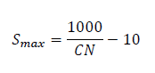
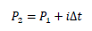
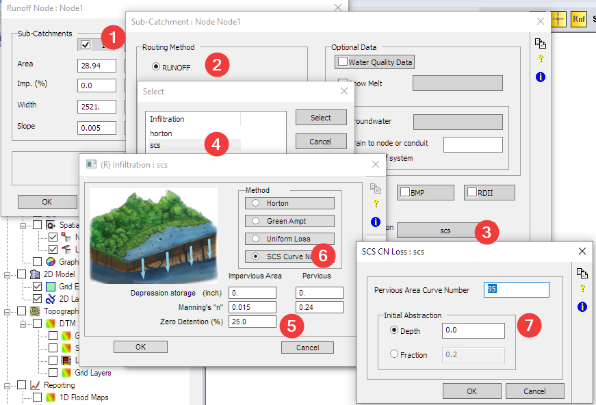
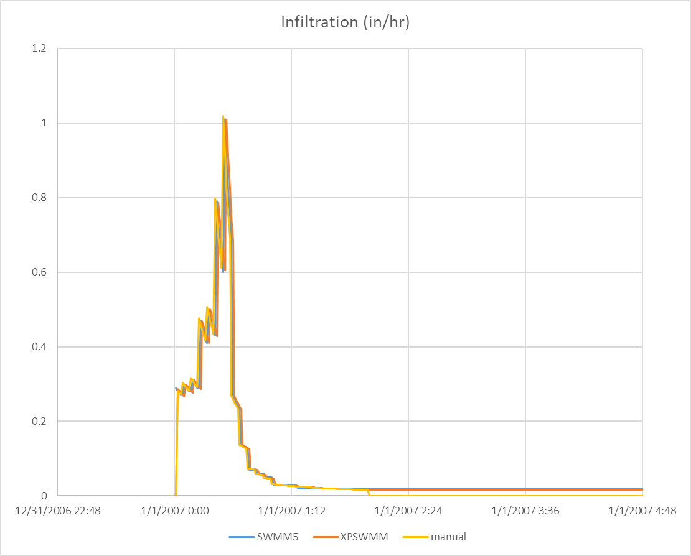
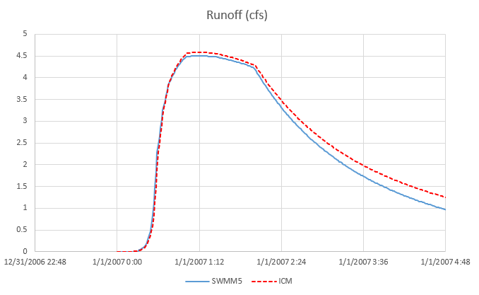

SCS infiltration is different from SCS hydrology method. It is often
used in place where SWMM runoff method is preferred as the routing
method, and to replace horton’s or green-ampt as the infiltration
method.

It is still based on the same equations of the SCS hydrology method.

# SCS Infiltration Method

It is possible to use SCS infiltration without using the SCS hydrology
method. Refer to the SWMM5 hydrology manual for the implementation.

There are several major differences between the SWMM5, XPSWMM and ICM
implementations,

-   SWMM5 doesn’t support the use of initial abstraction, which is the
    equivalent of setting initial abstraction as 0 in XPSWMM

-   XPSWMM doesn’t support the recovery of the infiltration capacity.
    For a single event simulation, this makes no difference

-   ICM is similar to XPSWMM that is supports the inclusion of the
    initial abstraction but does not support recovery of infiltration
    capacity.

SWMM5 assumes initial abstraction should be 0 when using the SCS
infiltration method, therefore the equation looks like the following.

Q: total runoff (in)

P: total rainfall (in)

S: maximum infiltration capacity (in)

The total infiltration is defined as F = P – Q.

By tracking the total loss at each time step we can calculate the
infiltration rate.

i: rainfall intensity in/hr

dt: time step (hr)

f: infiltration rate (in/hr)

For continuous simulation, S is constant for each storm event, however,
for each new event, S is updated by reducing its capacity from previous
storm(s), and regenerating when there is no rainfall.

# SWMM Model

We have a single subcatchment 100% pervious without any depression
storage.

Unlike the Horton method, the infiltration is always smaller than the
rainfall when it rains.

# XPSWMM Model

For the XPSWMM model, it has the same setup as SWMM5 except for the SCS
infiltration we need to set initial abstraction as 0 (7) to match what
SWMM5.

The results are almost the same as shown below,

If you are interested in how to manually calculate the infiltration
using the equations in the SWMM5 manual, see the excel file for more
details.

# InfoWorks ICM

Curve number is defined in two places in ICM. CN number is defined in
the subcatchment property(left), and the rest is defined in the runoff
surface for pervious land cover (right). To be consistent with the SWMM5
method, we set initial abstraction to 0, we set the initial loss to 0
for the runoff surface.

The results are close, but noticeably different. One obvious limitation
in ICM is that the infiltration stops when the rain stops.

