======================================================================

# "Tuflow_link_idp_w64.dll was not found" Error when using Solve Manager in XPSWMM

{
    "title": "\"Tuflow_link_idp_w64.dll was not found\" Error when using Solve Manager in XPSWMM",
    "aid": "kA04U000000I2uWSAS_en_US_1.html",
    "software": "XPSWMM",
    "topic": "hydraulics",
    "summary": "This article addresses an error encountered in XPSWMM's Solve Manager where the message 'Tuflow_link_idp_w64.dll was not found' is displayed. It suggests that reinstalling the software may resolve the issue, and includes an image illustrating the error."
}

- Product: XPSWMM
- Topic: hydraulics

## Summary
This article addresses an error encountered in XPSWMM's Solve Manager where the message 'Tuflow_link_idp_w64.dll was not found' is displayed. It suggests that reinstalling the software may resolve the issue, and includes an image illustrating the error.

## Text

If you get the error below when running the solve manager, reinstall the program may fix the problem.\

======================================================================

======================================================================

# How to troubleshoot standalone and floating dongle licenses for XPSWMM?

{
    "title": "How to troubleshoot standalone and floating dongle licenses for XPSWMM?",
    "aid": "kA04U000000UMfJSAW_en_US_1.html",
    "software": "XPSWMM",
    "topic": "licensing",
    "summary": "This article provides step-by-step troubleshooting instructions for resolving standalone and floating dongle licensing issues for XPSWMM. It explains how to identify the license type by checking configuration files, use the XP Diagnostic tool to verify dongle and licensing details, and resolve common connectivity problems. The guide also covers procedures for reinstalling the dongle driver, including uninstalling existing drivers, using cleanup tools, and installing necessary dependencies like VC++ redistributable and .NET 5.0. Additional troubleshooting for floating license server communication is also discussed."
}

- Product: XPSWMM
- Topic: licensing

## Summary
This article provides step-by-step troubleshooting instructions for resolving standalone and floating dongle licensing issues for XPSWMM. It explains how to identify the license type by checking configuration files, use the XP Diagnostic tool to verify dongle and licensing details, and resolve common connectivity problems. The guide also covers procedures for reinstalling the dongle driver, including uninstalling existing drivers, using cleanup tools, and installing necessary dependencies like VC++ redistributable and .NET 5.0. Additional troubleshooting for floating license server communication is also discussed.

## Text

\

\

When the dongle driver was not installed properly, you might get an error saying the dongle cannot be found or the server is not up. And it won't let you use XPSWMM/XPSTORM. If the error says the xcf file is expired or mismatched, you should contact [support@innovyze.com](mailto:support@innovyze.com) to get a matching xcf license file.\

Fixing a dongle driver issue can be a little complicated and you'll need admin right to your computer to resolve the issue. The general troubleshooting steps are shown below.

# License Type {#license-type style="margin-top: 16px;"}

First we need to determine the license type,

1.  Go to C:\\Program Files\\Innovyze\\xpswmm#####

2.  Open the swmpx.ini

3.  Check the \[NETWORK\] section

\

Standalone license will look like this,\

\

A floating license will look like this, the server line is the IP address or machine network name. Write down the server address, and you will need it for additional testing.\

# XP Diagnostic tool {#xp-diagnostic-tool style="margin-top: 16px;"}

Next we need to check the license file and the dongle using the XP Diagnostic tool. This will tell us if the dongle is working properly and if it matches the licensing information encoded in the xcf file.

## Check the dongle {#check-the-dongle style="margin-top: 3px;"}

**Regardless of a floating license or standalone license, to check the dongle you need log into the computer with the dongle plugged in physically, the dongle driver will detect remote desktop session and render the dongle as not available.**\

First look for the dongle connected to the computer and write down the serial number. It should read something like 42-#### for XPSWMM or 66-#### for XPSTORM.

1.  Go to C:\\Program Files\\Innovyze\\xpswmm#####

2.  Open XP Diagnostic

3.  Open the xcf file and check

\

\

At the top of the results, it should show the information encoded in the dongle. If the dongle was not found, make sure the dongle is connected properly and the light is on. If not, try to plug it into another port. If it is still not working, it means either the dongle is broken or more likely the driver is not working.\

The information encoded in the dongle is the product type and the serial number.\

## Check the licensing in the XCF file {#check-the-licensing-in-the-xcf-file style="margin-top: 3px;"}

Scroll down to the bottom to the window to review the xcf information, make sure the serial number matches, and the version number should be the same or later than the installed software. If the dongle serial doesn't match the xcf file, or the xcf is older than the installed software contact [support@innovyze.com](mailto:support@innovyze.com).\

NOTE: XPSWMM 2021 is version 2200, 2020 is 2100, etc.\

\

 

# Standalone License {#standalone-license style="margin-top: 16px;"}

If it is a standalone license,

1.  Use the XPDIAGNOSTIC tool to check if the xcf file and the dongle matches. If it doesn't match contact [support@innovyze.com](mailto:support@innovyze.com) for a matching xcf file

2.  If the dongle cannot be detected, try to plug it to a different port. Make sure the light is always on.

3.  If it is still not working it could be a defective dongle or more likely the driver was not working properly. Refer to reinstall driver section.

 

# Floating license {#floating-license style="margin-top: 16px;"}

If it is a floating license, open your browser and go to [http://server:6002](http://server:6002). For example, [http://127.0.0.1:6002](http://127.0.0.1:6002). The server address can be found from the swmxp.ini network section.\

You should see a page like the one below,\

Hard Limit: the number of users that can access the dongle at the same time, it is hardcoded to the dongle.\

Licenses-in-Use: number of users current connected to this dongle.\

Time-Outs: If you see a big number here, a sign of network connection issues.\

Serial number: it is different from the one written on the dongle. If you have multiple dongles, you'll have to figure out which one is which by trial and error.\

\

\

If you don't see this page,

-   Contact your IT to confirm the address of the server, if it is changed, you need to update swmxp.ini NETWORK section to match the address

-   Refer to the floating license server section for more details

 

# Reinstall the dongle driver {#reinstall-the-dongle-driver style="margin-top: 16px;"}

This applies to both floating and standalone dongles, they use the same driver. Sometimes the installer failed to properly install the dongle driver, and a manual install will be needed.\

Make sure that XPSWMM is the only product on the computer using Sentinel drivers, if you have multiple dongles connected to your computer, make sure the other dongle won't be impacted if you make any changes to the driver.\

You will need admin right to perform this task.\

To reinstall the dongle driver,

1.  Download the installer files

2.  Uninstall existing drivers if there is any

3.  Use the SSD cleanup tool to remove anything left

4.  Install the new driver

 

## Download the installer files {#download-the-installer-files style="margin-top: 3px;"}

For more information got to this page: [https://help.innovyze.com/display/xps/Third+Party+Downloads](https://help.innovyze.com/display/xps/Third+Party+Downloads)

-   Sentinel Protection Installer 7.7.0: [https://innovyze-us01.s3-us-west-2.amazonaws.com/Utilities/Sentinel+Protection+Installer+7.7.0.exe](https://innovyze-us01.s3-us-west-2.amazonaws.com/Utilities/Sentinel+Protection+Installer+7.7.0.exe)

-   MS VC++ redistributable: [https://aka.ms/vs/16/release/vc_redist.x64.exe](https://aka.ms/vs/16/release/vc_redist.x64.exe)

-   .Net 5.0: [https://dotnet.microsoft.com/download/dotnet/thank-you/runtime-5.0.10-windows-x64-installer](https://dotnet.microsoft.com/download/dotnet/thank-you/runtime-5.0.10-windows-x64-installer)

-   SSD Cleanup tool: [https://supportportal.thalesgroup.com/csm?sys_kb_id=e7609d7c4fc3a200873b69d18110c77c&id=kb_article_view&sysparm_rank=1&sysparm_tsqueryId=ca637f96dbe8a49080b2345239961964&sysparm_article=KB0010513](https://supportportal.thalesgroup.com/csm?sys_kb_id=e7609d7c4fc3a200873b69d18110c77c&id=kb_article_view&sysparm_rank=1&sysparm_tsqueryId=ca637f96dbe8a49080b2345239961964&sysparm_article=KB0010513)

## Uninstall existing drivers {#uninstall-existing-drivers style="margin-top: 3px;"}

Uninstall the sentinel driver.\

   \

\

Unzip the downloaded zip file and run the exe file after the driver is removed.\

## Install the new driver {#install-the-new-driver style="margin-top: 3px;"}

Install VC++ redistributable, .NET5.0 and the protection installer 7.7.0. You might need to restart your computer a few times. And usually this will fix most of the driver issues. If you still have issue, please contact [support@innovyze.com](mailto:support@innovyze.com).\

 

# Floating License Server {#floating-license-server style="margin-top: 16px;"}

For the floating license server to operate we'll need,

-   Install the dongle driver

-   Making sure nothing interferes with the network communication

\

The installer sometimes might not be able to install the dongle driver correctly, and it will need to be manually installed. Refer to the "Reinstall the dongle driver" section for more details, the only exception is that you don't need to install VC++ and .NET5.0 .\

From time to time the communication can be interfered between the floating license server and the client. There are a few things we can try to troubleshoot.\

Restart the sentinel services and see if that will get the client working for a few minutes.\

  \

Figuring out the communication interference can be tricky, the only known issues we are aware of are the older versions of SentinelOne can cause such problems and has been patched. If you are running any versions older than the list below, please update your SentinelOne software,\

• 5.13 SP3 WIN\

• 6.13 SP3 WIN\

• 7.11 SP1 WIN\

• 0.2 EA2 WIN\

• 1.1 EA WIN

======================================================================

======================================================================

# How to install subscription license for XPSWMM - Thales Software License

{
    "title": "How to install subscription license for XPSWMM - Thales Software License",
    "aid": "kA04U000000HychSAC_en_US_1.html",
    "software": "XPSWMM",
    "topic": "licensing",
    "summary": "The article provides step-by-step instructions for installing a floating subscription license for XPSWMM (also known as XPSTORM) using the Thales Software License system. It emphasizes the importance of using the computer's device name instead of an IP address, since IP addresses may change over time. The guide includes directions on locating the device name through the system information search and references external links with detailed procedures for applying the license. Screenshots are provided to assist users in the process."
}

- Product: XPSWMM
- Topic: licensing

## Summary
The article provides step-by-step instructions for installing a floating subscription license for XPSWMM (also known as XPSTORM) using the Thales Software License system. It emphasizes the importance of using the computer's device name instead of an IP address, since IP addresses may change over time. The guide includes directions on locating the device name through the system information search and references external links with detailed procedures for applying the license. Screenshots are provided to assist users in the process.

## Text

XPSWMM/XPSTORM Thales subscription license uses a floating license server, the installation is the same as \"[installing a floating license](https://help.innovyze.com/display/xps/Floating+License+Installation+-+Thales+Software+License){target="_blank"} \". You just need to make sure when applying the software, use your computer device name instead of an IP address as the server (IP address will change from time to time).\

1. To get your device name, search \"system information\" in your start menu.\

{height="504" width="257"}\

{height="179" width="384"}\

\

2. Follow the \"[Applying Thales Software License](https://help.innovyze.com/display/xps/Floating+License+Installation+-+Thales+Software+License#FloatingLicenseInstallationThalesSoftwareLicense-ApplyThalesSoftwareLicense){target="_blank"} \" steps\

3. For step 4, use your device name for the Network

======================================================================

======================================================================

# what is the recommended minimum link length

{
    "title": "what is the recommended minimum link length",
    "aid": "kA04U000000HybFSAS_en_US_1.html",
    "software": "XPSWMM",
    "topic": "hydraulics",
    "summary": "The article explains that very short pipes in an XPSWMM model can create stability issues. To address this, the software enforces a default minimum pipe length of 30ft, which can be overridden using configuration keywords. It outlines the MINLEN parameter within the Analysis Engine and provides images and a link to online help for further guidance."
}

- Product: XPSWMM
- Topic: hydraulics

## Summary
The article explains that very short pipes in an XPSWMM model can create stability issues. To address this, the software enforces a default minimum pipe length of 30ft, which can be overridden using configuration keywords. It outlines the MINLEN parameter within the Analysis Engine and provides images and a link to online help for further guidance.

## Text

Very short pipes in a model can cause stability issues in XPSWMM, therefore, by default XPSWMM will set the pipe length to 30ft if it is less than that.\

\

You can overwrite this setting by using the configuration keywords.\

\

\

\

For more information, refer to the online help,\

\

https://help.innovyze.com/display/xps/Configuration+Keywords\

 

###### *MINLEN* {#ConfigurationKeywords-MINLEN}

This parameter is used to alter the minimum length of conduits within the Analysis Engine. Currently the minimum is 30 feet.

\

\

 

======================================================================

======================================================================

# how to generate results in tables in XPSWMM

{
    "title": "how to generate results in tables in XPSWMM",
    "aid": "kA04U000000UhXESA0_en_US_1.html",
    "software": "XPSWMM",
    "topic": "hydraulics",
    "summary": "This article explains how to generate tabulated results using XPSWMM. It outlines the process of applying templates and XPX files to re-use portions of a model, thereby streamlining the workflow to produce and view simulation outputs in table format. The step-by-step guide is aimed at helping users efficiently set up their models and extract quantitative results for further analysis."
}

- Product: XPSWMM
- Topic: hydraulics

## Summary
This article explains how to generate tabulated results using XPSWMM. It outlines the process of applying templates and XPX files to re-use portions of a model, thereby streamlining the workflow to produce and view simulation outputs in table format. The step-by-step guide is aimed at helping users efficiently set up their models and extract quantitative results for further analysis.

## Text

https://innovyze.my.site.com/support/s/article/How-to-use-templates-and-XPX-files-to-re-use-part-of-a-model-in-XPSWMM

======================================================================

======================================================================

# How to get peak flow into a node in XPSWMM?

{
    "title": "How to get peak flow into a node in XPSWMM?",
    "aid": "kA04U000000UhHzSAK_en_US_1.html",
    "software": "XPSWMM",
    "topic": "hydraulics",
    "summary": "The article explains that XPSWMM does not report peak flows into a node when operating in hydraulics mode, unlike SWMM5. It recommends switching to runoff mode to view peak flows if the inflow originates from runoff. For inflows not from runoff mode, it suggests either directly calculating the peak flow from an external time series (hydrograph) or estimating it from the flow in connected pipes, while noting that pipe attenuation may lower the reported peak."
}

- Product: XPSWMM
- Topic: hydraulics

## Summary
The article explains that XPSWMM does not report peak flows into a node when operating in hydraulics mode, unlike SWMM5. It recommends switching to runoff mode to view peak flows if the inflow originates from runoff. For inflows not from runoff mode, it suggests either directly calculating the peak flow from an external time series (hydrograph) or estimating it from the flow in connected pipes, while noting that pipe attenuation may lower the reported peak.

## Text

XPSWMM doesn\'t report peak flows into the node in hydraulics mode like SWMM5.\

\

If the inflow is coming from the runoff mode, you need to switch to the runoff mode then you can get the peak flow.\

\

If the inflow into the nodes are not from the runoff mode, then XPSWMM will not report the inflow. You have a few options,\

\* If it is from an external time series (hydrograph), you can calculate the peak flow directly from the source\

\* If the inflow to the node is routed to a pipe, you can estimate the peak flow from the flow in the pipe, however, due to attenuation effects, the peak flow in the pipe will be lower than the node\

 

======================================================================

======================================================================

# How to switch from a dongle to Thales license for XPSWMM

{
    "title": "How to switch from a dongle to Thales license for XPSWMM",
    "aid": "kA04U000000Uh2QSAS_en_US_1.html",
    "software": "XPSWMM",
    "topic": "licensing",
    "summary": "The article outlines the steps to switch the licensing method for XPSWMM from using a dongle to a Thales license. It directs users to an FAQ for further details, provides links to the licensing request form, and encourages users without a portal account to register for free access to support resources."
}

- Product: XPSWMM
- Topic: licensing

## Summary
The article outlines the steps to switch the licensing method for XPSWMM from using a dongle to a Thales license. It directs users to an FAQ for further details, provides links to the licensing request form, and encourages users without a portal account to register for free access to support resources.

## Text

Refer to the FAQ for more information about the switch,\

https://help.innovyze.com/display/ILA/FAQ+Innovyze+Licensing+Changes\

\

To start the switch, please fill the request form: https://innovyze.my.site.com/support/s/licensing-request\

\

If you don\'t have a portal account, it is free to register: https://www.innovyze.com/en-us/about-us/support-portal-registration.\

\

======================================================================

======================================================================

# swmm error: encountered during 2D initialization, please check diagnostics file

{
    "title": "swmm error: encountered during 2D initialization, please check diagnostics file",
    "aid": "kA04U000000QMzLSAW_en_US_1.html",
    "software": "XPSWMM",
    "topic": "2D modeling",
    "summary": "This article provides troubleshooting steps for an error encountered during 2D initialization in the modeling software. It discusses checking for legacy Tuflow compatibility flags that may trigger the error and how to resolve it by unchecking these flags. The article also explains how to locate and load the diagnostics file from the modeling folder, adjust message display settings, and search for error codes on the Tuflow website. It further covers a common error (Error 2061) related to improperly digitized interface lines in the model and offers guidance on correcting these issues."
}

- Product: XPSWMM
- Topic: 2D modeling

## Summary
This article provides troubleshooting steps for an error encountered during 2D initialization in the modeling software. It discusses checking for legacy Tuflow compatibility flags that may trigger the error and how to resolve it by unchecking these flags. The article also explains how to locate and load the diagnostics file from the modeling folder, adjust message display settings, and search for error codes on the Tuflow website. It further covers a common error (Error 2061) related to improperly digitized interface lines in the model and offers guidance on correcting these issues.

## Text

 \

This article shows the troubleshooting steps when getting the following error.\

 \

# Check 2D flags

\

If you have compatibility flags of very old versions of Tuflow, you might get this error. Uncheck these flags should resolve the issue.\

 \

 

# Show the Diagnostics on the map

 \

The diagnostics file is located under the modeling folder, the default location is,\

..\\2D\\log\\\[model_name\].mif\

 \

If it is not loaded,  right click on the \"Diagnostics\" item in the layer list to load the file.\

 \

![Water Surface Profiles Legends Z\] GIS Flies Z\] CAD Flies Add Diagnostic Filem Show 20 Log File Show 20 Error Messages](./img/kA04U000000QMzLSAW_en_US_1_2.png)\

 \

By default, XPSWMM only shows the first 5 messages. To overwrite that, right click on the file, the choose properties.\

 \

![C\] Diagnostics GIS Files Z\] CAD Files Properties Delete Dia ic File](./img/kA04U000000QMzLSAW_en_US_1_3.png)\

 \

In the dialogue, switch to the data tab and make sure there are more items displayed than the number of items. You can turn off different type of messages to make it easier to locate them on the map.\

 \

\

 \

 \

 \

 

# Search for the error code

 \

The error code can be found on the Tuflow website. Usually if you google \"tuflow error xxxx\", it will take you to the official page of the error\

[https://wiki.tuflow.com/](https://wiki.tuflow.com/){target="_blank"}\

\

 

# Common errors

 

## Error 2061

 \

An interface line needs to be connected to a node on both ends, as shown below, the left side of the interface line was digitized as two line segments instead of a continuous one. To fix this error, delete the left interface lines, and digitize a continuous one.\

 \

 \

\

 \

 \

 

======================================================================

======================================================================

# XPSWMM ERROR 0252 - .xf8 is not a supported GIS file format

{
    "title": "XPSWMM ERROR 0252 - .xf8 is not a supported GIS file format",
    "aid": "kA04U000000UZb6SAG_en_US_1.html",
    "software": "XPSWMM",
    "topic": "2D modeling",
    "summary": "This article addresses error 0252 in XPSWMM, which indicates that the .xf8 file is not a supported GIS file format in newer versions. It explains that the 2D engine no longer supports compatible mode, and the error can be resolved by disabling certain flags."
}

- Product: XPSWMM
- Topic: 2D modeling

## Summary
This article addresses error 0252 in XPSWMM, which indicates that the .xf8 file is not a supported GIS file format in newer versions. It explains that the 2D engine no longer supports compatible mode, and the error can be resolved by disabling certain flags.

## Text

When using later version of XPSWMM, the 2D engine can no longer run in the compatible mode. Turn off the flags should remove the errors.\

======================================================================

======================================================================

# XPSWMM 2D Results not showing up

{
    "title": "XPSWMM 2D Results not showing\u00a0up",
    "aid": "kA04U000000UZamSAG_en_US_1.html",
    "software": "XPSWMM",
    "topic": "2D modeling",
    "summary": "The article offers troubleshooting steps when 2D results fail to display in XPSWMM. It outlines three main approaches: selecting a different scenario or global storm to reload results, manually reloading the results, and directly loading the XMDF result file from the designated folder. The provided images and step-by-step instructions help users locate and display missing 2D model outputs."
}

- Product: XPSWMM
- Topic: 2D modeling

## Summary
The article offers troubleshooting steps when 2D results fail to display in XPSWMM. It outlines three main approaches: selecting a different scenario or global storm to reload results, manually reloading the results, and directly loading the XMDF result file from the designated folder. The provided images and step-by-step instructions help users locate and display missing 2D model outputs.

## Text

###   {#section .graf .graf--h3}

From time to time, the 2D results might not show up in XPSWMM. Most of the time you can get the results showing up with a few simple steps. 

### Select scenario & global storm {#select-scenario-global-storm .graf .graf--h3}

Select the global storm or the scenario in the dropdown list will reload the results.

{.graf-image}

 

### Reload the results {#reload-the-results .graf .graf--h3}

You can also try to reload the results.

{.graf-image}

### Add 2D results {#add-2d-results .graf .graf--h3}

If you still don't see the results, try load the XMDF result file directly. XMDF file stores the 2D results. You can find it in the results folder.

{.graf-image}

By default, it is in the 2D/Output/\*.xmdf subfolder where the \*.xp file is saved. And the xmdf file is named as scenario_storm.xmdf.

 

 

 

 

======================================================================

======================================================================

# XPSWMM Error: No subcatchment specified

{
    "title": "XPSWMM Error: No subcatchment specified",
    "aid": "kA04U000000UZTKSA4_en_US_1.html",
    "software": "XPSWMM",
    "topic": "hydrology",
    "summary": "The article explains the error message 'No subcatchment specified' in XPSWMM, which occurs when no nodes are enabled in the RNF model mode. It provides clear instructions on how to resolve the issue: switch to RNF mode and enable the desired nodes by selecting them and clicking the '+' tool to generate runoff. An illustrative image is included to help guide the user through the process."
}

- Product: XPSWMM
- Topic: hydrology

## Summary
The article explains the error message 'No subcatchment specified' in XPSWMM, which occurs when no nodes are enabled in the RNF model mode. It provides clear instructions on how to resolve the issue: switch to RNF mode and enable the desired nodes by selecting them and clicking the '+' tool to generate runoff. An illustrative image is included to help guide the user through the process.

## Text

You will get this error if no nodes are enabled in the \"RNF\" model.\

\

To enable the nodes in \"RNF\" mode,\

1. switch to \"RNF\" mode, by default, the square nodes are \"disabled\" and will not be used for the simulation.\

2. enable the ones you would like to generate runoff by select the nodes then click on the \"+\" tool.\

\

\

{#_x0000_i1029 height="353" style="width: 4.4479in;height: 3.677in;" width="427"}

======================================================================

======================================================================

# XPSWMM Crashes for no obvious reasons

{
    "title": "XPSWMM Crashes for no obvious reasons",
    "aid": "kA04U000000UQKiSAO_en_US_1.html",
    "software": "XPSWMM",
    "topic": "other",
    "summary": "The article provides troubleshooting tips for when XPSWMM models crash unexpectedly. It suggests that these crashes may be due to issues with loading background layers caused by incorrect file paths. The author advises users to adjust the paths by renaming or relocating the files, or editing the *.xp text file to check file references. These steps are aimed at confirming if the background layers are causing the issue and resolving it."
}

- Product: XPSWMM
- Topic: other

## Summary
The article provides troubleshooting tips for when XPSWMM models crash unexpectedly. It suggests that these crashes may be due to issues with loading background layers caused by incorrect file paths. The author advises users to adjust the paths by renaming or relocating the files, or editing the *.xp text file to check file references. These steps are aimed at confirming if the background layers are causing the issue and resolving it.

## Text

When your XPSWMM model suddenly start to crash for no obvious reasons. One of the possibility is that it might have trouble loading one of the background layers. To confirm that, you need to change the paths for the referenced files.\

\

If they are all saved in one folder, you can simply change the folder name. Otherwise, you\'ll have to either temporarily move these files to a different location, or rename their names.\

\

Then try to open your XPSWMM model and see if that work.\

\

Another tip is that the \*.xp file is just a text file, you can open it with an text editor to find the referenced files.

======================================================================

======================================================================

# How to export 2D results in XPSWMM(flooding, inundation extent, etc.)

{
    "title": "How to export 2D results in XPSWMM(flooding, inundation extent, etc.)",
    "aid": "kA04U000000QOepSAG_en_US_1.html",
    "software": "XPSWMM",
    "topic": "2D modeling",
    "summary": "This article explains how to export 2D simulation results in XPSWMM. It details options available from the 2D results layer context menu for exporting current time steps as CSV files and rendered map outputs in vector formats like MapInfo and ESRI Shape File. The article also describes how to adjust contour settings to export only boundary lines and provides guidance on using the XP2D Utility, especially when dealing with rotated 2D grids for exporting maximum depth grids."
}

- Product: XPSWMM
- Topic: 2D modeling

## Summary
This article explains how to export 2D simulation results in XPSWMM. It details options available from the 2D results layer context menu for exporting current time steps as CSV files and rendered map outputs in vector formats like MapInfo and ESRI Shape File. The article also describes how to adjust contour settings to export only boundary lines and provides guidance on using the XP2D Utility, especially when dealing with rotated 2D grids for exporting maximum depth grids.

## Text

2D results can be exported directly from the 2D results layer panel or using the XP2D utilities.

### 2D results Layer Tree Context Menu

When using the context menu, there are a few options,

-   export the current results time step as a csv file

-   export the results as rendered on the map

When choosing the vector format (MapInfo/ESRI Shape File), the contour lines rendered in XPSWMM will be exported. Therefore the setting of the rendering can impact the results.

To export only the boundary use the setting below, set the first contour at 0 and the interval very high, which will result the boundary line being rendered. With the fill also turned on you can verify lines are at the right location before exporting.

 

For the ESRI Grid option, if the 2D grid is rotated, you'll get a warning as shown below. In this case, you'll need to use the XP2D tools. Otherwise, the exported results will not be at the right location.

### XP2D Utility

You can also use the XP2D Utility to export the 2D results.

To export the max. depth as a grid, follow the instructions below.

 

======================================================================

======================================================================

# Why XPSWMM keeps asking me fixing the errors that I already fixed

{
    "title": "Why XPSWMM keeps asking me fixing the errors that I already fixed",
    "aid": "kA04U000000UQ9VSAW_en_US_1.html",
    "software": "XPSWMM",
    "topic": "other",
    "summary": "This article addresses a common issue reported by users of XPSWMM, where error messages about unfixed problems persist even after the user believes they have corrected them. The confusion stems from the scenario manager: the simulation runs only the scenario that is checked in the Scenario Manager, not necessarily the one being edited. This can lead to misleading error prompts, such as a ground elevation error, causing unnecessary troubleshooting."
}

- Product: XPSWMM
- Topic: other

## Summary
This article addresses a common issue reported by users of XPSWMM, where error messages about unfixed problems persist even after the user believes they have corrected them. The confusion stems from the scenario manager: the simulation runs only the scenario that is checked in the Scenario Manager, not necessarily the one being edited. This can lead to misleading error prompts, such as a ground elevation error, causing unnecessary troubleshooting.

## Text

###   {#section .graf .graf--h3}

I have a few customers having this very frustrating problem. XPSWMM keeps asking him to fix problems he already fixed.

A closer look showed that the way the scenario manager works can be confusing sometimes.

As shown below, clearly the ground elevation is not 0, but XPSWMM keeps giving me this error, what went wrong?

{.graf-image}

The reason is when you run an XPSWMM model with scenarios, it only runs the one that is checked in the Scenario Manager, not the one being edited in the map window.

{.graf-image}

 

 

======================================================================

======================================================================

# How to get system statistics out of XPSWMM Model

{
    "title": "How to get system statistics out of XPSWMM Model",
    "aid": "kA04U000000UPRxSAO_en_US_1.html",
    "software": "XPSWMM",
    "topic": "hydraulics",
    "summary": "This video tutorial demonstrates how to extract system statistics from an XPSWMM model. It explains the differences between computed and interpolated values, highlighting that while computed values are generated at each simulation timestep, interpolated values are reported at larger intervals. The presentation shows how to locate these statistics using the 1D log and various tables such as the RUNOFF and Hydraulics tables, and then how to leverage the XP Table interface to automatically capture data. Techniques for verifying key metrics, such as peak flows and system volumes, are covered. Overall, the demonstration assists users in optimizing model performance."
}

- Product: XPSWMM
- Topic: hydraulics

## Summary
This video tutorial demonstrates how to extract system statistics from an XPSWMM model. It explains the differences between computed and interpolated values, highlighting that while computed values are generated at each simulation timestep, interpolated values are reported at larger intervals. The presentation shows how to locate these statistics using the 1D log and various tables such as the RUNOFF and Hydraulics tables, and then how to leverage the XP Table interface to automatically capture data. Techniques for verifying key metrics, such as peak flows and system volumes, are covered. Overall, the demonstration assists users in optimizing model performance.

## Text

XPSWMM generates lots of system statistics such as total inflow and outflow of a node, peak flows through pipes.

Many of the statistics cannot be easily accessed through the user interface, and it will require a little bit extra work to get them.

# Interpolation vs Computed {#deb2 .kd .ke .ii .bn .kf .kg .kh .ki .kj .kk .kl .km .kn .ko .kp .kq .kr .ks .kt .ku .kv .kw .kx .ky .kz .la .gj style="box-sizing: inherit;margin: 3.14em 0px -0.37em;font-family: sohne, \"Helvetica Neue\", Helvetica, Arial, sans-serif;color: rgb(41, 41, 41);font-style: normal;line-height: 28px;letter-spacing: 0px;font-weight: 600;font-size: 22px;"}

It is important to understand the the differences between the computed and interpolated values.

As shown in the figure below (credit: SWMM5 hydrology reference manual), the circles are the values computed by the engine, in general, it is reported at each simulation timestep (Trout: routing timestep, some of the engine will half the timestep if the error doesn't converge, therefore, the timestep might not be fixed). Since exporting all the computed timestep can be an overkill for most applications, time series for flow and depth are usually reported at bigger time intervals, which is interpolated from the computed values as shown in squares, it is just a simple linear interpolation between the two closest computed values.

{.cf .lm .ln height="318" style="box-sizing: inherit;vertical-align: middle;width: 530px;max-width: 100%;height: auto;" width="530"}

For example, you might compute every 1 second but choose to report every 5 minutes.

## The implication is system statistics can only be accurately calculated by the engine. {#a424 .lo .ke .ii .bn .kf .lp .lq .lr .kj .ls .lt .lu .kn .jq .lv .lw .kr .ju .lx .ly .kv .jy .lz .ma .kz .mb .gj style="box-sizing: inherit;margin: 2.37em 0px -0.31em;font-family: sohne, \"Helvetica Neue\", Helvetica, Arial, sans-serif;color: rgb(41, 41, 41);font-style: normal;letter-spacing: 0px;font-weight: 600;line-height: 24px;font-size: 20px;"}

For example, the peak value is calculated by updating the max value at every time step. You can calculated the peak flow from the reported time series, however, you might miss the true peak if it happened between the two reporting timestamps.

For a collection system, ideally we would like to see flow and depth changes gradually, and as a result, statistics calculated using a reporting interval of 5 min should give very similar results as the system reported statistics using all the computed values. Therefore, it is always a good idea to compare the reported peak with system computed peak.

{.cf .lm .ln height="331" style="box-sizing: inherit;vertical-align: middle;width: 692px;max-width: 100%;height: auto;" width="700"}

# System Statistics {#7cd8 .kd .ke .ii .bn .kf .kg .kh .ki .kj .kk .kl .km .kn .ko .kp .kq .kr .ks .kt .ku .kv .kw .kx .ky .kz .la .gj style="box-sizing: inherit;margin: 3.14em 0px -0.37em;font-family: sohne, \"Helvetica Neue\", Helvetica, Arial, sans-serif;color: rgb(41, 41, 41);font-style: normal;line-height: 28px;letter-spacing: 0px;font-weight: 600;font-size: 22px;"}

The best place to find system statistics is the 1D log.

{.cf .lm .ln height="171" style="box-sizing: inherit;vertical-align: middle;width: 320px;max-width: 100%;height: auto;" width="320"}

For hydrology information, refer to the RUNOFF Tables

{.cf .lm .ln height="349" style="box-sizing: inherit;vertical-align: middle;width: 544px;max-width: 100%;height: auto;" width="544"}

For hydraulics information, refer to the Hydraulics tables,

{.cf .lm .ln height="578" style="box-sizing: inherit;vertical-align: middle;width: 615px;max-width: 100%;height: auto;" width="615"}

For example, we would like to get the summary of total inflow and outflow through the outfall nodes. Then we go to Table E19. As shown below, to get the total volume of the flow through this simple model is not easy manually. We will have to calculate it from the reported time series and input data. Since the inflow/outflow time series of a node is not reported, we don't have too much from the results to calculate the inflow to a node. But if we check table E19, it is all there.

{.cf .lm .ln height="422" style="box-sizing: inherit;vertical-align: middle;width: 692px;max-width: 100%;height: auto;" width="700"}

One problem with the 1D log is that it is not that easy to extract that information, a better way is to use the XPTables to extract the information automatically from the results.

# System Statistics XPTables {#e30f .kd .ke .ii .bn .kf .kg .kh .ki .kj .kk .kl .km .kn .ko .kp .kq .kr .ks .kt .ku .kv .kw .kx .ky .kz .la .gj style="box-sizing: inherit;margin: 3.14em 0px -0.37em;font-family: sohne, \"Helvetica Neue\", Helvetica, Arial, sans-serif;color: rgb(41, 41, 41);font-style: normal;line-height: 28px;letter-spacing: 0px;font-weight: 600;font-size: 22px;"}

First open the XP Table tab,

{.cf .lm .ln height="101" style="box-sizing: inherit;vertical-align: middle;width: 262px;max-width: 100%;height: auto;" width="262"}

Next, we create a table to report the volume for nodes.

{.cf .lm .ln height="356" style="box-sizing: inherit;vertical-align: middle;width: 463px;max-width: 100%;height: auto;" width="463"}

It will take some time to figure out which variable is the one in the Table E16, but you only need to do this once.

1.  edit the variable of the table

2.  find the inflow/outflow volume folder

3.  drag the folder to the box on the right side

{.cf .lm .ln height="490" style="box-sizing: inherit;vertical-align: middle;width: 692px;max-width: 100%;height: auto;" width="700"}

Now we have most of the values populated in this XPTable,

{.cf .lm .ln height="224" style="box-sizing: inherit;vertical-align: middle;width: 692px;max-width: 100%;height: auto;" width="700"}

# Use the default template {#eb57 .kd .ke .ii .bn .kf .kg .kh .ki .kj .kk .kl .km .kn .ko .kp .kq .kr .ks .kt .ku .kv .kw .kx .ky .kz .la .gj style="box-sizing: inherit;margin: 3.14em 0px -0.37em;font-family: sohne, \"Helvetica Neue\", Helvetica, Arial, sans-serif;color: rgb(41, 41, 41);font-style: normal;line-height: 28px;letter-spacing: 0px;font-weight: 600;font-size: 22px;"}

Most of the system statistics and summaries are built into the default template. Using one of these templates probably will be easier than rolling out your own.

If you are starting a new project, choose "Use Default Template",

{.cf .lm .ln height="266" style="box-sizing: inherit;vertical-align: middle;width: 383px;max-width: 100%;height: auto;" width="383"}

{.cf .lm .ln height="208" style="box-sizing: inherit;vertical-align: middle;width: 349px;max-width: 100%;height: auto;" width="349"}

You can see a long list of the XPTables. You can hide the ones that you are not interested by unchecking these tables.

{.cf .lm .ln height="553" style="box-sizing: inherit;vertical-align: middle;width: 496px;max-width: 100%;height: auto;" width="496"}

## Import only the XPTables into an existing model {#d237 .lo .ke .ii .bn .kf .lp .lq .lr .kj .ls .lt .lu .kn .jq .lv .lw .kr .ju .lx .ly .kv .jy .lz .ma .kz .mb .gj style="box-sizing: inherit;margin: 2.37em 0px -0.31em;font-family: sohne, \"Helvetica Neue\", Helvetica, Arial, sans-serif;color: rgb(41, 41, 41);font-style: normal;letter-spacing: 0px;font-weight: 600;line-height: 24px;font-size: 20px;"}

If you are already in the middle of a project, you can merge the XPTables from another model.

For example, you can create an empty model using the default template, then merge it into your existing model.

{.cf .lm .ln height="156" style="box-sizing: inherit;vertical-align: middle;width: 176px;max-width: 100%;height: auto;" width="176"}

Only check the global Databases, this will import XPTables, and other records such as rainfall from the other model.

{.cf .lm .ln height="187" style="box-sizing: inherit;vertical-align: middle;width: 290px;max-width: 100%;height: auto;" width="290"}

You can find more templates from the [online resources page](https://help.innovyze.com/display/xps/Resource+Downloads){.au .ni style="box-sizing: inherit;color: inherit;text-decoration: underline;-webkit-tap-highlight-color: transparent;" target="_blank"}.

======================================================================

======================================================================

# How to batch edit Global Database in XPSWMM

{
    "title": "How to batch edit Global Database in XPSWMM",
    "aid": "kA04U000000UPRwSAO_en_US_1.html",
    "software": "XPSWMM",
    "topic": "hydraulics",
    "summary": "The video tutorial demonstrates how to batch edit the Global Database in XPSWMM using XPSTables. It explains how to overcome the limitations of a window-centric workflow by using a spreadsheet-like interface tailored for batch tasks. The presenter shows how to create an RDII table within the Global Database and populate it with essential fields used for rain-derived inflow and infiltration in sanitary sewer modeling projects. Detailed steps cover selecting the rainfall column, using the block edit tool, and applying new rainfall profiles across multiple basins, thereby streamlining model calibration and saving time."
}

- Product: XPSWMM
- Topic: hydraulics

## Summary
The video tutorial demonstrates how to batch edit the Global Database in XPSWMM using XPSTables. It explains how to overcome the limitations of a window-centric workflow by using a spreadsheet-like interface tailored for batch tasks. The presenter shows how to create an RDII table within the Global Database and populate it with essential fields used for rain-derived inflow and infiltration in sanitary sewer modeling projects. Detailed steps cover selecting the rainfall column, using the block edit tool, and applying new rainfall profiles across multiple basins, thereby streamlining model calibration and saving time.

## Text

XPSWMM provides a very intuitive point and click user interface, which makes it very easy for users to start building a model.

However, when it comes to batch editing tasks, the window centric workflow might not work too well.

In this article I'll show you how to use XPSTables to batch edit Global Database in the spreadsheet like user interface. This applies to most of the database types.

# RDII Database {#fb27 .kd .ke .ii .bn .kf .kg .kh .ki .kj .kk .kl .km .kn .ko .kp .kq .kr .ks .kt .ku .kv .kw .kx .ky .kz .la .gj style="box-sizing: inherit;margin: 3.14em 0px -0.37em;font-family: sohne, \"Helvetica Neue\", Helvetica, Arial, sans-serif;color: rgb(41, 41, 41);font-style: normal;line-height: 28px;letter-spacing: 0px;font-weight: 600;font-size: 22px;"}

For sanitary sewer modelling projects, the rain derived inflow and infiltration are defined in the RDII database.

{.cf .lm .ln height="113" style="box-sizing: inherit;vertical-align: middle;width: 204px;max-width: 100%;height: auto;" width="204"}

{.cf .lm .ln height="490" style="box-sizing: inherit;vertical-align: middle;width: 692px;max-width: 100%;height: auto;" width="700"}

If you have 20 basins to calibration, it can feel quite tedious to change the rainfall for all of your profiles. An easier way is to use XPTables.

# RDII Database in XPTables {#8438 .kd .ke .ii .bn .kf .kg .kh .ki .kj .kk .kl .km .kn .ko .kp .kq .kr .ks .kt .ku .kv .kw .kx .ky .kz .la .gj style="box-sizing: inherit;margin: 3.14em 0px -0.37em;font-family: sohne, \"Helvetica Neue\", Helvetica, Arial, sans-serif;color: rgb(41, 41, 41);font-style: normal;line-height: 28px;letter-spacing: 0px;font-weight: 600;font-size: 22px;"}

Go to XP Table and create a new RDII table under Global Database.

{.cf .lm .ln height="106" style="box-sizing: inherit;vertical-align: middle;width: 283px;max-width: 100%;height: auto;" width="283"}

{.cf .lm .ln height="343" style="box-sizing: inherit;vertical-align: middle;width: 479px;max-width: 100%;height: auto;" width="479"}

Populate the table with all the fields in RDII,

{.cf .lm .ln height="573" style="box-sizing: inherit;vertical-align: middle;width: 692px;max-width: 100%;height: auto;" width="700"}

You might need to close the XPTables tab and reopen it to see the new table.

To change the rainfall profile in batch,

1.  select the rainfall column

2.  Click the block edit tool

3.  set it to the new rainfall profile

{.cf .lm .ln height="440" style="box-sizing: inherit;vertical-align: middle;width: 692px;max-width: 100%;height: auto;" width="700"}

 

 

======================================================================

======================================================================

# XPSWMM 2D Engine Single vs double precision

{
    "title": "XPSWMM 2D Engine Single vs double precision",
    "aid": "kA04U000000UP6CSAW_en_US_1.html",
    "software": "XPSWMM",
    "topic": "2D modeling",
    "summary": "The video explains the differences between single and double precision in the XPSWMM 2D engine. It covers scenarios where double precision is needed, such as when models have ground elevations exceeding 100m or 100ft, during direct rainfall modeling, and in long-term simulations where small timestep rounding errors can accumulate. The discussion contrasts the classic solver that uses water level as the conserved variable with alternatives like TUFLOW HPC which uses depth and may avoid some of these issues. It also touches on issues with coupled 1D/2D modeling and provides a reference link for further details on hardware benchmarking and precision settings."
}

- Product: XPSWMM
- Topic: 2D modeling

## Summary
The video explains the differences between single and double precision in the XPSWMM 2D engine. It covers scenarios where double precision is needed, such as when models have ground elevations exceeding 100m or 100ft, during direct rainfall modeling, and in long-term simulations where small timestep rounding errors can accumulate. The discussion contrasts the classic solver that uses water level as the conserved variable with alternatives like TUFLOW HPC which uses depth and may avoid some of these issues. It also touches on issues with coupled 1D/2D modeling and provides a reference link for further details on hardware benchmarking and precision settings.

## Text

There is a wiki page dedicated to explain when double precision is required:\

[https://wiki.tuflow.com\

/index.php?title=Hardware_Benchmarking_Topic_Single_Precision_VS_Double_Precision#Conclusion](https://nam11.safelinks.protection.outlook.com/?url=https%3A%2F%2Fwiki.tuflow.com%2Findex.php%3Ftitle%3DHardware_Benchmarking_Topic_Single_Precision_VS_Double_Precision%23Conclusion&data=05%7C01%7Cmel.meng%40autodesk.com%7C39f85ceee2cb4999fb4708da48eb7e4e%7C67bff79e7f914433a8e5c9252d2ddc1d%7C0%7C0%7C637902474268311822%7CUnknown%7CTWFpbGZsb3d8eyJWIjoiMC4wLjAwMDAiLCJQIjoiV2luMzIiLCJBTiI6Ik1haWwiLCJXVCI6Mn0%3D%7C3000%7C%7C%7C&sdata=s2ULGrdmltMtbiHPHjK64BeildkzPkh4YbsnCkVJGD8%3D&reserved=0)\

 \

The Classic solver uses water level as the conserved variable, so you need to turn on double precision in the following situation to avoid around up error:

-   Models with ground elevations greater than 100m or ft (depending on length unit used by your model); and

-   Direct rainfall modelling.

 \

On the other hand, TUFLOW HPC uses depth as its conserved variable so the accuracy is not impacted by the two situations above. However, we found double precision is still required when:

-   a reduced wet/dry depth of 0.0002m (0.0007ft) is still recommended for direct rainfall models

-   Running **1D/2D** model with ground elevations greater than 100m. The 1D engine ESTRY uses water level as the conserved variable, so it's subjected to the same around up issue when the elevation of 1D node is above 100m. If you're using TUFLOW 2D HPC solver with other 1D solver, you might not need to turn on the double precision depending on the characters of the extern 1D solver. Alternatively, you can also artificially lower the ground elevation below 100m, and use post processing to convert the modelled water level to the actual elevations.

-   Long term simulations: when the simulation time is long or the model has large "Start Time" value (say more than 100000.0 hours), the around up issue can happen to the simulation time because the model timestep is typically in the order of 0.1\~10 seconds. This will cause some issue in the boundary data reading and model output, so double precision is required.

======================================================================

======================================================================

# How to compare simulated with observed flow/level in XPSWMM

{
    "title": "How to compare simulated with observed flow/level in XPSWMM",
    "aid": "kA04U000000UOxiSAG_en_US_1.html",
    "software": "XPSWMM",
    "topic": "hydraulics",
    "summary": "This video tutorial demonstrates how to compare simulated and observed flow and level data within XPSWMM, a software tool for hydraulic modeling. The presenter explains the importance of calibrating a model by overlaying simulated results with measured data. Detailed instructions are provided on how to prepare a CSV file containing time series data, including setting up date and time columns correctly in Excel, formatting header rows, and converting file encoding if needed. The video guides the user through linking the CSV file in XPSWMM and viewing the data, ensuring that the observed data is correctly integrated for model calibration and validation purposes."
}

- Product: XPSWMM
- Topic: hydraulics

## Summary
This video tutorial demonstrates how to compare simulated and observed flow and level data within XPSWMM, a software tool for hydraulic modeling. The presenter explains the importance of calibrating a model by overlaying simulated results with measured data. Detailed instructions are provided on how to prepare a CSV file containing time series data, including setting up date and time columns correctly in Excel, formatting header rows, and converting file encoding if needed. The video guides the user through linking the CSV file in XPSWMM and viewing the data, ensuring that the observed data is correctly integrated for model calibration and validation purposes.

## Text

When you are calibrating a model, showing the simulated and observed flow and level in the same plot can be quite useful. This can be easily done in XPSWMM.

{.cf .kn .ko height="331" style="box-sizing: inherit;vertical-align: middle;width: 692px;max-width: 100%;height: auto;" width="700"}

As shown above, for a link, just tell XPSWMM to plot the the flow from another file.

{.cf .kn .ko height="444" style="box-sizing: inherit;vertical-align: middle;width: 692px;max-width: 100%;height: auto;" width="700"}

# Prepare the observed flow data {#d655 .kq .kr .ii .bn .ks .kt .ku .kv .kw .kx .ky .kz .la .lb .lc .ld .le .lf .lg .lh .li .lj .lk .ll .lm .ln .gj style="box-sizing: inherit;margin: 3.14em 0px -0.37em;font-family: sohne, \"Helvetica Neue\", Helvetica, Arial, sans-serif;color: rgb(41, 41, 41);font-style: normal;line-height: 28px;letter-spacing: normal;font-weight: 600;font-size: 22px;font-variant-ligatures: normal;font-variant-caps: normal;orphans: 2;text-align: start;text-indent: 0px;text-transform: none;white-space: normal;widows: 2;word-spacing: 0px;-webkit-text-stroke-width: 0px;background-color: rgb(255, 255, 255);text-decoration-thickness: initial;text-decoration-style: initial;text-decoration-color: initial;"}

A typical flow data file is a csv file with the following fields,

{.cf .kn .ko height="195" style="box-sizing: inherit;vertical-align: middle;width: 327px;max-width: 100%;height: auto;" width="327"}

For the format, we need to refer to the XPSWMM settings.

{.cf .kn .ko height="484" style="box-sizing: inherit;vertical-align: middle;width: 692px;max-width: 100%;height: auto;" width="700"}

3: the first row in the csv file is a header

4: we'll use the free format to let CSV define the time step

5: here we define the format for each column

-   STATION: this is a text field, we can have more than one flow meter data saved in this column, and this column define the meter name

-   Date: use the mm/dd/yyyy format

-   Time: using the hh/mm format

-   Flow: that is the value to be compared to the results

A few tips on setting up the date time format in excel.

-   generate time series, enter the first two time stamps, then just drag the cells to get fixed time interval time stamps series

{.cf .kn .ko height="142" style="box-sizing: inherit;vertical-align: middle;width: 254px;max-width: 100%;height: auto;" width="254"}

-   make two copies of the time stamp columns, one for date, another for time

-   use the custom format to get date/time formatted

{.cf .kn .ko height="431" style="box-sizing: inherit;vertical-align: middle;width: 656px;max-width: 100%;height: auto;" width="656"}

{.cf .kn .ko height="288" style="box-sizing: inherit;vertical-align: middle;width: 524px;max-width: 100%;height: auto;" width="524"}

-   Save the file as csv file in Excel

{.cf .kn .ko height="495" style="box-sizing: inherit;vertical-align: middle;width: 649px;max-width: 100%;height: auto;" width="649"}

# Link to the csv file in XPSWMM {#b0e7 .kq .kr .ii .bn .ks .kt .ku .kv .kw .kx .ky .kz .la .lb .lc .ld .le .lf .lg .lh .li .lj .lk .ll .lm .ln .gj style="box-sizing: inherit;margin: 3.14em 0px -0.37em;font-family: sohne, \"Helvetica Neue\", Helvetica, Arial, sans-serif;color: rgb(41, 41, 41);font-style: normal;line-height: 28px;letter-spacing: normal;font-weight: 600;font-size: 22px;font-variant-ligatures: normal;font-variant-caps: normal;orphans: 2;text-align: start;text-indent: 0px;text-transform: none;white-space: normal;widows: 2;word-spacing: 0px;-webkit-text-stroke-width: 0px;background-color: rgb(255, 255, 255);text-decoration-thickness: initial;text-decoration-style: initial;text-decoration-color: initial;"}

In XPSWMM,

1.  select the csv file

2.  show the list of the stations

3.  select the one for the pipe

4.  check all dates, and user defined, select the format defined for the csv file

{.cf .kn .ko height="305" style="box-sizing: inherit;vertical-align: middle;width: 425px;max-width: 100%;height: auto;" width="425"}

5\. click edit to review or edit the csv file directly

{.cf .kn .ko height="350" style="box-sizing: inherit;vertical-align: middle;width: 692px;max-width: 100%;height: auto;" width="700"}

**NOTE: If you have trouble editing the csv file. The most likely cause is the wrong encoding of the csv file. Use text editor such as Notepad++ to convert the encoding to ANSI**

{.cf .kn .ko height="205" style="box-sizing: inherit;vertical-align: middle;width: 365px;max-width: 100%;height: auto;" width="365"}

For more information on using the standard format, refer to this [article](https://mel-meng-pe.medium.com/preparing-time-series-data-in-old-fixed-width-format-with-python-5a1d10dca376){.au .mr style="box-sizing: inherit;color: inherit;text-decoration: underline;-webkit-tap-highlight-color: transparent;" target="_blank"}.

{.cf .kn .ko height="305" style="box-sizing: inherit;vertical-align: middle;width: 425px;max-width: 100%;height: auto;" width="425"}

======================================================================

======================================================================

# Reporting Time Step vs Simulation Time Step

{
    "title": "Reporting Time Step vs Simulation Time Step",
    "aid": "kA04U000000UOsTSAW_en_US_1.html",
    "software": "XPSWMM",
    "topic": "hydraulics",
    "summary": "This video demonstrates the difference between reporting time step and simulation time step in hydraulic modeling using XPSWMM. The presenter explains that peak flow values can differ when calculated continuously during simulation compared to values derived from reported data for graphical plots. A simple model featuring a hydrograph at Node 1 with a single pipe is used to illustrate the effect. Different reporting intervals (20 minutes, 5 minutes, and 1 minute) are examined, showing that larger intervals may miss critical peaks. The video also highlights that while the simulation time step is fixed, XPSWMM adjusts reporting as needed to accurately capture true peak flows."
}

- Product: XPSWMM
- Topic: hydraulics

## Summary
This video demonstrates the difference between reporting time step and simulation time step in hydraulic modeling using XPSWMM. The presenter explains that peak flow values can differ when calculated continuously during simulation compared to values derived from reported data for graphical plots. A simple model featuring a hydrograph at Node 1 with a single pipe is used to illustrate the effect. Different reporting intervals (20 minutes, 5 minutes, and 1 minute) are examined, showing that larger intervals may miss critical peaks. The video also highlights that while the simulation time step is fixed, XPSWMM adjusts reporting as needed to accurately capture true peak flows.

## Text

#   {#ff7c .pw-post-title .ia .ib .ic .bn .id .ie .if .ig .ih .ii .ij .ik .il .im .in .io .ip .iq .ir .is .it .iu .iv .iw .ix .iy .gp style="box-sizing: inherit;margin: 0.6em 0px -0.27em;font-family: sohne, \"Helvetica Neue\", Helvetica, Arial, sans-serif;color: rgb(41, 41, 41);line-height: 40px;letter-spacing: -0.016em;font-style: normal;font-weight: 700;font-size: 32px;"}

If you are new to modeling, very quickly you'll find the peak flow can be different in your graph and your model results summary. How can that be, which one is correct?

The difference lies in how the peak flow is calculated. The engine keeps track of peak flow for each pipe for every calculation it does, and report the values in the model summary log. While plotting the results, the peak flow is calculated from the reported values.

To illustrate the difference, we created a very simple model. Let's load a hydrograph at Node 1, and let it flow through this pipe.

{.cf .kh .ki height="378" style="box-sizing: inherit;vertical-align: middle;width: 692px;max-width: 100%;height: auto;" width="700"}

For the same model, if I use different reporting time step of,

-   Base 20 min

-   5min: 5 min

-   1min: 1 min

{.cf .kh .ki height="523" style="box-sizing: inherit;vertical-align: middle;width: 569px;max-width: 100%;height: auto;" width="569"}

I will get the following flows from the same pipe.

{.cf .kh .ki height="331" style="box-sizing: inherit;vertical-align: middle;width: 692px;max-width: 100%;height: auto;" width="700"}

Because the simulation time step is 120 sec, when reporting every minute, I will almost get the same results from all simulation steps (XPSWMM will adjust the timestep if needed, it can go under the 120 sec.)

When reporting every 5 minutes, it looks almost the same, but when reporting every 20 minutes, we missed the critical part of the flow.

Another thing to notice is the reported peak flow in the graph is different for each scenario, it is from the reported data directly.

If you check the XPTables, which reports the true peak flow the engine reported which tracks every time step, they are all the same for the 3 scenarios.

{.cf .kh .ki height="103" style="box-sizing: inherit;vertical-align: middle;width: 320px;max-width: 100%;height: auto;" width="320"}

 

 

 

 

 

 

 

======================================================================

======================================================================

# How to model 2D infiltration in XPSWMM?

{
    "title": "How to model 2D infiltration in XPSWMM?",
    "aid": "kA04U000000UOSPSA4_en_US_1.html",
    "software": "XPSWMM",
    "topic": "2D modeling",
    "summary": "This article tutorial instructs on how to simulate 2D infiltration using XPSWMM software. The content details separate definition of landuse parameters for Manning\u2019s roughness and infiltration across the XPSWMM grid. It describes how to set up the global database entries for both landuse and soil infiltration properties, emphasizing flexibility by keeping infiltration separate from Manning's friction coefficients. Various methods to draw or import polygons for spatial representation are presented\u2014direct drawing in XPSWMM, importing shapefiles, and using external references. The tutorial explains the process of setting a default infiltration landuse for non-infiltrating soils on the model grid. Clear step-by-step guidance."
}

- Product: XPSWMM
- Topic: 2D modeling

## Summary
This article tutorial instructs on how to simulate 2D infiltration using XPSWMM software. The content details separate definition of landuse parameters for Manning’s roughness and infiltration across the XPSWMM grid. It describes how to set up the global database entries for both landuse and soil infiltration properties, emphasizing flexibility by keeping infiltration separate from Manning's friction coefficients. Various methods to draw or import polygons for spatial representation are presented—direct drawing in XPSWMM, importing shapefiles, and using external references. The tutorial explains the process of setting a default infiltration landuse for non-infiltrating soils on the model grid. Clear step-by-step guidance.

## Text

# How to model 2D infiltration in XPSWMM? {#380e .pw-post-title .if .ig .ih .bo .ii .ij .ik .il .im .in .io .ip .iq .ir .is .it .iu .iv .iw .ix .iy .iz .ja .jb .jc .jd .gi style="box-sizing: inherit;margin: 0.6em 0px -0.27em;font-family: sohne, \"Helvetica Neue\", Helvetica, Arial, sans-serif;color: rgb(41, 41, 41);line-height: 40px;letter-spacing: -0.016em;font-style: normal;font-weight: 700;font-size: 32px;"}

XPSWMM 2D can simulate infiltration at the cell level when water is flowing through the cells. Although in XPSWMM you can define both the manning's n and the infiltration in a single landuse entry. For simplicity and flexibility, usually it is a good idea to treat manning's n and infiltration as two different type of landuse entries.

For example, you have 5 different type of landuse, and 3 type of soils for infiltration. In you define both landuse and soil in the same landuse, then for each combination you'll have to create a new landuse, e.g. road with soil A, road with soil B, etc. As you can see, it can get complicated very quickly. A simpler way is to treat landuse and soil as two different type of input without mixing them up. And that is the approach we will show in this article.

# Define landuse {#1b8b .kc .kd .ih .bo .ke .kf .kg .kh .ki .kj .kk .kl .km .kn .ko .kp .kq .kr .ks .kt .ku .kv .kw .kx .ky .kz .gi style="box-sizing: inherit;margin: 3.14em 0px -0.37em;font-family: sohne, \"Helvetica Neue\", Helvetica, Arial, sans-serif;color: rgb(41, 41, 41);font-style: normal;line-height: 28px;letter-spacing: 0px;font-weight: 600;font-size: 22px;"}

As shown below, we first need to define manning's and infiltration as separate landuse entries in the global database.

5: For manning's n entries, we only check the "landuse" checkbox

6, 7, 8: For infiltration entries, we only check the "Infiltration" checkbox, then define the soil infiltration parameters.

{.ea .lp .lq height="406" style="box-sizing: inherit;vertical-align: middle;width: 692px;max-width: 100%;height: auto;" width="700"}

# Draw the polygons {#dd3f .kc .kd .ih .bo .ke .kf .kg .kh .ki .kj .kk .kl .km .kn .ko .kp .kq .kr .ks .kt .ku .kv .kw .kx .ky .kz .gi style="box-sizing: inherit;margin: 3.14em 0px -0.37em;font-family: sohne, \"Helvetica Neue\", Helvetica, Arial, sans-serif;color: rgb(41, 41, 41);font-style: normal;line-height: 28px;letter-spacing: 0px;font-weight: 600;font-size: 22px;"}

There are 3 ways to get the manning's n, and soil type polygons into XPSWMM.

-   draw the polygon directly inside XPSWMM

{.ea .lp .lq height="434" style="box-sizing: inherit;vertical-align: middle;width: 661px;max-width: 100%;height: auto;" width="661"}

-   import from a shapefile

{.ea .lp .lq height="358" style="box-sizing: inherit;vertical-align: middle;width: 602px;max-width: 100%;height: auto;" width="602"}

-   using the external references (another blog will cover the steps)

{.ea .lp .lq height="58" style="box-sizing: inherit;vertical-align: middle;width: 251px;max-width: 100%;height: auto;" width="251"}

# Default landuse {#eed5 .kc .kd .ih .bo .ke .kf .kg .kh .ki .kj .kk .kl .km .kn .ko .kp .kq .kr .ks .kt .ku .kv .kw .kx .ky .kz .gi style="box-sizing: inherit;margin: 3.14em 0px -0.37em;font-family: sohne, \"Helvetica Neue\", Helvetica, Arial, sans-serif;color: rgb(41, 41, 41);font-style: normal;line-height: 28px;letter-spacing: 0px;font-weight: 600;font-size: 22px;"}

We'll need to define a default landuse for the model. When soil infiltration is used, we should provide the default landuse with an infiltration type defined.

{.ea .lp .lq height="410" style="box-sizing: inherit;vertical-align: middle;width: 692px;max-width: 100%;height: auto;" width="700"}

An easy way to define a soil that doesn't infiltrate at all is setting the IL/CL (initial/continuous infiltration to 0)

{.ea .lp .lq height="349" style="box-sizing: inherit;vertical-align: middle;width: 692px;max-width: 100%;height: auto;" width="700"}

 

 

======================================================================

======================================================================

# How to extract results from XPSWMM 2D model?

{
    "title": "How to extract results from XPSWMM 2D model?",
    "aid": "kA04U000000UOSKSA4_en_US_1.html",
    "software": "XPSWMM",
    "topic": "2D modeling",
    "summary": "This video tutorial demonstrates how to extract and analyze time series outputs from a XPSWMM 2D model simulation. The presenter shows the process of using the built-in Time Series Outputs feature to aggregate results from points, lines, and polygons. Steps include selecting the appropriate layer and tool, drawing on the map to define the analysis area, and running the model to produce CSV files containing time series and maximum/minimum values. Special instructions are provided for polygon analysis using a Tuflow command and shapefile preparation. Techniques for plotting the final results using Excel are also highlighted, offering clear guidance for users."
}

- Product: XPSWMM
- Topic: 2D modeling

## Summary
This video tutorial demonstrates how to extract and analyze time series outputs from a XPSWMM 2D model simulation. The presenter shows the process of using the built-in Time Series Outputs feature to aggregate results from points, lines, and polygons. Steps include selecting the appropriate layer and tool, drawing on the map to define the analysis area, and running the model to produce CSV files containing time series and maximum/minimum values. Special instructions are provided for polygon analysis using a Tuflow command and shapefile preparation. Techniques for plotting the final results using Excel are also highlighted, offering clear guidance for users.

## Text

# How to extract results from XPSWMM 2D model? {#29da .pw-post-title .if .ig .ih .bo .ii .ij .ik .il .im .in .io .ip .iq .ir .is .it .iu .iv .iw .ix .iy .iz .ja .jb .jc .jd .gi style="box-sizing: inherit;margin: 0.6em 0px -0.27em;font-family: sohne, \"Helvetica Neue\", Helvetica, Arial, sans-serif;color: rgb(41, 41, 41);line-height: 40px;letter-spacing: -0.016em;font-style: normal;font-weight: 700;font-size: 32px;"}

XPSWMM can aggregate 2D results for point, line and polygon into time series using the **Time Series Outputs** features,

{.ea .ki .kj height="562" style="box-sizing: inherit;vertical-align: middle;width: 591px;max-width: 100%;height: auto;" width="591"}

1.  select the layer

2.  select the tool

3.  draw the point/line on the map

After running the model, two csv files will be created to report the time series, and the max. min values in the 2D output folder.

-   xx_PO.csv: time series

-   xx_POMM.csv: max/min values

-   xx: the model name

{.ea .ki .kj height="114" style="box-sizing: inherit;vertical-align: middle;width: 295px;max-width: 100%;height: auto;" width="295"}

To review the time series,

{.ea .ki .kj height="323" style="box-sizing: inherit;vertical-align: middle;width: 692px;max-width: 100%;height: auto;" width="700"}

# Report for Polygon {#d91d .lf .lg .ih .bo .lh .li .lj .lk .ll .lm .ln .lo .lp .lq .lr .ls .lt .lu .lv .lw .lx .ly .lz .ma .mb .mc .gi style="box-sizing: inherit;margin: 3.14em 0px -0.37em;font-family: sohne, \"Helvetica Neue\", Helvetica, Arial, sans-serif;color: rgb(41, 41, 41);font-style: normal;line-height: 28px;letter-spacing: normal;font-weight: 600;font-size: 22px;font-variant-ligatures: normal;font-variant-caps: normal;orphans: 2;text-align: start;text-indent: 0px;text-transform: none;white-space: normal;widows: 2;word-spacing: 0px;-webkit-text-stroke-width: 0px;background-color: rgb(255, 255, 255);text-decoration-thickness: initial;text-decoration-style: initial;text-decoration-color: initial;"}

If you need to get time series of a polygon, the XPSWMM user interface doesn't support it yet. And you'll need to use a Tuflow command to get it done.

-   add a line in the control file read the polygon from an GIS file

-   Read GIS PO == C:\\temp\\polygon.shp

{.ea .ki .kj height="270" style="box-sizing: inherit;vertical-align: middle;width: 692px;max-width: 100%;height: auto;" width="700"}

prepare a shapefile,

-   draw the polygon

-   create 3 columns

-   Type: Qin_Qout_Vol means to report flow in/out and the total volume within the polygon

-   Label: the name of the time series for this polygon

-   Comment: any comment

{.ea .ki .kj height="516" style="box-sizing: inherit;vertical-align: middle;width: 692px;max-width: 100%;height: auto;" width="700"}

The results are reported in the same csv files. But since it is not visible in XPSWMM, you need to plot it in Excel.

{.ea .ki .kj height="494" style="box-sizing: inherit;vertical-align: middle;width: 692px;max-width: 100%;height: auto;" width="700"}

======================================================================

======================================================================

# How to update your existing 2D surface in XPSWMM

{
    "title": "How to update your existing 2D surface in XPSWMM",
    "aid": "kA04U000000UOKRSA4_en_US_1.html",
    "software": "XPSWMM",
    "topic": "2D modeling",
    "summary": "This video explains multiple techniques to update a 2D surface in XPSWMM, a hydraulic modeling software. It covers three main methods: first, using third-party software like Civil3D or ArcMap to export an updated surface as a LandXML file for import into XPSWMM; second, applying a layered approach by combining additional DTM layers to introduce features such as ponds, roads, and building footprints; and third, utilizing built-in tools to add breaklines and elevation shapes that alter cell elevations precisely. The step-by-step instructions and visual examples make it straightforward to enhance existing terrains with complex details. Users gain practical and efficient guidance."
}

- Product: XPSWMM
- Topic: 2D modeling

## Summary
This video explains multiple techniques to update a 2D surface in XPSWMM, a hydraulic modeling software. It covers three main methods: first, using third-party software like Civil3D or ArcMap to export an updated surface as a LandXML file for import into XPSWMM; second, applying a layered approach by combining additional DTM layers to introduce features such as ponds, roads, and building footprints; and third, utilizing built-in tools to add breaklines and elevation shapes that alter cell elevations precisely. The step-by-step instructions and visual examples make it straightforward to enhance existing terrains with complex details. Users gain practical and efficient guidance.

## Text

When building a 2D model, updating the existing 2D surface is a common task,

-   add more details to the surface, such as adding breaklines for road

-   add proposed structures, such as new buildings, roads and ponds

In XPSWMM, you have a few choices:

-   Updating the surface in a 3rd party software such as Civil3D or ArcMap

-   Using a layered approach to combine a few DTM layers

-   Adding breaklines and elevation shapes

### Updating the surface in a 3rd party software such as Civil3D or ArcMap {#updating-the-surface-in-a-3rd-party-software-such-as-civil3d-or-arcmap .graf .graf--h3}

If you are designing a project in Civil 3D, this will be the easiest way to get your updated surface into XPSWMM. 

-   In Civil3D, export your surface as a LandXML file

-   In XPSWMM, import the LandXML file

{.graf-image}

In general, if you need to make a lot of changes to your surface, CAD or GIS has more powerful tools to get the job done.

### Using a layered approach to combine a few DTM layers {#using-a-layered-approach-to-combine-a-few-dtm-layers .graf .graf--h3}

For example, we need to add a pond to the existing surface.

-   the existing surface is a flat surface at 10 ft

-   the proposed pond is 10 ft deep

{.graf-image}

You can try the following,

-   create a new DTM that shows the surface for the proposed pond

{.graf-image}

-   then add it to your model, and make sure it is on top of the existing flat surface

{.graf-image}

For simple geometries, it can be directly created using the Build DTM tool. As shown below, we can easily define the pond using two rectangles

{.graf-image}

### Adding breaklines and elevation shapes {#adding-breaklines-and-elevation-shapes .graf .graf--h3}

A more advanced approach is to use the built-in tools to add breaklines and elevation shapes into the model.

First you need to create the layers under the Topography group.

{.graf-image}

For the same pond, you can use a fill area to represent the bottom, and a elevation shapes to represent the sides.

NOTE: the end results is a change of the elevation of the cell. Turn on the grid for better reference, the line should go through the middle of the cell to apply the changes.

Add a fill area from the bottom with elevation of 1.

{.graf-image}

add elevation shape for the 4 sides.

{.graf-image}

Below is the final result,

{.graf-image}

 

======================================================================

======================================================================

# How to enter storage curve as depth vs volume in XPSWMM

{
    "title": "How to enter storage curve as depth vs volume in XPSWMM",
    "aid": "kA04U0000005ODMSA2_en_US_1.html",
    "software": "XPSWMM",
    "topic": "hydraulics",
    "summary": "This article explains how to input a storage curve as a depth-volume relationship in XPSWMM, even though the software\u2019s user interface is designed for depth versus area curves. It shows that by using the advanced VE configuration keyword, users can override the default behavior to enter a depth-volume curve. The guide details the process: enabling the VE parameter, running the model, checking the 1D log for converted data, and then updating the curve accordingly. The article also discusses the underlying storage approximation method using frustum calculations and emphasizes the importance of unit consistency when copying the derived depth-area values."
}

- Product: XPSWMM
- Topic: hydraulics

## Summary
This article explains how to input a storage curve as a depth-volume relationship in XPSWMM, even though the software’s user interface is designed for depth versus area curves. It shows that by using the advanced VE configuration keyword, users can override the default behavior to enter a depth-volume curve. The guide details the process: enabling the VE parameter, running the model, checking the 1D log for converted data, and then updating the curve accordingly. The article also discusses the underlying storage approximation method using frustum calculations and emphasizes the importance of unit consistency when copying the derived depth-area values.

## Text

###  

 

When modeling storage, entering a depth storage curve seems to be the only option in XPSWMM. What if you need to enter a depth-volume curve instead?

Designed for advanced users, we can overwrite default behavior of the XPSWMM using [configuration keywords](https://help.innovyze.com/display/xps/Configuration+Keywords){target="_blank"}.

 

With the VE keyword, XPSWMM will take the storage curve as elevation-volume.\

**NOTE: the first column is elevation instead of depth.**\

However, setting up a model in this manner can be quite confusing because the user interface still says it is depth vs area, you can only tell this by checking this VE parameter or looking into the detailed 1D log.

Another challenge is that this applies to the whole model, if you have a mix of depth-area and depth-volume curves, then they need to be converted to the same format.

Here is the recommended approach,

1.  setup the VE configuration keyword

2.  enter the depth-vs-volume curve

3.  run the model

4.  check the 1D log table 4E and get the converted depth-vs-area curve

5.  remove the VE configuration keyword

6.  update the cure to the depth-vs-area curve

7.  run the model

### Converting depth-volume to depth-area

When the VE parameter is used, XPSWMM starts with the user defined stage information provided, then breaks this into a smaller interval, and uses an algorithm to approximate the equivalent areas for the volume you have provided.

After the running the model, go to the 1D log.

The section titled: "Storage Junction Data" right after Table E3b has the storage information. 

Below is a sample of storage without using the VE keyword,

With the keyword VE turned on,

As shown above, when the junction type is Elev/Vol, XPSWMM interpolates the curve into smaller intervals to approximate the depth-volume curve as depth-area curve. Pay attention to the units when copying the curve. In this case, we would copy the "depth ft" column and "Area acres" columns as the depth-area curve.

Note that storage volume when using the stepwise linear method is represented as a [Frustum](https://en.wikipedia.org/wiki/Frustum#:~:text=In%20geometry%2C%20a%20frustum%20%28plural,right%20pyramid%20or%20right%20cone.){target="_blank"}, and the volume is calculated using the following formula for volume of a Frustum:

V = h/3 (B1 + SQRT(B1\*B2) + B2)

where V is the volume of storage\

h is the height\

B1 and B2 the surface areas

======================================================================

======================================================================

# How to improve loading and saving time in XPSWMM by reference external landuse/soil/DEM

{
    "title": "How to improve loading and saving time in XPSWMM by reference external landuse/soil/DEM",
    "aid": "kA04U000000UNvSSAW_en_US_1.html",
    "software": "XPSWMM",
    "topic": "2D modeling",
    "summary": "The article discusses strategies for reducing loading and saving times in XPSWMM by using external references for landuse, soil, and DEM data. It provides an overview of why external referencing is beneficial and presents a quick tour of the XP2D model structure. The document also covers topics related to external DTM, material, and soil components, touches on settings for XPSWMM 2D, and mentions the use of Tuflow QGIS Tools."
}

- Product: XPSWMM
- Topic: 2D modeling

## Summary
The article discusses strategies for reducing loading and saving times in XPSWMM by using external references for landuse, soil, and DEM data. It provides an overview of why external referencing is beneficial and presents a quick tour of the XP2D model structure. The document also covers topics related to external DTM, material, and soil components, touches on settings for XPSWMM 2D, and mentions the use of Tuflow QGIS Tools.

## Text

Refer to the link below for more information,\

https://docs.google.com/presentation/d/1qZQ9AEBsg_eG66kOVB19tDRFxCMAgxak/edit?usp=sharing&ouid=114688303859114364697&rtpof=true&sd=true

-   Why external reference

-   A quick tour of XP2D Model structure

-   External DTM

-   External Material

-   External Soil

-   XPSWMM 2D Settings

-   Tuflow QGIS Tools

\

\

 

======================================================================

======================================================================

# How to check your license in XPSWMM

{
    "title": "How to check your license in XPSWMM",
    "aid": "kA04U000000UNtISAW_en_US_1.html",
    "software": "XPSWMM",
    "topic": "licensing",
    "summary": "This video tutorial demonstrates two methods for checking the software license in XPSWMM. First, users learn to verify license details directly from inside the application by navigating to \u2018Help > About\u2019 for the serial number and \u2018Help > License\u2019 for feature information, with clear screenshots provided. Second, the video explains how to examine licensing externally by running the XPDIAGNOSTIC tool found in the installation folder, opening the xcf file, and reviewing the complete licensing information. This process is straightforward, ensuring that users can quickly confirm they have the correct updated license status. The guidance is concise, practical, and extremely useful."
}

- Product: XPSWMM
- Topic: licensing

## Summary
This video tutorial demonstrates two methods for checking the software license in XPSWMM. First, users learn to verify license details directly from inside the application by navigating to ‘Help > About’ for the serial number and ‘Help > License’ for feature information, with clear screenshots provided. Second, the video explains how to examine licensing externally by running the XPDIAGNOSTIC tool found in the installation folder, opening the xcf file, and reviewing the complete licensing information. This process is straightforward, ensuring that users can quickly confirm they have the correct updated license status. The guidance is concise, practical, and extremely useful.

## Text

There are two ways to check your license.

-   Inside XPSWMM

-   Outside XPSWMM

# Inside XPSWMM

Serial Number: Help-\>About\

\

\

Features Licensed: Help-\>License\

\

\

\

# Outside XPSWMM

1\. Go to the installation folder\

2. Start \"Run XPDIAGNOSTIC\"\

3. Open the xcf file\

4. Check the licensing information\

5. Review the detailed information\

\

\

 

======================================================================

======================================================================

# How to get rid of a frozen dialog in XPSWMM

{
    "title": "How to get rid of a frozen dialog in XPSWMM",
    "aid": "kA04U000000UNooSAG_en_US_1.html",
    "software": "XPSWMM",
    "topic": "other",
    "summary": "In this video tutorial, the presenter explains a workaround for a known bug in XPSWMM where one or more dialog boxes become frozen and unresponsive to mouse clicks. The video details the problem, explaining that when a dialog becomes stuck, users can recover by simply pressing the enter key. It guides viewers through replicating this bug, emphasizing the workaround as a temporary fix until the developers resolve the underlying issue. The demonstration includes visuals highlighting the frozen dialog and step-by-step instructions to solve the problem quickly, ensuring users can resume their tasks without significant interruption. This video clearly demonstrates resolution."
}

- Product: XPSWMM
- Topic: other

## Summary
In this video tutorial, the presenter explains a workaround for a known bug in XPSWMM where one or more dialog boxes become frozen and unresponsive to mouse clicks. The video details the problem, explaining that when a dialog becomes stuck, users can recover by simply pressing the enter key. It guides viewers through replicating this bug, emphasizing the workaround as a temporary fix until the developers resolve the underlying issue. The demonstration includes visuals highlighting the frozen dialog and step-by-step instructions to solve the problem quickly, ensuring users can resume their tasks without significant interruption. This video clearly demonstrates resolution.

## Text

There is a known bug that some times a dialog can freeze, not responding to any mouse clicks. The workaround is to press the \"enter\" key.\

\

======================================================================

======================================================================

# How to fix the missing  2D  "water depth" check box in XPSWMM?

{
    "title": "How to fix the missing  2D  \"water depth\" check box in XPSWMM?",
    "aid": "kA00P0000000yJASAY_en_US_1.html",
    "software": "XPSWMM",
    "topic": "2D modeling",
    "summary": "The video explains how to fix an issue with the missing 'Water Depth' checkbox in XPSWMM\u2019s 2D module. Normally only the 'Max/Min Water Depth' options appear in the left panel, while the per time-step 'Water Depth' is absent. The presenter advises ensuring that map results for water depth are saved and that the output interval is set to a non-zero value to allow result saving. Detailed screenshots guide users through the steps necessary to recover missing data, ensuring accurate simulation outputs during varying time steps. This clear demonstration helps users troubleshoot configuration settings quickly and ensures reliable hydraulic modeling performance."
}

- Product: XPSWMM
- Topic: 2D modeling

## Summary
The video explains how to fix an issue with the missing 'Water Depth' checkbox in XPSWMM’s 2D module. Normally only the 'Max/Min Water Depth' options appear in the left panel, while the per time-step 'Water Depth' is absent. The presenter advises ensuring that map results for water depth are saved and that the output interval is set to a non-zero value to allow result saving. Detailed screenshots guide users through the steps necessary to recover missing data, ensuring accurate simulation outputs during varying time steps. This clear demonstration helps users troubleshoot configuration settings quickly and ensures reliable hydraulic modeling performance.

## Text

Only the \"Max/Min Water Depth\" checkboxes are shown in the left panel, the \"Water Depth\" for each time step is missing.\

\

\

\

Step 1: make sure the map results are saved for depth.\

2. Make sure the output interval is not 0, when it is set 0 no results will be saved.\

\

 

======================================================================

======================================================================

# How to enable WSPG in XPSWMM?

{
    "title": "How to enable WSPG in XPSWMM?",
    "aid": "kA04U000000UNkFSAW_en_US_1.html",
    "software": "XPSWMM",
    "topic": "other",
    "summary": "This article explains how to enable the WSPG feature in XPSWMM, which is disabled by default. It details the process of updating the .ini configuration file to activate WSPG and includes images that illustrate the behind-the-scenes changes. The guide is a straightforward walkthrough for users looking to modify software settings."
}

- Product: XPSWMM
- Topic: other

## Summary
This article explains how to enable the WSPG feature in XPSWMM, which is disabled by default. It details the process of updating the .ini configuration file to activate WSPG and includes images that illustrate the behind-the-scenes changes. The guide is a straightforward walkthrough for users looking to modify software settings.

## Text

By default, WSPG is turned off. To enable WSPG,\

\

\

\

What happens behind the scene is XPSWMM updates the \*.ini file with the setting to turn on WSPG.\

\

\

\

\

 

======================================================================

======================================================================

# XPSWMM 2021.1/2021.2 xcf floating license not working

{
    "title": "XPSWMM 2021.1/2021.2 xcf floating license not working",
    "aid": "kA04U000000UNg0SAG_en_US_1.html",
    "software": "XPSWMM",
    "topic": "licensing",
    "summary": "This video explains a known bug affecting the floating dongle license in versions 2021.1 and 2021.2 of the hydraulic software XPSWMM. It demonstrates how the program fails immediately upon starting when the license is not correctly recognized, showing error messages and screenshots of the issue. The video then guides users through a workaround by instructing them to modify the swmxp.ini file. Specifically, users are advised to add the line OPT_NETWORK_LOCK=1 within the [SETTINGS] section to resolve the licensing problem and allow the software to run without error and interruption for stability."
}

- Product: XPSWMM
- Topic: licensing

## Summary
This video explains a known bug affecting the floating dongle license in versions 2021.1 and 2021.2 of the hydraulic software XPSWMM. It demonstrates how the program fails immediately upon starting when the license is not correctly recognized, showing error messages and screenshots of the issue. The video then guides users through a workaround by instructing them to modify the swmxp.ini file. Specifically, users are advised to add the line OPT_NETWORK_LOCK=1 within the [SETTINGS] section to resolve the licensing problem and allow the software to run without error and interruption for stability.

## Text

This is a known bug in 2021.1 and 2021.2 releases. When using the floating dongle license, you might get the following error immediately after starting XPSWMM.\

\

\

\

The workaround is to update the swmxp.ini file\

\

In the INI file, ensure the \[SETTINGS\] section has the following line:

OPT_NETWORK_LOCK=1\

======================================================================

======================================================================

# Legacy XPSWMM Installers

{
    "title": "Legacy XPSWMM Installers",
    "aid": "kA04U000000UN3ZSAW_en_US_1.html",
    "software": "XPSWMM",
    "topic": "other",
    "summary": "Legacy XPSWMM Installers documentation provides a centralized reference for accessing and managing historical versions of the XPSWMM software. The page lists several network drive locations, online links to release histories, and document references containing passwords and file details to facilitate installer retrieval. It includes direct links to Innovyze\u2019s internal iNet web pages and Amazon S3 hosted files. The instructions note that Tony is responsible for uploading legacy versions to AWS and detail file naming conventions and release dates. Overall, this article serves as an indispensable archival resource for engineers seeking older installers for compatibility, testing, or specialized hydraulic modeling needs."
}

- Product: XPSWMM
- Topic: other

## Summary
Legacy XPSWMM Installers documentation provides a centralized reference for accessing and managing historical versions of the XPSWMM software. The page lists several network drive locations, online links to release histories, and document references containing passwords and file details to facilitate installer retrieval. It includes direct links to Innovyze’s internal iNet web pages and Amazon S3 hosted files. The instructions note that Tony is responsible for uploading legacy versions to AWS and detail file naming conventions and release dates. Overall, this article serves as an indispensable archival resource for engineers seeking older installers for compatibility, testing, or specialized hydraulic modeling needs.

## Text

 \

 \

Network Drive:\

[\\\\portxpfs01\\XP Shared\\XP Shared\\Release\\FTP\\legacy\\xpswmm](file://portxpfs01/XP%20Shared/XP%20Shared/Release/FTP/legacy/xpswmm){target="_blank"}\

 \

 \

iNet Release History and passwords:\

[http://inet.innovyze.com/display/CS/XPS+Download+Links](http://inet.innovyze.com/display/CS/XPS+Download+Links){target="_blank"}\

 \

[http://inet.innovyze.com/pages/viewpage.action?spaceKey=PM&title=XPSWMM+Release+History](http://inet.innovyze.com/pages/viewpage.action?spaceKey=PM&title=XPSWMM+Release+History){target="_blank"}\

 \

 \

\<\<old school password list.doc\>\>\

\<\<Current Passwords and Links 7-16-08.doc\>\>\

 \

 \

Tony is in charge of uploading all the files to AWS\

 \

[https://innovyze-us01.s3-us-west-2.amazonaws.com/XPSWMM/Legacy/xpswmm2016.1.exe](https://innovyze-us01.s3-us-west-2.amazonaws.com/XPSWMM/Legacy/xpswmm2016.1.exe){target="_blank"}\

 \

 \

![53 Management Console Apps • XCF Maker Resource Groups Amazon S3 innowze•usOI X_PSW\'MM innovyze-us01 Q Type a prefix and press Enter Search. Press ESC to Legacy o o o o Name 2009 2010 2011 2012 2013 2014 xpsvtmm20 2 ex e xp---\'2014sp1 -exe xpswmm2016.1 exe XPSWtnm2017_2v2.exe xpswmm20 t 722, (uS) Last modified sep 24.2019 1:55 pu May 24.2019 PM GMT.0700 May 24.2019 PM GMT-0700 Oct 7.2019 May 24.2019 PM GMT-0700 May 2\', 2019 PM Size 383,3 MB 1569 ME 99. t ME 1046 ME Storage S t and.\" US West (Oregon) Mewing 1 to 15 Vewing to IS PNC/ ](./img/kA04U000000UN3ZSAW_en_US_1_0.gif)\

 \

 

======================================================================

======================================================================

# Paths in XPSWMM

{
    "title": "Paths in XPSWMM",
    "aid": "kA04U000000UMftSAG_en_US_1.html",
    "software": "XPSWMM",
    "topic": "hydraulics",
    "summary": "XPSWMM organizes simulation outputs in a structured folder system, and the video explains how to navigate these directories efficiently. The tutorial covers the main files generated by a model such as the primary database (.xp), scenario information (.sqlite), and rainfall data (.json). It describes how simulation results are stored separately in 1D and 2D folders, and how subfolders are created for individual models. Additionally, it explains the folder naming conventions used when running multiple scenarios and global storms, emphasizing the importance of concise naming to prevent excessively long file paths. This guidance helps users access and analyze simulation results effectively."
}

- Product: XPSWMM
- Topic: hydraulics

## Summary
XPSWMM organizes simulation outputs in a structured folder system, and the video explains how to navigate these directories efficiently. The tutorial covers the main files generated by a model such as the primary database (.xp), scenario information (.sqlite), and rainfall data (.json). It describes how simulation results are stored separately in 1D and 2D folders, and how subfolders are created for individual models. Additionally, it explains the folder naming conventions used when running multiple scenarios and global storms, emphasizing the importance of concise naming to prevent excessively long file paths. This guidance helps users access and analyze simulation results effectively.

## Text

###   {#section .graf .graf--h3}

XPSWMM generates lots of files when running simulations. Getting familiar with the folder structures and how the results are organized can be helpful if you need to "hack" your way to get the results outside of the XPSWMM UI.

### A Simple Example {#a-simple-example .graf .graf--h3}

A typical XPSWMM model is managed in its own folder as shown below,

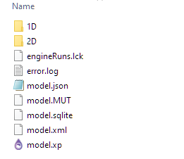{.graf-image}

There are a few files share the base name of the model, "model.\*", they are the main [database](https://help.innovyze.com/display/xps/The+Database){.markup--anchor .markup--p-anchor target="_blank"} of the model,

-   model.xp is the main database of the model

-   model.sqlite stores other information, most important is the scenarios

-   model.json has rainfall data

The modeling results are saved in the 1D and 2D folders.

For models without scenarios and global storms, the results are saved under the subfolder of 1D or 2D with model base name as shown below,

{.graf-image}

-   the \*.dat file is the 1D input file

-   the \*.out is the 1D log file

-   other files are results files

The 2D folder, results are organized in subfolders

{.graf-image}

-   Data: the input data folder for the 2D model

-   Log: the log of the 2D results

-   Output: the 2D simulation results

-   Check: you might have a check folder if the check files are generated

**NOTE**: you can have multiple models in the same folder, and each will create a subfolder in the 1D/2D folder to store its results

### Scenario & Global Storms {#scenario-global-storms .graf .graf--h3}

When using scenarios and global storms, XPSWMM will run a combination of the two for a list of simulations. For example if we have 3 scenarios, and two global storms, you'll get 2\*3=6 simulations

{.graf-image} {.graf-image}

After running the model, we'll have the following runs in the 1D folder,

{.graf-image}

The name of results folder for each run is defined as, "base_scenario_global storm". **Therefore, it is important to make sure the names of the model, scenario and storm is not too long, the path can grow very quickly.**

 

======================================================================

======================================================================

# How to open an XPSWMM model created in a new version

{
    "title": "How to open an XPSWMM model created in a new version",
    "aid": "kA04U000000UMduSAG_en_US_1.html",
    "software": "XPSWMM",
    "topic": "other",
    "summary": "This video demonstrates a workaround for opening an XPSWMM model created in a newer version using an older version of the software. The presenter explains that XPSWMM lacks backward compatibility, meaning models saved in newer versions may become corrupted when opened in previous releases. The hack involves first making a backup copy of the model, then using a text editor like Notepad++ to open the model\u2019s .xp file. The user is instructed to search for the identifier 0PVER and modify the displayed version number to match the installed version. A warning about potential data corruption may appear upon opening the modified model."
}

- Product: XPSWMM
- Topic: other

## Summary
This video demonstrates a workaround for opening an XPSWMM model created in a newer version using an older version of the software. The presenter explains that XPSWMM lacks backward compatibility, meaning models saved in newer versions may become corrupted when opened in previous releases. The hack involves first making a backup copy of the model, then using a text editor like Notepad++ to open the model’s .xp file. The user is instructed to search for the identifier 0PVER and modify the displayed version number to match the installed version. A warning about potential data corruption may appear upon opening the modified model.

## Text

The method we are going to show here should only be used when having the right version of the software is not possible. XPSWMM is never built with backward compatibility tested, and opening a model in a older version can corrupt the model and cause wrong modeling results.\

\

1. Make a copy of the model before trying this \"hack\"\

2. open the \*.xp file using a text editor, Notepad++ should be installed with XPSWMM\

3. Search for 0PVER, and you should find the line looks something like this below,\

\

**SWMM   0PVER   0   0     21.1.0.0            2020.1  **\

4. The last column is the software version. Change that to your version you have on your computer, and save the model.\

5. Open the model you might get a warning saying the model was created in a later version, and data might be corrupted.\

 

======================================================================

======================================================================

# How to apply a new xcf file to XPSWMM?

{
    "title": "How to apply a new xcf file to XPSWMM?",
    "aid": "kA04U000000UMckSAG_en_US_1.html",
    "software": "XPSWMM",
    "topic": "licensing",
    "summary": "This video tutorial explains how XPSWMM/XPSTORM users update their software licensing by applying a new xcf file through their InfoCare subscription. The video guides viewers through checking the current license type by reviewing configuration files and verifying dongle information using the XP Diagnostic tool. Detailed steps are provided to confirm the dongle serial number and compare it with the xcf file details. In addition, instructions on requesting a new xcf file from Innovyze support are included. Finally, the tutorial shows how to replace an outdated xcf file in the installation folder, ensuring proper licensing and software functionality. Update is essential."
}

- Product: XPSWMM
- Topic: licensing

## Summary
This video tutorial explains how XPSWMM/XPSTORM users update their software licensing by applying a new xcf file through their InfoCare subscription. The video guides viewers through checking the current license type by reviewing configuration files and verifying dongle information using the XP Diagnostic tool. Detailed steps are provided to confirm the dongle serial number and compare it with the xcf file details. In addition, instructions on requesting a new xcf file from Innovyze support are included. Finally, the tutorial shows how to replace an outdated xcf file in the installation folder, ensuring proper licensing and software functionality. Update is essential.

## Text

\

\

In order for XPSWMM/XPSTORM end users to access the latest versions, the employer needs to subscribe to the [InfoCare](https://www.innovyze.com/en-us/support-overview/infocare-the-details), an annual service contract which will give the company employees access to software updates and technical support and many other resources. The main mechanism to enforce the InfoCare policy is through the xcf licensing file. Every year, the sales team at Innovyze will issue new xcf file to users who subscribed for the current year InfoCare, and the end user will need a copy of the new xcf file to use the latest version of the software.\

Since the sales team only send the xcf file to the company contact on our contract, usually from the accounting department, the xcf file does not always find its way to the end user.\

For the end user, there are two typical paths to get the software updated

-   The end user may have installed the latest version with an old xcf file, and the software will show an error message of expired xcf file and exit. In this case, please contact the [support@innovyze.com](mailto:support@innovyze.com) to request a new xcf file. Or contact your staff who managed the account.

-   The end user is aware of the need of a new xcf file, and reach out for a copy of the xcf file first before installing the software.

In this article, we'll show the steps for both situations. It includes the following steps,

-   Check the license type

-   Get the dongle serial number

-   Request for a xcf file

-   Apply a new xcf file

# License Type {#license-type style="margin-top: 16px;"}

First we need to determine the license type,

1.  Go to C:\\Program Files\\Innovyze\\xpswmm#####

2.  Open the swmpx.ini

3.  Check the \[NETWORK\] section

\

Standalone license will look like this,\

\

A floating license will look like this, the server line is the IP address or machine network name. Write down the server address, and you will need it for additional testing.\

# XP Diagnostic tool {#xp-diagnostic-tool style="margin-top: 16px;"}

Next we need to check the license file and the dongle using the XP Diagnostic tool. This will tell us if the dongle is working properly and if it matches the licensing information encoded in the xcf file.

## Check the dongle {#check-the-dongle style="margin-top: 3px;"}

**Regardless of a floating license or standalone license, to check the dongle you need log into the computer with the dongle plugged in physically, the dongle driver will detect remote desktop session and render the dongle as not available.**\

First look for the dongle connected to the computer and write down the serial number. It should read something like 42-#### for XPSWMM or 66-#### for XPSTORM.

1.  Go to C:\\Program Files\\Innovyze\\xpswmm#####

2.  Open XP Diagnostic

3.  Open the xcf file and check

\

The information encoded in the dongle is the product type and the serial number.\

\

 

## Check the licensing in the XCF file {#check-the-licensing-in-the-xcf-file style="margin-top: 3px;"}

Scroll down to the bottom to the window to review the xcf information, make sure the serial number matches, and the version number should be the same or later than the installed software. If the dongle serial doesn't match the xcf file, or the xcf is older than the installed software contact [support@innovyze.com](mailto:support@innovyze.com).\

NOTE: XPSWMM 2021 is version 2200, 2020 is 2100, etc.\

\

 

# Request for an XCF file {#request-for-an-xcf-file style="margin-top: 16px;"}

Now you know how to check if your xcf file is older than the latest version of the software. To request an xcf file, you can either ask internally if you know who might have got the email from Innovyze or you can contact [support@innovyze.com](mailto:support@innovyze.com), and the support team will send you the latest xcf file. You will need to provide the following information,

-   Your employer name

-   Your dongle serial number

 

# Install the latest version {#install-the-latest-version style="margin-top: 16px;"}

Once you got the xcf file, you can follow the [instructions](https://help.innovyze.com/display/xps/Installing+XSWMM+or+XPStorm) to get the software installed. You can have multiple versions of XPSWMM/XPSTORM installed on the same computer, so there is no need to remove older versions when installing the latest version.\

If you have already installed the software with the wrong version of the software, simply go to the installation folder and replace the old xcf file with the new one.\

\

 

======================================================================

======================================================================

# How to recover a model that won’t open in XPSWMM

{
    "title": "How to recover a model that won\u2019t open in XPSWMM",
    "aid": "kA04U000000UMGnSAO_en_US_1.html",
    "software": "XPSWMM",
    "topic": "other",
    "summary": "This tutorial outlines troubleshooting strategies for recovering an XPSWMM model that fails to open. It explains that the model data is stored in multiple files and highlights the role of backup (*.bak) files and version-specific *.xp copies. The recovery process includes renaming and replacing files, and optionally merging individual elements from an older model if a backup is unavailable. The article further advises on best practices such as regular backups, data snapshots using the transmit model tool, and periodic model rebuilds to optimize performance and reduce database clutter. These steps aim to restore model functionality and prevent future data corruption."
}

- Product: XPSWMM
- Topic: other

## Summary
This tutorial outlines troubleshooting strategies for recovering an XPSWMM model that fails to open. It explains that the model data is stored in multiple files and highlights the role of backup (*.bak) files and version-specific *.xp copies. The recovery process includes renaming and replacing files, and optionally merging individual elements from an older model if a backup is unavailable. The article further advises on best practices such as regular backups, data snapshots using the transmit model tool, and periodic model rebuilds to optimize performance and reduce database clutter. These steps aim to restore model functionality and prevent future data corruption.

## Text

###   {#section .graf .graf--h3}

If your XPSWMM model won't open, here are a few things you might be able to do to recovery the model.

### XPSWMM Model Files {#xpswmm-model-files .graf .graf--h3}

Refer to the help for more information about the structure of the model database, and how model edits are saved to the files.

[**The Database**\

*XPSWMM maintains an internal database that integrates the spatial data associated with an object with the attribute...*help.innovyze.com](https://help.innovyze.com/display/xps/The+Database "https://help.innovyze.com/display/xps/The+Database"){.markup--anchor .markup--mixtapeEmbed-anchor target="_blank"}

Here are a few important facts related to recovering a corrupted model,

-   XPSWMM stores the model data in a few files. When an XPSWMM model is open, everything is loaded into the memory, until the model is saved the model will not be updated on the hard drive.

-   XPSWMM also creates a copy of the model file when it is open with the extension of \*.bak. In case the model crashes, the \*.bak file will have the copy before the crash.

-   When a model is opened with a newer version of XPSWMM, a copy of the original \*.xp file will be created with the suffix of the database version.

### Recover a model {#recover-a-model .graf .graf--h3}

Below are the options,

-   If there is a \*.bak file in the model folder, change the name of the \*.xp to \*\_copy.xp, then change the \*.bak file to \*.xp. See if the backup model will open.

-   If there is a \*.xp file with the suffix of a database version. Change the name of the model \*.xp file to \*\_copy.xp, rename the \*.xp file with the suffix to the model name, see if that model opens. 

-   Some models can be partly restored by making a new model and then merging incrementally the links and nodes, the Job Control and the Global Database records if no .bak is available.

{.graf-image} {.graf-image}

### Recommendations {#recommendations .graf .graf--h3}

As an XPSWMM model grows in size over time it is important to be prepared for possible data corruption. Making copies of the model at key milestones such as the end of each phase is good practice. Using the "transmit model" tool to create zip files for a snapshot of the model.

{.graf-image}

 

 For models with a long history spanning many versions of XPSWMM the model might need to be rebuilt from time to time to purge out the unused objects in the database. Next time you pick up an old model, check its size. For most XPSWMM models, its size should be well under the 50M mark. If you have a model larger than 50M, it is a good idea to [rebuild it](https://mel-meng-pe.medium.com/how-to-rebuild-a-1d-xpswmm-model-1629d7192cfe){.markup--anchor .markup--p-anchor target="_blank"}.

 

======================================================================

======================================================================

# XPSWMM sentinelOne conflict

{
    "title": "XPSWMM sentinelOne conflict",
    "aid": "kA04U000000UME8SAO_en_US_1.html",
    "software": "XPSWMM",
    "topic": "licensing",
    "summary": "In Q1 2021, customers experienced an issue where the Sentinel LDK License Manager (hasplms.exe) was being blocked by SentinelOne. The article explains that the R&D teams from both companies collaborated to develop a fix, which is available in several SentinelOne versions. It instructs customers to verify their current version of SentinelOne, whether they are using a standalone or multi-user Sentinel SuperPro dongle, and to update to the latest Sentinel Protection Installer (version 7.7.0) if needed."
}

- Product: XPSWMM
- Topic: licensing

## Summary
In Q1 2021, customers experienced an issue where the Sentinel LDK License Manager (hasplms.exe) was being blocked by SentinelOne. The article explains that the R&D teams from both companies collaborated to develop a fix, which is available in several SentinelOne versions. It instructs customers to verify their current version of SentinelOne, whether they are using a standalone or multi-user Sentinel SuperPro dongle, and to update to the latest Sentinel Protection Installer (version 7.7.0) if needed.

## Text

We did face an issue with the "SentinelOne" vendor, with our "Sentinel LDK RTE" in Q1 2021.\

Our "Sentinel LDK License Manager" (hasplms.exe) was getting blocked.\

Our R&D team worked with \"SentinelOne\" team to find a fix for the issue. The fix ensure that all current and future versions of Sentinel LDK License Manager no longer face interoperability issues with SentinelOne.\

SentinelOne fix versions:\

• 5.13 SP3 WIN\

• 6.13 SP3 WIN\

• 7.11 SP1 WIN\

• 0.2 EA2 WIN\

• 1.1 EA WIN\

Our "Sentinel SuperPro" customers did not report the same with the service "Sentinel Protection Server" (spnsrvnt.exe) before you.\

Could you check the following:\

1) Could your customer confirm what versions of \"SentinelOne\" they currently use ? Can they update to the above SentinelOne fix versions?\

2) Can you confirm if your customer use a \"standalone\" Sentinel Superpro dongle in local or a \"multi-user\" Sentinel SuperPro over the network?\

3) Can you check if the customer has our latest "Sentinel Protection Installer" 7.7.0 installed ?\

Here is the download link:\

[https://supportportal.gemalto.com/csm?id=kb_article_view&sysparm_article=KB0019063](https://supportportal.gemalto.com/csm?id=kb_article_view&sysparm_article=KB0019063)\

 \

 

======================================================================

======================================================================

# How to visualize capacity issues in XPSWMM

{
    "title": "How to visualize capacity issues in XPSWMM",
    "aid": "kA04U000000UMCESA4_en_US_1.html",
    "software": "XPSWMM",
    "topic": "hydraulics",
    "summary": "This video demonstrates techniques for visualizing capacity issues in collection systems using XPSWMM. It details tools for evaluating hydraulic performance by analyzing the hydraulic grade line (HGL) relative to pipe slopes. Users learn several flow path selection methods, including using right-click commands and keyboard shortcuts, to isolate sections of interest. The dynamic long section tool displays both profiles and hydrographs, revealing surcharged pipes and insufficient freeboard at manholes. Additionally, the dynamic plan view uses animated maps to display flow directions and flooding conditions, enhancing understanding of system dynamics. The guide helps modelers identify capacity issues and determine underlying hydraulic causes."
}

- Product: XPSWMM
- Topic: hydraulics

## Summary
This video demonstrates techniques for visualizing capacity issues in collection systems using XPSWMM. It details tools for evaluating hydraulic performance by analyzing the hydraulic grade line (HGL) relative to pipe slopes. Users learn several flow path selection methods, including using right-click commands and keyboard shortcuts, to isolate sections of interest. The dynamic long section tool displays both profiles and hydrographs, revealing surcharged pipes and insufficient freeboard at manholes. Additionally, the dynamic plan view uses animated maps to display flow directions and flooding conditions, enhancing understanding of system dynamics. The guide helps modelers identify capacity issues and determine underlying hydraulic causes.

## Text

###   {#section .graf .graf--h3}

Evaluating a collection system's capacity is a critical task for planning and design projects. XPSWMM provides a wide range of tools for modeler to evaluate the system capacity.

Common tasks include checking the HGL of system to,

-   identify capacity issues of manholes without enough freeboard and pipes that are surcharged

-   understand the causes of the capacity issues, pipe too small or downstream restriction, etc.

### Profile View {#profile-view .graf .graf--h3}

The most useful tool is the "dynamic long section" tool

{.graf-image}

To use this tool, first select a flow path. XPSWMM provides several ways to select a flow path in a network,

1.  right click on a node and select upstream or downstream

{.graf-image}

2\. click the start node, then hold "shift" key and click the end of a flow path, XPSWMM will select the path in between.

3\. Hold "ctrl" key to select one pipe at a time

Once the flow path is selected, click on the profile tool

{.graf-image}

In general, if the model performs well, we only need to focus on the max. HGL. There are a few simple checks to determine the pipe capacity by comparing the slope of the HGL and the pipe,

-   When the pipe has enough capacity to convey the flow, the HGL should have the same slope as the pipe

-   When the pipe doesn't have enough capacity, to push more flow through the pipe, the HGL will have a steeper slope than the pipe, so that there is more head on the upstream end to push more water

-   When the downstream end is backing water up, the HGL slope will be less than the pipe slope, so that there is less head to push the water through the pipe

Using the above rules, we can quickly identify sections of the profile that have capacity issues, and the causes for these issues.

{.graf-image}

However, the rules above assume the flow through the pipes does not change dramatically throughout the system, and its behavior can mostly be described using the manning's equation, and energy equations. Therefore, it is a good idea to watch the animation and verify that the max. HGL is a result of the same peak flow passing through the system. 

"Dynamic section views" combines both the profile and the hydrographs in one place, so that the dynamics of the system can be better studied.

{.graf-image}

The dynamic section views can display a lot of customizable information.

The link/node tables are from the XPTables, which can be customized.

As shown below, the cross section view and the hydrograph view are linked using the link name.

{.graf-image}

You might need to maximize the graph to see the link name by right click on the graph.

{.graf-image}

You can drag the dashed red line to change the current time of the animation.

{.graf-image}

As shown below, understanding what is going on in this graph can take some time. The dynamics of a collection system can be complicated, and watching the animation is one of the best ways for modelers to develop intuitions how water moves through a system.

{.graf-image}

### Plan View {#plan-view .graf .graf--h3}

For people without the engineering training on hydraulics and hydrology, a plan view might be easier to understand.

{.graf-image}

The Dynamic plan view shows system performance as animation on a map.

Links and nodes are styled with different color and sizes to represent the flow and flooding conditions. The animation also shows the flow direction inside the pipes.

Zoom to the area of interest, then click on the "Dynamic Plan View" button,

{.graf-image}

You can use the controls on the top of the window for playing the animation.

{.graf-image}

The colors and freeboard settings can be accessed using the file menu.

{.graf-image} {.graf-image}

### Summary {#summary .graf .graf--h3}

XPSWMM has several visualization tools just a click away to reveal the capacity issues of the model, through some practice, the modeler can quickly identify the capacity issues and the causes.

 

======================================================================

======================================================================

# What are model modes in XPSWMM?

{
    "title": "What are model modes in XPSWMM?",
    "aid": "kA00P0000000xjCSAQ_en_US_1.html",
    "software": "XPSWMM",
    "topic": "hydraulics",
    "summary": "The article explains the three model modes in XPSWMM\u2014runoff, hydraulics, and sanitary\u2014originating from earlier SWMM versions designed to work within limited computing power. It describes how the modes were originally separated to manage hydrology, hydraulics, and water quality individually using output files, and how modern computing allows simultaneous simulation. The article discusses the configuration of individual modes, the common pitfalls in setting up routing, and the option for simultaneous runoff and hydraulics without interface files for backward compatibility."
}

- Product: XPSWMM
- Topic: hydraulics

## Summary
The article explains the three model modes in XPSWMM—runoff, hydraulics, and sanitary—originating from earlier SWMM versions designed to work within limited computing power. It describes how the modes were originally separated to manage hydrology, hydraulics, and water quality individually using output files, and how modern computing allows simultaneous simulation. The article discusses the configuration of individual modes, the common pitfalls in setting up routing, and the option for simultaneous runoff and hydraulics without interface files for backward compatibility.

## Text

# The History

XPSWMM has 3 model modes, runoff, sanitary and hydraulics. These modes are originated from earlier versions of SWMM. In the early days of SWMM, computers are not very powerful, therefore running a full simulation with hydrology, hydraulics and water quality simultaneously is beyond the hardware limits. Therefore, the SWMM engine has an architecture to separate the different components as individual programs(blocks). In this manner, the computer only needs to run one program at a time, and the different programs only exchange data through output files.\

{height="381" width="512"}\

\

The XPSWMM engine is based on SWMM and inherited the same architecture.  Fast forward to today, the computer hardware is no longer a limitation, and the underlying engine is also evolved to run the hydrology and hydraulics at the same time without using an interface file. However, for backward compatibility purposes, the model modes are still part of the user interface, and the user can still choose to run hydrology and hydraulics separately just like in the old days.

# The Modes

Runoff mode is for hydrology, it is similar to HEC-HMS. You can generate runoff from subcatchments, and you can also route flow through links using hydrology routing methods.\

\

Hydraulics mode is for hydraulics, it uses the 1D shallow water Saint-Venant equations to route the flow through pipes.\

\

Sanitary mode is for long term water quality modeling. By using simplified routing method, it is suited for long term water quality modeling due to its simplicity and speed.\

 

# Runoff + Hydraulics

XPSWMM models usually use the runoff model to generate inflows to the network, and then uses the hydraulics mode to route flow. You need to switch to runoff mode to enter runoff parameters for subcatchments, and the hydraulic mode to enter invert for pipes and nodes.\

\

\

\

A common mistake is to setup the routing in pipes in both hydrology and hydraulics. When hydraulics routing is used, all the pipes should be disabled in the runoff mode.\

1. select runoff mode\

2. select all pipes\

3. disable all pipes\

4. all the pipes should be disabled shown as dashed lines\

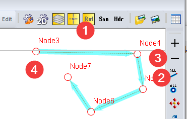

# Choose What to run

To tell XPSWMM what mode should be used for the simulation, go to the \"mode properties\".\

\

When the current model is selected, it will only run the current mode, which is the default setting. If you are in the runoff mode, it only run the runoff simulation without the routing.\

\

However, there is one exception. If in the \"Hydraulics Job Control\", \"Solve Runoff & Hydraulics Mode Simultaneously\" is checked, XPSWMM will run both runoff and hydraulics simultaneously. With this option checked, the engine runs a single model, at each time step it solves both the hydrology and hydraulics without the need to use an interface file. This is different from running runoff first to create an interface file with the inflow hydrographs, and then run the hydraulic model to route the hydrographs.\

\

\

As explained before, running Runoff and then use its output as input for hydraulics simulation was a compromise due to historical hardware limitations. In most cases, they should be run simultaneously without the need of using interface file. To remove interface files,\

\

Make sure all the interface files are unchecked.\

\

\

\

\

\

You can also overwrite the default behavior of what mode to run when the run button is clicked.\

1. Uncheck \"current model\" if checked\

2. check the mode you would like to run\

\

\

\

With this setting, regardless of the current model when the run button is clicked, the checked mode will be running.\

\

\

\

\

\

 

======================================================================

======================================================================

# How does the ponding option work in XPSWMM

{
    "title": "How does the ponding option work in XPSWMM",
    "aid": "kA04U0000005PCqSAM_en_US_1.html",
    "software": "XPSWMM",
    "topic": "hydraulics",
    "summary": "XPSWMM provides flexible ponding options for managing overflow at hydraulic nodes, and this video/article explains these choices in detail. It reviews three primary settings \u2013 \u201cNone,\u201d \u201cAllowed,\u201d and \u201cSealed\u201d \u2013 and explains their implications for water storage and overflow control. The \u201cNone\u201d option causes overflow water to disappear beyond the structural rim, while \u201cAllowed\u201d provides a basic method to retain excess water, with \u201cSealed\u201d preventing any overflow entirely. Additionally, the demonstration compares the ponding behavior when linking node outlets to 2D surfaces using alternative methods. A simple model, including constant inflow and variable node configurations, illustrates realistic system responses, effectively demonstrated."
}

- Product: XPSWMM
- Topic: hydraulics

## Summary
XPSWMM provides flexible ponding options for managing overflow at hydraulic nodes, and this video/article explains these choices in detail. It reviews three primary settings – “None,” “Allowed,” and “Sealed” – and explains their implications for water storage and overflow control. The “None” option causes overflow water to disappear beyond the structural rim, while “Allowed” provides a basic method to retain excess water, with “Sealed” preventing any overflow entirely. Additionally, the demonstration compares the ponding behavior when linking node outlets to 2D surfaces using alternative methods. A simple model, including constant inflow and variable node configurations, illustrates realistic system responses, effectively demonstrated.

## Text

###   {#section .graf .graf--h3}

Ponding options for nodes can be confusing. You can find more about it from the online [help](https://help.innovyze.com/display/xps/Hydraulics+Node+Data#HydraulicsNodeData-PondingPonding){.markup--anchor .markup--p-anchor target="_blank"}.

Here is a quick summary,

-   None: any overflow will disappear

-   allowed: a quick and dirty way to get water stored above the node, and later the flow back to the system. Usually a more conservative way of sizing your system during very early stage of planning or design. In more detailed modeling, this option will be replaced with more realistic storage curves

-   sealed: if it is a sealed manhole or a structure that doesn't allow overflow

{.graf-image}

So what about link to 2D surfaces?

-   link spill crest to 2d: most of the times this is how a manhole should be connected to 2D

-   link invert to 2d: for river and open channel where the node is "imaginary", this usually is the right option.

One thing I would like to share is how we can learn from the model directly. To become an experienced modeler, the most important skill is to gain insights from the model, in other words, we need to be very good at using model as a learning tool.

In this case, we would like to learn more about how we can model overflows from a node. The easiest thing to do is to run a model with all the options and see what happens next.

As shown below, we setup a model with a node for each ponding option,

-   invert is 0ft

-   rim is 10ft

-   a constant inflow of 10cfs

-   each node is named after the ponding option

-   the model has no 2D components

 

{.graf-image}

The results are shown below,

option 2, 3, 4 are the same: so we know when there is no 2D but we are choosing the 2D options, it acted as "allowed" option.

option 1 is "None" and option 5 is "Sealed".

-   we can see the overflow amount is the same for all options except sealed because it doesn't overflow at all

-   for option 1 none: the level stopped at 10ft where the rim is

-   for option 2, 3, 4: it follow the storage curve of the allowed storage

{.graf-image}

You can find the model on [Github](https://github.com/mel-meng/xpswmm/tree/master/models/ponding_options){.markup--anchor .markup--p-anchor target="_blank"}.

I hope you find this simple model very helpful in understanding how different ponding options work. You can use similar models to learn how a model works directly from the results.

 

======================================================================

======================================================================

# How to prepare rainfall data for modeling?

{
    "title": "How to prepare rainfall data for modeling?",
    "aid": "kA04U0000005P14SAE_en_US_1.html",
    "software": "XPSWMM",
    "topic": "hydrology",
    "summary": "This video demonstrates practical techniques to prepare rainfall data for hydrologic modeling. It explains the process of converting raw rainfall data, typically measured by tipping bucket rain gauges, into useful formats including proper intensity units and total volumes. The presentation covers challenges such as converting rainfall units, aligning various date-time formats using Excel functions, and enforcing fixed time intervals through techniques like vlookup. An example with XPSWMM is provided where a user-defined rainfall file is created and verified. The video serves as a guide to effectively manage and preprocess rainfall data for accurate simulation and analysis in modeling applications."
}

- Product: XPSWMM
- Topic: hydrology

## Summary
This video demonstrates practical techniques to prepare rainfall data for hydrologic modeling. It explains the process of converting raw rainfall data, typically measured by tipping bucket rain gauges, into useful formats including proper intensity units and total volumes. The presentation covers challenges such as converting rainfall units, aligning various date-time formats using Excel functions, and enforcing fixed time intervals through techniques like vlookup. An example with XPSWMM is provided where a user-defined rainfall file is created and verified. The video serves as a guide to effectively manage and preprocess rainfall data for accurate simulation and analysis in modeling applications.

## Text

A common task for modeling is preparing rainfall data, and it could be complicated. In this example, we will learn a few tips of managing rainfall data.

Most common rainfall data are recorded from rain gauges, which is reported as totals for each time interval. For [tipping bucket rain gauges](https://www.reddit.com/r/meteorology/comments/hmd4md/tipping_bucket_rain_gauge/){.markup--anchor .markup--p-anchor target="_blank"}, a very clever mechanical device, it counts the number of bucket tipping, since each time it tips, it is a fixed volume, the total rainfall can be calculated.

{.graf-image}

If the rain gauge reports the rainfall every 15 minutes, the data will look something like this.

{.graf-image}

### Rainfall Units {#rainfall-units .graf .graf--h3}

Now, the first thing we need to do is rainfall unit conversion. Depending on the program you will use, it could ask you either intensity or total volume.

If it is intensity, it will be inch/hr or mm/hr. In our example above, the intensity will be calculated as total (volume/time interval). So for 1 in rain collected in 15 min, it will be 4 in/hr (1 in/0.25hr).

This might take some testing with your software package if it doesn't provide obvious clues of the units to be used.

A simple way to check is comparing the total rainfall from the modeling output with your source data.

### Date Time formats {#date-time-formats .graf .graf--h3}

Date time formats conversion can be more challenging. There are so many date formats, 

-   Jan 1 2020, 11:20am

-   2020, 1, 1, 11, 20

-   11/20/2020, 11:20

-   11/20/2020 11:20

-   etc

Another thing to look out for is the time interval, most modeling package requires fixed interval time series data, and we might need to clean up the data first. 

For date time format, Excel has excellent functions for the task.

As shown below, the common tasks are,

-   combine date time from multiple columns into one column

-   separate date time from one column to multiple columns

{.graf-image}

As shown below, excel treat date time as numbers,

{.graf-image} {.graf-image}

So to combine date and time into a single column is as simple as adding them together

{.graf-image}

Then choose the right style,

{.graf-image}

Now we have date time in a single column, how to get a single date time into multiple columns? we can use the TEXT function to format a datetime number,

{.graf-image} {.graf-image}

Next, let's see how we can enforce a fixed time interval for rainfall time series.

First we need to verify the time interval by calculating the delta between two time steps,

{.graf-image}

Then we can use the filter to see how many different time interval we have, and if we have multiple intervals, we can go ahead and fix these irregular time intervals.

{.graf-image}

For rain gauges without a synchronized clock, usually the time stamp is just off by a few minutes, and if it is 15 min interval, we can simply move the time to align with the closest reading, which should give us pretty good data.

For this, we can build a spreadsheet with manually populated time stamps at fixed intervals, then "calculate" the value from the source data.

1.  we need to build a time index with fixed interval. Start the first two rows, then drag it. Be careful, sometimes Excel might get the calculation wrong, make sure you review the intervals using the method above and fix any errors.

{.graf-image}

 

2\. Then we can use the **vlookup** function to grab the data closest to the time interval. Make sure the last parameter of the vlookup is "True" so that it will look for the closest time in the red area rather than an exact match.

{.graf-image}

### An XPSWMM Example {#an-xpswmm-example .graf .graf--h3}

With the above tips, you can turn most raw rainfall data into any format a modeling program asks for.

Here is an example adding rainfall data to XPSWMM as a user defined file.

First let's create a rainfall entry for RG01

{.graf-image} {.graf-image}

For the File Format, it should look like this.

{.graf-image}

And that is the format we are going to build.

{.graf-image} {.graf-image}

Column C should be total instead of intensity in inches

Column D is needed, and it is the station name.

{.graf-image}

With this setting, we have the results shown below,

the rainfall is,

-   4 in/hr for the 1st hour (1in/15min=4in/hr)

-   8in/hr for the 2nd hour.

{.graf-image}

You can find the model and excel example on [github](https://github.com/mel-meng/xpswmm/tree/master/models/rainfall/user_defined_rainfall){.markup--anchor .markup--p-anchor target="_blank"}.

======================================================================

======================================================================

# How does XPSWMM model evaporation

{
    "title": "How does XPSWMM model evaporation",
    "aid": "kA04U0000005P0USAU_en_US_1.html",
    "software": "XPSWMM",
    "topic": "hydrology",
    "summary": "In this simulation video, the process of evaporation modeling within XPSWMM is demonstrated for SWMM runoff in urban subcatchments. The video explains that evaporation reduces surface water depth during each time step and interacts with infiltration processes. It illustrates how water depth is impacted by evaporation rates and how depressed areas store water. Several scenarios, including increased depression area, no evaporation, and baseline conditions, are compared using rainfall events in January and February. The video reveals that evaporation significantly influences runoff peak magnitudes and infiltration recovery dynamics. Combining these simple processes produces complex hydrologic behaviors in urban stormwater systems effectively."
}

- Product: XPSWMM
- Topic: hydrology

## Summary
In this simulation video, the process of evaporation modeling within XPSWMM is demonstrated for SWMM runoff in urban subcatchments. The video explains that evaporation reduces surface water depth during each time step and interacts with infiltration processes. It illustrates how water depth is impacted by evaporation rates and how depressed areas store water. Several scenarios, including increased depression area, no evaporation, and baseline conditions, are compared using rainfall events in January and February. The video reveals that evaporation significantly influences runoff peak magnitudes and infiltration recovery dynamics. Combining these simple processes produces complex hydrologic behaviors in urban stormwater systems effectively.

## Text

Evaporation in XPSWMM applies to the SWMM runoff. As shown below, SWMM uses the non-linear reservoir to model runoff for subcatchment.

ds is the depression depth, d is the water depth on the subcatchment. When it rains, water will start to pond on the subcatchment surface, and at each time step, and standing water will lose depth based on the evaporation rate. If the evaporation is given as 0.1 in/day, then it will translate into a depth based on the time step for the water to be removed from the subcatchment. At the same time, infiltration will happen based on the infiltration method used. Then the flow can be calculated using the Manning's equation like formula.

{.graf-image}

That description is for one type of subcatchment. SWMM runoff allows more detailed description of the subcatchments into pervious and impervious, and the area with and without depression.

{.graf-image}

For continuous simulation, evaporation might have significant impact on the runoff. Especially for depressed area, evaporation can dry these areas up quickly and thus allowing the infiltration to recover sooner. Once the subcatchment is dry, evaporation no longer has impact on its hydrology.

Here is an example, we set up different evaporation rate for Jan and Feb. Feb is 5 times as high.

{.graf-image}

 A simulation from 1/30--2/5 that rained one day in Jan and one day in Feb.

{.graf-image}

The following scenarios were compared,

-   base: the base line

-   depression: increase the depression area

-   no evaporation: set evaporation at 0

The runoff is shown below,

{.graf-image}

If we zoom in closer to the first peak,

-   no evaporation has the highest peak: the surface water not evaporated becomes flow

-   depression has the lowest peak: some of the rainfall was stored in the depressed area

Next, let's compare the infiltration rate,

For the first storm it looks almost the same except,

-   depression has standing water longer on the surface, therefore, the red line dropped to zero the last

-   base dried out the first because it has less water on the surface to drain than the no evaporation scenario

{.graf-image}

Now if we look at the second peak,

base has the highest infiltration rate because of the evaporation allowed the subcatchment to dry earlier thus recover more capacity

depression has the lowest infiltration rate because it has standing water on the surface longer.

{.graf-image}

In conclusion, although each of the processes of precipitation, evaporation and infiltration is quite simple. Once combined, it can generate complex flow patterns.

You can find the model on [github](https://github.com/mel-meng/xpswmm/blob/master/models/evaporation/evaporation.zip){.markup--anchor .markup--p-anchor target="_blank"}.

 

======================================================================

======================================================================

# How to model a sealed manhole that can overflow in XPSWMM?

{
    "title": "How to model a sealed manhole that can overflow in XPSWMM?",
    "aid": "kA04U0000005OzuSAE_en_US_1.html",
    "software": "XPSWMM",
    "topic": "2D modeling",
    "summary": "This video demonstrates a method to model a sealed manhole that can overflow using XPSWMM. The presenter explains that when an underground system is overwhelmed, water can overflow from a manhole that is not designed as an inlet. The overflow is modeled by linking the spill crest to a two-dimensional (2D) surface, checking the inlet capacity, and setting the maximum capacity to zero. An example compares two scenarios: one with a 5 cfs inlet capacity and a second with no inlet flow, illustrating the water level interactions between a one-dimensional (1D) pipe system and the 2D surface. Improves system resilience."
}

- Product: XPSWMM
- Topic: 2D modeling

## Summary
This video demonstrates a method to model a sealed manhole that can overflow using XPSWMM. The presenter explains that when an underground system is overwhelmed, water can overflow from a manhole that is not designed as an inlet. The overflow is modeled by linking the spill crest to a two-dimensional (2D) surface, checking the inlet capacity, and setting the maximum capacity to zero. An example compares two scenarios: one with a 5 cfs inlet capacity and a second with no inlet flow, illustrating the water level interactions between a one-dimensional (1D) pipe system and the 2D surface. Improves system resilience.

## Text

When the underground system is overwhelmed, significant amount of flow can overflow to the surface through manholes, but the manhole might not be designed as an inlet to collect surface water.

Under such situation how should we model the node?

It turned out to be quite simple,

1.  Link the Spill Crest to 2D: this will allow flow to be exchanged between the node and the surface

2.  check Inlet Capacity

3.  Set the maximum Capacity to 0: this will limit the flow from surface to node to 0

{.graf-image}

To illustrate the impact, here is an example.

The 2D surface is flat at 90 ft elevation. It has standing water on it. The 1D system is controlled by an outfall with water level rising from 80ft to 100ft.

{.graf-image} {.graf-image}

So at the beginning water will be ponding on top of the node 4. Then as the outfall water level increases, water will come out of node 4 to the grid. As shown in the figure about, it is around 2AM, the water level in the pipe is higher than the surface, and there should be overflow to the surface.

Two scenarios are created,

-   Base: max. inlet capacity is 5cfs

-   Inlet tiny flow: inlet capacity is 0 cfs

As shown below,

-   base scenario shows inflow around 5 cfs when there is capacity, and overflow after 2am when the pipe is overflowing

-   inlet tiny flow scenario shows no flow until the water in the outfall is higher than the surface

{.graf-image}

The model can be found on [github](https://github.com/mel-meng/xpswmm/blob/master/models/inlet/1d_inlet_no_inflow_only_overflow.zip){.markup--anchor .markup--p-anchor target="_blank"}.

 

 

======================================================================

======================================================================

# How to get help in XPSWMM?

{
    "title": "How to get help in XPSWMM?",
    "aid": "kA04U0000005OqBSAU_en_US_1.html",
    "software": "XPSWMM",
    "topic": "hydraulics",
    "summary": "This article provides a simple guide for obtaining support with XPSWMM. It outlines the process of registering or logging into the support portal, using the provided click-to-access interface, and filling out a support ticket form. The article also advises reviewing helpful topics for quick solutions and attaching the relevant model file to facilitate efficient troubleshooting."
}

- Product: XPSWMM
- Topic: hydraulics

## Summary
This article provides a simple guide for obtaining support with XPSWMM. It outlines the process of registering or logging into the support portal, using the provided click-to-access interface, and filling out a support ticket form. The article also advises reviewing helpful topics for quick solutions and attaching the relevant model file to facilitate efficient troubleshooting.

## Text

###   {#section .graf .graf--h3}

Getting support for XPSWMM is literally just one click away.

{.graf-image}

If you don't already have a support portal account, register for a free account. Otherwise, log in.

{.graf-image}

Fill the support ticket form, make sure you take a look of the "Helpful topics", you might find an answer before even submitting a ticket.

{.graf-image}

It is usually helpful to upload your model, too.

{.graf-image}

 

======================================================================

======================================================================

# What happens when a river is overflowing in XPSWMM?

{
    "title": "What happens when a river is overflowing in XPSWMM?",
    "aid": "kA04U0000005OkwSAE_en_US_1.html",
    "software": "XPSWMM",
    "topic": "hydraulics",
    "summary": "XPSWMM simulates river overflow by treating river channels as closed pipe networks, applying momentum and continuity equations at mid-points and nodes. The video explains that unlike storm sewer systems, natural rivers overflow through their banks rather than at manmade nodes. This approach forces the simulation to assume a predefined cross-section with an imaginary lid that prevents water from rising above the top. The video discusses limitations of this method for river systems and provides recommendations such as using 1D/2D interfaces, adjusting node ground elevations, and adding vertical walls. It also compares XPSWMM with more sophisticated tools like ICM and HECRAS."
}

- Product: XPSWMM
- Topic: hydraulics

## Summary
XPSWMM simulates river overflow by treating river channels as closed pipe networks, applying momentum and continuity equations at mid-points and nodes. The video explains that unlike storm sewer systems, natural rivers overflow through their banks rather than at manmade nodes. This approach forces the simulation to assume a predefined cross-section with an imaginary lid that prevents water from rising above the top. The video discusses limitations of this method for river systems and provides recommendations such as using 1D/2D interfaces, adjusting node ground elevations, and adding vertical walls. It also compares XPSWMM with more sophisticated tools like ICM and HECRAS.

## Text

Water flows through a river in a very different way than flowing in man made structures. When a river overflows, it is through the banks. Unlike storm sewer, through an overflowing manhole. So how does XPSWMM handle that?

The XPSWMM engine is built with the assumption of a closed pipe network, there is no special treatment for a channel or river. Let's review how XPSWMM solve the hydraulics. As the diagram shown below, the momentum equation is applied to each pipe and calculated at the mid-point of the pipe, and the continuity equation is applied to the "node assembly" which includes all the half-pipes connected to the node.

{.graf-image}

There are a few important implications of this approach,

-   Only a single flow and velocity is calculated for each link at the mid-point

-   The HGL inside of the a link is not calculated within the link, but assumed as a straight line connecting the head of the upstream and downstream nodes

-   Overflow can only happen at nodes, not in the link

However, such assumptions might not be ideal for a river system,

-   A river system is not closed, and it doesn't have nodes, and when overflows, it is through the banks not the "node"

-   The assumption the HGL within each pipe is a straight line holds very well for most man made structures, however, might not be the case for a winding river.

Before getting into the recommendations, let's get into more details of how XPSWMM will simulate a river when it is overflowing.

### River as closed pipe {#river-as-closed-pipe .graf .graf--h3}

A river link behaves exactly the same as a closed circular pipe. The only difference is that the cross section of a channel is irregular.

As far as XPSWMM engine is concerned, the cross section of a channel or river is a closed shape. Water cannot rise above the top of the section.

When the channel is flowing within the cross section, it is the same as a pipe flowing half full. When a channel is flowing above the height of the defined cross section, it will operate exactly the same as a surcharged pipe. A imaginary lid will be placed on top of the cross section of the channel, and all the flow will be forced and pressurized through the channel.

 

### What happens when a river is overflowing {#what-happens-when-a-river-is-overflowing .graf .graf--h3}

As we just discussed, it will behave exactly the same as a surcharged pipe. The flow will be pressurized and therefore, the water depth in the nodes will be elevated above the crow of the pipe to push more flow through the channel.

Apparently, that is not what we would like the river link to do. The ideal outcome should be that the water will overflow through the lowest point of the bank.

If we are building a 1D/2D link, we can build the 1d/2d interface lines to represent the banks, and we can let the water to overflow along the bank lines.

If we are building a 1D only model, then we'll have to make some assumptions where we would like the overflow to go.

As we explained, the only way to lose flow is through the node. So when a river overflows, we'll have to lose the flow through the nodes. If we believe that all the flow above the top of the cross section will simply be gone, we can simply use the ponding option of "None" at the node.

{.graf-image}

### Recommendations {#recommendations .graf .graf--h3}

Based on the discussion above, we have the following recommendations.

If river overflowing is critical to the modeling project, review the limitations and choose the appropriate measures to address it. For example, setting up a 1D/2D model to simulate the overflow through the banks, or develop a storage curve for overflowing through a node.

Understand different configurations when a pipe is surcharged.

Typically, you should setup the node ground elevation the same as the top of your cross section, and then choose the ponding option when there is overflow. In this manner, XPSWMM doesn't need to make any assumptions.

If you set your node ground elevation higher than the top of the cross section, XPSWMM will have to make some assumptions,

-   Assume the cross section have a lid on top, and will flow surcharged. Unless you are modeling the link as a bridge, this is rarely what is desired. When choosing this option, make sure the VERT_WALLS=OFF is used.

{.graf-image} {.graf-image}

-   Or setup the max depth to use only part of the cross section as a closed pipe 

{.graf-image}

-    

{.graf-image}

-   Another commonly used option during the initial phase of a modeling project is to add vertical walls on the cross section to keep the water contained in the channel without overflowing, this will be the worse situation as far as the max. water depth is concerned.

-   Set the VERT_WALLS=ON (by default this is turned on)

-   Set the node ground elevation higher than the expected HGL to contain all the water in the channel

-   Set max depth=0

{.graf-image}

Blow is a comparison with the VERT_WALLS both on/off.

If the 1D log table E11, the green one is the off option, and the channel is treated as a closed pipe, the max area is 13 sf. While with the ON option, vertical walls are added to the cross section to match the ground elevation, therefore, the max. area is 17.6sf, bigger than the area defined in the cross section.

{.graf-image} {.graf-image}

 

### Conclusion {#conclusion .graf .graf--h3}

XPSWMM models the river the same way as a closed pipe, and are less sophisticated than river modeling packages such as ICM and HECRAS.

Understanding the river modeling approach and limitations of the XPSWMM can help when converting models from other packages into XPSWMM, and choosing the appropriate approach modeling river.

======================================================================

======================================================================

# How does date and time work in XPSWMM

{
    "title": "How does date and time work in XPSWMM",
    "aid": "kA04U0000005OirSAE_en_US_1.html",
    "software": "XPSWMM",
    "topic": "other",
    "summary": "This video explains how date and time settings work in XPSWMM for stormwater modeling. It demonstrates the default setup, where a design storm begins at midnight, and shows how to adjust start times for historical rainfall or off-midnight design storms. The presenter details how rainfall input is linked to simulation start time, explains user input hydrograph behavior, and highlights the nuances between runoff (RNF) and hydraulic routing (HDR) models. In addition, the video guides users on decoupling RNF and HDR using an interface file for continuous simulation, ensuring accurate simulation timing and synchronization between hydrological and hydraulic components."
}

- Product: XPSWMM
- Topic: other

## Summary
This video explains how date and time settings work in XPSWMM for stormwater modeling. It demonstrates the default setup, where a design storm begins at midnight, and shows how to adjust start times for historical rainfall or off-midnight design storms. The presenter details how rainfall input is linked to simulation start time, explains user input hydrograph behavior, and highlights the nuances between runoff (RNF) and hydraulic routing (HDR) models. In addition, the video guides users on decoupling RNF and HDR using an interface file for continuous simulation, ensuring accurate simulation timing and synchronization between hydrological and hydraulic components.

## Text

###   {#section .graf .graf--h3}

For most of the XPSWMM models, we are assuming a model will run with a design storm starting from midnight. And that works pretty well most of the time.

However, from time to time we need to run models with historical rainfall data, or we would like to run a design storm that starts at a different time of the day.

In such situations, things can get complicated, and we need to have a deeper understanding how XPSWMM defines date and time for the input time series, and simulation start and end time. 

### Rainfall Date Time {#rainfall-date-time .graf .graf--h3}

By default, rainfall start time is defined by the starting time of the simulation.

\(5\) is checked by default to force the rainfall to start at the same date and time as the simulation. 

 

{.graf-image}

And with (5) checked, the starting date time of the rainfall is disabled.

{.graf-image}

If (5) is unchecked, then you can specify the starting time of the rainfall. 

{.graf-image}

When the rainfall data is entered, the Time is counted from the starting date and time, NOT midnight.

{.graf-image}

As shown below, when a constant 1in/hr rainfall is loaded,

(1): use the start from simulation start time

(4): an one hour constant rainfall from the start of the simulation

{.graf-image}

 

 By adjusting the starting time of the simulation, we can move the rainfall.

-   midnight_sim_start: the simulation started at midnight

-   5am_sim_start: the simulation started at 5am

{.graf-image}

If we don't use the simulation start time, the start time can be changed in the rainfall profile,

{.graf-image}

And the results of starting the rainfall at 1am, 4am is shown below,

{.graf-image}

### User Input Hydrograph {#user-input-hydrograph .graf .graf--h3}

For the user input hydrograph into a node, **it is always assumed time 0 is midnight**, and the starting date is the same as the simulation start date regardless of the hour and minutes.

A pulse of flow was loaded at 11am into Node1.

{.graf-image}

We changed the start time from 0 to 5am,

{.graf-image}

And the results look exactly the same because user inflow always starts from midnight regardless of the time the simulation starts.

{.graf-image}

### Runoff date time vs Hydrology date time {#runoff-date-time-vs-hydrology-date-time .graf .graf--h3}

Probably the most complicated aspect of XPSWMM is getting the RNF and HDR model to work together.

In most cases, you should use the run simultaneously [option](https://mel-meng-pe.medium.com/how-to-run-hydraulics-and-runoff-simultaneously-in-xpswmm-b1ca20870b89){.markup--anchor .markup--p-anchor target="_blank"}. That will make the RNF/HDR essentially one seamless model. It is good practice to ensure the simulation start/end time are entered the same in both modes.

As shown below, the rainfall starts at midnight for one hour. If we start the RNF at 3am, then there will be no flow in the model as shown below, even though for the HDR, we started at midnight.

{.graf-image}

### Use different date time for RNF & HDR {#use-different-date-time-for-rnf-hdr .graf .graf--h3}

Sometimes you might want to run the hydrology and hydraulics with different time. For example, you just need to route the flow for the second storm but you do need the hydrology to run for the infiltration for both storms.

As shown below,

-   back_to_back_2nd: only simulated the storm after 12PM

{.graf-image}

This is achieved by adjusting the start time for the scenario to 12pm. Switching to the RNF model, we can see hydrology was run for the full duration for both storms

{.graf-image}

 

A more practical approach would be using the interface file, the way how SWMM worked in the very early days when computer doesn't have enough power to run the simulation simultaneously. This still can be relevant today for continuous simulations that can take a very long time to run. 

By decoupling the RNF and HDR, we can treat the RNF results just as another input source, and run only for the periods we are interested. This can be very appealing for continuous simulation. To run a hydraulic model for a few months can take a long time and the results can become very big. If all we are interested are the few big events, then we can run the RNF for the whole duration, and only run HDR for the few big events. 

A continuous RNF run is needed because processes such as infiltration will require simulating the precedent condition long before the event of interest. 

To use an interface file,

{.graf-image}

1.  we recommend to use relative path, it will make it easier when transferring the model

2.  give it a name to save the runoff results into the interface file

3.  make sure the same file is referenced for HDR to read the runoff

{.graf-image}

Make sure (2) is unchecked, so that we'll only read the interface file.

{.graf-image}

We should run the RNF and HDR separately,

{.graf-image} {.graf-image}

Next, we switch to RNF and run the model to generate the runoff and save it in "data.int".

After that, we can switch to HDR model and run the model only for the events we are interested.

======================================================================

======================================================================

# How to speed up the display of large TIN file in XPSWMM?

{
    "title": "How to speed up the display of large TIN file in XPSWMM?",
    "aid": "kA00P0000000yelSAA_en_US_1.html",
    "software": "XPSWMM",
    "topic": "2D modeling",
    "summary": "This article explains techniques to improve the display speed of large TIN files in XPSWMM. It emphasizes balancing high resolution simulation data with faster visual rendering by using lower resolution alternatives. Two main methods are described. The first involves using a reference grid that offers a rapid display by eliminating the need to load the full TIN file, allowing users to focus on selected areas via polygon drawing, though it limits direct access to Z values. The second method re-samples the TIN to create a coarser resolution model, which still supports simulation requirements while significantly reducing the display load and enhancing performance."
}

- Product: XPSWMM
- Topic: 2D modeling

## Summary
This article explains techniques to improve the display speed of large TIN files in XPSWMM. It emphasizes balancing high resolution simulation data with faster visual rendering by using lower resolution alternatives. Two main methods are described. The first involves using a reference grid that offers a rapid display by eliminating the need to load the full TIN file, allowing users to focus on selected areas via polygon drawing, though it limits direct access to Z values. The second method re-samples the TIN to create a coarser resolution model, which still supports simulation requirements while significantly reducing the display load and enhancing performance.

## Text

In this article we\'ll explore a few options to speed up the display of large TIN files. The basic idea is to use the high resolution grid file for simulation but using a lower resolution or options with faster rendering for display.

-   Use the reference grid

-   Re-sample the TIN to a coarser resolution

# Use the source grid file in simulation

# Reference Grid

The main benefits of a reference grid is its speed, there is no loading required to build a TIN. The main benefits of a referenced grid is that you can only display part of the grid by drawing a polygon in the area of interest. The main limitation is that you cannot get the Z value simply by pointing your mouse at the location, and the value has to be estimated using contour lines of the color symbology.\

\

\

Then you draw the area to be displayed\

\

\

Then you can change how it looks,\

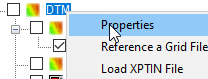\

# Re-sample TIN

Loading the TIN file does have a great benefit, you can get the Z value just by pointing your mouse at the location. However, it could slow down the model if the TIN file is too big. One alternative is to re-sample the source data so that its size is more manageable in XPSWMM.

======================================================================

======================================================================

# How to use rainfall interface file in XPSWMM

{
    "title": "How to use rainfall interface file in XPSWMM",
    "aid": "kA04U0000005OiHSAU_en_US_1.html",
    "software": "XPSWMM",
    "topic": "hydrology",
    "summary": "This technical guide explains the utilization of rainfall interface files in XPSWMM simulations. It outlines the historical usage of binary rainfall interface files, originally designed for SWMM, to efficiently store rainfall data in a compact format. The presentation demonstrates how to reference a *.rin file in XPSWMM, create a global rainfall data entry, and apply the input to subcatchments. It further explains converting the interface file using InterfaceUtils.exe, extracting non-zero rainfall values and recalculating time intervals into a usable format for long-term simulation scenarios, ensuring efficient data management within the modeling environment. The method streamlines rainfall data management."
}

- Product: XPSWMM
- Topic: hydrology

## Summary
This technical guide explains the utilization of rainfall interface files in XPSWMM simulations. It outlines the historical usage of binary rainfall interface files, originally designed for SWMM, to efficiently store rainfall data in a compact format. The presentation demonstrates how to reference a *.rin file in XPSWMM, create a global rainfall data entry, and apply the input to subcatchments. It further explains converting the interface file using InterfaceUtils.exe, extracting non-zero rainfall values and recalculating time intervals into a usable format for long-term simulation scenarios, ensuring efficient data management within the modeling environment. The method streamlines rainfall data management.

## Text

###   {#section .graf .graf--h3}

When running very long simulations in XPSWMM, you might find an rainfall interface file. A rainfall interface file is a quite old type of data format for rainfall, developed in the early days of SWMM. The main benefits of an rainfall interface file is that it can pack a lot of data in a very small file. It a binary file with only the rainfall data when it rained.

The downside of a rainfall interface file is that you cannot read the rainfall data directly, and you can not have any other type of rainfall data in a model if a rainfall interface file is used.

We'll cover the following topics in this article,

-   How to use a rainfall interface file in the model

-   How to convert a rainfall interface file to user input rainfall

### Use a rainfall interface file {#use-a-rainfall-interface-file .graf .graf--h3}

To use a rainfall interface file,

-   reference the \*.rin file

-   create a rainfall global data entry

{.graf-image} {.graf-image} {.graf-image} {.graf-image}

After that, you can reference the rainfall in your subcatchment.

{.graf-image}

### Convert a rainfall interface file {#convert-a-rainfall-interface-file .graf .graf--h3}

In some situations, you might want to use multiple sources of rainfall data or you only need a portion of the rainfall from the interface file. 

-   extract the time series from rainfall interface file 

-   create a global rainfall item using variable time step

Launch the InterfaceUtils.exe,

{.graf-image} {.graf-image}

This will create the csv file for rain gauge station 128187. As shown below, only the non-zero rainfall values are reported, and each row has its date, time and the time step duration and the rainfall intensity (in/hr)

{.graf-image}

To convert the table to a rainfall record in XPSWMM,

{.graf-image}

We'll get into the details how to convert the time intervals below,

time interval is the time from the start in minutes

-   start date is 1/1/1992 (1992001), (1992002--1992001)\*60\*24 is the minutes from 1/1/1992 to 1/2/1992 (1992002)

-   39600/60 is the minutes since the start of the day

-   and the total is the minutes since 1/1/1992 in minutes for the time step

duration is the time step length, it is 60 min for all the time step

rainfall is the intensity, the same as the interface file export

{.graf-image}

You can find the example on [GitHub](https://github.com/mel-meng/xpswmm/tree/master/models/rainfall_interface){.markup--anchor .markup--p-anchor target="_blank"}.

Base uses the RIN file, and converted scenario used the converted results.

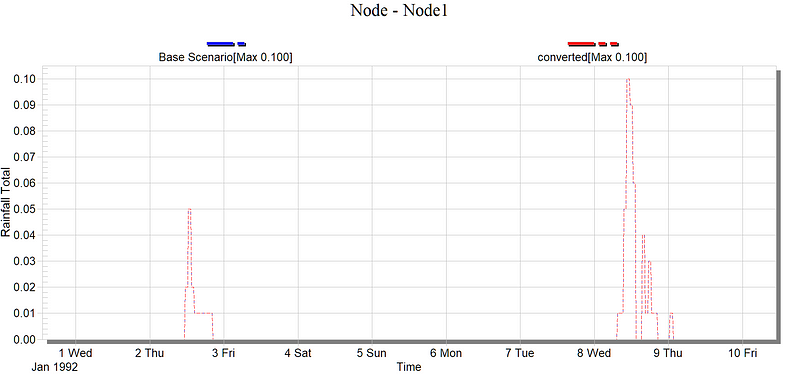{.graf-image}

 

======================================================================

======================================================================

# How to share XPSWMM models

{
    "title": "How to share XPSWMM models",
    "aid": "kA04U0000005OVWSA2_en_US_1.html",
    "software": "XPSWMM",
    "topic": "hydraulics",
    "summary": "The article explains best practices for sharing XPSWMM models. It details the use of the transmit model tool to archive models with all necessary external files, ensuring correct file path references. The guide emphasizes reviewing external file links such as hot restart, interface, rainfall, and gauged data files for accuracy. It also provides tips on organizing files and folders to avoid exporting unintended results, particularly when working with 2D settings where extra files might not be automatically included."
}

- Product: XPSWMM
- Topic: hydraulics

## Summary
The article explains best practices for sharing XPSWMM models. It details the use of the transmit model tool to archive models with all necessary external files, ensuring correct file path references. The guide emphasizes reviewing external file links such as hot restart, interface, rainfall, and gauged data files for accuracy. It also provides tips on organizing files and folders to avoid exporting unintended results, particularly when working with 2D settings where extra files might not be automatically included.

## Text

XPSWMM models work best in a single user environment, therefore, any time we need to sharer the model with someone else, we need to archive the model and send a copy.

In this article, we'll go over a quick summary of the common external files a model will use and a few recommendations on best practice of sharing the models.

### Using the Transmit Model tool {#using-the-transmit-model-tool .graf .graf--h3}

The best way to share a model in most cases is using the transmit model tool. Check the files you would like to be included and uncheck the ones you don't need. Then a zip file will be created with all the file paths correctly linked.

{.graf-image} {.graf-image}

When another user receives the zip file, just unzip it, and open up the \*.xp model, the included external files should be correctly referenced.

### Review referenced files {#review-referenced-files .graf .graf--h3}

When using the transmit tool, it is a good practice to review the files listed in the window.

-   make sure all the external files are used, outdated files should be removed

-   make sure all the external files are saved in an appropriate location that will not be deleted

Most of the files included can be located in the layer tree panel.

{.graf-image}

Hot Restart file can be access through the HDR settings,

{.graf-image}

Interface file can be accessed through the configuration menu.

{.graf-image}

Rainfall file is defined in Global data

{.graf-image}

Gauged data file is defined for the node

{.graf-image}

### Tips for transmitting a model {#tips-for-transmitting-a-model .graf .graf--h3}

When exporting results, it is highly recommended to make sure there are no other models in the same folder, otherwise, XPSWMM will also export the results from other models. To get around this situation,

-   create a new folder for the model

-   save the model as a new model in the new folder

-   run the model to get the results

-   now you can transmit the model with only its own results in the zip file

Most of the externally referenced files in the 2D settings are not automatically included in the transmit zip file. If they are used, the user need to send additional instructions on how to link to these files.

{.graf-image} {.graf-image}

 

======================================================================

======================================================================

# What is a hot-restart file in XPSWMM

{
    "title": "What is a hot-restart file in XPSWMM",
    "aid": "kA04U0000005ORxSAM_en_US_1.html",
    "software": "XPSWMM",
    "topic": "hydraulics",
    "summary": "The article explains the concept and use of hot-restart files in XPSWMM, which allow users to preserve and reapply initial conditions in hydraulic simulations. It describes scenarios where starting with water present (hot) is crucial to avoid issues encountered with dry starts, such as altered results, extended run times, or model instability. The piece outlines different use cases for hot-restart files: starting cold and creating a file for future runs, starting hot using an existing file, or starting hot while creating a new file. It also stresses the importance of updating the file when significant model changes occur."
}

- Product: XPSWMM
- Topic: hydraulics

## Summary
The article explains the concept and use of hot-restart files in XPSWMM, which allow users to preserve and reapply initial conditions in hydraulic simulations. It describes scenarios where starting with water present (hot) is crucial to avoid issues encountered with dry starts, such as altered results, extended run times, or model instability. The piece outlines different use cases for hot-restart files: starting cold and creating a file for future runs, starting hot using an existing file, or starting hot while creating a new file. It also stresses the importance of updating the file when significant model changes occur.

## Text

{.graf-image}

Before getting into what is a hot restart file, let's go through a few scenarios to get the context.

When the simulation starts unless we provide additional information of the water level in the nodes and pipes, the model will start dry without any water in the system. For most of the storm sewer system, this is the correct starting condition.

However, for sewer systems or storm systems that constantly having flow in the system. The assumption of starting with a dry system can lead to several issues,

1.  the existing water in the system as the run starts might has significant impact on the results. The results could look quite different.

2.  to overcome the above limitation we might need to warm up the system by running the simulation long before the event we are mostly interested. However, this will greatly increase the run time.

3.  another less common situation is for certain tricky system, starting dry might get the model unstable. Therefore, starting from a slightly wet condition might get the model over that initial instability

As the above discussion shows, getting the correct initial condition of a system can be critical. Rather than manually set the initial depth of each node, we can simply run the model and save the state of all the water levels, etc. when the simulation ends. This is the idea behind hot restart file, 

-   hot: the system already has flow in it, no longer dry

-   cold: the system is dry, no data from a previous run are used to warm up the system

Now if we go to the [online help](https://help.innovyze.com/display/xps/Hydraulics+Mode+Job+Control#HydraulicsModeJobControl-HotRestartHotRestart%28REDO%29){.markup--anchor .markup--p-anchor target="_blank"}, we can find more details on how to set it up..

### Hot Restart {#hot-restart .graf .graf--h3}

A hot restart facility allows a file to be read and/or created to establish initial conditions for a run. This may avoid re-running of, for example, dry-weather flow conditions prior to the start of a storm runoff simulation.

{.graf-image}

The user can create a hot start file from a normal run or from a previous hot start run. Only one hot start file can be created.

**Start Cold, Create Hot-Start File**

*Use case: create a hot-restart file for the future runs so that you don't need to start the model a few days before the event to warm it up.*

If this option is selected then the model does not use a hot restart file to set initial conditions and creates a hot restart file for the next simulation run.

#### Start Hot Using Hot-Start File {#start-hot-using-hot-start-file .graf .graf--h4}

*Use case: already have the initial condition simulated in a previous run, just need to start hot from it.*

If this option is selected then the model uses a hot start file to set initial conditions and does not create a new hot restart file for the next simulation run.

#### Start Hot, Create New Hot-Start File {#start-hot-create-new-hot-start-file .graf .graf--h4}

*Use case: you might have a very long continuous simulation that you are breaking into a few more manageable runs. So you start with the hot-restart file from a previous run, but you'll need to save the end state for the next run.*

If this option is selected then the model uses a hot restart file to set initial conditions and then creates a new hot restart file for the next simulation run.

### Import Tip: update hot-restart file when needed {#import-tip-update-hot-restart-file-when-needed .graf .graf--h3}

If you read the 1D log, you'll notice this section below. The XPSWMM engine uses internal IDs, which is unique for each model. Since the hot-restart file is implemented at engine level, the data are referenced only using internal IDs.

Any time you make significant changes to your model, the internal IDs might change for the node and it could cause problems. 

{.graf-image}

Therefore, it is a good idea to update your hot-restart file any time you make significant changes to your model.

======================================================================

======================================================================

# How to import multi-link from a table into XPSWMM

{
    "title": "How to import multi-link from a table into XPSWMM",
    "aid": "kA04U0000005OQ8SAM_en_US_1.html",
    "software": "XPSWMM",
    "topic": "hydraulics",
    "summary": "This article explains how to import multi-link data from a table into XPSWMM, focusing on a unique feature exclusive to the software. It covers the process of setting up a connection to an Excel table, mapping key columns (such as multi-link name and individual channel names), and executing the import/export function. It also provides helpful tips for testing the mapping with simple models and links to additional resources and a sample model on GitHub."
}

- Product: XPSWMM
- Topic: hydraulics

## Summary
This article explains how to import multi-link data from a table into XPSWMM, focusing on a unique feature exclusive to the software. It covers the process of setting up a connection to an Excel table, mapping key columns (such as multi-link name and individual channel names), and executing the import/export function. It also provides helpful tips for testing the mapping with simple models and links to additional resources and a sample model on GitHub.

## Text

XPSWMM has many ways to bring external data into the model. Most of them can be accessed through the **Import/Export Data**

{.graf-image}

For GIS files, most of the import/export tools can be accessed by right click the item in the layer tree panel.

{.graf-image}

### What is Multi-link {#what-is-multi-link .graf .graf--h3}

[Multi-link](https://help.innovyze.com/display/xps/Multiple+Conduits+or+Diversion+Links){.markup--anchor .markup--p-anchor target="_blank"} is XPSWMM specific feature no other software offers. Multi-link is used for two situations,

-   parallel pipes between two nodes, a common one is dual drainage, a pipe and the street section that both convey storm water

-   pumps, weir, orifice and other diversion structures

Multi-link presents a challenge when importing data from external sources, because in XPSWMM muli-link is treated as a group entity with multiple children, however, usually the data in the external source are not grouped. Therefore, importing multi-link from external sources will require a slightly different process.

Before getting into the steps of importing multi-link, modelers who are building dual drainage system might also want to check the [dual drainage automation tool](https://innovyze.force.com/support/s/article/How-to-setup-dual-drainage-in-XPSWMM){.markup--anchor .markup--p-anchor target="_blank"}, which might be a more intuitive way of building drainage system.

### Import/Export External Databases {#importexport-external-databases .graf .graf--h3}

To import/export multi-link data with external data, use the tool below.

{.graf-image}

Create a new connection to an excel table.

{.graf-image}

For a two way import/export, you can set it up like this,

{.graf-image}

The last step is to map the key columns in the table so that XPSWMM knows how to import each row. Make sure,

-   Link Name is the multi-link name

-   Channel/Conduit is the name of the individual pipe/channel

{.graf-image}

Next, set up the mapping for the values to be imported.

{.graf-image}

When the mapping is done, use the Import/Export button to get the data into or out of XPSWMM.

 

{.graf-image}

You can find the sample model on [GitHub](https://github.com/mel-meng/xpswmm/tree/master/models/multi_link){.markup--anchor .markup--p-anchor target="_blank"}.

### TIPS {#tips .graf .graf--h3}

Figuring out the field mapping can be tricky, it will take some trial and error. Therefore, it is highly recommended started with a very simple model and a sample table with just a handful rows to test the mapping before working with the full dataset.

 

======================================================================

======================================================================

# How to batch import rainfall into XPSWMM

{
    "title": "How to batch import rainfall into XPSWMM",
    "aid": "kA04U0000005OIkSAM_en_US_1.html",
    "software": "XPSWMM",
    "topic": "hydraulics",
    "summary": "This article provides a step-by-step guide on how to batch import rainfall data into XPSWMM using the XPX exchange format. It explains how to create a template rainfall entry within the global database, export the data to XPX, compare the XPX commands with the user interface, and automate the data conversion using Excel. The process is illustrated with screenshots and example files available on GitHub, ensuring that users can streamline the import process and verify the model performance before full implementation."
}

- Product: XPSWMM
- Topic: hydraulics

## Summary
This article provides a step-by-step guide on how to batch import rainfall data into XPSWMM using the XPX exchange format. It explains how to create a template rainfall entry within the global database, export the data to XPX, compare the XPX commands with the user interface, and automate the data conversion using Excel. The process is illustrated with screenshots and example files available on GitHub, ensuring that users can streamline the import process and verify the model performance before full implementation.

## Text

Manually getting a large number of rainfalls into XPSWMM can take quite some time. In this article we will show the step by step instruction on using the XPX exchange format to import rainfall data.

Major steps are,

1.  manually create one template rainfall global database entry

2.  export the rainfall to XPX format

3.  review the format of the XPX data and develop the steps to convert the source data to the XPX commands

4.  automate the conversion

### Create template rainfall in XPSWMM

Start with a new model and add the rainfall into the global data.

 

Then enter the data, it is important to review the data and correct any errors identified.

It is also a good practice to setup a simple model and make sure the rainfall is generating expected results before moving ahead to automate the import process. As shown below, a single node RNF model is developed to make sure the response is reasonable.

### Export to XPX

Use the export to XPX tool to generate the XPX file for the template rainfall data entry.

We only need to export the rainfall, so we can turn off everything else.

### Map data to the XPX Commands

As shown in the comparison of the XPX and the user interface,

1.  the XPX commands for each rainfall consist many rows of command, each command set one of the parameters. The syntax is quite easy to understand, refer to the [global database commands](https://help.innovyze.com/display/xps/XPX+Format+File#XPXFormatFile-GLDB){target="_blank"} for more details.

2.  most of the commands are the same for different rainfalls, the only thing that changes are, the name of the rainfall, the 3 columns of the rainfall data

With that understanding, we can develop an automated process below,

1.  prepare the input data: a table with 3 columns of the rainfall data, and a name for the profile

2.  prepare a template with all the commands and place holders for 3 rows of data and the name of the rainfall profile

3.  replace the placeholders in the template with the values of the profile

4.  repeat for each profile

I'll show an example using excel. 

### Excel Example

You can find the files on [GitHub](https://github.com/mel-meng/xpswmm/tree/master/models/rainfall_xpx){target="_blank"}.

In the example excel file, we add the source data in the "test_rainfall" tab, it has 3 columns and should be ordered as shown below. The order is hard coded, if you need to change the order, modify the formula accordingly.

The conversion is done in the template tab.

The only input is cell E1, the tab name of the data source. The following rows 2--6 calculates the number of rows and the ranges of each column.

Next section is the template of the XPX commands, the tricky part is to make sure all the quotes are included.

All the orange cells are placeholders that are updated from the source data.

The next step is to select all the green cells, copy and paste it into a text file.

And then import it into XPSWMM.

 

This example shows how to create one profile from the source data. To batch convert the data, more advanced programming might be needed, and in a future article, we'll see how we can use python to automate such tasks.

 

 

======================================================================

======================================================================

# How to setup outfall stage boundary condition as a time series in XPSWMM?

{
    "title": "How to setup outfall stage boundary condition as a time series in XPSWMM?",
    "aid": "kA04U0000005OI5SAM_en_US_1.html",
    "software": "XPSWMM",
    "topic": "hydraulics",
    "summary": "This article details the process of setting up an outfall stage boundary condition as a time series within the XPSWMM software. It provides step-by-step guidance along with visual aids to help users input time series data for dynamic boundary condition simulation, ensuring accurate representation of changing outfall stage conditions."
}

- Product: XPSWMM
- Topic: hydraulics

## Summary
This article details the process of setting up an outfall stage boundary condition as a time series within the XPSWMM software. It provides step-by-step guidance along with visual aids to help users input time series data for dynamic boundary condition simulation, ensuring accurate representation of changing outfall stage conditions.

## Text

======================================================================

======================================================================

# How to get detailed simulation information for river reaches in XPSWM

{
    "title": "How to get detailed simulation information for river reaches in XPSWM",
    "aid": "kA04U0000005O8wSAE_en_US_1.html",
    "software": "XPSWMM",
    "topic": "hydraulics",
    "summary": "This article demonstrates how to extract detailed simulation information for river reaches using advanced features in XPSWMM. It explains how to access 1D log data that details river reach geometry, hydraulic parameters, conveyance curves, and flow conditions. It also guides the user on printing simulation details to the output file or exporting them to a CSV file via configuration parameters, offering advanced users insights into the underlying hydraulic calculations."
}

- Product: XPSWMM
- Topic: hydraulics

## Summary
This article demonstrates how to extract detailed simulation information for river reaches using advanced features in XPSWMM. It explains how to access 1D log data that details river reach geometry, hydraulic parameters, conveyance curves, and flow conditions. It also guides the user on printing simulation details to the output file or exporting them to a CSV file via configuration parameters, offering advanced users insights into the underlying hydraulic calculations.

## Text

###   {#section .graf .graf--h3}

XPSWMM has a few "secret" tools for advanced users who really need to look under the hood to see how the engine does its calculations. In this article, we'll show a few tips for getting very detailed information about river reaches geometry, hydraulic characteristics, and simulation results.

### 1D Log {#d-log .graf .graf--h3}

1D log has lots of detailed information for each river reach in the model. You can find the geometry summary with length, max. areas.

{.graf-image}

In Table E15, you can find the water volume.

{.graf-image}

In Table E14, detailed channel summary

{.graf-image}

In table Conduit Volume, you can find the total volume of all the pipes in the model.

{.graf-image}

### Conveyance Curve {#conveyance-curve .graf .graf--h3}

To get detailed conveyance curve for each channel, check the "Echo Natural Section Data". Then you will find the data in the 1D log.

{.graf-image}

The conveyance curve used for routing flow through each river reach is printed in the 1D log as shown below.

{.graf-image}

### Flow Details for river reaches {#flow-details-for-river-reaches .graf .graf--h3}

To print the details of the river reach simulation results, check the "Print Flow Details" for each river reach,

{.graf-image}

Then in the output control, we can specify how often to print out the details.

{.graf-image}

In the 1D log, detailed flow condition for the selected river reach is printed.

{.graf-image}

### Export the results into a CSV file {#export-the-results-into-a-csv-file .graf .graf--h3}

use the configuration parameter EXTERNAL_CSV to direct the results to a csv file instead of the output file.

{.graf-image}

The detailed flow information will be directed to a csv file in the 1D results folder,

{.graf-image}

 

 

======================================================================

======================================================================

# How to change the time step for reported results in XPSWMM?

{
    "title": "How to change the time step for reported results in XPSWMM?",
    "aid": "kA04U0000005O4GSAU_en_US_1.html",
    "software": "XPSWMM",
    "topic": "hydraulics",
    "summary": "This article explains how to adjust the reported results time step in XPSWMM. It provides instructions for modifying the time interval for runoff outputs, noting that the time step cannot be changed for time series exports from the view results window. Additionally, the article details steps to adjust the time step for hydraulics results, accompanied by illustrative images."
}

- Product: XPSWMM
- Topic: hydraulics

## Summary
This article explains how to adjust the reported results time step in XPSWMM. It provides instructions for modifying the time interval for runoff outputs, noting that the time step cannot be changed for time series exports from the view results window. Additionally, the article details steps to adjust the time step for hydraulics results, accompanied by illustrative images.

## Text

For runoff results, the following will change how it is printed in the output file. However, the time interval cannot be changed for the time series  when exported from view results window.\

\

\

\

For hydraulics results,\

======================================================================

======================================================================

# How to use gauged inflow in XPSWMM

{
    "title": "How to use gauged inflow in XPSWMM",
    "aid": "kA04U000000QOcISAW_en_US_1.html",
    "software": "XPSWMM",
    "topic": "hydraulics",
    "summary": "This article explains how to use gauged inflow in XPSWMM by importing flow data from a text (CSV) file. It details the process of preparing your data with proper columns for date, time, flow, and station information. The guide walks through steps to enable gauged inflow, set the appropriate file format, map your data columns, and review the configuration using the XPTable. Additionally, it discusses the use of the Transmit Model tool to package external files with your model for sharing."
}

- Product: XPSWMM
- Topic: hydraulics

## Summary
This article explains how to use gauged inflow in XPSWMM by importing flow data from a text (CSV) file. It details the process of preparing your data with proper columns for date, time, flow, and station information. The guide walks through steps to enable gauged inflow, set the appropriate file format, map your data columns, and review the configuration using the XPTable. Additionally, it discusses the use of the Transmit Model tool to package external files with your model for sharing.

## Text

Gauged inflow can bring in flow data saved in text file as the data source into XPSWMM. This option is flexible and easy to understand. Unless you are dealing with very large dataset, this should be the preferred option.

### Prepare

To setup gauged inflow, first prepare your flow data in a text format. CSV is a good format since it is supported by Excel. The csv file should have the following information,

-   Date and Time: it can be one or several columns

-   Flow: the flow field

-   Station: the station field, you can have multiple flow time series saved in the same file.

As shown below,

1.  check "Gauged Inflow"

2.  Select a "File Format", and the station name

3.  Define the "File Format"

4.  Map each column, for date time fields define the format

### Review

It is recommended to setup an XPTable to review your settings,

1.  check the variables

2.  bring in all the "Gauged Input Data" columns

3.  Bring in the flag of gauged flow

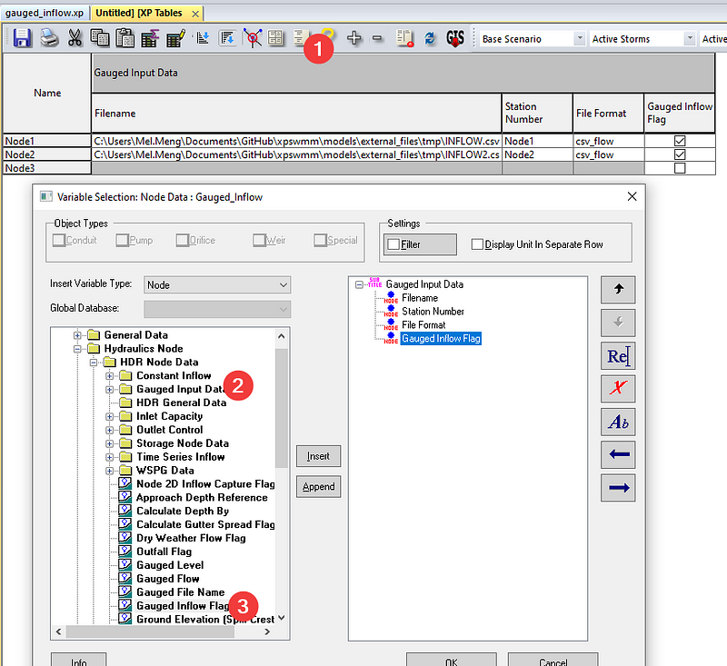

### Package

One of the drawbacks of using external files is that the modeler needs to package the external files with the model when sharing with other people. XPSWMM made it easy with the transmit model tool. The "Transmit Model" tool will check the external sources and package the files in the zip file.

The sample model can be downloaded from [Github](https://github.com/mel-meng/xpswmm/blob/master/models/external_files/gauged_inflow.zip){target="_blank"}.

======================================================================

======================================================================

# Why my encript file for view is greyed out in XPSWMM

{
    "title": "Why my encript file for view is greyed out in XPSWMM",
    "aid": "kA04U000000QOZySAO_en_US_1.html",
    "software": "XPSWMM",
    "topic": "licensing",
    "summary": "The article explains that the grayed-out encrypted view file in XPSWMM is most likely caused by an inactive or missing license. It guides users to consult the License Troubleshooting Guide and to run the XPDiagnostic tool from the installation folder (specific instructions provided for the 2019.1 version), ensuring that the dongle serial number matches the license file. The instructions emphasize that activating the XP Viewer Creator license is necessary for full functionality."
}

- Product: XPSWMM
- Topic: licensing

## Summary
The article explains that the grayed-out encrypted view file in XPSWMM is most likely caused by an inactive or missing license. It guides users to consult the License Troubleshooting Guide and to run the XPDiagnostic tool from the installation folder (specific instructions provided for the 2019.1 version), ensuring that the dongle serial number matches the license file. The instructions emphasize that activating the XP Viewer Creator license is necessary for full functionality.

## Text

Most likely it is because you don\'t have the required license. For more information about checking the license go to:\

https://help.innovyze.com/display/xps/License+Troubleshooting+Guide\

 

For the 2019.1 versions, go to the installation folder: C:\\Program Files\\Innovyze\\xpswmm2019.1.2_x64. Then run the XPDiagnostic tool shown below:

{.confluence-embedded-image style="margin: 0px 2px;padding: 0px;border: 0px;cursor: pointer;display: block;max-width: calc(100% - 4px);"}

 

The top section shows the dongle serial number, the four digit number, which should match the bottom results from the \*.xcf file.

{.confluence-embedded-image style="margin: 0px 2px;padding: 0px;border: 0px;cursor: pointer;display: block;max-width: calc(100% - 4px);"}\

As shown above,\

XP Viewer Creator license needs to be turned on for the functionality.

======================================================================

======================================================================

# How to get the missing 2D Model layers back in XPSWMM?

{
    "title": "How to get the missing 2D Model layers back in XPSWMM?",
    "aid": "kA04U000000QOZoSAO_en_US_1.html",
    "software": "XPSWMM",
    "topic": "2D modeling",
    "summary": "The article explains how to restore missing 2D model layers in XPSWMM by guiding users through checking their configuration settings and license type. It advises users to ensure that the Stormwater option is enabled instead of a Sanitary Sewer configuration, and to verify that the 1D sewer option is not mistakenly checked. If configurations are incorrect or licensing issues occur, users are encouraged to contact support for resolution."
}

- Product: XPSWMM
- Topic: 2D modeling

## Summary
The article explains how to restore missing 2D model layers in XPSWMM by guiding users through checking their configuration settings and license type. It advises users to ensure that the Stormwater option is enabled instead of a Sanitary Sewer configuration, and to verify that the 1D sewer option is not mistakenly checked. If configurations are incorrect or licensing issues occur, users are encouraged to contact support for resolution.

## Text

If your **2D Model** layers are suddenly gone from your layers panel, there are a few things you can check.

{.graf-image}

You are either in a Sanitary Sewer Configuration or your license is Sanitary only.

Check your Configuration below to make sure **Stormwater** is checked.

{.graf-image}

Check your license and make sure your 1D sewer is not checked, if it is checked by mistake please contact the support team to resolve the license issue.

{.graf-image}

 

======================================================================

======================================================================

# How to fix the missing node/link plots in XPSWMM when reviewing results?

{
    "title": "How to fix the missing node/link plots in XPSWMM when reviewing results?",
    "aid": "kA04U000000QODYSA4_en_US_1.html",
    "software": "XPSWMM",
    "topic": "hydraulics",
    "summary": "The article provides a troubleshooting tip for when node and link plots are missing in XPSWMM results. It advises ensuring that the specific parameter to be plotted is activated, even if all other system checks seem normal. Screenshots are provided to guide users through verifying and adjusting the settings."
}

- Product: XPSWMM
- Topic: hydraulics

## Summary
The article provides a troubleshooting tip for when node and link plots are missing in XPSWMM results. It advises ensuring that the specific parameter to be plotted is activated, even if all other system checks seem normal. Screenshots are provided to guide users through verifying and adjusting the settings.

## Text

When everything seems to be fine, but the results just won\'t show up.\

\

\

\

Make sure the parameter to be plotted is turned on.\

\

\

 

======================================================================

======================================================================

# How to remove standing water in dual drainage in XPSWMM?

{
    "title": "How to remove standing water in dual drainage in XPSWMM?",
    "aid": "kA04U000000QOCtSAO_en_US_1.html",
    "software": "XPSWMM",
    "topic": "hydraulics",
    "summary": "The article addresses an issue in XPSWMM where standing water accumulates at an inlet in dual drainage systems. The problem occurs when a drainage link directs flow to an inlet lacking a downstream street link, causing water to persist. Two solutions are offered: disable the problematic inlet or add a downstream street section to dissipate the water. The article also provides screenshots and a link to sample models on GitHub for further review."
}

- Product: XPSWMM
- Topic: hydraulics

## Summary
The article addresses an issue in XPSWMM where standing water accumulates at an inlet in dual drainage systems. The problem occurs when a drainage link directs flow to an inlet lacking a downstream street link, causing water to persist. Two solutions are offered: disable the problematic inlet or add a downstream street section to dissipate the water. The article also provides screenshots and a link to sample models on GitHub for further review.

## Text

Standing Water on top of Inlet for Dual Drainage\

\

XPSWMM simulates standing water on top of the inlet when a dual drainage link is draining to an inlet without any street links downstream\

\

As shown below, the water rises at the inlet and never falls. And the profile shows standing water on the downstream section of the street.\

\

\

\

\

\

This can be resolved by,

-   Disable the inlet

-   Add a street section downstream

\

\

\

sample models can be downloaded from [github](https://github.com/mel-meng/xpswmm/tree/master/models/dual_drainage/inlet_issues){target="_blank"} .\

\

 

======================================================================

======================================================================

# How to run hydraulics and runoff simultaneously in xpswmm

{
    "title": "How to run hydraulics and runoff simultaneously in xpswmm",
    "aid": "kA04U000000QN0sSAG_en_US_1.html",
    "software": "XPSWMM",
    "topic": "hydraulics",
    "summary": "The article explains how to run hydraulics and runoff simultaneously in XPSWMM by removing outdated interface file references. It guides users through steps to update models with modern processes: first eliminating the need for interface files, then configuring the setup to solve runoff and hydraulics modes together, and finally executing both modes concurrently. The instructions help update older models and improve efficiency by leveraging the enhanced capabilities of current computing power."
}

- Product: XPSWMM
- Topic: hydraulics

## Summary
The article explains how to run hydraulics and runoff simultaneously in XPSWMM by removing outdated interface file references. It guides users through steps to update models with modern processes: first eliminating the need for interface files, then configuring the setup to solve runoff and hydraulics modes together, and finally executing both modes concurrently. The instructions help update older models and improve efficiency by leveraging the enhanced capabilities of current computing power.

## Text

For the majority of XPSWMM models, we should no longer use the interface files when generating runoff from rainfall and then route the flow through pipes. It was a feature that was used in the swmm3, swwm4 era when computer was not powerful enough (see [this article](https://innovyze.force.com/support/s/article/How-to-load-external-flow-from-interface-file-in-XPSWMM){target="_blank"} for more details.). The support for interface files is mostly for backward compatibility, and should be avoided when updating an old model or setup new models.\

 \

Below are the procedures to remove interface files and run the runoff and hydraulics mode simultaneously.\

 \

 

# Step 1 Remove the references to interface files

 \

\

 

# Step 2 Solve Runoff & Hydraulics Mode Simultaneously

 \

\

 

# Step 3 Run both modes

\

 

======================================================================

======================================================================

# How to import cad file into XPSWMM

{
    "title": "How to import cad file into XPSWMM",
    "aid": "kA04U000000QO4oSAG_en_US_1.html",
    "software": "XPSWMM",
    "topic": "hydraulics",
    "summary": "The article explains how to import CAD files into XPSWMM by first loading the CAD file as a background, then importing its layers into the model, and finally addressing common connectivity issues by manually cleaning up extra nodes. It includes step-by-step instructions with screenshots to help users integrate CAD data effectively into their hydraulic models."
}

- Product: XPSWMM
- Topic: hydraulics

## Summary
The article explains how to import CAD files into XPSWMM by first loading the CAD file as a background, then importing its layers into the model, and finally addressing common connectivity issues by manually cleaning up extra nodes. It includes step-by-step instructions with screenshots to help users integrate CAD data effectively into their hydraulic models.

## Text

A common model building task is importing CAD files into XPSWMM.

Import CAD files is a little different from importing other type of external files. It starts with loading the CAD file as a background.

{.graf-image} {.graf-image}

Once the CAD file is loaded we can import the layer into the model.

{.graf-image} {.graf-image}

It is common to have connectivity issues after the data is imported. As shown below, manual clean up might be needed to remove extra nodes to fix the connectivity.

{.graf-image}

 

======================================================================

======================================================================

# Troubleshooting unstable 1D models in XPSWMM

{
    "title": "Troubleshooting unstable 1D models in XPSWMM",
    "aid": "kA04U000000QMeGSAW_en_US_1.html",
    "software": "XPSWMM",
    "topic": "hydraulics",
    "summary": "The article explains the causes of numerical instability in 1D hydraulic models using dynamic and kinematic wave routing in XPSWMM. It outlines common issues such as boundary condition problems, challenging flow conditions (e.g., surcharged pipes, hydraulic jumps), and improper engine settings like time step choices. The article recommends detailed checks including visualizations via hydrographs and HGL animations, reviewing iteration tables, and adjusting model parameters (e.g., pipe segmentation, time steps, Preissmann slot width) to resolve instability. It emphasizes an iterative troubleshooting approach to ensure that simulation results align with the modeling objectives."
}

- Product: XPSWMM
- Topic: hydraulics

## Summary
The article explains the causes of numerical instability in 1D hydraulic models using dynamic and kinematic wave routing in XPSWMM. It outlines common issues such as boundary condition problems, challenging flow conditions (e.g., surcharged pipes, hydraulic jumps), and improper engine settings like time step choices. The article recommends detailed checks including visualizations via hydrographs and HGL animations, reviewing iteration tables, and adjusting model parameters (e.g., pipe segmentation, time steps, Preissmann slot width) to resolve instability. It emphasizes an iterative troubleshooting approach to ensure that simulation results align with the modeling objectives.

## Text

# What is model instability?

Due to the explicit nature of the numerical methods used for Dynamic Wave routing (and to a lesser extent, Kinematic Wave routing), the flows in some links or water depths at some nodes may fluctuate or oscillate significantly at certain periods of time as a result of numerical instabilities in the solution method. SWMM does not automatically identify when such conditions exist, so it is up to the user to verify the numerical stability of the model and to determine if the simulation results are valid for the modeling objectives ([Chapter 8.4 of EPA SWMM User Manual](https://www.epa.gov/sites/production/files/2019-02/documents/epaswmm5_1_manual_master_8-2-15.pdf){target="_blank"}).\

 \

Time series plots at key locations in the network can help identify such situations as can a scatter plot between a link's flow and the corresponding water depth at its upstream node. Numerical instabilities can occur over short durations and may not be apparent when time series are plotted with a long-time interval. When detecting such instabilities, it is recommended that a reporting time step of 1 minute or less be used, at least for an initial screening of results.\

 

# Common source of instability

Instability usually is the result of dramatic change in the calculation, common sources are,

-   Challenging hydraulic conditions, flow over bumps, e.g. error in pipe invert to be above manhole invert

-   Hydraulic jumps, great slope changes between pipes

-   Complicated controls, complicated controls might have unintended side effects on the hydraulic routing results

-   Switch of numerical solutions, pipe surcharged vs gravity flow, nodes overflowing vs not overflowing, river flowing over the bank, structures switching flow mode (weir flow vs orifice flow, etc)

 

# Troubleshoot instability

First step is to identify the pipe or node that is causing the instability.\

 \

By tracing the instability upstream by checking the hydrograph we can quickly narrow down the areas that might cause it. Playing the HGL animation can also be a good way to quickly visualize the problem, the HGL will jump up and down at the nodes with instability issues.\

 \

Another way to quickly narrow down onto problematic nodes is to review table E8. Review junctions with very high number of not converged iterations, and total iterations, etc.\

![Table E8 Not Convi Convr Conv e 11 Ome ga Cng Max Itern Junction Time Step Limitation Summary Number of times this Junction did not converge during the simulation. Average Junction iterations. Mean convergence . Change of omega during iterations Maxime-am number of iterations Jun c on Nodeg6Y3 Nodeg700 Nodeg701 Nodeg702 Nodeg703 Nodeg704 Nodeg70S Nodeg706 Nodeg708 Nodeg70g ot Convi Avg Convi Total ICC Ome ga Cng Max 5022 2.36 2.72 2 . 32 2.54 2.58 24.41 2.78 2 12 . 71 . 47 04 14 68 292671 403322 464203 4340\" 421673 44041S 519346 2072257 970158 474305 Ice rn 450 sol 429 sol 480 493 sol sol sol 236 ICCrn 4 40 Ills 4035 3976 1485 2050 2754 7966 15241 13335 14857 3866 ICC rn 310 478 498 486 439 662 1434 14325 12171 4279 296 ICC rn 204 114 188 313 13560 11221 1271](./img/kA04U000000QMeGSAW_en_US_1_0.png)\

 \

 \

 \

Due to the complexity involved in the numerical methods, troubleshooting instability is an iterative process of identifying possible sources.\

Once the source is identified, we should go through this checklist,

-   Make sure the input is correct, no errors

-   Is there a smooth flow path through the area, if not what might make the flow condition more challenging?

-   Is the instability caused by switching mode? E.g. overflowing, surcharging, etc.

-   Is there a boundary condition that might be causing it? Level, flow, etc.

-   Any special controls might be causing it?

-   Any model settings might cause it?

 \

We\'ll discuss each of them in more details below.\

 

## Boundary condition

-   Will the boundary condition cause any instability issues? For example, high water level will backflow into the system. Frequent changes in boundary water levels. Try a constant boundary condition to see if it solves it.

-   Is the model initialized properly so that the initial boundary condition won't cause stability issues? Initial depth or hot-restart file might be used.

 

## Challenging flow conditions

For example,

-   Manholes overflows

-   Pipe surcharges

-   Overflow structure activation

-   Flow line not smooth, removing the interruptions of the flow line usually will fix this type of problem

    -   Bumps, pipe invert higher than manhole invert

    -   Pipes with great slope changes (hydraulic jump might happen), if the pipe is too long and cannot accurately capture where the hydraulic jump happens, divide it into smaller segments.

    -   Channel with dramatic cross section changes, roughness changes

-   Long pipes. XPSWMM route flow at pipe level without internal calculation points, and it assumes the flow condition within the pipe should be very similar across the full length of the pipe. Therefore, when the pipe is too long, and significant flow changes is expected within the pipe, the engine will have trouble to accurately simulate the flow, and in such situation the pipes should be divided into shorter pipes, especially for large diameter pipes, and a length of a few hundred feet is recommended.

 \

In some cases, instability will be the expected behavior, thus it is the modeler's responsibility to adjust the model to support the design goals. Maybe the modeler should increase the losses of the pipe so that it stayed in the surcharge condition during the simulation, which will result a more conservative result.\

 

## Engine Settings

 \

Sometimes, it could be the settings of the engine that is the source of the instability.\

 \

If the time step is too long to capture the flow changes, it could lead to instability issues. Sometimes a time step of 1 second might be needed. It should also be noted that too short a time step might also cause stability issues.\

 \

Using Table E7 in the 1D log we can get a report on the time steps. As shown in the example below, the average and smallest time step is 1 second, so a time step close to 1 second might be a better choice.\

\

 \

As shown below, the stability issue can be resolved by change the time step from 60 sec to 10 sec.\

\

\

\

\

 \

When a pipe length is shorter than the wave can travel in a time step, it can lead to instabilities. Adjust the time step or make the short pipe longer to avoid this situation.\

If needed using [Configuration Parameters](https://help.innovyze.com/display/xps/The+Configuration+Menu#TheConfigurationMenu-ConfigurationParameters){target="_blank"} to override default min. length and time step with MINLEN and MIN_TS.

> ***MIN_TS***

> Allows the user to set the minimum time step for the Hydraulics solution. The default is 1 second. Example, MIN_TS=0.2 will allow the program to lower the time step in the hydraulic solution down to 0.2 seconds if the simulation warrants that detail.

> *SPATIAL*

> Change spatial conduit weighting to 0.50 upstream, 0.5 downstream. Default is 0.55 upstream, 0.45 downstream.

Alter the Preissmann Slot size to change the behavior when pipes are surcharged, WSLOT1 for example makes it larger

> *WSLOT*

> Slot width in the Preissmann slot = 0.005 × conduit width.

> Note: The WSLOT is set by default, so the slot defaults to a 0.5% width.

> ***WSLOT1***

> Slot width in the Preissmann slot = 0.01 × conduit width.

> *WSLOT2*

> Slot width in the Preissmann slot = 0.001 × conduit width.

 

\

\

       {.graf-image}

 

\

You might also find [overwriting default settings](https://help.innovyze.com/display/xps/Hydraulics+Mode+Job+Control#HydraulicsModeJobControl-SimulationTolerances){target="_blank"} useful.\

\

 

======================================================================

======================================================================

# How to get the storage summary report in XPSWMM

{
    "title": "How to get the storage summary report in XPSWMM",
    "aid": "kA04U000000QNpESAW_en_US_1.html",
    "software": "XPSWMM",
    "topic": "hydraulics",
    "summary": "The article explains how to access the storage summary report in XPSWMM. It highlights that calculating the storage volume from a storage curve can be challenging due to the use of frustum formulas. The report, found in the 1D data under Table E4 titled 'Variable storage data for node', provides storage volumes for each point on the storage curve. Screenshots are included to guide users through the process."
}

- Product: XPSWMM
- Topic: hydraulics

## Summary
The article explains how to access the storage summary report in XPSWMM. It highlights that calculating the storage volume from a storage curve can be challenging due to the use of frustum formulas. The report, found in the 1D data under Table E4 titled 'Variable storage data for node', provides storage volumes for each point on the storage curve. Screenshots are included to guide users through the process.

## Text

Calculating the storage volume from a storage curve turned out to be not so straight forward, most people will not remember the [Frustum](https://en.wikipedia.org/wiki/Frustum#:~:text=In%20geometry%2C%20a%20frustum%20%28plural,right%20pyramid%20or%20right%20cone.){.markup--anchor .markup--p-anchor target="_blank"} formulas after high school.

XPSWMM reports the storage volume at each storage curve point in the 1D report.

{.graf-image}

It is under table E4 with the title "Variable storage data for node" for each storage node.

{.graf-image}

...

...

{.graf-image}

 

======================================================================

======================================================================

# Cannot create nodes in XPSWMM

{
    "title": "Cannot create nodes in XPSWMM",
    "aid": "kA04U000000QNp9SAG_en_US_1.html",
    "software": "XPSWMM",
    "topic": "hydraulics",
    "summary": "The article addresses an issue in XPSWMM where new nodes may disappear due to zero-sized symbols from incorrect default display settings. It explains how to restore default display properties to ensure proper node and link visualization. For nodes already created, the article instructs users to manually update the drawing properties by selecting the nodes, accessing the properties menu via a right click, and ensuring that the 'Modify' option is checked for the new symbol size."
}

- Product: XPSWMM
- Topic: hydraulics

## Summary
The article addresses an issue in XPSWMM where new nodes may disappear due to zero-sized symbols from incorrect default display settings. It explains how to restore default display properties to ensure proper node and link visualization. For nodes already created, the article instructs users to manually update the drawing properties by selecting the nodes, accessing the properties menu via a right click, and ensuring that the 'Modify' option is checked for the new symbol size.

## Text

Sometimes the default display setting for XPSWMM can get messed up with 0 size symbols. As a results, after a new node is created, it can disappear.

To fix this issue, we need to reset the node display properties. The easiest way is to "restore Default".

{.graf-image}

Similarly, we can restore the settings for links.

{.graf-image}

These settings will only apply to new nodes and links after we apply them. For nodes that are already created we need to select them, and then update the drawing properties.

1.  select the the nodes that are "invisible"

2.  right click on one of the node

3.  click "Properties"

Make sure "Modify" is checked when setting the new symbol size. 

{.graf-image}

 

======================================================================

======================================================================

# Graphical Encoding and Spatial Report in XPSWMM

{
    "title": "Graphical Encoding and Spatial Report in XPSWMM",
    "aid": "kA04U000000QN6MSAW_en_US_1.html",
    "software": "XPSWMM",
    "topic": "hydraulics",
    "summary": "This article demonstrates how to use XPSWMM\u2019s built-in tools for creating professional quality maps without the need to export results to GIS. It explains the steps to apply graphical encoding for styling nodes and links based on attribute values. The article also details the use of the spatial report tool for advanced labeling, including leader lines and adjustable tag placement, and introduces a Quick Data View feature to display model attributes interactively."
}

- Product: XPSWMM
- Topic: hydraulics

## Summary
This article demonstrates how to use XPSWMM’s built-in tools for creating professional quality maps without the need to export results to GIS. It explains the steps to apply graphical encoding for styling nodes and links based on attribute values. The article also details the use of the spatial report tool for advanced labeling, including leader lines and adjustable tag placement, and introduces a Quick Data View feature to display model attributes interactively.

## Text

Present modeling results in maps with symbols and labels is an important task for any modeling projects.

For large models and professional quality figures with unique branding and looks, exporting the modeling results into a GIS package will be needed for the finer touches.

However, for small projects and a quick check of the modeling results, the overhead of exporting results to GIS is simply too high and XPSWMM has all the tools you'll need to style the map and label the maps with just a few clicks.

To change the symbols of nodes and links, we'll use the graphical encoding tool, and for advanced labeling, we'll use the spatial report tool.

You can download the sample models for [graphical encoding](https://github.com/mel-meng/xpswmm/tree/master/models/graphical_encoding){.markup--anchor .markup--p-anchor target="_blank"} and [spatial report](https://github.com/mel-meng/xpswmm/tree/master/models/spatial_report_example){.markup--anchor .markup--p-anchor target="_blank"} on GitHub.

These tools can be accessed on the toolbar and in the layer tree.

{.graf-image}

**Graphical Encoding**

{.graf-image}

Graphical encoding styles the nodes and links based on the object's attribute values. To start the Graphical encoding window, we can either right click on the "Graphical Encoding" tree item or click on the icon in the toolbar.

Each row in the window controls one aspect of the symbol. For example, the first row is for node color.

{.graf-image}

To set the node color symbols,

1\. Select a variable to show, the freeboard

2\. Click on the node color to set the color ramp

3\. Use the suggest button to automatically get a range

4\. Modify if needed the color and range

5\. Click OK to finish

{.graf-image}

To add a legend,

1\. click on the legend button.

2\. Change the title

3\. Select a background

4\. Pick the location on the screen

5\. Click OK

{.graf-image}

 

**Spatial Report**

{.graf-image}

For advanced labeling, we use the spatial report tool, which is an addition to the link and node labeling. Spatial report tags have leader lines to the object.

To start the spatial report window, we can either right click on the "Spatial Report" tree item or click on the icon in the toolbar.

{.graf-image}

 

As shown in the report attributes window, we define the attributes/variables, and the look of the "tag"/frame for links and nodes.

**Setup the spatial report**

{.graf-image}

 

And for the variables, we also define its label/Mnemonic and unit in the variable list window.

Once the tags (spatial report) are created, we can adjust the location by moving the tags.

{.graf-image}

 

We can also define the behavior how the tags are turned on or off by right click on the Spatial reports tree items.

{.graf-image}

 

For example, if "Show Spatial Reports as Tooltip" is selected, only when we hover the mouse on the object the tag will show. This can be great when interactively checking the modeling results.

**Quick Data View**

{.graf-image}

 

In addition to the spatial report, we can also use "Quick data view" to show attributes of the selected model element in its own window. To show the attribute table, click on the icon on the toolbar.

{.graf-image}

 

We can change the default table for node, link, and how multi-link should be displayed in the attributes window.

======================================================================

======================================================================

# Bug: simulation report missing for scenarios in XPTables in XPSWMM

{
    "title": "Bug: simulation report missing for scenarios in XPTables in XPSWMM",
    "aid": "kA04U000000QN6HSAW_en_US_1.html",
    "software": "XPSWMM",
    "topic": "hydraulics",
    "summary": "This article reports a known bug in XPSWMM version 2019.1.3 where simulation reports in XPTables fail to display values (e.g., peak flows for pipes) for certain scenarios when nested scenarios are used. A workaround suggested by a customer is to avoid using nested scenarios and instead position scenarios directly under the base. There is currently no fix available for this issue."
}

- Product: XPSWMM
- Topic: hydraulics

## Summary
This article reports a known bug in XPSWMM version 2019.1.3 where simulation reports in XPTables fail to display values (e.g., peak flows for pipes) for certain scenarios when nested scenarios are used. A workaround suggested by a customer is to avoid using nested scenarios and instead position scenarios directly under the base. There is currently no fix available for this issue.

## Text

This is a known bug for 2019.1.3. When you have several scenarios, and trying to show say the peak flows for pipes in XPTables, the values are missing for some of the scenarios.\

\

There is no fix at the moment.\

\

One possible workaround reported by one customer is not to use nested scenario, for scenario directly under the base, there is no such missing values.

======================================================================

======================================================================

# FATAL: Failed to load SWMM5 Service error in XPSWMM

{
    "title": "FATAL: Failed to load SWMM5 Service error in XPSWMM",
    "aid": "kA04U000000QN3cSAG_en_US_1.html",
    "software": "XPSWMM",
    "topic": "other",
    "summary": "The article provides troubleshooting steps for resolving the 'Failed to load SWMM5 Service' error encountered in XPSWMM. It instructs users and IT administrators to register the Solve Manager service via command line using netsh commands to add a URL ACL for port 8000 and to configure appropriate firewall rules. The document also offers rollback commands and suggests checking installer logs for additional details. These steps address issues that arise due to insufficient privileges or restrictive IT security policies."
}

- Product: XPSWMM
- Topic: other

## Summary
The article provides troubleshooting steps for resolving the 'Failed to load SWMM5 Service' error encountered in XPSWMM. It instructs users and IT administrators to register the Solve Manager service via command line using netsh commands to add a URL ACL for port 8000 and to configure appropriate firewall rules. The document also offers rollback commands and suggests checking installer logs for additional details. These steps address issues that arise due to insufficient privileges or restrictive IT security policies.

## Text

When running the solve manager getting the following error,\

\

\

To solve this issue, refer the the online [help](https://help.innovyze.com/display/xps/The+Analyze+Menu#TheAnalyzeMenu-TheEngineViewer){target="_blank"} for more details.

Additional IT Security Requirements

In the event that you are working in an environment where you do not have full administrator rights or have set of IT policies that prevents you from accessing ports and adding firewall rules, you can let your IT administrator set them for you. Otherwise, the installer would do it for you automatically.  You can check the installer logs for further information if it fails.  If you experience any error in running Solve Manager, perform the following steps with the help of your IT administrator.

1.  Register Solve Manager service:\

    Run the following command in the command line:\

    \"*netsh http add urlacl url=http://+:8000/ user=everyone*\".\

    This allows the service to use port 8000.  Without registering this url, Solve Manager will not be able to solve. To rollback this command, you can run:\

    *netsh http delete urlacl url=http://+:8000/*\

     

2.  Add rule in firewall to allow port usage against the firewall:\

    Most organizations will block anyone from changing the IT policies. In this event, you can run the following in command line\

    `netsh advfirewall firewall add rule name`{.inline-codesnippet .prettyprint style="font-family: SFMono-Medium, \"SF Mono\", \"Segoe UI Mono\", \"Roboto Mono\", \"Ubuntu Mono\", Menlo, Courier, monospace;"}`=`{.inline-codesnippet .prettyprint style="font-family: SFMono-Medium, \"SF Mono\", \"Segoe UI Mono\", \"Roboto Mono\", \"Ubuntu Mono\", Menlo, Courier, monospace;"}`"XPSWMM2019.1"`{.inline-codesnippet .prettyprint style="font-family: SFMono-Medium, \"SF Mono\", \"Segoe UI Mono\", \"Roboto Mono\", \"Ubuntu Mono\", Menlo, Courier, monospace;"}` dir`{.inline-codesnippet .prettyprint style="font-family: SFMono-Medium, \"SF Mono\", \"Segoe UI Mono\", \"Roboto Mono\", \"Ubuntu Mono\", Menlo, Courier, monospace;"}`=`{.inline-codesnippet .prettyprint style="font-family: SFMono-Medium, \"SF Mono\", \"Segoe UI Mono\", \"Roboto Mono\", \"Ubuntu Mono\", Menlo, Courier, monospace;"}`in`{.inline-codesnippet .prettyprint style="font-family: SFMono-Medium, \"SF Mono\", \"Segoe UI Mono\", \"Roboto Mono\", \"Ubuntu Mono\", Menlo, Courier, monospace;"}` action`{.inline-codesnippet .prettyprint style="font-family: SFMono-Medium, \"SF Mono\", \"Segoe UI Mono\", \"Roboto Mono\", \"Ubuntu Mono\", Menlo, Courier, monospace;"}`=`{.inline-codesnippet .prettyprint style="font-family: SFMono-Medium, \"SF Mono\", \"Segoe UI Mono\", \"Roboto Mono\", \"Ubuntu Mono\", Menlo, Courier, monospace;"}`allow program`{.inline-codesnippet .prettyprint style="font-family: SFMono-Medium, \"SF Mono\", \"Segoe UI Mono\", \"Roboto Mono\", \"Ubuntu Mono\", Menlo, Courier, monospace;"}`=`{.inline-codesnippet .prettyprint style="font-family: SFMono-Medium, \"SF Mono\", \"Segoe UI Mono\", \"Roboto Mono\", \"Ubuntu Mono\", Menlo, Courier, monospace;"}`"C:\Program Files\Innovyze\xpswmm2019.1\SolveManager\SWMM5Service.exe"`{.inline-codesnippet .prettyprint style="font-family: SFMono-Medium, \"SF Mono\", \"Segoe UI Mono\", \"Roboto Mono\", \"Ubuntu Mono\", Menlo, Courier, monospace;"}` enable`{.inline-codesnippet .prettyprint style="font-family: SFMono-Medium, \"SF Mono\", \"Segoe UI Mono\", \"Roboto Mono\", \"Ubuntu Mono\", Menlo, Courier, monospace;"}`=`{.inline-codesnippet .prettyprint style="font-family: SFMono-Medium, \"SF Mono\", \"Segoe UI Mono\", \"Roboto Mono\", \"Ubuntu Mono\", Menlo, Courier, monospace;"}`yes`{.inline-codesnippet .prettyprint style="font-family: SFMono-Medium, \"SF Mono\", \"Segoe UI Mono\", \"Roboto Mono\", \"Ubuntu Mono\", Menlo, Courier, monospace;"}\

    To rollover, you can run:\

    `netsh advfirewall firewall `{.inline-codesnippet .prettyprint style="font-family: SFMono-Medium, \"SF Mono\", \"Segoe UI Mono\", \"Roboto Mono\", \"Ubuntu Mono\", Menlo, Courier, monospace;"}`delete`{.inline-codesnippet .prettyprint style="font-family: SFMono-Medium, \"SF Mono\", \"Segoe UI Mono\", \"Roboto Mono\", \"Ubuntu Mono\", Menlo, Courier, monospace;"}` rule name=`{.inline-codesnippet .prettyprint style="font-family: SFMono-Medium, \"SF Mono\", \"Segoe UI Mono\", \"Roboto Mono\", \"Ubuntu Mono\", Menlo, Courier, monospace;"}`"XPSWMM2019.1"`{.inline-codesnippet .prettyprint style="font-family: SFMono-Medium, \"SF Mono\", \"Segoe UI Mono\", \"Roboto Mono\", \"Ubuntu Mono\", Menlo, Courier, monospace;"}\

    Take note that name is the product name. You can change the version number depending on what you are using.  The *program=* is where the install path of SWMM5Service.exe in your machine.

======================================================================

======================================================================

# Roadway overtopping in XPSWMM

{
    "title": "Roadway overtopping in XPSWMM",
    "aid": "kA04U000000QN0iSAG_en_US_1.html",
    "software": "XPSWMM",
    "topic": "hydraulics",
    "summary": "The article details the modeling of roadway overtopping in XPSWMM using a weir approach. It explains key parameters such as weir length, weir crown, and weir coefficient, including the use of the FWHA chart. A sample model from Github is referenced to illustrate the impact of setting different maximum water level (WSEL) values. The study shows that when the maximum WSEL is set at 980, the model switches from a weir to an orifice equation, allowing less flow compared to a 990 setting. This highlights the importance of setting an appropriate WSEL for accurate overtopping flow predictions."
}

- Product: XPSWMM
- Topic: hydraulics

## Summary
The article details the modeling of roadway overtopping in XPSWMM using a weir approach. It explains key parameters such as weir length, weir crown, and weir coefficient, including the use of the FWHA chart. A sample model from Github is referenced to illustrate the impact of setting different maximum water level (WSEL) values. The study shows that when the maximum WSEL is set at 980, the model switches from a weir to an orifice equation, allowing less flow compared to a 990 setting. This highlights the importance of setting an appropriate WSEL for accurate overtopping flow predictions.

## Text

###   {#section .graf .graf--h3}

{.graf-image}

The flow overtopping a roadway is modeled as a [weir](https://help.innovyze.com/display/xps/Broad-crested+Weir+Coefficients){.markup--anchor .markup--p-anchor target="_blank"} in XPSWMM. The corresponding parameters are shown below.

-   weir length: the section of road where flow will overtop

-   weir crown: it is the max WSEL for the bridge, it should be set high enough so that no orifice flow will occur, refer to [help](https://help.innovyze.com/display/xps/Links#Links-BridgeLink){.markup--anchor .markup--li-anchor target="_blank"} for more information.

-   weir coefficient: a constant can be entered, or XPSWMM can use the FWHA chart to determine.

{.graf-image} {.graf-image}

 

To illustrate the impact of the "max. WSEL" on the results, a sample model is created. The model can be found on [Github](https://github.com/mel-meng/xpswmm/tree/master/models/bridge_weir){.markup--anchor .markup--p-anchor target="_blank"}. There two identify river models below, the only difference the the max WSEL were set at 980 and 990. So when water level is above 980 when overtopping the bridge, the max WSEL =980 option will switch to an orifice equation.

 

{.graf-image}

The flow over the roadway as weir is compared below. The dashed lines are depth and using the right axis, and flows are solid lines.

As shown below, before the depth raises above the 980, the two models behave exactly the same.

The flow is through the opening from 0 -4:30am, from 4:30 the road is overtopping, and at around 6:30am it reaches 980ft, and the model starts to diverge. With a max WSEL of 980, the 980 option switches to an orifice equation and allows less flow through as shown in the orange flow line. The 990 option continues to use the weir equation and the flow is higher and level is lower as the grey solid line and yellow dashed line shows.

{.graf-image}

 

======================================================================

======================================================================

# How to create a rainfall from the unitless rainfall distribution in xpswmm

{
    "title": "How to create a rainfall from the unitless rainfall distribution in xpswmm",
    "aid": "kA04U000000QN0dSAG_en_US_1.html",
    "software": "XPSWMM",
    "topic": "hydrology",
    "summary": "The article details how to create a rainfall event in XPSWMM by converting a unitless rainfall distribution table into an actual rainfall record. It explains that the time column represents a normalized duration and the p/p total column shows normalized cumulative rainfall. The guide demonstrates how to use a 1-inch, 24-hour storm as an example, instructing the user to enter the normalized data into XPSWMM\u2019s global data section, with screenshots provided to support each step."
}

- Product: XPSWMM
- Topic: hydrology

## Summary
The article details how to create a rainfall event in XPSWMM by converting a unitless rainfall distribution table into an actual rainfall record. It explains that the time column represents a normalized duration and the p/p total column shows normalized cumulative rainfall. The guide demonstrates how to use a 1-inch, 24-hour storm as an example, instructing the user to enter the normalized data into XPSWMM’s global data section, with screenshots provided to support each step.

## Text

We have a unitless rainfall distribution in a table below,

-   Time column is normalized to the whole duration of the rainfall

-   p/p total is normalized to the total rainfall, and each row is the cumulative total rainfall as a fraction

  --------- -----------

  time      p/p total

  0         0

  0.04167   0.012

  0.08333   0.025

  0.12533   0.039

  0.16667   0.054

  0.20833   0.071

  0.25      0.089

  0.2917    0.11

  0.33333   0.134

  0.35417   0.148

  0.375     0.164

  0.39583   0.181

  0.41667   0.201

  0.4375    0.226

  0.45833   0.258

  0.46875   0.275

  0.47917   0.308

  0.48959   0.42

  0.5       0.607

  0.51042   0.684

  0.52083   0.719

  0.53125   0.74

  0.54167   0.757

  0.5625    0.785

  0.58333   0.807

  0.60417   0.826

  0.625     0.842

  0.64583   0.857

  0.66667   0.87

  0.6875    0.882

  0.70833   0.893

  0.72917   0.904

  0.75      0.913

  0.77083   0.923

  0.79167   0.931

  0.8125    0.94

  0.83333   0.948

  0.85417   0.955

  0.875     0.962

  0.89583   0.969

  0.91667   0.976

  0.9375    0.983

  0.9583    0.989

  0.97917   0.995

  1         1

  --------- -----------

 \

To create this rainfall in XPSWMM, we need to first decide the total rainfall and the duration.\

Let\'s say we would like to have a 1 inch 24-hour storm\

 \

First go to global data to create a rainfall record.\

 \

\

 \

Create a rainfall record, we call it test, then start editing.\

 \

\

 \

As shown below,\

Step 5: that\'s the total duration of 24-hr\

Step 6: past the p/p total column.\

 \

======================================================================

======================================================================

# How to use templates and XPX files to re-use part of a model in XPSWMM

{
    "title": "How to use templates and XPX files to re-use part of a model in XPSWMM",
    "aid": "kA04U000000QN0YSAW_en_US_1.html",
    "software": "XPSWMM",
    "topic": "hydraulics",
    "summary": "This article explains how to utilize templates and XPX files in XPSWMM to streamline stormwater and wastewater modeling. It demonstrates creating a new model from a pre-built template that carries over standardized settings, including symbols, styles, tables, and rainfall data. The article also shows how to use XPX files to import data and configurations into an existing model, enhancing efficiency and consistency across projects."
}

- Product: XPSWMM
- Topic: hydraulics

## Summary
This article explains how to utilize templates and XPX files in XPSWMM to streamline stormwater and wastewater modeling. It demonstrates creating a new model from a pre-built template that carries over standardized settings, including symbols, styles, tables, and rainfall data. The article also shows how to use XPX files to import data and configurations into an existing model, enhancing efficiency and consistency across projects.

## Text

For modeling projects, one way to gain efficiency and improve consistency is to standardize the workflows for similar modeling projects and re-use the data and calculations developed previously as much as possible.\

 \

XPSWMM has tools to facilitate the sharing of knowledge and re-use of previously developed procedures. In this article we will show a few examples to explain how XPSWMM can facilitate such effort.\

 

# Using a template

The most powerful tool for re-use previous work is using a template. Usually a template is created by an experienced modeler over the years working on similar projects specific for one type of projects for an area. It works as a starter model with all the information and settings carried over from our knowledge of previous projects. For example,

-   Symbols, styles for the mapped elements

-   Standardized XPTables

-   Design input and parameters stored in the Global database: Rainfall, landuse, infiltration parameters, etc.

-   Default settings: units, engine run parameters, etc.

 \

We can use a template when creating a new model, which will copy the carefully selected and tested default settings from a template.\

 \

The built-in template comes with XPSWMM is a good starting point if you haven\'t used a template before.

-   Start XPSWMM

-   Select \"Create From Template\"

![XPSV./MM - \[20.4.26.0\] File Edit Project View Configuration Tools Analyze Resc x pswmm e XPSWMM STORMWATER AND WASTEWATER MANAGEMENT MODEL Neum Innovyze 42-2000-0001 Create New using Default Template„ Create From Templata„ C: -line Continue Copyright 1992-2019 All rights Check for updates on application startup](./img/kA04U000000QN0YSAW_en_US_1_0.png)\

 

-   Save your model

-   Select the template file. If we go to the installation folder, we can select the master template

\

 \

 \

 \

Now your model will have all the settings from the master template. Let\'s take a look what they are.

-   The map styles, XPTables and rainfall and many other data are already set. If we check the global data, we can show a few examples,

#  

-   We can see there are already a long list of XPTables built

#  

-   Rainfall data

#  

-   For common model building tasks, this can save the modeler lots of time. And also can be used as examples to build other customized tables.

#  

 \

Any model can be saved as a template by save it as a template. What should be kept in a template is dependent on the particular workflow, and is beyond the scope of this article.\

\

 

#  

# Using XPX files

 \

Once the model is built, if we need to import data/settings into the model, we can use the XPX files.\

 \

[XPX](https://help.innovyze.com/display/xps/XPX+Format+File){target="_blank"} is a text format file that can be used to export and import most of the modeling data. Due to its simple syntax, some of our users found it easier to manually create data in the XPX format when working on repetitive data exchange tasks.\

 

# Using the US and General Templates

 \

For the United State customers, we provide commonly used rainfall data online. If we download the [US and General Templates.zip](https://help.innovyze.com/download/attachments/3737898/US%20and%20General%20Templates.zip?version=2&modificationDate=1557985468000&api=v2){target="_blank"} from [Model Templates](https://help.innovyze.com/display/xps/Resource+Downloads#ResourceDownloads-ModelTemplates){target="_blank"} and unzip it, we have quite a few templates (\*.xpt) and xpx files. If you are in other regions, there are other templates on [Resource Downloads](https://help.innovyze.com/display/xps/Resource+Downloads){target="_blank"} page.\

 \

Say we\'ll need to import the rainfall data and the xptables.

-   To get data into the model, we can import XPX data

 \

\

 

-   Go to the folder where we unzipped the US template

-   Basic-Tables.xpx will add XPTables, and SCS Rainfall Distributions will add SCS rainfall data.

\

 \

\

 \

 \

 \

 \

 \

 

======================================================================

======================================================================

# How to load external flow from interface file in XPSWMM

{
    "title": "How to load external flow from interface file in\u00a0XPSWMM",
    "aid": "kA04U000000QMycSAG_en_US_1.html",
    "software": "XPSWMM",
    "topic": "hydraulics",
    "summary": "This article explains the role and use of interface files in XPSWMM. It discusses how these binary files store various time series data like rainfall, flow, pollutants, and more, highlighting their historical relevance when computational resources were limited. The guide then provides a step-by-step process, complete with screenshots, on converting and loading long flow time series data via the write interface file tool in XPSWMM."
}

- Product: XPSWMM
- Topic: hydraulics

## Summary
This article explains the role and use of interface files in XPSWMM. It discusses how these binary files store various time series data like rainfall, flow, pollutants, and more, highlighting their historical relevance when computational resources were limited. The guide then provides a step-by-step process, complete with screenshots, on converting and loading long flow time series data via the write interface file tool in XPSWMM.

## Text

What is an interface file in XPSWMM? It is just a binary file that stores a bunch of time series, it could be rainfall, flow, pollutants, temperature, evaporation and wind, etc. The reason a binary format is used is because it is much smaller than a text file.

Why do we need an interface file? We need an interface file for two reasons in the swmm3/4 days of the 80s and 90s when computer was not powerful enough for hydraulic simulations,

-   not enough memory to hold all all the data, and the CPU was not powerful enough to crunch all the numbers

-   not enough storage to save all the results on the disk

To deal with limited computing resources, we had to divide the problem into smaller pieces. Instead of calculating the runoff from the rainfall and then route the flow through the pipes simultaneously, let's calculate only the runoff from the rainfall and save the results of the runoff. After that we can route the runoff through the network using the hydraulic engine, in this manner, the computer doesn't need to keep track all the hydrology and hydraulics variables in the memory, and only need to do one type of the calculation.

The binary format makes a lot of sense because it can greatly reduce the file sizes, at a time when the most common storage was the the floppy disk with just a few MB storage, every KB matters. 

Fast forward to today, neither makes too much sense. The computer is fast enough to run both hydrology and hydraulics at the same time, we no longer need to divide the simulation into two steps with an interface file. File storage is not longer a concern, external time series stored in a text format is much easier to work with than the binary format. Therefore, in most cases, interface file shouldn't be the first choice as an input and exchange time series format.

However, XPSWMM does have some limitation on the number of rows a text file time series can have, and in this case, an interface file is the only option to load a very long time series.

Here is an example of encoding flows into an interface file. You can find the model and data on [Github](https://github.com/mel-meng/xpswmm/tree/master/models/interface_writer){.markup--anchor .markup--p-anchor target="_blank"}. The write interface tool can convert flow and pollutant time series into interface files.

 

1.  launch the write interface file tool

{.graf-image}

2\. setup the conversion settings as shown below,

{.graf-image}

3\. Setup the interface file for flow routing

{.graf-image} {.graf-image}

 

======================================================================

======================================================================

# How does flow boundary work in XPSWMM?

{
    "title": "How does flow boundary work in\u00a0XPSWMM?",
    "aid": "kA04U000000QMyDSAW_en_US_1.html",
    "software": "XPSWMM",
    "topic": "hydraulics",
    "summary": "The article explains the operation of flow boundaries within XPSWMM. It illustrates how drawing flow boundaries\u2014both as linear (polylines) and as flow areas\u2014affects the distribution of flow, such as loading flow at the lowest cell(s) along the boundary and creating evenly distributed flows when the 'equal distribution' option is enabled. It also shows how aligning boundaries with contour lines can create flat surfaces for flow dispersion. Multiple visual examples from a model are provided to aid in understanding the behavior of flow boundaries within the software."
}

- Product: XPSWMM
- Topic: hydraulics

## Summary
The article explains the operation of flow boundaries within XPSWMM. It illustrates how drawing flow boundaries—both as linear (polylines) and as flow areas—affects the distribution of flow, such as loading flow at the lowest cell(s) along the boundary and creating evenly distributed flows when the 'equal distribution' option is enabled. It also shows how aligning boundaries with contour lines can create flat surfaces for flow dispersion. Multiple visual examples from a model are provided to aid in understanding the behavior of flow boundaries within the software.

## Text

###   {#section .graf .graf--h3}

{.graf-image}

What happens when you draw a flow boundary in XPSWMM?

As shown above, we have 5 flow boundaries presented in this model. A 3D view of the surface is shown below to help visualize the surface. You can find the model on [github](https://github.com/mel-meng/xpswmm/tree/master/models/flow_boundary){.markup--anchor .markup--p-anchor target="_blank"}.

{.graf-image}

For linear flow boundaries (polylines), the flow is introduced to the lowest cell(s) along the line until all the flow is conveyed,

1.  It loads the flow in the channel

2.  It loads at the east end the lowest point

3.  When using the flow area, it can evenly distribute flow along the whole area when "equal distribution" is checked. 

{.graf-image}

4\. West end the low point

5\. When aligning the line with the contour line, it forms a flat surface, therefore the flow spreads across the whole length

======================================================================

======================================================================

# How does flow is allocated to 1d nodes from 2d?

{
    "title": "How does flow is allocated to 1d nodes from 2d?",
    "aid": "kA04U000000QMy8SAG_en_US_1.html",
    "software": "XPSWMM",
    "topic": "hydraulics",
    "summary": "The article describes how flow is transmitted from a 2D domain to 1D nodes in an integrated model. It explains that the 2D engine allocates calculated flow by dividing the interface line into two halves, with flows routed to either the upstream or downstream 1D nodes. Two test cases\u2014one loading water at the downstream end and one at the upstream end\u2014demonstrate that the flow is correctly apportioned based on the interface line division. The discussion also touches on modeling assumptions and makes reference to established techniques from the Tuflow manual."
}

- Product: XPSWMM
- Topic: hydraulics

## Summary
The article describes how flow is transmitted from a 2D domain to 1D nodes in an integrated model. It explains that the 2D engine allocates calculated flow by dividing the interface line into two halves, with flows routed to either the upstream or downstream 1D nodes. Two test cases—one loading water at the downstream end and one at the upstream end—demonstrate that the flow is correctly apportioned based on the interface line division. The discussion also touches on modeling assumptions and makes reference to established techniques from the Tuflow manual.

## Text

{.graf-image}

There are quite a few major assumptions are made to link 1D/2D models. In this article we will setup a very simple model to get better feel how it works. You can find the models on [github](https://github.com/mel-meng/xpswmm/tree/master/models/1d2d_interface){.markup--anchor .markup--p-anchor target="_blank"}.

As shown in the figure above, we have a surface that has a ridge at the middle of 12ft high, then it slopes down north and south to 10ft. In the middle of this surface, we have added a fairly flat channel that runs from south to north with inverts from 8.1ft to 8ft.

With a typical setup of interface lines, inactive areas and connection lines, the channel is linked to the 2D surface. Refer to the "Link 1D and 2D Models" section below for more information about how it works.

What we would like to focus on in this article, is after the flow is calculated at each cell along the interface line, how does the 2D engine pass it back to the 1D nodes?

As explained below, the engine simply divides the interface line between the two nodes in half, and total flow from each half goes to its node.

To test this, we set up our model accordingly,

-   we load water to the channel at two locations

-   To force the flow into the channel, we build two dams by adding break lines (green lines)

### Test 1 --- load on the downstream end {#test-1-load-on-the-downstream-end .graf .graf--h3}

Load water only to the downstream end. As expected,

-   Table E19 shows flow into the d/s node

-   the profile shows negative flows into the system from the downstream end 

 

{.graf-image}

 

{.graf-image}

### Test 2 {#test-2 .graf .graf--h3}

From the the upstream end.

{.graf-image}

As expected, 

-   In table E19, there is only flow into u/s node from the 2D layer.

-   And this time we have positive flows from the upstream end

{.graf-image} {.graf-image}

### Conclusion {#conclusion .graf .graf--h3}

Without getting into the source code (if we have access) or taking an experts' words for it. We confirmed how flows from 2D are loaded into 1D nodes with two simple models. Due to the limitation of 1D model, flow can only be loaded at the upstream/downstream nodes, therefore, the 2D engine routes the flow along the interface lines to the 1D nodes by dividing the interface line in half. For all the flow exchanges happening on the upstream end, the 2D engine loads all the flow at the upstream node. For all the flow exchange happening on the downstream end, the 2D engine loads all the flow to the downstream node.

### Link 1D and 2D Models {#link-1d-and-2d-models .graf .graf--h3}

As shown in the figure below (from Tuflow manual), there are a few ways flow can be exchanged between a river and the surface around it. The 2d engine compares the water level in the 1D channel with the water level in the left and right banks, and then calculates the flow exchange at each cell.

 

{.graf-image}

The calculation for the flow to go through the banks is achieved using the interface lines. As shown in the figure below (from TuFlow), for a river reach, we create two interface lines for each bank (blue, HX type, head boundary), and then we connect the nodes to the interface line (green, CN type). By connecting the nodes to the interface bank lines, the 2D engine can interpolate the water depth inside the river by interpolating between the two nodes, then the engine compares the depth of the 1D river with the 2D cells along the interface line to calculate the flow exchange between them. Then the engine will divide the interface line in half, and load all the flows (in or out of 1D) on the upstream end to the upstream node, and the other half to the downstream node.

 

{.graf-image}

###   {#section .graf .graf--h3 .graf--empty}

======================================================================

======================================================================

# Flow short circuiting in 1D/2D XPSWMM model

{
    "title": "Flow short circuiting in 1D/2D XPSWMM model",
    "aid": "kA04U000000QMwgSAG_en_US_1.html",
    "software": "XPSWMM",
    "topic": "2D modeling",
    "summary": "This article discusses a common error in 1D/2D hydraulic modeling using XPSWMM, where misalignment between the 1D channel and the adjacent 2D surface causes unrealistic short-circuiting flows. The error is identified by observing flow paths that circulate back into the same channel due to improper channel-to-surface stitching. It reviews how flow exchanges are calculated using interface lines between the 1D nodes and 2D cells, and emphasizes the need for accurate cross-sectional and slope consistency in the model setup."
}

- Product: XPSWMM
- Topic: 2D modeling

## Summary
This article discusses a common error in 1D/2D hydraulic modeling using XPSWMM, where misalignment between the 1D channel and the adjacent 2D surface causes unrealistic short-circuiting flows. The error is identified by observing flow paths that circulate back into the same channel due to improper channel-to-surface stitching. It reviews how flow exchanges are calculated using interface lines between the 1D nodes and 2D cells, and emphasizes the need for accurate cross-sectional and slope consistency in the model setup.

## Text

{.graf-image}

What is shown above is a common 1d/2d model error. You can see the flow is overflowing from the upstream banks, and then short circuiting back to the same channel on the downstream end. When something like this is happening, we usually have very poor continuity errors.

The models and calculations can be found on [github](https://github.com/mel-meng/xpswmm/tree/master/models/short_circuit){.markup--anchor .markup--p-anchor target="_blank"}.

If we check the 1D log table E19, we can see unrealistic flow is exchanged between the 2 nodes and the 2D surface. And the volume of around 11E06 was generated by the short-circuiting which is not real but due to model configuration errors.

{.graf-image}

Let's take a closer look of this model.

Ideally when we build a 1d/2d model, the channel should fit nicely with the 2d surface as shown below.

{.graf-image} 500 ft with 2% slope from (invert from 0--10ft)

The channel in the middle should match seamlessly with the surface on each side as the cross section shows.

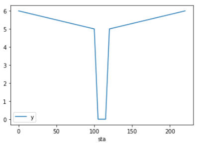{.graf-image} 200ft cross section

However, when stitching 1d and 2d surface, it is quite common to have something like this below. The invert of the 1d channel didn't line up with the 2d surface, here on the upstream side, the channel bottom is above the 2d surface, and the downstream end, the channel is much lower than the surface. And this usually will create the flow circuiting situation.

{.graf-image} 1D channel incorrectly stitched to the 2D surface

 

### **Link 1D and 2D Models** {#link-1d-and-2d-models .graf .graf--h3}

To understand the causes of this type of errors, we need to look into how the engine link 1d and 2d models. As shown in the figure below (from Tuflow manual), there are a few ways flow can be exchanged between a river and the surface around it. The 2d engine compares the water level in the 1D channel with the water level in the left and right banks, and then calculates the flow exchange at each cell.

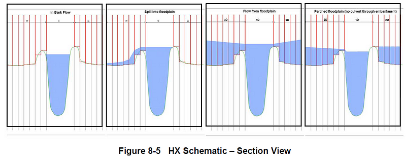{.graf-image}

The calculation for the flow to go through the banks is achieved using the interface lines. As shown in the figure below (from TuFlow), for a river reach, we create two interface lines for each bank (blue, HX type, head boundary), and then we connect the nodes to the interface line (green, CN type). By connecting the nodes to the interface bank lines, the 2D engine can interpolate the water depth inside the river by interpolating between the two nodes, then the engine compares the depth of the 1D river with the 2D cells along the interface line to calculate the flow exchange between them. Then the engine will divide the interface line in half, and load all the flows (in or out of 1D) on the upstream end to the upstream node, and the other half to the downstream node.

{.graf-image}

### The Challenge {#the-challenge .graf .graf--h3}

Ideally, the 1D banklines match exactly the 2D surface at where the banks are in a 3D space. However, when we build 1D channel, we tend to simplify its geometry to ignore the details such as small bends and slope changes. Especially if the river model is from a decades old FEMA insurance map study HECRAS model. So much has changed since the model was built, and with a surface from the latest LIDAR, it is rarely the case the HECRAS model can be dropped in and just match.\

 \

Therefore, when building 1D/2D models to link the river systems with the 2D, it is more like building a new model with existing information, because the accuracy of the model relies on building a correct representation of the river in 3D. When building the river reaches, make sure each reach has consistent cross section and slope. Refer to this excellent [webinar](https://www.youtube.com/watch?v=fzZjJwqVolg&t=2063s&ab_channel=XPSolutionsMediabyInnovyze){.markup--anchor .markup--p-anchor target="_blank"} for best practices on building 1D/2D river models.

======================================================================

======================================================================

# Work with subcatchments in XPSWMM

{
    "title": "Work with subcatchments in XPSWMM",
    "aid": "kA04U000000QMw7SAG_en_US_1.html",
    "software": "XPSWMM",
    "topic": "hydraulics",
    "summary": "The article explains the concepts of catchment and subcatchment in XPSWMM, highlighting the differences from similar elements in other software like SWMM5 and InfoWorks ICM. It discusses how subcatchments, which convert rainfall into runoff through various hydrologic parameters, are managed in XPSWMM. The article outlines best practices for creating subcatchments, including manual creation, importing from GIS data, and table imports, and describes how these workflows can be optimized for different project sizes."
}

- Product: XPSWMM
- Topic: hydraulics

## Summary
The article explains the concepts of catchment and subcatchment in XPSWMM, highlighting the differences from similar elements in other software like SWMM5 and InfoWorks ICM. It discusses how subcatchments, which convert rainfall into runoff through various hydrologic parameters, are managed in XPSWMM. The article outlines best practices for creating subcatchments, including manual creation, importing from GIS data, and table imports, and describes how these workflows can be optimized for different project sizes.

## Text

Subcatchment is a widely used concept for modeling the runoff. Most storm sewer modeling software uses subcatchment to generate runoff from rainfall. However, the way to create and edit subcatchment can be quite different in different software packages.\

 \

In most modeling packages, subcatchments are used to generate runoff from rainfall, and the user can enter all the hydrology parameters.\

 \

In SWMM5 and InfoWorks ICM, subcatchment has its own layer, it works very similar to nodes and pipes, which can have its own names, attribute tables, and can be accessed directly from the map view by clicking on the subcatchment polygon. There is no limit on how many subcatchments can be connected to a single node.\

 \

In InfoWorks ICM, subcatchment is also used for generating dry weather flows from land use information.\

\

Catchment and subcatchment are usually used interchangeably. XPSWMM, however, does use them with slight difference.\

Catchment: The polygon layer or the polygons that can be associated to a node that may represent the model subcatchment.  The catchment polygon can be connected to a node in a subcatchment position and then be used to assign area or other hydrologic properties using embedded tools.\

\

Subcatchment: The drainage area and associated data that will convert rainfall to runoff using a routing method such as SWMM non-linear reservoir, SCS etc.  A node in XP can have up to 5 subcatchments.  The outflow of a subcatchment can be directed to another node or another catchment rendering the 5 subcatchment limit moot.\

\

In summary, in XPSWMM, catchment is a graphical only child layer of the nodes layer and the individual subcatchment data can be directly accessed through the node or by double-clicking on the attached catchment polygon in the map view.  In XPSWMM, each node can have up to 5 fixed subcatchments with fixed subcatchment number.\

 \

Due to these differences, working with subcatchments can feel different for users who are familiar with SWMM5 or InfoWorks ICM. In this article, we will go over a few best practices when working with subcatchments in XPSWMM.\

 

# Subcatchment Polygons (catchment)

The  subcatchment polygon layer is treated as a polygon layer rather than a modeled element layer the same way as node and point. Therefore, when creating subcatchments, it works in similar ways as all the 2D layers. We need to select the catchment layer in the layer tree first, then the polygon tool will be activated.\

 \

Also, having a polygon for a subcatchment is optional, the engine doesn\'t use any of the information of the subcatchment polygon for its calculation.\

 \

 

# Creating Subcatchment

The XPSWMM user interface is optimized for manually entering subcatchment attributes. For models with a large number of subcatchments to delineate and parameters to populate, a different workflow is needed.\

 \

For teams with advanced GIS capabilities, subcatchment attributes are commonly generated using automated GIS tools, and then imported into modeling software.\

 \

We\'ll review 3 typical subcatchment creation workflows.

-   [Manually create subcatchment](https://innovyze.force.com/support/s/article/How-to-manually-create-a-subcatchment-in-xpswmm){target="_blank"} for small models

-   [Import subcatchment from GIS data](https://innovyze.force.com/support/s/article/How-to-import-subcatchment-from-GIS-in-XPSWMM){target="_blank"} for large models

-   [Import subcatchment from table](https://innovyze.force.com/support/s/article/Import-subcatchments-from-external-table-in-XPSWMM){target="_blank"} will take more time to setup, but if keeping a dynamic link is important this is the right method

======================================================================

======================================================================

# Import subcatchments from external table in XPSWMM

{
    "title": "Import subcatchments from external table in XPSWMM",
    "aid": "kA04U000000QMw2SAG_en_US_1.html",
    "software": "XPSWMM",
    "topic": "hydraulics",
    "summary": "This article explains how to import subcatchments from an external table into XPSWMM. It details the setup of an external table (like Excel) containing node and subcatchment attributes, highlights the limitation of XPSWMM where each table row represents a node rather than a subcatchment, and compares it with GIS file imports. The article further guides users through the import process, field mapping, and updating import settings for re-running and automating data transfers."
}

- Product: XPSWMM
- Topic: hydraulics

## Summary
This article explains how to import subcatchments from an external table into XPSWMM. It details the setup of an external table (like Excel) containing node and subcatchment attributes, highlights the limitation of XPSWMM where each table row represents a node rather than a subcatchment, and compares it with GIS file imports. The article further guides users through the import process, field mapping, and updating import settings for re-running and automating data transfers.

## Text

Unlike pipes and nodes, XPSWMM can only import subcatchment from a node table.  When a node has multiple subcatchments, the setup can get a little bit complicated.\

 \

For comparison, when importing subcatchments as GIS file, each row in the GIS table is a subcatchment. While importing subcatchments from a table, each row is a node, therefore, if a node has 5 subcatchments, we need to have all the subcatchment arranged in a single row.\

 \

Due to this limitation, you might find using the GIS import method a better method if most of your data are saved in the GIS database. However, if you do plan to keep an active link between XPSWMM and the external database, this method although might take more time to prepare, could be easier to automate since all the field mappings are saved and can be re-run with just a few clicks.\

 \

Refer to this [article](https://innovyze.force.com/support/s/article/How-to-import-export-model-nodes-pipes-using-shapefiles-in-XPSWMM){target="_blank"} for an introduction on how import works in XPSWMM.\

 \

 

# Setup the external table

 \

First we need to setup an external table (e.g. excel table), and the table should have the following fields,

-   Node name

-   Catchment 1 attributes

-   Catchment 2 attributes

-   Etc.

 \

\

 

# Setup the import

\

 \

A few important notes,

-   Step 4: Setup import only

-   Step 5: Only update existing, otherwise it might not work properly.

 \

\

 \

When mapping the fields, make sure the corresponding subcatchment is select (step 3).  Refer to this [article](https://innovyze.force.com/support/s/article/How-to-prepare-data-to-be-imported-into-XPSWMM){target="_blank"} for how to match fields in XPSWMM.\

 \

![External Database Wizard - Step 6 New connection Table Import/Export Options Node/Link Mapping • Finish Preview Table Data D 20 Results Time Series Outputs XP Van able ? Name ? area I ? Width ? Imp ? slopel ? cnl ia method I ia dl ia min I shape_fact I ? rainfall r ? routing I RNF Node Sub-catchment BMP Flag RNF Node Sub-Catchment LID Flag RNF Node Sub-Catchment RD\" Flag Routing Method Infiltration Reference Rainfall Reference Runoff Redirection Drain To Flag Runoff Flow Redirection Flag Runoff Redirection Drain To Node Runoff Redirection Drain To Subcatchment Number Runoff Redirection Type Snow Melt Reference Snow Melt Flag Time of Concentration (or Parameter 2) Water Quality Data Flag Catchment Number RNF Node BMP Flag Annual Adiustments to width data Annual Adiustments to Imperviousness Hydrology Methods Print Flow and Concentrations Flag Save Results for Review(flag ment Flag Width Imoewious Percentaoe Subcatch I](./img/kA04U000000QMw2SAG_en_US_1_3.png)\

 

# Update the Import Settings

 \

The biggest benefits of using the export/import is the ability to re-run and modify the settings.\

To re-run previous importing/exporting

1.  Select the previous setup

2.  Import from the external source

3.  Export to the external source

\

 \

To change the external source,\

\

 \

 \

To update the mapping,\

\

 

======================================================================

======================================================================

# How to import subcatchment from GIS in XPSWMM

{
    "title": "How to import subcatchment from GIS in XPSWMM",
    "aid": "kA04U000000QMvsSAG_en_US_1.html",
    "software": "XPSWMM",
    "topic": "hydrology",
    "summary": "This article explains how to import subcatchment data from a GIS shapefile into XPSWMM. It outlines a step-by-step process including selecting the shapefile, importing it, and mapping the shapefile\u2019s attributes to the corresponding subcatchment parameters within XPSWMM. The guide also details how to match node names and catchment numbers to ensure correct data transfer and provides screenshots to illustrate the steps."
}

- Product: XPSWMM
- Topic: hydrology

## Summary
This article explains how to import subcatchment data from a GIS shapefile into XPSWMM. It outlines a step-by-step process including selecting the shapefile, importing it, and mapping the shapefile’s attributes to the corresponding subcatchment parameters within XPSWMM. The guide also details how to match node names and catchment numbers to ensure correct data transfer and provides screenshots to illustrate the steps.

## Text

Importing subcatchment from GIS is probably the easiest way to import subcatchment data into XPSWMM.\

 

# Import from GIS

 \

Right click on the catchments layer and click \"Import From GIS File\"\

\

 

1.  Select the shapefile

2.  Click Import

 \

\

 

# Match shapefile record to XPSWMM record

 \

The shapefile should be prepared as a polygon layer, with each record a subcatchment.  The attributes table of the shapefile is shown below,\

 \

\

 \

And node name and catchment number can be found in the node properties dialogue.\

 \

\

 \

 \

To match the shapefile record to the XPSWMM subcatchment, we\'ll need two piece of information, 1) the node name the catchment drains to, 2) the subcatchment name.\

 \

\

 \

 

# Matching subcatchment attributes

 \

 \

The best way to figure out what attributes need to be imported is by reviewing the nodes properties dialogue.\

 \

All the values required for each subcatchment can be identified from the dialogues.\

\

 \

To set the mapping of the shapefile field to the XPSWMM subcatchment attribute,

1.  Select the field in the shapefile

2.  Navigate to find the attribute

3.  Click OK

 \

\

 \

It might take some time to figure out which fields in the variable list matches the node dialogue, below are some examples.\

 \

![Variable Selection: Node Data ilDbaI Oatabase Name Node Data and Resuns General Data Hydraulics Node Runoff Node CUHP Catchment Data LA County Hyüolow Data RNF Node Data Sacramento Basin Data Sub-Catchment Data RNF Node BMP Flag Annual Adjustments to data Annual Adjustments to Imperviousness Hyd•ology Methods Print Flow and Concentmtions Flag Save Results Review Flag Sub-Catchment Flag Alea Width I mpe•vious percentage Slope RNF Node Results Sacramento Hyd•ology Runoff Node Node I Sub-catchment Node Nodel o Wave Print Lht osave SCS TYPE SYR input parameter ](./img/kA04U000000QMvsSAG_en_US_1_7.png)\

 \

 \

![Variable Selection: Node Data Global Database Name 8-13 Node Data and ResuRs Gene\'al Data Hyåauhcs Node Runoff N ode CUHP Catchment Data LA County Hyd•olom Data RNF Node Data Sacramento Basin Data Sub-Catchment Data Ground Wate\' Lauenson Rational Formula RD\" Data Pervious Area Curve Numbet Initial Abstraction Method Initial Abstraction Depth Initial Abstraction Fraction SCS Shape Factor UK Hydrology Unit Hydgograph (see also SCSI Info. Runoff Node : Nodel a Prit Sub-catchment Node Node\' SCS Hydrology Node Node\' Area Curve osave Hy&dqy SCS TYPE SYR D FEW Re&ecÜ of Concentratin Factor 484 @ Cur.\*ear Trungubr O @ Fracton o Initia Abstraction Depth (R_IADEPTH input parameter name (hover mouse over box) ](./img/kA04U000000QMvsSAG_en_US_1_8.png)\

 \

 \

SCS time of concentration can be found below.\

 \

\

 \

 \

If the value is a drop down, the value could be numbers rather than the text.  For example the initial abstraction method when imported should be 0 (Depth) 1(Fraction).\

\

 \

\

 \

For routing method, it uses an index of 1\

\

 \

Refer to this [article](https://innovyze.force.com/support/s/article/How-to-prepare-data-to-be-imported-into-XPSWMM){target="_blank"} on how to get the internal values for check and radio buttons.\

 

======================================================================

======================================================================

# How to prepare data to be imported into XPSWMM

{
    "title": "How to prepare data to be imported into XPSWMM",
    "aid": "kA04U000000QMvnSAG_en_US_1.html",
    "software": "XPSWMM",
    "topic": "hydraulics",
    "summary": "This article explains how to prepare data for import into XPSWMM by identifying the various modeling parameters that need to be input. It discusses marking parameters within the user interface\u2014covering text boxes, check buttons, and radio buttons\u2014and details the use of a dummy model to determine how XPSWMM stores these settings. It also explains how exporting the dummy model\u2019s results into a table can help clarify parameter values and suggests using XPTables for further investigation. This data preparation process helps streamline setting up models with numerous elements."
}

- Product: XPSWMM
- Topic: hydraulics

## Summary
This article explains how to prepare data for import into XPSWMM by identifying the various modeling parameters that need to be input. It discusses marking parameters within the user interface—covering text boxes, check buttons, and radio buttons—and details the use of a dummy model to determine how XPSWMM stores these settings. It also explains how exporting the dummy model’s results into a table can help clarify parameter values and suggests using XPTables for further investigation. This data preparation process helps streamline setting up models with numerous elements.

## Text

XPSWMM provides a user friendly user interface to enter modeling parameters, and the user can quickly setup a model with just a few elements.\

 \

For models with a large number of elements, entering data through the UI can be tedious and time consuming. XPSWMM provides powerful import/export tools to facility such tasks. And the first step is to figure out what parameters need to be prepared.\

 

# List all the attributes to be imported

 \

Going through the user interface and mark all the parameters to be entered,

-   Text boxes: majority of the attributes are entered as values

-   Check Buttons: these are often called \"XXX Flag\"

-   Radio buttons: these indicates a selected option

 \

\

 \

 \

For text box values, it is quite straightforward. However, for check buttons and radio buttons it will take some investigation to figure out how XPSWMM internally stores such information.  And that is the purpose of this article.\

 

# Setup a dummy model with sample values

 \

To know what the values corresponding to the radio buttons and check boxes, we need to setup a dummy model with a few sample values first. And then we export the results to a table, and that will give us the values.\

 \

First create a new excel table to figure out the value for \"SCS Hydrology\" radio button, and \"Fraction\" for initial abstraction method.\

 \

\

 \

 \

Next we setup a dummy model with just two nodes: Node1, Node2 and setup a few sample values for SCS hydrology.\

 \

Then we setup an export to get the sample values.\

\

\

It can take some time to figure out which variable is corresponding to the user interface. And in that case, the XPTables might be a better place to quickly see the values of the variables. Refer to [XPTables](https://innovyze.force.com/support/s/article/How-to-import-export-model-nodes-pipes-using-shapefiles-in-XPSWMM){target="_blank"} articles for more information.\

 \

\

 \

\

 \

The nice thing about this setup is that the configuration is saved, so you can go back and change the values of the dummy model, and re-export to see the new values.\

 \

 \

 

======================================================================

======================================================================

# How many links can be added between two nodes in XPSWMM?

{
    "title": "How many links can be added between two nodes in XPSWMM?",
    "aid": "kA04U000000QMsZSAW_en_US_1.html",
    "software": "XPSWMM",
    "topic": "hydraulics",
    "summary": "The article explains the link-adding rules between two nodes in XPSWMM. It details that only one link can normally be added between nodes, except when using the multi-link option which allows multiple types (up to 35 links for 5 types) or multiple conduits if they are identical. It also explains that if more links are needed than supported by multi-link (for instance, more than 7 conduits), a sealed dummy node can be used. However, there is a hard cap of 15 links per node, limiting the overall connectivity."
}

- Product: XPSWMM
- Topic: hydraulics

## Summary
The article explains the link-adding rules between two nodes in XPSWMM. It details that only one link can normally be added between nodes, except when using the multi-link option which allows multiple types (up to 35 links for 5 types) or multiple conduits if they are identical. It also explains that if more links are needed than supported by multi-link (for instance, more than 7 conduits), a sealed dummy node can be used. However, there is a hard cap of 15 links per node, limiting the overall connectivity.

## Text

In XPSWMM, you can add only ONE link between two nodes, and the link type can be the following.\

\

\

Other than \"multi link\", the other type of links are all single link type. And for the conduit link, the number of barrels can be used if the parallel pipes are identical.\

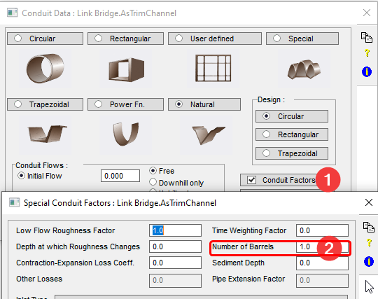\

\

Muiti Link should be used when there are more than one links between two nodes. You can have 7\*5=35 links added between the two nodes for 5 different type of links.\

\

\

If you need to add more than say 7 conduits, more than what a multi link supports, then a sealed dummy node can be used as shown below.\

\

There is a hard limit of 15 links that can be connected to a node, so even with the dummy node approach, you cannot have more than 15 links connected.

======================================================================

======================================================================

# Model bridge opening in XPSWMM Example

{
    "title": "Model bridge opening in XPSWMM Example",
    "aid": "kA04U000000QMrgSAG_en_US_1.html",
    "software": "XPSWMM",
    "topic": "hydraulics",
    "summary": "The article demonstrates how to model a bridge opening using three scenarios in XPSWMM. It details modeling a river stretch with a bridge by representing the bridge as a channel, a trimmed channel, and a closed conduit. The setup includes a hydrograph inlet, free outfall, and three connecting links with natural channel shapes. Simulation results show similar maximum stage levels across scenarios, and the analysis reviews conveyance curves using Manning's equation, confirming that modeling the bridge opening as a closed conduit produces comparable hydraulic behavior."
}

- Product: XPSWMM
- Topic: hydraulics

## Summary
The article demonstrates how to model a bridge opening using three scenarios in XPSWMM. It details modeling a river stretch with a bridge by representing the bridge as a channel, a trimmed channel, and a closed conduit. The setup includes a hydrograph inlet, free outfall, and three connecting links with natural channel shapes. Simulation results show similar maximum stage levels across scenarios, and the analysis reviews conveyance curves using Manning's equation, confirming that modeling the bridge opening as a closed conduit produces comparable hydraulic behavior.

## Text

# Model Setup

You can download the model from [GitHub](https://github.com/mel-meng/xpswmm/tree/master/models/bridge_opening){target="_blank"}.\

XPSWMM models a bridge by converting the opening as closed conduit(s). In this example, we will model a river stretch with a bridge. In this special case, the bridge is above the flow, and shouldn\'t impact the flow.\

 \

We modeled this situation in 3 scenarios,

1.  Top:  modeling the bridge as the channel

2.  Middle: model the bridge as the channel cross section trimmed to only the opening

3.  Bottom: model the bridge with trimmed opening cross section

 \

\

 \

Model setup

-   Each scenario has 3 link flowing from the left to the right

-   The upstream node has a hydrograph of ramping form 0 to 250 cfs

-   The downstream node is a free outfall

-   The 3 links are all natural shaped channels with the same cross section

    -   

-   The only difference are,

    -   Top scenario, the middle link uses the full cross section

    -   Middle scenario, the channel uses a trimmed cross section with everything else the same

        -   ![FLU\]ON 2 qde\]El](./img/kA04U000000QMrgSAG_en_US_1_2.png)

 

-   The bottom scenario, the middle link is modeled as a closed conduit using the table generated for the bridge

    -   

 \

 \

 \

 

# Results

The max. stage of the upstream node of the bridge in the 3 scenarios are almost the same.\

 \

![ridge Trimmed \[Max Stage = 974.098 Cumulative Overflow = 0.0000\] Node - AsTrimChannel \[Max Stage = 974.099 Cumulative Overflow = 0.0000\] Node - AsChannel \[Max Stage = 974.098\] Cumulative Overflow = 0.0000\] Stage 974_2 974 \_ 0 Overflow Stage Overflow Stage 974_2 1.0 974 \_ 0 974_2 1.0 974 \_ 0 Overflow 1.0](./img/kA04U000000QMrgSAG_en_US_1_4.png)\

 \

 

# Analysis

Let\'s review the 1D log to understand what is happening.\

 \

XPSWMM models bridge openings as closed conduit. And internally closed conduit and natural channel are modeled the same, both are relying on conveyance curves calculated from its geometry to route the flow through them.\

 \

To show the conveyance curve for channels, check \"Echo Natural Section Data\".\

 \

\

 \

We can then exam the conveyance curve for Bridge trimmed and as channel, a sample is shown below.\

 \

\

 \

 \

For the bridge, its opening is converted into a closed conduit, and its conveyance curve is also reported in 1D log.\

\

 \

 \

Based on the information above, the conveyance for the closed conduit can be calculated as C = 1/n\*area\*R\^(2/3) using manning\'s equation. The data in the 1D log is compiled and compared,\

 \

For the simulated depth range less than 3 ft, they are the same, therefore giving similar results.\

 \

\

 

======================================================================

======================================================================

# Dual drainage example in XPSWMM

{
    "title": "Dual drainage example in XPSWMM",
    "aid": "kA04U000000QMfYSAW_en_US_1.html",
    "software": "XPSWMM",
    "topic": "hydraulics",
    "summary": "This article presents a simulation of a dual drainage system using a street with an underlying sewer pipe. It describes two scenarios: one without inlets, where all flow remains in the upstream node and beneath the street, and a second scenario with inlets that capture a portion of the flow, redistributing it between the street and the sewer pipe. The model illustrates how flow is shifted from the street to the sewer as inlets are encountered. Detailed diagrams and flow data are provided, and the model is available on GitHub."
}

- Product: XPSWMM
- Topic: hydraulics

## Summary
This article presents a simulation of a dual drainage system using a street with an underlying sewer pipe. It describes two scenarios: one without inlets, where all flow remains in the upstream node and beneath the street, and a second scenario with inlets that capture a portion of the flow, redistributing it between the street and the sewer pipe. The model illustrates how flow is shifted from the street to the sewer as inlets are encountered. Detailed diagrams and flow data are provided, and the model is available on GitHub.

## Text

# Dual Drainage Examples

 \

In this article we will use a few examples to understand how dual drainage work.

You can find the model on [GitHub](https://github.com/mel-meng/xpswmm/tree/master/models/dual_drainage){.markup--anchor .markup--p-anchor target="_blank"}.

\

 \

A simple dual drainage model,

1.  A constant 3% slope stretch of street with sewer pipe underneath, the street is 20ft wide and 1ft tall, the sewer pipe is 1.5ft in diameter

 \

{height="309" width="550"}\

\

 \

 \

 \

 

# Base Scenario: No inlets with 15cfs constant flow at upstream node (N1)

Without inlets, ,

1.  Flow will fill in N1 and start to flow in the sewer pipe down stream

2.  Since there is no surcharge, the flow never reached the street level

Apparently, this is not the desired behavior of a dual drainage system.\

 \

{height="470" width="1250"}\

 \

 \

 \

 

# Scenario 15cfs with inlet 3cfs max flow

In this scenario,

1.  15cfs is loaded at N1

2.  All the inlets have an max. capture of 3cfs

3.  For N1, 3cfs goes into the sewer pipe, and 12 cfs goes down the street

4.  At N2, another 3cfs goes into the sewer pipe, and 9 cfs goes down the street, etc.

 \

{height="659" width="1201"}\

The final results are shown below. Each time an inlet is passed, 3cfs is transferred from the street to the sewer pipe.\

 \

Note: ##.1 is the sewer pipe, ##.2 is the street, link 31-\>32..-\>36\

 \

Flow in the dual drainage system (cfs)

  ----------- ---- ---- ---- ---- ---- ----

  Link Name   31   32   33   34   35   36

  street      12   9    6    3    0    0

  pipe        3    6    9    12   15   15

  ----------- ---- ---- ---- ---- ---- ----

 \

\

 \

 

 

======================================================================

======================================================================

# How to setup dual drainage in XPSWMM?

{
    "title": "How to setup dual drainage in XPSWMM?",
    "aid": "kA04U000000QMf4SAG_en_US_1.html",
    "software": "XPSWMM",
    "topic": "hydraulics",
    "summary": "This article explains how to set up a dual drainage system in XPSWMM to model storm water flows on streets. It outlines the concept of splitting nodes into a top and bottom component and integrating a rating curve to control the division of flow between the surface (street) and underground systems. The article also highlights the software's internal mechanics, including node naming conventions and connectivity details, and provides practical tips for proper configuration to ensure accurate simulation results."
}

- Product: XPSWMM
- Topic: hydraulics

## Summary
This article explains how to set up a dual drainage system in XPSWMM to model storm water flows on streets. It outlines the concept of splitting nodes into a top and bottom component and integrating a rating curve to control the division of flow between the surface (street) and underground systems. The article also highlights the software's internal mechanics, including node naming conventions and connectivity details, and provides practical tips for proper configuration to ensure accurate simulation results.

## Text

# What is dual drainage

 \

Dual drainage is the setup to model typical storm water flows along streets.

-   When runoff reaches the street, they start to flow along the gutters

-   As it hits the catch basin, some of the flow will be captured and goes into the storm pipe underground

-   The rest of the flow will continue along the gutter until it hits the next catch basin, then the same thing happens, part of it will be captured and goes into the pipe under ground, the rest flows along the street.

 \

\

 \

 

# How does XPSWMM represent dual drainage system

 \

To fully model the dynamics of a dual drainage system, an inlet need to be added to each node.\

 \

As shown below, the trick is breaking the existing node into a top and a bottom node, and add a rating curve in between to represent the inlet. With this setup,

1.  When runoff is loaded into the node, the rating curve will determine how much flow will go into underground pipe, and the rest will flow into the street pipe

2.  Similarly, as the flow reaches the downstream node in the street pipe, the rating curve will decide how much will be captured into the underground

 \

\

 \

 \

However, XPSWMM does this trick internally, from the user interface, it still shows the two nodes as one junction without exposing the details. The details could be revealed by checking the 1D log.\

 \

Detailed node information can be found in table E3a, an example is shown below.

-   The top node has the same node name as show in the XPSWMM user interface

-   The bottom node has the suffix \$I

-   The top node has the original ground elevation and the invert of the street

-   The bottom node has the original invert and the ground invert using the street invert

 \

\

 \

The rating curve is named with a suffix of \$R after the node name, and the connectivity can be found in table E4 as shown in the example below.\

\

\

The stages and flow of the two split nodes can be plotted in XPSWMM,\

\

 

# How to setup dual drainage in XPSWMM?

As shown below, with this setup, we need to model the rim of the node as the top of the street channel cross section, instead of the rim of the actual manhole, also we need to model all the inlet into the node as a single inlet.\

 \

\

 \

A convenient way of setting dual drainage is to create the underground pipe first, and then make sure all the ground elevation of the nodes are set to the street invert, then use the automated tool to create the street channels.\

   \

\

 

# Tips

 \

XPSWMM assumes the open channel in the multi-link is the street.

-   If you would like to use a closed pipe to represent the surface channel, it will not work properly, because it will be connected to the bottom node instead

-   If you have more than one open channel going out of a node, the node will be split at the lowest invert of the open channel, make sure that is the desired configuration

 \

When inlets are not used, dual drainage will behave as the following which might not give the desired outcome since there will be no flow in the open channel unless the level in the node is higher than the street channel invert.\

 

 

======================================================================

======================================================================

# How to get the toolbar back in XPSWMM?

{
    "title": "How to get the toolbar back in XPSWMM?",
    "aid": "kA04U000000QMeLSAW_en_US_1.html",
    "software": "XPSWMM",
    "topic": "other",
    "summary": "The article provides instructions on how to restore a missing toolbar in XPSWMM. It explains that toolbars can be undocked or closed, and shows how to bring back the missing toolbar using the 'View > Toolbars' option. The guide includes a screenshot to help users navigate the process."
}

- Product: XPSWMM
- Topic: other

## Summary
The article provides instructions on how to restore a missing toolbar in XPSWMM. It explains that toolbars can be undocked or closed, and shows how to bring back the missing toolbar using the 'View > Toolbars' option. The guide includes a screenshot to help users navigate the process.

## Text

In XPSWMM, you can drag the toolbar to undock it. And you can close toolbars. To get the missing toolbar back, \"View \> Toolbars\"\

======================================================================

======================================================================

# How to fix "Weir Allocation exceeded" error in XPSWMM?

{
    "title": "How to fix \"Weir Allocation exceeded\" error in XPSWMM?",
    "aid": "kA04U000000QMdXSAW_en_US_1.html",
    "software": "XPSWMM",
    "topic": "hydraulics",
    "summary": "The article provides a quick solution to the 'Weir Allocation exceeded' error encountered in XPSWMM. It instructs users to navigate to the installation folder and update the MAX_WEIRS parameter to a higher number. After making the change, restarting XPSWMM should resolve the error."
}

- Product: XPSWMM
- Topic: hydraulics

## Summary
The article provides a quick solution to the 'Weir Allocation exceeded' error encountered in XPSWMM. It instructs users to navigate to the installation folder and update the MAX_WEIRS parameter to a higher number. After making the change, restarting XPSWMM should resolve the error.

## Text

Go to the installation folder, and update the MAX_WEIRS to a higher number as shown below. Restart XPSWMM should fix the error.\

======================================================================

======================================================================

# How to export 2D results using XP2D GIS tool  in feet in XPSWMM?

{
    "title": "How to export 2D results using XP2D GIS tool  in feet in XPSWMM?",
    "aid": "kA04U000000QMdSSAW_en_US_1.html",
    "software": "XPSWMM",
    "topic": "2D modeling",
    "summary": "This article explains how to export 2D modeling results in feet using the XP2D GIS tool within the XPSWMM environment. It instructs users to ensure that the 'Use project unit for 2D Engine' option is activated in the 2D job control settings, which makes the process consistent with the project\u2019s unit settings. A supporting image is included to guide the user."
}

- Product: XPSWMM
- Topic: 2D modeling

## Summary
This article explains how to export 2D modeling results in feet using the XP2D GIS tool within the XPSWMM environment. It instructs users to ensure that the 'Use project unit for 2D Engine' option is activated in the 2D job control settings, which makes the process consistent with the project’s unit settings. A supporting image is included to guide the user.

## Text

In the 2D job control settings, make sure \"Use project unit for 2D Engine\" is checked.\

======================================================================

======================================================================

# How to import/export model nodes/pipes using shapefiles in XPSWMM

{
    "title": "How to import/export model nodes/pipes using shapefiles in XPSWMM",
    "aid": "kA04U000000QMdISAW_en_US_1.html",
    "software": "XPSWMM",
    "topic": "hydraulics",
    "summary": "This article explains how to import and export model nodes and pipes between GIS shapefiles and XPSWMM/XPSTORM. It details using shapefiles as database tables, matching primary keys, and mapping fields between the shapefile and XPSWMM\u2019s internal data structure via XPTables. Step-by-step instructions and screenshots guide the user through creating node tables, setting up field mappings, and performing import/export operations for both nodes and links."
}

- Product: XPSWMM
- Topic: hydraulics

## Summary
This article explains how to import and export model nodes and pipes between GIS shapefiles and XPSWMM/XPSTORM. It details using shapefiles as database tables, matching primary keys, and mapping fields between the shapefile and XPSWMM’s internal data structure via XPTables. Step-by-step instructions and screenshots guide the user through creating node tables, setting up field mappings, and performing import/export operations for both nodes and links.

## Text

Nodes and pipes in XPSWMM/XPSTORM can be easily imported or exported using shapefiles using the built in tools.\

The import tool can import shapefiles from the GIS database to build model network, and the export tools can be used to export results to GIS for more advanced mapping.\

 

# How does it work?

An easy way to visualize the process is to treat the shapefile and the XPSWMM model as two tables.\

For example, the shapefile is a table with a few columns,\

\

 \

And we need to import this shapefile into XPSWMM\

\

 \

And the export is the reverse process to get the table in XPSWMM to be saved in a shapefile table.\

 \

To make the import work, we\'ll need the following defined,

1.  First we need to match the rows in the two tables using a primary key, the value uniquely identifies the row.  In this case it is the \"name\" field in the shapefile and the \"Node Name\" field in the XPSWMM table, which uniquely identifies a node in the two tables. Node1 row in the shapefile table is the same as the Node1 row in the XPSWMM table.

2.  Once the row is matched, a mapping is needed to convert the field value from the shapefile table to the XPSWMM table, for example \"x\" in the shapefile table for Node1 row is imported as the \"Node X\" cell in the XPSWMM table.

 \

For export, it is the reverse writing data from the XPSWMM table to the shapefile.\

 

# XPTables

 \

Before getting into the import/export procedures, we need to get familiar with XPTables, which exposes the internal data structure of XPSWMM models for the user to create customizable tables. The mechanism of mapping the fields between XPSWMM and Shapefiles and other external sources relying on this functionality of XPTables.\

 \

Click the XPTables icon to start the XPTable list\

 \

\

To create a new node table,

1.  Select the \"Node Tables\" folder

2.  Click Add button

3.  Using the \"Variable Selection\" window to add the field into the list of table headers. Most of the common model attributes can be found under the Hydraulics Node \> HDR Node Data

4.  Use the tools to create a list of table columns

5.  Click OK to create the table.

 \

![XP Table List Obiect Selection: All Obiects in Model Global Database T ables Global T able Node T able Link Tables Variable Selection: Node Data : node biect Types amrifice Cancel Append Display unit In Separate Ron Inset Variable Type: Global Database: Node General Data Hydraulics Node HDR Node Data Constant Inflow Gauged Input Data HDR General Data Inlet Capacity Outlet Control Storage Node Data Time Series Inflow WSPG Data Node 2D Inflow Capture Flag Approach Depth Reference Calculate Depth By Calculate Gutter Spread Flag Dry Weather Flow Flag Outfall Flag Gauged Level Gauged Flow Gauged File Name Gauged Inflow Flag Ground Elevation S ill Cres Node Name NodeX Ground Elevation (Spill Crest) Invert Elevation Cancel Rel ](./img/kA04U000000QMdISAW_en_US_1_3.png)\

 \

Once a table is created, you can use the \"Setup Table Variables\" tool to go back to the window above to change the table.\

\

 \

 \

 

# Export node layer to shapefile

Both importing/exporting tools can be accessed by right click on the Nodes or Links layer.\

![D ID Net\',volk Z\] Labels \[S Z\] Catchn D O sew Properties Import From GIS Export To GIS File\... Delete Contents Of This Layer Lock Layer ](./img/kA04U000000QMdISAW_en_US_1_5.png)\

 \

To export the node layer as shapfiles,

1.  Right click the Nodes layer \> Export to GIS File ...

2.  Go to the export folder and name the shapefile

3.  Using the \"\>\" button to add the field from the list

    1.  Node Name, x, y

    2.  Hydraulics \> HDR Node Data \> Invert Elevation/Ground Elevation

4.  Change the custom name following shapefile naming convention

    1.  name, x, y invert, rim

\

 \

\

 

# Import Node from shapefile

Before importing shapefiles into XPSWMM, it is recommended to create a corresponding XPTables,

1.  So that you can check the imported data quickly

2.  To make sure the values in the shapefile are properly prepared, for example, using the XPSWMM code for shape of pipe, and using the same units for pipe size, inverts, etc.

 \

Right click on Nodes layer\

\

 

1.  Select the shapefile

2.  Click import

3.  Set node name field (primary key to match the rows)

4.  Set field mapping, \"Field\" column is the field in the shapefile, \"XP Variables\" is the field the values will be imported into.

![Import GIS File C : itemp\\suppor HD 0392983Wode shp Selected Data Proper ty Name Nodes Import Properties C, De fault Names • Set Nodes Names Fr om Attribu te Da ta Pr oper ty Value o name (80Char) ariable Mappings name (80Char) x (Double) y (Double) invert (Double) nm (Double) Water Surface Profiles D Legends Diagnostics Z\] GIS Z\] CAD Flies XP Variables Invert Elevation Ground äevabon (Spill Crest Variable Selection: Node Data Global Database Name: General Data Hydraulics Node HDR Node Data Constant Inflow Gauged Input Data HDR General Data Inlet Capacity Outlet Control Storage Node Data Time Series Inflow WSPG Data Node 2D Inflow Capture Flag Approach Depth Reference Calculate Depth By Calculate Gutter Spread Flag Dry Weather Flow Flag Outfall Flag Gauged Level Gauged Flow Gauged File Name Gauged Inflow Flag Ground Elevation (Spill Crest) 5 Cancel ](./img/kA04U000000QMdISAW_en_US_1_9.png)\

 \

 

# Export Links layer to shapefile

Right click on the Links layer,\

 \

\

 \

Export window,

1.  Go to the folder and name the new shapefile

2.  Select the field, common link attributes can be found under Link \> Link Data \> Conduit Data

3.  Rename the custom Name column to comply with shapefile naming convention (short simple names)

\

 

# Import Links from Shapefile

To understand the data format, open an existing model, or create a few sample links.\

Then create an XPTables for links to check the format of the data. For Shape, it is coded as \"Circular\", and the units are shown in the table header.\

![Variable Selection: Conduit Data : Links biect Types Conduit Inset Variable Type: Global Database: Link Link Data Bridge Data Conduit Data Conduit Factors Design Options Multi-Conduit Data Natural Channel Data Power Function Print Control Trapezoidal Channel Data Height of Rectangle Bridge Culvert Centerline Sta Conduit Factor Flag Design Surface Offset(xl Natural Surface Offset(xl Diameter (Height) Conduit Design Option Design Surface Flag Natural Surface Flag Services Flag Length Special Display Link Name Upstream Node Name Downstream Node Name Diameter (Height) Upstream Invert Elevation Downstream Invert Elevation Shape Append ](./img/kA04U000000QMdISAW_en_US_1_12.png)\

 \

\

 \

Right click the Links layer,\

![Z\] Properties Import From GIS Filem ](./img/kA04U000000QMdISAW_en_US_1_14.png)\

 \

Import links from shapefile

1.  Locate the links shapefile file

2.  Click import

3.  Set link names as the \"name\" field in the GIS (primary key, matching the rows)

4.  Link End Points, XPSWMM will automatically assign the node for links on the end of the link

5.  Map the field from shapefile to the XPSWMM table

![Import GIS File C : itemp\\suppor shp Import Selected Data Proper ty Name GIS Import Properties C, De fault Names • Set Links Names From Attribute Data: Proper ty Value name (80Char) o Connecbvi ty Option • Link End Poin C, user De fine Upstream Node Name: Downstr eam Node Name: Variable mappings: ds_node (254Char) Length (Double) Shape (In teger) us_invert (Double) ds_invert (Double) diame ter (Double diameter (Double diameter (Double) XP Variables Length Shape Upstream Invert Elevation Covvnstream Invert Elevabo Variable Selection: Conduit Data Global Database Name: Link Link Data Bridge Data Conduit Data Conduit Factors Design Options Multi-Conduit Data Natural Channel Data Power Function Print Control Trapezoidal Channel Data Height of Rectangle Bridge Culvert Centerline Station Conduit Factor Flag Design Surface Offset(xl Natural Surface Off Diameter (H eight) 7 Conduit Design Opt Design Surface Flag Natural Surface Flag Services Flag Length Cancel ](./img/kA04U000000QMdISAW_en_US_1_15.png)\

 

======================================================================

======================================================================

# How to model storage in XPSWMM

{
    "title": "How to model storage in\u00a0XPSWMM",
    "aid": "kA04U000000QMEmSAO_en_US_1.html",
    "software": "XPSWMM",
    "topic": "hydraulics",
    "summary": "The article explains how to model storage in XPSWMM by describing different ponding options for node flooding situations. It compares the behavior of nodes with no storage, allowed ponding (using an imaginary inverted cone), and sealed ponding (modeled as a cylinder). The document elaborates on two storage implementations: storage applied at the spill crest and storage applied from the invert. It explains how storage curves and node setup determine water rise during flooding events. Sample models and graphical illustrations support the explanation, with a downloadable model provided for further reference."
}

- Product: XPSWMM
- Topic: hydraulics

## Summary
The article explains how to model storage in XPSWMM by describing different ponding options for node flooding situations. It compares the behavior of nodes with no storage, allowed ponding (using an imaginary inverted cone), and sealed ponding (modeled as a cylinder). The document elaborates on two storage implementations: storage applied at the spill crest and storage applied from the invert. It explains how storage curves and node setup determine water rise during flooding events. Sample models and graphical illustrations support the explanation, with a downloadable model provided for further reference.

## Text

It is helpful to define [ponding options](https://help.innovyze.com/display/xps/Hydraulics+Node+Data#HydraulicsNodeData-Ponding){target="_blank"} before getting into the storage difference. When a node is flooding, the following options apply

-   None: the overflow is lost when it is overflowing

-   Allowed: a imaginary inverted cone is added to the top of the manhole and will allow the overflow to keep rising inside. Simulate depression around a manhole.

-   Sealed: a imaginary cylinder the same as the top of the node is added to the top of the manhole and will allow the overflow to keep rising inside. Simulate bolted manhole or sealed manhole.

\

 \

 \

When a storage is added to the spill crest, it behaves similar to the \"allowed\" ponding option, instead with a user provided storage curve. During flooding event, the water will keep rising in the storage, and if it goes above the user defined point, it will assume the area stays constant from the last point.\

When storage is added at node Invert: this is the typical setup of a storage node, the node will be filled from the bottom until to the top and then start to overflow, then depending on the ponding setup, the overflow will be routed accordingly.\

\

 \

 \

A sample is created to illustrate the difference,\

 

-   Storage at spill: storage added at spill level with None ponding option

-   Storage_from_invert_XXX: storage set from invert with ponding option xxx

 \

The model can be downloaded from [github](https://github.com/mel-meng/xpswmm/raw/master/models/howtos/storage/storage%20at%20spill%20crest%20vs%20from%20invert.zip){target="_blank"}.\

 \

\

 

# Storage at spill crest

 \

\

 \

![3AM Stage 6AM Node - Storage at spill \[Max Stage 25.548\] \[Cumulative Overflow 738.0000\] water keeps rising after last storage curve point at 3ft depth Overflow 25 20 10 5 Stepwise - Stepwise - Depth Surface Area overflow routed to storage at spill ace Clnyert Elevation 0.00, 700 600 500 O 400 300 a 200 100 1 Wed Jan 2020 9AM 12PM Time 3PM 6PM 9PM 2 Thu ](./img/kA04U000000QMEmSAO_en_US_1_4.png)\

 \

 

# Storage from invert XXX

\

 \

![- Storage from invert \[Max Stage ¯ 12.000\]\[Cumulative Overflow 12 11 10 1 Wed Jan 2020 3AM Stage 6AM Node 9AM none = 871.2000\] Overflow S rface Elevation = 12 0 Overflows when reaches spill level 900 800 700 600 500 300 200 12PM Time 3PM 6PM ](./img/kA04U000000QMEmSAO_en_US_1_6.png)\

 \

 \

![Stage 6AM Node - Storage from invert allowed \[Max Stage 18.662\] \[Cumulative Overflow 0.0000\] allowed will keep rising in the cone 18 16 14 12 0 10 1 Wed Jan 2020 rface Elevation = 12 0 Clnyert Elevation 0.00 1.0 0.8 0.6 0.4 0.2 \< 0.0 -0.2 \> -0.4 -0.6 -0.8 -1.0 3AM Overflow 6PM S 9AM 12PM Time 3PM 9PM 2 Thu ](./img/kA04U000000QMEmSAO_en_US_1_7.png)\

 \

![18 16 14 12 710 1 Wed Jan 2020 Node - Storage from invert sealed \[Max Stage 18.024\] \[Cumulative Overflow 0.0000\] seals option will also keep rising assuming constant area Overflow 6PM S rface Elevation = 1.0 0.8 0.6 0.4 12.00 0.2 \< 0.0 -0.2 \> -0.4 -0.6 -0.8 -1.0 3AM Stage 6AM Clnyert Elevation 0.00 9AM 12PM Time 3PM 9PM 2 Thu ](./img/kA04U000000QMEmSAO_en_US_1_8.png)\

 

 

======================================================================

======================================================================

# How to reduce the modeling results of a 2D model in XPSWMM?

{
    "title": "How to reduce the modeling results of a 2D model in XPSWMM?",
    "aid": "kA00P0000000yW1SAI_en_US_1.html",
    "software": "XPSWMM",
    "topic": "2D modeling",
    "summary": "The article explains how to manage and reduce excessive modeling results in a 2D model using the XPSWMM software. It emphasizes the importance of careful management of the generated output by adjusting settings in the '2D Job Control' panel, ensuring that only the parameters necessary for analysis and reporting are checked."
}

- Product: XPSWMM
- Topic: 2D modeling

## Summary
The article explains how to manage and reduce excessive modeling results in a 2D model using the XPSWMM software. It emphasizes the importance of careful management of the generated output by adjusting settings in the '2D Job Control' panel, ensuring that only the parameters necessary for analysis and reporting are checked.

## Text

2D Modeling modeling results can grow very quickly if not carefully managed. All of the settings can be found in the \"2D Job Control\".\

\

Check only the parameters will be used for analysis and reports,\

======================================================================

======================================================================

# How to export all pump curves into a single table in XPSWMM?

{
    "title": "How to export all pump curves into a single table in XPSWMM?",
    "aid": "kA00P0000000yW6SAI_en_US_1.html",
    "software": "XPSWMM",
    "topic": "hydraulics",
    "summary": "This article explains how to export pump curves from XPSWMM into a table format for easier management. It outlines two alternative methods: one using manual copy and paste from either the curve editor or XPTable, and another by exporting the model to the XPX format for large numbers of pump curves. The text details the process of pasting the pump curve data into Excel and converting the text to columns, and illustrates the steps with images showing the relevant interfaces and paths within the software."
}

- Product: XPSWMM
- Topic: hydraulics

## Summary
This article explains how to export pump curves from XPSWMM into a table format for easier management. It outlines two alternative methods: one using manual copy and paste from either the curve editor or XPTable, and another by exporting the model to the XPX format for large numbers of pump curves. The text details the process of pasting the pump curve data into Excel and converting the text to columns, and illustrates the steps with images showing the relevant interfaces and paths within the software.

## Text

We need to export all of the pump curves into the following format of a table with these columns,

-   curve name

-   x

-   y

\

There is no easy way to get this information directly into an excel file. Below are two alternatives.\

1. If you don\'t have that many, you can simply copy and paste the data into excel for each curve. It can be done either using the curve editor or using XPTables as shown below,\

\

You can access the pump curve from the subgrid of this XPTable below\

\

\

2. If you have many pump curves, exporting your model to the XPX format might work better.\

\

\

Pump curves are saved in Global database,\

\

\

The pump curves are exported in the text format,\

\

\

Pasting the text in Excel and use the \"Text to Columns\" to convert it to table,\

\

\

If you only need selected pump curves, follow the instructions below,\

\

\

 

======================================================================

======================================================================

# Troubleshoot no flow in 1D model in XPSWMM?

{
    "title": "Troubleshoot no flow in 1D model in XPSWMM?",
    "aid": "kA00P0000000yV3SAI_en_US_1.html",
    "software": "XPSWMM",
    "topic": "hydraulics",
    "summary": "This article provides troubleshooting steps for addressing a lack of flow in a 1D model using XPSWMM. It advises verifying that runoff nodes are activated and that a rain event is scheduled during the simulation period. The guide also stresses the importance of aligning time settings between the runoff and hydraulics models, ensuring they run simultaneously, and confirming that no flow interface files are in use. Step-by-step instructions with images are given to assist users in resolving the issue and ensuring that both RNF and HDR components of the model are correctly solved."
}

- Product: XPSWMM
- Topic: hydraulics

## Summary
This article provides troubleshooting steps for addressing a lack of flow in a 1D model using XPSWMM. It advises verifying that runoff nodes are activated and that a rain event is scheduled during the simulation period. The guide also stresses the importance of aligning time settings between the runoff and hydraulics models, ensuring they run simultaneously, and confirming that no flow interface files are in use. Step-by-step instructions with images are given to assist users in resolving the issue and ensuring that both RNF and HDR components of the model are correctly solved.

## Text

If runoff is used to generate flows

Make sure the runoff nodes are activated. The steps to active a node is shown below.

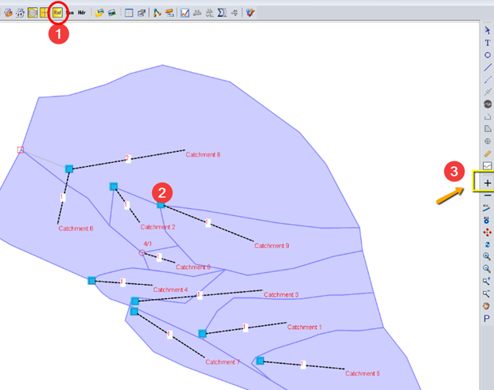\

\

Make sure there is rain event during the simulation period. If you want to use a rainfall event defined for a different period, you'll need to enable the "Use Simulation Start Time for Rainfall Event" to force the rainfall to happen in the simulated period.

# If you have flows in Runoff model, but no in the Hydraulics model.

Make sure the time settings are the same period in runoff and hydraulics controls.\

\

 

Make sure you are solving both the runoff and hydraulics models.

In most cases, you should solve Runoff and Hydraulics mode simultaneously. Follow the steps below,

1.     Make sure no flow interface files are used

2.     Check solve Runoff and Hydraulics mode simultaneously

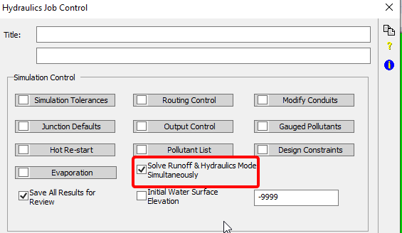

3.     Ensure the solve mode run both RNF and HDR

\

For more information, please refer to:\

[https://help.innovyze.com/display/xps/Tutorial+2+-+Surface+Water+Hydrology](https://help.innovyze.com/display/xps/Tutorial+2+-+Surface+Water+Hydrology)\

\

[https://help.innovyze.com/display/xps/Tutorial+3+-+Surface+Water+Hydraulics](https://help.innovyze.com/display/xps/Tutorial+3+-+Surface+Water+Hydraulics)\

\

\

 

======================================================================

======================================================================

# How to work with rainfall interface file (*.rin) in XPSWMM?

{
    "title": "How to work with rainfall interface file (*.rin) in XPSWMM?",
    "aid": "kA00P0000000yVrSAI_en_US_1.html",
    "software": "XPSWMM",
    "topic": "hydraulics",
    "summary": "The article explains how to work with the .rin rainfall interface file in XPSWMM. It covers creating and converting .rin files from various rainfall formats, including the process of turning them into a CSV format for easier viewing. The utility tools built into XPSWMM allow users to manage and graph rainfall data, even as the .rin format\u2019s binary structure and 2-digit year encoding (for pre-2000 data) present certain challenges. The article also provides visual examples and links for additional information, making it a practical guide for handling compact rainfall data files in modern hydraulic models."
}

- Product: XPSWMM
- Topic: hydraulics

## Summary
The article explains how to work with the .rin rainfall interface file in XPSWMM. It covers creating and converting .rin files from various rainfall formats, including the process of turning them into a CSV format for easier viewing. The utility tools built into XPSWMM allow users to manage and graph rainfall data, even as the .rin format’s binary structure and 2-digit year encoding (for pre-2000 data) present certain challenges. The article also provides visual examples and links for additional information, making it a practical guide for handling compact rainfall data files in modern hydraulic models.

## Text

The \*.rin rainfall interface file is a fairly old rainfall format developed in very early SWMM versions. The \*.rin is a very compact binary file format that can encode very long rainfall time series into a much smaller file size. Usually it is used to get around the text input file size limits.\

\

As the software evolve over the years, in most cases, using the \*.rin is not required, and saving the rainfall as a time series inside of the model or as an external text file is usually more convenient because there is no easy way to view the data inside the \*.rin file.\

\

In this article, we will cover the various tools and procedures of creating, converting rainfall data to and from \*.rin format, and setting up the model to use the \*.rin file.

# Creating \*.rin file

You can convert various rainfall formats into the \*.rin format using the "Rainfall Utility"

XPSWMM supports a long list of standard rainfall formats, and you can also use a "user defined" format.

# Converting \*.rin file

XPSWMM also has a tool to graph and convert \*.rin file to other formats.

You can use the utility to convert the \*.rin to a csv file. Since \*.rin only records time steps with non-zero values, and using the Julian date integer for dates, the graph is not very helpful.

A sample of the converted csv file is shown below,

More information about Julian day can be found below,

[https://www.extendoffice.com/documents/excel/2474-excel-convert-julian-date-to-calendar-date.html](https://www.extendoffice.com/documents/excel/2474-excel-convert-julian-date-to-calendar-date.html){target="_blank"}

 

# Run the model with \*.rin file

One of the limitations of very old \*.rin file is the "Y2K" issue. For rainfall data before year 2000, the year is encoded using two digits, instead of 4 digits. Therefore, when running models that uses \*.rin with historical dates before 2000, the year should be set using the 2-digit format.

======================================================================

======================================================================

# How to move a floating license to a new server for XPSWMM?

{
    "title": "How to move a floating license to a new server for XPSWMM?",
    "aid": "kA00P0000000z5nSAA_en_US_1.html",
    "software": "XPSWMM",
    "topic": "licensing",
    "summary": "This article provides step-by-step instructions to transfer a floating license for XPSWMM to a new server. It outlines the necessary resources including an installation guide, the latest *.xcf file which is obtained by contacting support, and a download link for the installer from the support portal. The process includes installing the network server option on the new server, verifying the new IP address if it changes, and updating the *.ini file if the client already has the required version installed."
}

- Product: XPSWMM
- Topic: licensing

## Summary
This article provides step-by-step instructions to transfer a floating license for XPSWMM to a new server. It outlines the necessary resources including an installation guide, the latest *.xcf file which is obtained by contacting support, and a download link for the installer from the support portal. The process includes installing the network server option on the new server, verifying the new IP address if it changes, and updating the *.ini file if the client already has the required version installed.

## Text

You\'ll need the following to move the license to a new server,

1.  Installation guide: [https://help.innovyze.com/display/xps/Installing+xpswmm#Installingxpswmm-NetworkServerInstallation](https://help.innovyze.com/display/xps/Installing+xpswmm#Installingxpswmm-NetworkServerInstallation){target="_blank"}

2.  The latest \*.xcf file, you can request the \*.xcf by providing the dongle number (XXXX  or XX-XXXX)  to your company contact or support@innvoyze.com

3.  Download the latest version of the installer from the support portal, contact support if you don\'t have a free account. ([https://innovyze.force.com/support](https://innovyze.force.com/support){target="_blank"})

 

 

Here is a brief summary of the steps,

 

1\. install the \"network server\" option on the new server, if the IP address changes, then get the new IP address

2\. if the client needs the latest version, use the same installer and the \*.xcf file

3\. if the client already has the right version installed, update the \*.ini file shown below,

 

{height="393" width="726"}

 

======================================================================

======================================================================

# How to export hydrograph in XPSWMM?

{
    "title": "How to export hydrograph in XPSWMM?",
    "aid": "kA04U000000QM5aSAG_en_US_1.html",
    "software": "XPSWMM",
    "topic": "hydrology",
    "summary": "This article guides users through two methods for exporting hydrographs in XPSWMM. The first method explains how to export directly from the plot window, utilizing reported values and subsequently pasting the data into Excel. The second method describes using the interface tool to load the simulation results file and export the hydrograph data in CSV format. Step-by-step instructions and images support both techniques."
}

- Product: XPSWMM
- Topic: hydrology

## Summary
This article guides users through two methods for exporting hydrographs in XPSWMM. The first method explains how to export directly from the plot window, utilizing reported values and subsequently pasting the data into Excel. The second method describes using the interface tool to load the simulation results file and export the hydrograph data in CSV format. Step-by-step instructions and images support both techniques.

## Text

There are a few ways to export the hydrograph from a model,

1\. export from the plot window, this uses the reported values

2\. use the interface tool, this uses the simulation results

 

# Export hydrograph using the plot window {#export-hydrograph-using-the-plot-window style="margin: 0in;font-family: Calibri;font-size: 16.0pt;color: #1E4E79;"}

1.  Select the object, then review results

 

{height="255" width="416"}

1.  Right click, export results

{height="370" width="396"}

 

{height="307" width="497"}

1.  It is easier to export one parameter at a time. When export multiple, each time series is appended to the end of another.

{height="393" width="497"}

1.  Paste into excel

{height="411" width="410"}

 

 

# Use the Interface tool {#use-the-interface-tool style="margin: 0in;font-family: Calibri;font-size: 16.0pt;color: #1E4E79;"}

1.  Launch the interfaceUtils

{height="524" width="426"}

 

1.  Load the results file and export it as an csv file.

{height="609" width="974"}

======================================================================

======================================================================

# How to fix "Too many RDII pattern" error in XPSWMM?

{
    "title": "How to fix \"Too many RDII pattern\" error in XPSWMM?",
    "aid": "kA00P0000000zE7SAI_en_US_1.html",
    "software": "XPSWMM",
    "topic": "hydraulics",
    "summary": "This article explains how to fix the 'Too many RDII pattern' error in XPSWMM. The error occurs because the default configuration only allows 5 RTK unit hydrographs. It shows screenshots from the 1D log that display the error and provides guidance on updating the configuration parameter to increase the limit of hydrographs, ensuring the error is resolved."
}

- Product: XPSWMM
- Topic: hydraulics

## Summary
This article explains how to fix the 'Too many RDII pattern' error in XPSWMM. The error occurs because the default configuration only allows 5 RTK unit hydrographs. It shows screenshots from the 1D log that display the error and provides guidance on updating the configuration parameter to increase the limit of hydrographs, ensuring the error is resolved.

## Text

When you get the error message below,\

\

If you go to the 1D log, at the bottom is shows an error like this.\

\

\

\

As the error message indicated, the default setting only accepts 5 RTK unit hydrographs. To increase the number the configuration parameter need to be updated.\

\

\

\

\

======================================================================

======================================================================

# How to keep the boundary when importing raster into XPTIN in XPSWMM

{
    "title": "How to keep the boundary when importing raster into XPTIN in XPSWMM",
    "aid": "kA04U000000QM5VSAW_en_US_1.html",
    "software": "XPSWMM",
    "topic": "2D modeling",
    "summary": "The article explains that when importing raster data into XPTIN within XPSWMM, the software does not automatically create a boundary, unlike when vector data is imported. It emphasizes that this behavior is generally not problematic provided the 2D grid is confined within the original data\u2019s boundary. Users are advised to ensure that the grid does not extend beyond this limit to avoid errors."
}

- Product: XPSWMM
- Topic: 2D modeling

## Summary
The article explains that when importing raster data into XPTIN within XPSWMM, the software does not automatically create a boundary, unlike when vector data is imported. It emphasizes that this behavior is generally not problematic provided the 2D grid is confined within the original data’s boundary. Users are advised to ensure that the grid does not extend beyond this limit to avoid errors.

## Text

XPSWMM only retains the boundary of a surface when importing vector data format. For raster format, the boundary will not be created. In general this is not a source of error, make sure the 2D grid doesn\'t extend beyond the boundary of the original data.\

======================================================================

======================================================================

# How to setup XPSWMM to use difference licenses on the same computer?

{
    "title": "How to setup XPSWMM to use difference licenses on the same computer?",
    "aid": "kA00P0000000z5sSAA_en_US_1.html",
    "software": "XPSWMM",
    "topic": "licensing",
    "summary": "This article explains a workaround for using multiple XPSWMM licenses on one computer. Normally, XPSWMM is configured to work with only one license at a time, but by creating batch files that copy specific configuration files (.ini and .xcf) from separate folders (for example, local and network licenses) to the software's installation directory before launch, users can switch between licenses easily."
}

- Product: XPSWMM
- Topic: licensing

## Summary
This article explains a workaround for using multiple XPSWMM licenses on one computer. Normally, XPSWMM is configured to work with only one license at a time, but by creating batch files that copy specific configuration files (.ini and .xcf) from separate folders (for example, local and network licenses) to the software's installation directory before launch, users can switch between licenses easily.

## Text

By default, you can only use XPSWMM for one license/dongle. If your organization owns a few XPSWMM/XPSTORM licenses, within the software you cannot switch which license to use.\

\

The method shown below solves this problem by using different \*.bat files to copy the license configuration files for the chosen license first before launching XPSWMM.

# How does it work?

When launching XPSWMM, it checks the swmxp.ini file first to locate the license file \*.xcf and the location of the dongle. By default, the \*.xcf file is located in the same installation folder as shown in the example below,\

\

\

Therefore, if we can save the swmxp.ini and xpswmm.xcf for each dongle in another folder, and then copy them over before launching XPSWMM, we can easily switch XPSWMM between different licenses.

# Instructions

Scenario: switch between  a local XPSWMM and a network license\

Steps:\

1. Setup local XPSWMM, make sure it is working. Then copying the \*.ini and \*.xcf to folder \"c:/xps/local_config\"\

2. Setup network XPSWMM, make sure it is working. Then copying the \*.ini and \*.xcf to folder \"c:/xps/network_config\"\

2. create local.bat in the installation folder as shown below

\@echo off\

set SRC_FOLDER=c:\\xps\\local_config\

rem set SRC_FOLDER=c:\\xps\\network_config\

xcopy %SRC_FOLDER%\\swmxp.ini . /Y\

xcopy %SRC_FOLDER%\\xpswmm.xcf . /Y\

3. create network.bat in the installation folder as shown below

\@echo off\

rem set SRC_FOLDER=c:\\xps\\local_config\

set SRC_FOLDER=c:\\xps\\network_config\

xcopy %SRC_FOLDER%\\swmxp.ini . /Y\

xcopy %SRC_FOLDER%\\xpswmm.xcf . /Y\

\

4. Create shortcuts to the two \*.bat file say on your desktop\

5. Before launching XPSWMM, run the \*.bat first

======================================================================

======================================================================

# Common User Inflow Errors in xpswmm

{
    "title": "Common User Inflow Errors in xpswmm",
    "aid": "kA04U000000QLp3SAG_en_US_1.html",
    "software": "XPSWMM",
    "topic": "hydraulics",
    "summary": "The article explains two common errors when entering user inflow data in XPSWMM. First, it warns against using the HH:MM time format instead of a decimal hour, which can lead to only the last entry being used in the hydrograph. Second, it highlights the issue of a time series that does not end with a zero, causing XPSWMM to falsely assume a constant flow for the rest of the simulation. The article provides examples of correct and incorrect data entries to help users ensure proper formatting for accurate hydraulic simulation."
}

- Product: XPSWMM
- Topic: hydraulics

## Summary
The article explains two common errors when entering user inflow data in XPSWMM. First, it warns against using the HH:MM time format instead of a decimal hour, which can lead to only the last entry being used in the hydrograph. Second, it highlights the issue of a time series that does not end with a zero, causing XPSWMM to falsely assume a constant flow for the rest of the simulation. The article provides examples of correct and incorrect data entries to help users ensure proper formatting for accurate hydraulic simulation.

## Text

User inflow is a convenient way to get flow generated outside of XPSWMM/XPSTORM into the model, however, errors could be introduced if the data are not correctly formatted.

 

The two common errors are shown in this article.

 

 

 

1.  The hour column should use a decimal number instead of the HH:MM format. When using this format anything after \":\" will be ignored. As a result, only the last entry of the hour will be used for creating the hydrograph

 

A correctly entered time series should look like this.

 

 

 

1.  Time series doesn\'t end with 0, XPSWMM will assume a constant flow of the last value for the rest of the simulation

 

 

 

======================================================================

======================================================================

# How to access buttons controls hidden got cut off in XPSWMM

{
    "title": "How to access buttons controls hidden got cut off in XPSWMM",
    "aid": "kA00P0000000x3ASAQ_en_US_1.html",
    "software": "XPSWMM",
    "topic": "other",
    "summary": "This article explains a bug in XPSWMM where, if custom scaling is not set to 100%, some dialog controls are cut off because the windows are not resizable. It outlines two workarounds: using keyboard shortcuts to access hidden buttons, or resetting the custom scaling settings to 100% to avoid the issue. Screenshots of the intended appearance are provided."
}

- Product: XPSWMM
- Topic: other

## Summary
This article explains a bug in XPSWMM where, if custom scaling is not set to 100%, some dialog controls are cut off because the windows are not resizable. It outlines two workarounds: using keyboard shortcuts to access hidden buttons, or resetting the custom scaling settings to 100% to avoid the issue. Screenshots of the intended appearance are provided.

## Text

It is a \"bug\". When the custom scaling is not 100%, XPSWMM dialog controls can be cut off. And because the windows are not resizable, there is no way to see the controls.\

\

This is what it should look like.\

\

{height="468" width="519"}\

\

There are two workarounds,\

1. Use keyboard shortcuts, click in the input box, tap \"tab\", then \"enter\" should open the \"\...\" button.\

\

2. You can change your \"custom scaling settings\"  to 100, it should get around the issue.\

\

\

\

======================================================================

======================================================================

# Error: database capacity too small 400000 0 XPSWMM

{
    "title": "Error: database capacity too small 400000 0 XPSWMM",
    "aid": "kA00P0000000xinSAA_en_US_1.html",
    "software": "XPSWMM",
    "topic": "hydraulics",
    "summary": "The article explains how to resolve an error in XPSWMM where the default database capacity of 400000 records is insufficient for a larger model. It instructs the user to open a model, navigate to the Application Settings under the Tools menu, select the CONFIG pull-down, and increase the \"Maximum DB Cards\" value to 800000 or more as needed. Restarting XPSWMM after the change should clear the error."
}

- Product: XPSWMM
- Topic: hydraulics

## Summary
The article explains how to resolve an error in XPSWMM where the default database capacity of 400000 records is insufficient for a larger model. It instructs the user to open a model, navigate to the Application Settings under the Tools menu, select the CONFIG pull-down, and increase the "Maximum DB Cards" value to 800000 or more as needed. Restarting XPSWMM after the change should clear the error.

## Text

The program allocates space in memory for records, and the default size in the old versions is set for 400000 records. The model that you are working with has more than 400000 records, and that is why you are getting this error message. To increase the number of database records do the following:\

Open either the model you are working on, or if it that model doesn\'t open a blank model or small model that you have worked on before within XPSWMM. \

\

Go to the \"Application Settings\...\" found under the \"Tools\" menu. Once there, choose \"CONFIG\" in the pull-down menu. If you scroll to around the middle of the list, you will find an item/key labeled \"Maximum DB Cards\". Increase the value to 800000 and select OK. The initial setting of 400000 database records seems to be too small for your model, so I recommended 800000, if that is still not enough increase it further. You will have to restart XPSWMM. \

\

This should resolve the error. Let me know if you continue to get this error message after making the change.

======================================================================

======================================================================

# Error 0118:  Not a Valid Type or File Format XPSWMM

{
    "title": "Error 0118:  Not a Valid Type or File Format XPSWMM",
    "aid": "kA00P0000000xG1SAI_en_US_1.html",
    "software": "XPSWMM",
    "topic": "other",
    "summary": "The article discusses Error 0118 in XPSWMM, a problem that occurs when file paths are too long or include special characters. It explains that such issues can prevent XPSWMM from recognizing the file type or format. The article provides a troubleshooting tip: shortening the file path and removing special characters may resolve the error."
}

- Product: XPSWMM
- Topic: other

## Summary
The article discusses Error 0118 in XPSWMM, a problem that occurs when file paths are too long or include special characters. It explains that such issues can prevent XPSWMM from recognizing the file type or format. The article provides a troubleshooting tip: shortening the file path and removing special characters may resolve the error.

## Text

XPSWMM can stop working if the path is too long or with special characters.\

\

For example,changing this file from\

\"C:\\Users\\Some.One\\company, inc\\this road\'s existing condition.xp\"\

to\

\"C:\\XPSWMM\\this_road_existing.xp\"\

\

sometimes can fix the issue.

======================================================================

======================================================================

# Error opening unit 12IOSTAT=   in XPSWMM

{
    "title": "Error opening unit 12IOSTAT=   in XPSWMM",
    "aid": "kA00P0000000yVmSAI_en_US_1.html",
    "software": "XPSWMM",
    "topic": "hydrology",
    "summary": "This article explains a common error in XPSWMM indicated by the message 'Error opening unit 12 IOSTAT=..' which typically occurs when a required file, such as the rainfall definition file, is missing. It includes visual examples of the error and discusses possible causes so users can diagnose the issue effectively."
}

- Product: XPSWMM
- Topic: hydrology

## Summary
This article explains a common error in XPSWMM indicated by the message 'Error opening unit 12 IOSTAT=..' which typically occurs when a required file, such as the rainfall definition file, is missing. It includes visual examples of the error and discusses possible causes so users can diagnose the issue effectively.

## Text

The following will happen when the XPSWMM couldn\'t find a required file during the simulation. Unfortunately, the error message of \"Error opening unit 12IOSTAT=..\" ususally is not very helpful.\

\

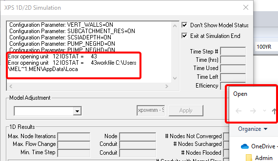\

\

\

This article will list some of the possible causes.\

\

1. Missing rainfall definition: the required rainfall is not populated below.\

======================================================================

======================================================================

# error: cannot find engine item in XPSWMM

{
    "title": "error: cannot find engine item in XPSWMM",
    "aid": "kA04U000000QLn2SAG_en_US_1.html",
    "software": "XPSWMM",
    "topic": "hydraulics",
    "summary": "This article explains an error in XPSWMM where the software cannot locate the engine program. It provides steps to troubleshoot the issue, including restarting the program, ensuring a simple file path, and verifying that the file paths in the settings are correct. The article includes images with instructions to help users confirm and correct path settings, ultimately aiming to resolve the engine detection problem."
}

- Product: XPSWMM
- Topic: hydraulics

## Summary
This article explains an error in XPSWMM where the software cannot locate the engine program. It provides steps to troubleshoot the issue, including restarting the program, ensuring a simple file path, and verifying that the file paths in the settings are correct. The article includes images with instructions to help users confirm and correct path settings, ultimately aiming to resolve the engine detection problem.

## Text

This error means that XPSWMM couldn\'t find the engine program.\

The following steps usually can get it fixed.

-   close and restart xpswmm

-   make sure the file path is short and simple

-   check the settings shown below,

\

\

Make sure the paths are set correctly following the instructions below.\

{height="336" width="321"}\

\

{height="318" width="382"}\

Please verify the paths are correct, you might want to copy and paste the path from file explorer.\

======================================================================

======================================================================

# How to setup 2d flow capture for 1d node Link Spill Crest to 2D in XPSWMM?

{
    "title": "How to setup 2d flow capture for 1d node Link Spill Crest to 2D in XPSWMM?",
    "aid": "kA04U000000QLfRSAW_en_US_1.html",
    "software": "XPSWMM",
    "topic": "2D modeling",
    "summary": "The article details methods for managing flow exchanges between 1D and 2D systems in XPSWMM, focusing on the \"Link Spill Crest to 2D\" feature. It examines three approaches: using the 1D capacity settings, enabling 2D inflow capture, and the outdated default option. The author highlights that the default method is unreliable and influenced by the 1D/2D sync time, recommending the global 2D inflow capture setting with individual inlet adjustments for better accuracy. Comparative test results are discussed to demonstrate the inconsistencies associated with the default setting."
}

- Product: XPSWMM
- Topic: 2D modeling

## Summary
The article details methods for managing flow exchanges between 1D and 2D systems in XPSWMM, focusing on the "Link Spill Crest to 2D" feature. It examines three approaches: using the 1D capacity settings, enabling 2D inflow capture, and the outdated default option. The author highlights that the default method is unreliable and influenced by the 1D/2D sync time, recommending the global 2D inflow capture setting with individual inlet adjustments for better accuracy. Comparative test results are discussed to demonstrate the inconsistencies associated with the default setting.

## Text

When a node is linked to the 2D using \"Link Spill Crest to 2D\", there a few ways to define how the flow exchanges between 1d/2d.

-   using the inet capacity settings (1)

-   using 2D inflow Capture (2)

-   default

And I found the \"default\" option can be confusing, and here I will try to clarify it a little bit.

According to the [help](https://help.innovyze.com/display/xps/2D+Job+Control+Settings#id-2DJobControlSettings-2DInflowCapture){target="_blank"}, 2D inflow capture is the preferred option and the \"default\" option is a pretty old method that shouldn\'t be used.

As you can see, the \'pre-2009 method\' is dependent on the 1D/2D sync time, if you half the time step, the flow rate will double. Not a great choice for 1d/2d flow exchange.

# Tests

To get better idea how XPSWMM handles the \"default\" options in 2019.1.2, I did a few tests and here is a quick summary of my findings.

-   The default setting is not reliable. It looks like if I ever set the 2D flow capture option, even if I turn it off. The "default" will be using the 2D inflow capture instead.

-   The default 2d inflow capture is Q=13.382\*depth\^0.5, even though I didn't enter anything in the settings

-   For a clean 2D model, when using the default setting, the 1d/2d sync time does impact the flow rate as shown in the help file.

The results are based on the figure below,

-   All the dashed lines are manually calculated using the equation from the help file, and they match pretty well with the simulated results.

-   Only the default_1sec_clean/default_2sec_clean showed the expected behavior for "default" settings, which is a clean model without ever setting 2D capture

-   All other models show the same results using the default 2D flow capture, although I checked it off

# Recommendations,

I will not use the "default" option for my 2D model, and I\'ll use the global 2D flow capture to ensure that the 2D inflow option is used. Then I\'ll change individual inlets for more fine tuning.

======================================================================

======================================================================

# Troubleshoot: 2D items missing in layer panel in XPSWMM

{
    "title": "Troubleshoot: 2D items missing in layer panel in XPSWMM",
    "aid": "kA00P0000000yVhSAI_en_US_1.html",
    "software": "XPSWMM",
    "topic": "2D modeling",
    "summary": "The article details a troubleshooting procedure for missing 2D items in the XPSWMM layer panel. It explains that enabling the '1D Sewer' option in the license erroneously removes 2D items due to an error in creating the *.xcf file for a new or updated license. Users are advised to uncheck '1D Sewer' and contact support at support@innovyze.com for a resolution."
}

- Product: XPSWMM
- Topic: 2D modeling

## Summary
The article details a troubleshooting procedure for missing 2D items in the XPSWMM layer panel. It explains that enabling the '1D Sewer' option in the license erroneously removes 2D items due to an error in creating the *.xcf file for a new or updated license. Users are advised to uncheck '1D Sewer' and contact support at support@innovyze.com for a resolution.

## Text

When \"1D Sewer\" is checked in the license, 2D items will be gone. This is an error when creating the \*.xcf file for a new/updated license. And please contact the support@innovyze.com for a fix.\

\

1. Check the license\

\

2. Make sure \"1D Sewer\" is not checked.\

\

\

\

 

======================================================================

======================================================================

# How to model culvert in XPSWMM

{
    "title": "How to model culvert in XPSWMM",
    "aid": "kA00P000000QLUWSA4_en_US_1.html",
    "software": "XPSWMM",
    "topic": "hydraulics",
    "summary": "The article explains how to model a culvert using XPSWMM, emphasizing the importance of accurately representing headwater depth despite the limitation of not having computation points inside the pipe. It outlines the steps required to set up a culvert, including checking conduit factors, selecting the inlet design, and setting entrance/exit loss coefficients. The guide distinguishes between inlet and outlet control situations, noting their effects on the headwater depth. It also references additional resources and comparative modeling examples using HY8 and HECRAS to enhance understanding of parameter estimation."
}

- Product: XPSWMM
- Topic: hydraulics

## Summary
The article explains how to model a culvert using XPSWMM, emphasizing the importance of accurately representing headwater depth despite the limitation of not having computation points inside the pipe. It outlines the steps required to set up a culvert, including checking conduit factors, selecting the inlet design, and setting entrance/exit loss coefficients. The guide distinguishes between inlet and outlet control situations, noting their effects on the headwater depth. It also references additional resources and comparative modeling examples using HY8 and HECRAS to enhance understanding of parameter estimation.

## Text

Refer to [culvert design theory](https://innovyze.force.com/support/s/article/Culvert-Design-Theory){target="_blank"} for more background information.

 

One important note is that the culvert design goal is to more accurately get the headwater depth correctly, since XPSWMM doesn\'t have any computation points inside a pipe, therefore, the water surface inside the culvert cannot be accurately represented using XPSWMM.

 

To setup a culvert, go to the property of the conduit,

1.  Check conduit factors

2.  Select the inlet design of the culvert

3.  Set the entrance/exit loss coefficients

 

 

 

For inlet control, the entrance/exit loss shouldn\'t play a significant role in the headwater depth, and the FWHA equations will be used to calculate the headwater depth.

 

For outlet control, the entrance and exit loss need to be set and the headwater is sensitive to these parameters.

Detailed culvert calculation report can be found in 1D log,\

\

\

\

To get a better handle on the parameter estimation, it is recommended to compare modeling results using HY8 and HECRAS as shown in the examples below,

-   [Adverse slope culvert](https://medium.com/@mel.meng.pe/adverse-slope-culvert-comparison-e1f758e2f058){target="_blank"}

-   [Inlet control culvert](https://nbviewer.jupyter.org/github/mel-meng/SewerAnalysis/blob/master/references/culvert/Culvert%20Performance%20Curve.ipynb){target="_blank"}

 

 

 

 

\

 

======================================================================

======================================================================

# How to rebuild a 1D XPSWMM Model?

{
    "title": "How to rebuild a 1D XPSWMM Model?",
    "aid": "kA00P000000QLO8SAO_en_US_1.html",
    "software": "XPSWMM",
    "topic": "hydraulics",
    "summary": "This article provides a detailed procedure for rebuilding a 1D XPSWMM model to resolve issues caused by database corruption. It explains how the main .xp file, along with associated .sqlite and .json files, can accumulate extraneous historical data that may lead to unpredictable errors. The guide outlines steps such as switching to the base scenario, exporting it as an .xpx file, importing it into a new empty model, and then ensuring the .sqlite file is renamed to match the new model. It also covers managing scenarios and global storms to ensure all critical data is retained in the rebuilt model."
}

- Product: XPSWMM
- Topic: hydraulics

## Summary
This article provides a detailed procedure for rebuilding a 1D XPSWMM model to resolve issues caused by database corruption. It explains how the main .xp file, along with associated .sqlite and .json files, can accumulate extraneous historical data that may lead to unpredictable errors. The guide outlines steps such as switching to the base scenario, exporting it as an .xpx file, importing it into a new empty model, and then ensuring the .sqlite file is renamed to match the new model. It also covers managing scenarios and global storms to ensure all critical data is retained in the rebuilt model.

## Text

XPSWMM/XPSTORM database can get corrupted from time to time, for example after a system crash. Corrupted database can lead to strange model errors that are hard to diagnose. If your model meet the following descriptions, you might want to rebuild your model.

-   For a 1D model with less than 100 nodes, the \*.xp file should be less than 10M for most models.  If your \*.xp file is larger than 50M, usually it has a lot of historical information saved, which can make data corruption more likely.

-   Strange errors

    -   Model might complain about missing values which are not missing

 

# 1D XPSWMM Model Data Structure

According to the [online help](https://help.innovyze.com/display/xps/The+Database){target="_blank"}, XPSWMM saves all 1D model information in the following files,

-   \*.xp: the main database

-   \*.sqlite: sewershed geometry, scenarios

-   \*.json: ensemble rainfall analysis input and results

-   External files: time series interface file, time series text files, background layers, DTM files etc.

 

The table below shows a more detailed summary of data items and where they are saved.

 

+---------------------------------------------------------------------------------------+-----------------------------------------+----------------------------------------------------+-------------+-------------------------+

| Item                                                                                  | \*.xp                                   | \*.sqlite                                          | \*.json     | External file           |

+---------------------------------------------------------------------------------------+-----------------------------------------+----------------------------------------------------+-------------+-------------------------+

| 1D Network                                                                            | the base scenario is saved in this file | network updated differ from the base is saved here |             |                         |

|                                                                                       |                                         |                                                    |             |                         |

|                                                                                       |                                         | Geometry of the subcatchments                      |             |                         |

+---------------------------------------------------------------------------------------+-----------------------------------------+----------------------------------------------------+-------------+-------------------------+

| Rainfall                                                                              | Global database                         |                                                    | ensemble    | Rainfall interface file |

|                                                                                       |                                         |                                                    |             |                         |

|                                                                                       |                                         |                                                    |             | Also use text file      |

|                                                                                       |                                         |                                                    |             |                         |

|                                                                                       |                                         |                                                    |             |                         |

+---------------------------------------------------------------------------------------+-----------------------------------------+----------------------------------------------------+-------------+-------------------------+

| [Global Database](https://help.innovyze.com/display/xps/Global+Data){target="_blank"} | All saved in \*.xp                      |                                                    |             |                         |

+---------------------------------------------------------------------------------------+-----------------------------------------+----------------------------------------------------+-------------+-------------------------+

| Hydrograph                                                                            | User Inflow                             |                                                    |             | Gauged Inflow           |

|                                                                                       |                                         |                                                    |             |                         |

|                                                                                       |                                         |                                                    |             | Interface flow(?)       |

+---------------------------------------------------------------------------------------+-----------------------------------------+----------------------------------------------------+-------------+-------------------------+

| Initial Conditions                                                                    | Settings, and object initial settings   |                                                    |             | Hot Restart File        |

+---------------------------------------------------------------------------------------+-----------------------------------------+----------------------------------------------------+-------------+-------------------------+

| Options                                                                               | Run settings                            | Scenario options                                   |             |                         |

|                                                                                       |                                         |                                                    |             |                         |

|                                                                                       | Interface files                         |                                                    |             |                         |

|                                                                                       |                                         |                                                    |             |                         |

|                                                                                       | Display Settings, etc.                  |                                                    |             |                         |

+---------------------------------------------------------------------------------------+-----------------------------------------+----------------------------------------------------+-------------+-------------------------+

 

# \*.XP Database

The main model file is the \*.xp database. \*.xp file saves model information as text command.

 

 

 

When lots of changes are made to a model, \*.xp database tends to grow significantly in size. Due to the complexity of the database format, not all the data added are used by the engine when running the model, and thus can cause unexpected issues. By rebuilding the database, we can purge the \"junk\" information out and this usually will fix the issues. Even if we get errors, usually they are much easier to fix because the process exposes the corrupted data items in the database.

 

# Scenarios

When rebuilding a model, special care is needed to ensure all scenarios are carried over. Scenario is managed using both the \*.xp database and a \*.sqlite database.

 

The main \*.xp database stores the base scenario. When a new scenario is created, XPSWMM compares the scenario to the base scenario, and saved the changes to the \*.sqlite database. So when rebuilding a model, the old \*.sqlite database need to be also renamed to match the new model.

 

RTC rules works differently than objects, where individual settings can vary in different scenarios. To apply a different RTC setting, a new rule needs to be created and enabled.

 

# Global Storms

Global storms saved in the global database will be carried over in \*.xp. If [ensemble](https://help.innovyze.com/display/xps/Tutorial+10+-+Creating+Design+Storms+and+Using+Global+Storms){target="_blank"} is used, the \*.json file should also be copied.

 

# Rebuilding Model Procedures

Rebuilding a 1D model is a fairly straight forward process,

 

1.  Switch to the base scenario

1.  Export the base scenario as \*.xpx file

 

1.  Start an empty model, and save it

1.  Import the \*.xpx file and save it

1.  Close XPSWMM

2.  Copy the old \*.sqlite model to the same folder as the new \*.xp file

3.  Rename the \*.sqlite to match the new model name

1.  Open the new \*.xp file, save the model

 

# Review the new model

Many times, this is all you need to fix the issues. Sometimes, there will be additional work involved to get the model working.

 

Sometimes, this will expose corrupted data items and you should be notified in the warnings about missing values. By comparing with the old model, most of these errors can be fixed.

 

You can also bring some of the Xptables and styles by saving the existing model as a template and then apply it as the template, refer to the [template tutorial](https://help.innovyze.com/display/xps/Tutorial+11+-+Importing+Rainfall+from+Templates){target="_blank"}.

 

 

 

 

 

======================================================================

======================================================================

# How to use scenarios manager in XPSWMM?

{
    "title": "How to use scenarios manager in XPSWMM?",
    "aid": "kA00P000000QLO3SAO_en_US_1.html",
    "software": "XPSWMM",
    "topic": "hydraulics",
    "summary": "This article details how to use XPSWMM\u2019s scenario manager to streamline hydraulic model design. It explains setting up parent/child scenario hierarchies to manage different alternatives, such as modifying culvert specifications or diverting flows. The guide covers best practices for updating, adding, and disabling objects within scenarios, as well as managing simulation options. Real-world examples and recommendations are provided to help modelers efficiently compare scenarios and maintain consistency in design changes."
}

- Product: XPSWMM
- Topic: hydraulics

## Summary
This article details how to use XPSWMM’s scenario manager to streamline hydraulic model design. It explains setting up parent/child scenario hierarchies to manage different alternatives, such as modifying culvert specifications or diverting flows. The guide covers best practices for updating, adding, and disabling objects within scenarios, as well as managing simulation options. Real-world examples and recommendations are provided to help modelers efficiently compare scenarios and maintain consistency in design changes.

## Text

XPSWMM provides advanced scenario management. Refer to the online help for an [overview](https://help.innovyze.com/display/xps/The+Toolbar#TheToolbar-ScenarioManagerToolsScenarioManagerTools){target="_blank"} of the scenario tool functionalities. To take full advantage of the scenario management tool, we\'ll discuss a few preferred ways to setup scenarios.

 

# Why use scenarios?

 

Scenarios are important part of design and master planning projects. Properly setup scenarios can save modelers a lot of time updating the models for each alternatives, and comparing the results among different scenarios.

-   Saving time updating scenarios, by establishing the parent/child relationship, changes to part of the model shared by different scenarios can be updated once in the parent scenario

-   Comparing results of scenarios, using XPTables, long section views, etc., the modeler can get the comparison directly from XPSTWMM without manually compile the charts and figures

 

XPSWMM uses both scenarios and global storms to manage different alternatives,

-   Scenarios are for different alternatives of the network, such as existing, proposed conditions

-   Global storms are for different rainfall event such as 1, 2, 5, 10 year design storms

 

It should be noted that scenario also manages simulation options, such as simulation start and end time, etc. So make sure to review the differences between different scenarios for such settings, too.

 

# How does scenario work?

 

At the heart of scenario management is tracking changes among different scenarios. XPSWMM provides a parent/children hierarchy for a more powerful scenario management.

 

To illustrate how this work, let\'s use a simple example .

 

To address the flooding issue for a culvert crossing a road, the engineer is evaluating a few options,

1.  SC1: Replace the culvert with a bigger one at the same location

2.  SC2: Add a pipes to diver the flow to a pond

    1.  SC2ALT1: All pipes underground

    2.  SC2ALT2: A mix of ditch and pipes

 

 

Scenarios need to manage the following changes,

-   Update parameter of an existing object, e.g. change the diameter of a proposed pipe

-   Add a new object, e.g. install a new pipe

-   Abandon/remove an existing object, e.g. remove existing pipes, and build a ditch

 

The parent/children hierarchy enables inheritance, which happens at attribute level (for example, the diameter is an attribute of a pipe),

-   A child will look the same as its parent when it is created

-   When an object is updated, added or removed in the child, the following will happen

    -   Updated: the updated attribute of the object is no longer related to the parent. To be more specific, changes of other attribute of the same object in base will still update the child. But the updates of this attribute will not impact the parent.

    -   Added: a new object will be added to this child scenario, and will not be added to its parent

    -   Deleted: the object will be marked as disabled. You cannot permanently delete an object that already exists in parent scenario.

-   When a change is made to the parent,

    -   if it is not an attribute already changed in the child, it will automatically change in the child scenario

    -   otherwise, the child will not change to the parent\'s value

 

# Should I add new objects in base or Child?

 

One tricky area of setting up scenarios is adding new objects in child scenario,

-   Approach 1: Only create the objects in the child scenarios.

-   Approach 2: Create the objects in the base scenario, and disable them in base. Then enable them in the child scenario.

 

Based on our experiences, the second approach is preferred for the following reasons,

-   We want to make as few changes among scenarios, by placing new objects in base, we don\'t need to track the creation of new objects.

-   Creating objects in child scenarios tend to complicate the model database, and the model is more likely to run into strange issues.

 

# Recommendations

 

Here are some general scenario management recommendations,

-   There is no undo button in scenario, when making major changes, save a copy of the whole model so that you can roll back.

-   Keep the scenario as simple as possible, you should be able to go through the scenario property list and understand what has been changed.

-   Do not create deeply nested scenario, try add most alternatives in the base scenario instead

 

NOTE: there is no undo button for scenario management. If you see an unintended entry in the scenario report, in most cases, it cannot be undone.

 

# Example

 

Let\'s put everything together. You can find the model on [github](https://github.com/mel-meng/xpswmm/blob/master/models/howtos/scenario/Culvert_Scenario01.zip){target="_blank"}.

 

1.  Add SC2 in base scenario and disable all of them

 

1.  Create SC1 Upsize

Updating the culvert to 2ft diameter.

 

 

Culvert setting in SC1

 

Check the scenario property, it will show the change.

 

Survey came back the culvert is 45 feet long instead of 31 foot long. I updated the base scenario. Then I switch back to SC1, it shows the 2ft diameter stays the same, and the length updated from the base scenario.

 

1.  Create SC2 parent scenario.  For both SC2 alternatives, the first part will be the same pipe. But the next two segments will be circular pipes in alt1, and box pipes in alt2.

 

ALT1 is \"SC2 Divert\" scenario, instead of updating the pipe, nodes inverts in base. I updated them in the SC2 scenario. The downside of adding information outside of the base scenario is when checking the properties of the SC2, the list is simply too long, which makes it very hard to QA/QC this scenario. A better way is to build everything in the base scenario, then I\'ll have a much shorter list here.

 

 

 

Alt2 is built as a child scenario of SC2, the only difference is the pipe shape.

 

 

Below are the results,

-   One in the base scenario the road overtopped, and all other scenarios can fix the flooding issue.

 

 

Refer to the [tutorial](https://help.innovyze.com/display/xps/Tutorial+13+-+The+Scenario+Manager){target="_blank"} for more information.

======================================================================

======================================================================

# How to Reference external landuse soil and dtm in XPSWMM

{
    "title": "How to Reference external landuse soil and dtm in XPSWMM",
    "aid": "kA00P00000010HsSAI_en_US_1.html",
    "software": "XPSWMM",
    "topic": "hydraulics",
    "summary": "This article explains how to speed up XPSWMM model load and save times by referencing external landuse, soil, and digital terrain (DTM) data. It offers slide recommendations and a detailed Medium article link for further guidance on performance optimization. By linking external data instead of embedding it directly, users can substantially improve the efficiency of their hydraulic modeling workflows."
}

- Product: XPSWMM
- Topic: hydraulics

## Summary
This article explains how to speed up XPSWMM model load and save times by referencing external landuse, soil, and digital terrain (DTM) data. It offers slide recommendations and a detailed Medium article link for further guidance on performance optimization. By linking external data instead of embedding it directly, users can substantially improve the efficiency of their hydraulic modeling workflows.

## Text

If it is taking you a long time to load or save an XPSWMM model, these suggestions on my slides may cut it down to seconds. You can read the detailed [slides ](https://docs.google.com/presentation/d/e/2PACX-1vRAPcOWF0DMWVmpweHoSpf9ZIZ8SIcQtbDJIKOSDJlIHkUxPitwtITfHqkjODnIAA/pub?start=false&loop=false&delayms=3000){target="_blank"} for more information. I hope this helps your experience with XPSWMM.\

\

[https://medium.com/@mel.meng.pe/taking-too-long-to-load-save-an-xpswmm-model-use-external-references-of-landuse-soil-dem-85c9004a1a15](https://medium.com/@mel.meng.pe/taking-too-long-to-load-save-an-xpswmm-model-use-external-references-of-landuse-soil-dem-85c9004a1a15){target="_blank"}

======================================================================

======================================================================

# How to install database driver for XPSWMM

{
    "title": "How to install database driver for XPSWMM",
    "aid": "kA00P0000000yIgSAI_en_US_1.html",
    "software": "XPSWMM",
    "topic": "other",
    "summary": "The article provides a guide for installing the 64-bit Microsoft Access Database Engine required for XPSWMM (and XPStorm) to connect with external GIS files such as Microsoft Access and Excel. It explains that due to the 64-bit upgrade and potential compatibility issues with Office 365 installations (where 32-bit components may interfere), IT department assistance might be necessary. A download link for the appropriate version of the database engine is included, ensuring successful integration between the GIS files and the software."
}

- Product: XPSWMM
- Topic: other

## Summary
The article provides a guide for installing the 64-bit Microsoft Access Database Engine required for XPSWMM (and XPStorm) to connect with external GIS files such as Microsoft Access and Excel. It explains that due to the 64-bit upgrade and potential compatibility issues with Office 365 installations (where 32-bit components may interfere), IT department assistance might be necessary. A download link for the appropriate version of the database engine is included, ensuring successful integration between the GIS files and the software.

## Text

retire this one, use the silent mode.\

\

XPSWMM and XPStorm can connect to external GIS files using the Microsoft Access Database Engine Redistributables. This Microsoft driver allows XPSWMM & XPStorm to facilitate the transfer of data between existing Microsoft Office files such as Microsoft Office Access (\*.mdb and \*.accdb) files and Microsoft Office Excel (\*.xls, \*.xlsx, and \*.xlsb) files via the GIS Link tool.\

\

As XPSWMM and XPStorm are now 64-bit applications, the 64-bit Access Database Engine is required. Due to Microsoft\'s installer, If Office 365 is already installed, side by side detection will prevent the installation from proceeding. Microsoft will prevent the 64-bit Access Database Engine to be installed by a user when 32-bit Microsoft Office components are installed. Please work with the IT department to support Microsoft Office compatibility.\

\

Then you can go to the link below and then download and install the database engine depending on your version of Office installed.\

\

[https://help.innovyze.com/display/xps/Third+Party+Downloads](https://help.innovyze.com/display/xps/Third+Party+Downloads)\

 

======================================================================

======================================================================

# Troubleshoot 1D instability in XPSWMM

{
    "title": "Troubleshoot 1D instability in XPSWMM",
    "aid": "kA00P0000000yVXSAY_en_US_1.html",
    "software": "XPSWMM",
    "topic": "hydraulics",
    "summary": "This article outlines methods to troubleshoot numerical instability in 1D dynamic wave routing within XPSWMM. It explains that instability may arise from factors such as input errors, boundary condition issues, conveyance characteristics, engine settings, or 1D/2D interactions. The guide recommends careful inspection of time series plots, usage of detailed animations, and reviewing log tables to identify problematic nodes or pipes. It also provides advice on adjusting configuration parameters and pipe segmentation to improve model stability."
}

- Product: XPSWMM
- Topic: hydraulics

## Summary
This article outlines methods to troubleshoot numerical instability in 1D dynamic wave routing within XPSWMM. It explains that instability may arise from factors such as input errors, boundary condition issues, conveyance characteristics, engine settings, or 1D/2D interactions. The guide recommends careful inspection of time series plots, usage of detailed animations, and reviewing log tables to identify problematic nodes or pipes. It also provides advice on adjusting configuration parameters and pipe segmentation to improve model stability.

## Text

**Unstable 1D Flow Routing Results **

 

According to "Chapter 8.4 of EPA SWMM User Manual" ([https://www.epa.gov/sites/production/files/2019-02/documents/epaswmm5_1_manual_master_8-2-15.pdf](https://www.epa.gov/sites/production/files/2019-02/documents/epaswmm5_1_manual_master_8-2-15.pdf){target="_blank"})

Due to the explicit nature of the numerical methods used for Dynamic Wave routing (and to a lesser extent, Kinematic Wave routing), the flows in some links or water depths at some nodes may fluctuate or oscillate significantly at certain periods of time as a result of numerical instabilities in the solution method. SWMM does not automatically identify when such conditions exist, so it is up to the user to verify the numerical stability of the model and to determine if the simulation results are valid for the modeling objectives.

Time series plots at key locations in the network can help identify such situations as can a scatter plot between a link's flow and the corresponding water depth at its upstream node. Numerical instabilities can occur over short durations and may not be apparent when time series are plotted with a long-time interval. When detecting such instabilities, it is recommended that a reporting time step of 1 minute or less be used, at least for an initial screening of results.

# Find the source of instability

Usually instability is the caused by one node or pipe, and usually it is close to a significant change in flow conditions. By comparing the hydrgraph around the areas where instability was observed we can quickly narrow the areas that might cause it. Playing the HGL animation can also be a good way to quickly visualize the problem.

You can also check the 1D log table E8 to identify nodes with a very high number of iterations.

 

**Troubleshoot instability**

 

Due to the complexity involved in the numerical methods, troubleshooting instability is an iterative process of identifying possible sources.

Once the source is identified, we should example the possible causes,

·         Is it caused by input?

·         Is it caused by boundary condition?

·         Is it caused by the conveyance characteristics?

·         Is it caused by the engine settings?

·         Is it caused by 1D/2D interaction?

## Input

·         Does the inflow or runoff show any sign of unusual up and downs?

## Boundary condition

·         Will the boundary condition cause any instability issues? For example, high water level will backflow into the system. Frequent changes in boundary water levels.

·         Is the model initialized properly so that the initial boundary condition won't cause stability issues? Initial depth or hot-restart file might be used.

## Engine Settings

·         Time step is too long, shorter time step is needed for situation the flow changes rapidly. Sometimes a time step of 1 second might be needed. It should also be noted that too short a time step might also cause stability issues.

·         Pipe is too long or too short. XPSWMM route flow at pipe level, and it assumes the flow condition within the pipe should be very similar across the full length of the pipe. Therefore, when the pipe is too long, and significant flow changes is expected within the pipe, the engine will have trouble to accurately simulate the flow, and in such situation the pipes should be divided into shorter pipes, especially for large diameter pipes, and a length of a few hundred feet is recommended. When pipes are too short, it can also cause stability issues.

·         Configuration Parameters, refer to this link for more information: [https://help.innovyze.com/display/xps/The+Configuration+Menu#TheConfigurationMenu-ConfigurationParameters](https://help.innovyze.com/display/xps/The+Configuration+Menu#TheConfigurationMenu-ConfigurationParameters){target="_blank"}

·         

·         Overwrite default settings, refer to this link for more information: [https://help.innovyze.com/display/xps/Hydraulics+Mode+Job+Control#HydraulicsModeJobControl-SimulationTolerances](https://help.innovyze.com/display/xps/Hydraulics+Mode+Job+Control#HydraulicsModeJobControl-SimulationTolerances){target="_blank"}

·                   

##  Conveyance characteristics

Another source of instabilities can be traced to "dramatic changes" of the conveyance characteristics, for example, if a pipe is switching quickly between surcharged and not surcharged. In some cases, instability will be the expected behavior, thus it is the modeler's responsibility to adjust the model to support the design goals. Maybe the modeler should increase the losses of the pipe so that it stayed in the surcharge condition during the simulation, which will result a more conservative result. A few more examples are listed below,

·         Manholes overflows

·         Pipe surcharges

·         Channel with dramatic cross section changes

·         Overflow structure activation

Errors in model input data can also be a source of stability issues, any time a smooth flow path in the model is disrupted, it could trigger stability issues, such as a bump in the profile, sudden change of slopes and roughness, and huge reduction of pipe size downstream. Review the input parameters close to the part with instability issues

## 1D/2D interaction

 

Please refer to 2D instability troubleshooting for more information about 2D model troubleshooting techniques. For models that the stability is mainly observed in the 1D system, the common 1D/2D interaction caused instability is a result of the connection between nodes and the 2D surfaces.

For nodes that represent manholes or inlets that can overflow to the surface, the manhole ground level should match the surface level, or it should be a little lower than the surface. Otherwise it might cause stability issue as manhole might frequently switching between submerged and above water conditions.

It should be noted that the "Generate Ground Elevations from TIN" might not always generate the correct elevation because 2D cell elevation is based on a regular square mesh. You can zoom in to areas of issues to check the cell elevation and the manhole. In areas where the elevation doesn't match well, use the fill area to smooth the 2D cells.

======================================================================

======================================================================

# How to view subcatchment runoff results in XPSWMM?

{
    "title": "How to view subcatchment runoff results in XPSWMM?",
    "aid": "kA00P0000000yUjSAI_en_US_1.html",
    "software": "XPSWMM",
    "topic": "hydrology",
    "summary": "The article explains how to view subcatchment runoff results in XPSWMM. It outlines that when multiple subcatchments converge to the same node, the combined runoff is displayed by default using the Review Results command. For detailed summaries, XPTables can be utilized and for individual subcatchment results, the InterfaceUtils.exe tool is employed to plot and export the data as CSV from the 1D simulation results folder accompanying the model file."
}

- Product: XPSWMM
- Topic: hydrology

## Summary
The article explains how to view subcatchment runoff results in XPSWMM. It outlines that when multiple subcatchments converge to the same node, the combined runoff is displayed by default using the Review Results command. For detailed summaries, XPTables can be utilized and for individual subcatchment results, the InterfaceUtils.exe tool is employed to plot and export the data as CSV from the 1D simulation results folder accompanying the model file.

## Text

When multiple subcatchments are connecting to the same node, only the combined runoff can be plotted using the \"Review Results\" command.\

\

To view summaries of the subcatchments runoff results, you can use XPTables. Please refer to \[XPTables tutorials: TODO\] for more information.\

\

\

\

To view the individual subcatchment runoff results, we need to use \"InterfaceUtils.exe\" tool to plot and extract the runoff simulation results.\

\

\

\

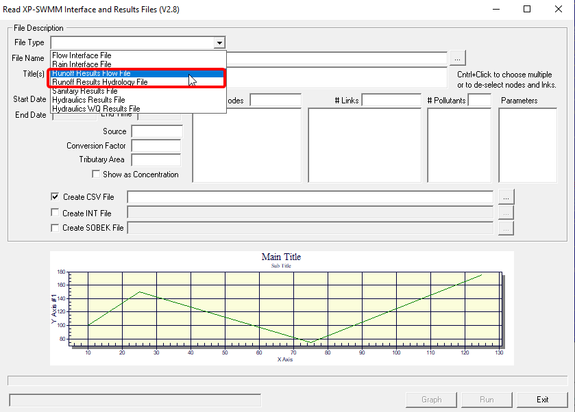\

\

The runoff results can be found in the \"1D\" simulation results folder, it can be located in the same folder of the model file (\*.xp).\

\

Pick the subcatchment(s), and the parameters to be plotted and exported as csv using the tool as shown below.\

\

\

\

======================================================================

======================================================================

# How to control pump using RTC in XPSWMM?

{
    "title": "How to control pump using RTC in XPSWMM?",
    "aid": "kA00P0000000yUoSAI_en_US_1.html",
    "software": "XPSWMM",
    "topic": "hydraulics",
    "summary": "The article explains how to control pump operations in XPSWMM using an RTC (Real-Time Control) rule. It illustrates a scenario where pump P1 starts at 105 ft and is shut off by an RTC rule when the water level reaches 108 ft, while pump P2 is activated at 109 ft. The rule ensures that P1 is disabled when the larger P2 is running, optimizing pump station operation. Simulation results and example setups are provided to demonstrate the effectiveness of this control strategy."
}

- Product: XPSWMM
- Topic: hydraulics

## Summary
The article explains how to control pump operations in XPSWMM using an RTC (Real-Time Control) rule. It illustrates a scenario where pump P1 starts at 105 ft and is shut off by an RTC rule when the water level reaches 108 ft, while pump P2 is activated at 109 ft. The rule ensures that P1 is disabled when the larger P2 is running, optimizing pump station operation. Simulation results and example setups are provided to demonstrate the effectiveness of this control strategy.

## Text

Typically, pumps are controlled by on and off levels. As the level in the wet well keeps rising, the 2^nd^ pump will kick in and if the level still rises, the next pump will kick in. However, in some situations, the pump station is designed to turn off the smaller pump when a much bigger pump is turned on. In this case, an RTC rule is needed to turn off the pump.

An example is shown below to illustrate how to set it up.

The setup below will start pump P1 when the water level is 105ft, and if the water level keeps rising, P2 will be turned on when the level is 109ft. An an RTC rule will be needed to turn off P1 at level 108ft.

+-----------------------------------+-----------------------------------+

| P1                                | P2                                |

+-----------------------------------+-----------------------------------+

| ON: 105\                          | ON: 109\                          |

| OFF: 102\                         | OFF: 104                          |

| OFF: 108                          |                                   |

+-----------------------------------+-----------------------------------+

\

The rule below says, if Node1\>108, then P1 speed factor is 0.\

And the simulation results is shown below,

======================================================================

======================================================================

# How to fix "swmm error: ERROR reading data for Conduit 2995" in XPSWMM

{
    "title": "How to fix \"swmm error: ERROR reading data for Conduit 2995\" in XPSWMM",
    "aid": "kA00P0000000yK3SAI_en_US_1.html",
    "software": "XPSWMM",
    "topic": "hydraulics",
    "summary": "This article addresses the error message \"swmm error: ERROR reading data for Conduit 2995\" encountered in XPSWMM. It explains that the numerical designation is a reference number and not the actual link ID used in the model. The article guides users to locate the correct link by referring to the *.dat file found in the result 1D folder and then reviewing the data within XPSWMM to resolve the error."
}

- Product: XPSWMM
- Topic: hydraulics

## Summary
This article addresses the error message "swmm error: ERROR reading data for Conduit 2995" encountered in XPSWMM. It explains that the numerical designation is a reference number and not the actual link ID used in the model. The article guides users to locate the correct link by referring to the *.dat file found in the result 1D folder and then reviewing the data within XPSWMM to resolve the error.

## Text

\

For the error: \"swmm error: ERROR reading data for Conduit 2995\", the conduit number 2995 in the error message is a reference number instead of the link ID entered in the model. The link ID can be found in the \*.dat file, which is saved in the result 1D folder.\

\

The instructions below shows an example on how to locate the pipe and fix the error.\

\

\

\

{.ckimgrsz style="max-width: 1133.0332946777344px;"}\

\

Go back the XPSWMM, we can locate the link and review the data.\

\

\

======================================================================

======================================================================

# What graphic card/video card are supported by XPSWMM 2D?

{
    "title": "What graphic card/video card are supported by XPSWMM 2D?",
    "aid": "kA00P0000000yIqSAI_en_US_1.html",
    "software": "XPSWMM",
    "topic": "2D modeling",
    "summary": "This article explains that only Nvidia CUDA 3.0 Compatible GPU Cards or newer are supported by XPSWMM for 2D hardware acceleration. It provides links to further details on system requirements and HPC introduction. The focus is on ensuring that the proper graphics card is used for efficient performance in the XPSWMM 2D environment."
}

- Product: XPSWMM
- Topic: 2D modeling

## Summary
This article explains that only Nvidia CUDA 3.0 Compatible GPU Cards or newer are supported by XPSWMM for 2D hardware acceleration. It provides links to further details on system requirements and HPC introduction. The focus is on ensuring that the proper graphics card is used for efficient performance in the XPSWMM 2D environment.

## Text

Only Nvidia CUDA 3.0 Compatible GPU Card or greater are supported by XPSWMM for 2D hardware acceleration. For more information,\

\

https://help.innovyze.com/display/xps/System+Requirements\

https://wiki.tuflow.com/index.php?title=HPC_Introduction\

 

======================================================================

======================================================================

# FATAL: SWMM5Service has been disconnected in XPSWMM

{
    "title": "FATAL: SWMM5Service has been disconnected in XPSWMM",
    "aid": "kA00P0000000yIlSAI_en_US_1.html",
    "software": "XPSWMM",
    "topic": "hydraulics",
    "summary": "The article explains that the error message 'FATAL: SWMM5Service has been disconnected in XPSWMM' occurs when the solve manager is closed before the simulation completes. To resolve the issue, it suggests ensuring the solve manager is kept open and recommends running one scenario at a time."
}

- Product: XPSWMM
- Topic: hydraulics

## Summary
The article explains that the error message 'FATAL: SWMM5Service has been disconnected in XPSWMM' occurs when the solve manager is closed before the simulation completes. To resolve the issue, it suggests ensuring the solve manager is kept open and recommends running one scenario at a time.

## Text

\

When the \"solve manager\" is closed before the simulation finishes, the user will get this error.\

\

Make sure the \"solve manager\" was not closed by accident. And you might try just \"solve\" one scenario.\

\

======================================================================

======================================================================

# Troubleshooting XPSWMM model with errors

{
    "title": "Troubleshooting XPSWMM model with errors",
    "aid": "kA00P0000000xidSAA_en_US_1.html",
    "software": "XPSWMM",
    "topic": "hydraulics",
    "summary": "The article provides a troubleshooting guide for errors encountered in XPSWMM models. It advises users to search the support portal, ensure the model file path is short and simple, and isolate issues by running different components (runoff, sanitary, hydraulics) separately. The guide suggests dividing the model into smaller sections to pinpoint problematic elements, making it easier to identify and fix errors."
}

- Product: XPSWMM
- Topic: hydraulics

## Summary
The article provides a troubleshooting guide for errors encountered in XPSWMM models. It advises users to search the support portal, ensure the model file path is short and simple, and isolate issues by running different components (runoff, sanitary, hydraulics) separately. The guide suggests dividing the model into smaller sections to pinpoint problematic elements, making it easier to identify and fix errors.

## Text

1.  Search the support portal for the error

2.  Make sure the model path is short and simple (without special characters)

    a.  Save a copy of the model to your local hard drive. For example, \"c:\\model\\model.xp\"

3.  Divide and conquer

    a.  run the runoff, sanitary, hydraulics model separately and see where it stops working

    b.  divide the model into smaller sections and isolate the model elements that is not working.

======================================================================

======================================================================

# How to fix "Weir Allocation exceeded Please contact Technical Support for Valid Authorization" in XPSWMM

{
    "title": "How to fix \"Weir Allocation exceeded Please contact Technical Support for Valid Authorization\" in XPSWMM",
    "aid": "kA00P0000000xhCSAQ_en_US_1.html",
    "software": "XPSWMM",
    "topic": "hydraulics",
    "summary": "This article explains how to resolve the error 'Weir Allocation exceeded Please contact Technical Support for Valid Authorization' in XPSWMM. The error occurs because the program's fixed array for handling weirs and orifices, defined in the SWMXP.INI file, has been exceeded. The article advises users to edit the MAX_WEIRS and MAX_ORIFICES values to larger numbers in the CONFIG section, then reopen the software to eliminate the error."
}

- Product: XPSWMM
- Topic: hydraulics

## Summary
This article explains how to resolve the error 'Weir Allocation exceeded Please contact Technical Support for Valid Authorization' in XPSWMM. The error occurs because the program's fixed array for handling weirs and orifices, defined in the SWMXP.INI file, has been exceeded. The article advises users to edit the MAX_WEIRS and MAX_ORIFICES values to larger numbers in the CONFIG section, then reopen the software to eliminate the error.

## Text

**W****hen we click on the \"review results\" icon an alert screen pops up that says \"Weir Allocation exceeded Please contact Technical Support for Valid Authorization\".\

When I try to close the alert or click \"ok\" another window continues to pop up. I have to go into the computer\'s task menu and end the xpswmm process.** \

\

The program has a fixed array for handling weirs and orifice results.  This is set when the program is loaded by reading the SWMXP.INI file.  In the CONFIG section you can find the following lines:\

\

MAX_WEIRS=800\

MAX_ORIFICES=700\

\

Simply edit the numbers for these to larger reasonable numbers and reopen the software.\

 

======================================================================

======================================================================

# Error:  Eind - not found:idx, n .. (XPSWMM)

{
    "title": "Error:  Eind - not found:idx, n .. (XPSWMM)",
    "aid": "kA00P0000000x5uSAA_en_US_1.html",
    "software": "XPSWMM",
    "topic": "other",
    "summary": "This article explains how to resolve an 'Eind - not found' error encountered in XPSWMM due to model database corruption. It details several recovery methods including exporting the model to an XPX file and re-importing it into a new, blank database, merging the corrupted model into a new database, or restoring from a backup file (.bak). These approaches can help strip out corrupted records and restore model functionality."
}

- Product: XPSWMM
- Topic: other

## Summary
This article explains how to resolve an 'Eind - not found' error encountered in XPSWMM due to model database corruption. It details several recovery methods including exporting the model to an XPX file and re-importing it into a new, blank database, merging the corrupted model into a new database, or restoring from a backup file (.bak). These approaches can help strip out corrupted records and restore model functionality.

## Text

\

\

It appears that your model has become corrupted.\

\

There are a couple ways to attempt to recover a file which has become corrupted - any time the \'Eind - not found\' error occurs, at least one database record has become corrupted and must be removed/updated in order for the model to work.\

\

I would first try to open the software and problematic model and attempt to use File-\>Import/Export database-\>Export XPX file. By exporting the entire model as an xpx file, then importing that xpx file into a blank model database any corrupted items will be stripped out of the model. you may also be able to open a blank/new model and use File-\>merge to bring your corrupted model into the new database. I would recommend trying to bring in only the model objects at first and see if the model can be saved. A combination of using the file-\>merge approach and the export to xpx file approach can be used as well - i.e. merge the database into a new model, then export, and then import into another blank model.\

\

The final possible solution would be to open a backup file (\*.bak) which was created when the model was in good health. A \*.bak file is created every time a model is successfully opened, so you may need to check with your local IT group to find a backup file from the point when the model was functioning correctly. I hope this helps. Please let us know if you have additional questions or concerns.\

\

 

======================================================================

======================================================================

# Error: Cannot find 'engine' item in 'main' section of application's INI file XPSWMM

{
    "title": "Error: Cannot find 'engine' item in 'main' section of application's INI file XPSWMM",
    "aid": "kA00P0000000x0LSAQ_en_US_1.html",
    "software": "XPSWMM",
    "topic": "other",
    "summary": "The article details an error encountered in XPSWMM where the 'engine' item cannot be located in the 'main' section of the application\u2019s INI file. It appears to be a configuration issue, potentially pointing to a missing or misconfigured parameter within the software settings. The error message is accompanied by a reference case number for troubleshooting purposes."
}

- Product: XPSWMM
- Topic: other

## Summary
The article details an error encountered in XPSWMM where the 'engine' item cannot be located in the 'main' section of the application’s INI file. It appears to be a configuration issue, potentially pointing to a missing or misconfigured parameter within the software settings. The error message is accompanied by a reference case number for troubleshooting purposes.

## Text

Reference:\

\

Case: 00358593\

 

======================================================================

======================================================================

# Conduit factors and selecting inlet type

{
    "title": "Conduit factors and selecting inlet type",
    "aid": "kA00P0000009GAOSA2_en_US_1.html",
    "software": "XPSWMM",
    "topic": "hydraulics",
    "summary": "This article explains the use of inlet types and loss coefficients in hydraulic modeling as applied to conduit factors. It details when to consider both an Inlet Type and the specified entrance and exit losses, ensuring the worst-case loss is applied. The document clarifies that when inlet control occurs, the model employs FHWA equations, computing losses based on either the designed inlet edge or the manual loss inputs, and states the differences in simulation outcomes when inlet control is or isn\u2019t detected."
}

- Product: XPSWMM
- Topic: hydraulics

## Summary
This article explains the use of inlet types and loss coefficients in hydraulic modeling as applied to conduit factors. It details when to consider both an Inlet Type and the specified entrance and exit losses, ensuring the worst-case loss is applied. The document clarifies that when inlet control occurs, the model employs FHWA equations, computing losses based on either the designed inlet edge or the manual loss inputs, and states the differences in simulation outcomes when inlet control is or isn’t detected.

## Text

**Question:** In Hydraulic mode, in the Conduit Factors for a conduit, there is the option to select an Inlet Type as well as enter in an Entrance and Exit loss coefficients.  If I select an Inlet Type do I want to leave the Entrance loss at 0 or do I also want an Entrance loss value?  If the Inlet Type is selected does this override the entrance loss or vise versa?\

\

**Answer:** In short, both the Inlet Type and inlet/exit losses should be used to ensure the worst case loss is applied.  If Inlet type is not specified, inlet control will not be checked and only the momentum equation used to calculate flow which can underestimate the resulting headwater levels if inlet control occurs. \

\

When Inlet Edge Type is used, the simulation will check the conduit for inlet control. The following are the protocol for what is used and what is not when inlet edge and losses are used when inlet control is found. \

\

No Inlet Edge and Inlet or Outlet Control Occurring:\

- Entrance and Exit Losses apply if entered\

- No check of Inlet Control is being performed\

\

Inlet Edge and Entrance and Exit Losses selected and Inlet Control Occurring:\

- The model has checked for Inlet control since an inlet edge design has been selected\

- The model uses the FHWA equations during Inlet control and computes the losses using the described shape or the entrance and exit losses, whichever is higher\

\

Inlet Edge and Entrance and Exit Losses selected and Inlet Control not Occurring:\

- The model has checked for Inlet control since an inlet edge design has been selected and it is not occurring\

- The model uses the FHWA typical xpswmm momentum equation and computes the losses using the friction and entrance and exit losses

======================================================================

======================================================================

# Storage Node Output Questions

{
    "title": "Storage Node Output Questions",
    "aid": "kA00P0000009GAESA2_en_US_1.html",
    "software": "XPSWMM",
    "topic": "hydraulics",
    "summary": "The article discusses generating detailed output results for storage nodes in hydraulic modeling. It explains how to display the calculations for stage-storage and stage-discharge for a pond and its outlet using the Hydraulics mode. It outlines that detailed printouts are obtained through specific output settings, including a summary interval and CSV file export options, and clarifies that the storage calculations are part of the dynamic wave routing method. The article also advises on exporting data for plotting storage versus time using external tools like Excel."
}

- Product: XPSWMM
- Topic: hydraulics

## Summary
The article discusses generating detailed output results for storage nodes in hydraulic modeling. It explains how to display the calculations for stage-storage and stage-discharge for a pond and its outlet using the Hydraulics mode. It outlines that detailed printouts are obtained through specific output settings, including a summary interval and CSV file export options, and clarifies that the storage calculations are part of the dynamic wave routing method. The article also advises on exporting data for plotting storage versus time using external tools like Excel.

## Text

**Question:** \

(1) Is there anyway to call out/show the calculations of the stage-storage and stage-discharge for the pond and its outlet. \

\

(2) What is the method used by the software for the stage-storage, stage-discharge and routing calculation.\

\

(3) How can I plot a Storage versus Time for the pond node? I couldn't find the related data information from the review results and XP-tables. What I found was just the maximum volume that is taken by the pond node.\

\

**Answer:**\

(1) The best way to create a stage-storage and stage-discharge for the pond and the outlet, is to select Options-\>Detail Printout for the node in the Hydraulics mode.  This tags the object for creating a time series for the node including depth, stage, volume and inflow and outflow among other results.  The frequency of the results are controlled in the Hydraulics-\>Job Control-\>Output Control-\>Summary Interval.  For example using a summary interval of 2 means every 2nd time step will be included in the detailed printout.  The detailed printout will be located in the output file unless the configuration parameter EXTERNAL_CSV is used in which case the detailed printout will be in the file modelname.csv where modelname is the name of the xp file.\

\

(2)Storage is an intrinsic part of the Dynamic Wave routing method.  A level water surface is assumed in the storage node and storage is calculated using the stage and area data entered by the user.  Additional points are generated to ensure a smooth transition as the storage fills and empties.  The stage discharge of the node is the hydraulics of the outlet structure.  For example an orifice and a weir as the outlet structure will have a flow rate based on the level in the pond and the downstream elevation.  The flow rate in conduits leaving the node will be the outflow from the storage node. \

\

(3) Using the method found in A load the CSV file or import the summary data from the output file in to Excel and create the plots in that program.

======================================================================

======================================================================

# XPSWMM Capabilities

{
    "title": "XPSWMM Capabilities",
    "aid": "kA00P0000009G9VSAU_en_US_1.html",
    "software": "XPSWMM",
    "topic": "hydraulics",
    "summary": "The article details the capabilities of XPSWMM, emphasizing its flexibility in modeling both urban and non-urban arid dendritic watersheds. It explains how the software subdivides complex watersheds into homogeneous units, integrates multiple hydrologic methods (including SWMM, kinematic wave, SCS, and others), and executes full hydraulic simulations with the St. Venant equations. The article also compares XPSWMM favorably against HEC-1, HEC-HMS, and HEC-RAS in terms of integrated hydrology/hydraulics, advanced 2D modeling, water quality, and groundwater interaction."
}

- Product: XPSWMM
- Topic: hydraulics

## Summary
The article details the capabilities of XPSWMM, emphasizing its flexibility in modeling both urban and non-urban arid dendritic watersheds. It explains how the software subdivides complex watersheds into homogeneous units, integrates multiple hydrologic methods (including SWMM, kinematic wave, SCS, and others), and executes full hydraulic simulations with the St. Venant equations. The article also compares XPSWMM favorably against HEC-1, HEC-HMS, and HEC-RAS in terms of integrated hydrology/hydraulics, advanced 2D modeling, water quality, and groundwater interaction.

## Text

**Question: **I would like your thoughts and answers to the following:\

We have a local client who is being sold on XPSWMM as the model of choice for modeling urban and non-urban arid, dendritic watersheds. Our watersheds are about 70% non-urban, and 30% urban. The watersheds are steep, mountainous, with highly variable precipitation over the valley, highly variable vege cover density, with limited calibration data. They are being told that XPSWMM will be more accurate and easier to update than an HEC-1 or an HMS model. XPSWMM's usefulness in urban systems is well known, but we are wondering if anyone has experience using it in non-urban arid dendritic watersheds? \

\

- Is XPSWMM applicable to this type of environment or would you suggest something else?\

- What loss and transform methods are available in XPSWMM? Older versions only supported kinematic wave transform....\

- Does it support other loss methods like Green and Ampt?\

- What are the pros and cons to using this software in urban and non-urban environments vs. HEC-1 or HMS?\

- What are the benefits of using XPSWMM for hydraulics over the HEC suite?\

\

**Answer:**\

***General Issues***\

XPSWMM is well suited to non-urban arid dendritic watersheds.  One of the key features is that XPSWMM allows you to subdivide a complex watershed (like the one you describe) into manageable pieces that can represent relatively homogeneous hydrologic units.  Up to 5 units can be created for each node in a drainage network - of course the drainage network can have unlimited nodes.  Thus, the runoff characteristics of diverse sections of the watershed can be accurately represented and the runoff can be routed through an open channel network with accuracy not possible in HEC-1 or HEC-HMS.  Further, doing this sort of model in XPSWMM rather than HEC-1 or HEC-HMS allows you to build incrementally and check model results as you add more complexity to the model.  XPSWMM allows you to run the simulation of hydrology/hydraulics on selected portions of the overall watershed - rather that requiring that the whole model be fully set up and parameterized before the 1st run as HEC-1 or HMS require.\

  \

XPSWMM has several hydrologic methods available that are suited to arid watershed modeling (see next question).  Further, the option to mix and match methods allows for greater flexibility than HEC-1 or HMS.  Finally, there are hydrologic processes that can be modeled more accurately with XPSWMM, such as evapotranspiration, groundwater interaction, water quality, than with HEC-1 or HMS.\

 \

Several private firms as well as public agencies use XPSWMM to model non-urban watersheds and mixed watersheds.  It is not uncommon for XPSWMM models to contain areas of non-urban, dendritic drainage as well as urban network drainage.\

\

***Applications in non-urban watersheds***\

XPSWMM is well suited to non-urban arid dendritic watersheds.  One of the key features is that XPSWMM allows you to subdivide a complex watershed (like the one you describe) into manageable pieces that can represent relatively homogeneous hydrologic units.  Up to 5 units can be created for each node in a drainage network - of course the drainage network can have unlimited nodes.  Thus, the runoff characteristics of diverse sections of the watershed can be accurately represented and the runoff can be routed through an open channel network with accuracy not possible in HEC-1 or HEC-HMS.  Further, doing this sort of model in XPSWMM rather than HEC-1 or HEC-HMS allows you to build incrementally and check model results as you add more complexity to the model.  XPSWMM allows you to run the simulation of hydrology/hydraulics on selected portions of the overall watershed - rather that requiring that the whole model be fully set up and parameterized before the 1st run as HEC-1 or HMS require. \

\

XPSWMM has several hydrologic methods available that are suited to arid watershed modeling (see next question).  Further, the option to mix and match methods allows for greater flexibility than HEC-1 or HMS.  Finally, there are hydrologic processes that can be modeled more accurately with XPSWMM, such as evapotranspiration, groundwater interaction, water quality, than with HEC-1 or HMS.\

\

***Available Hydrologic Methods*** \

SWMM Runoff Method (with Horton, Green Ampt or Uniform losses)\

Kinematic Wave Method (with Horton, Green Ampt or Uniform losses)\

SCS (Curve Number and Initial abstraction losses)\

Unit Hydrograph Methods - Santa Barbara, Clark, Snyder, Nash, Rational, Time Area (with Horton, Green Ampt or Uniform losses);\

Rational Method (composite loss coefficient)\

LA County Method (MODRAT)\

CUHP Method\

Sacramento County Method (modified HEC-1)\

Alameda County Method\

2D RAIN ON GRID\* (Green Ampt, Uniform Losses)\

 \

***XPSWMM vs HEC-1 & HMS***\

*Pros of XPSWMM* - integrated hydrology and full hydraulics; mix and match hydrologic methods to suit hydrologic units; GIS/CAD/Graphical interface for model building, results review, presentation; optional 2D overland flow modeling for flooding outside of channels or pipes; looped drainage networks are possible.\

*Cons of XPSWMM* - slower run times; more elaborate set up of models possible since more options are available; more input data required for full hydrology and hydraulics; cost.\

\

***XPSWMM Hydraulics***\

 \

When compared to HEC-1 or HMS, XPSWMM is vastly superior because it does full hydraulic calculations (St. Venant equations) vs. simple \"hydrologic routing\".  This means you will know depth and velocity (along with the EGL and HGL) at any point in time in XPSWMM.  \

 \

When compared with HEC-RAS, XPSWMM is superior because it handles fully dynamic hydraulics (not just steady state or \"quasi-steady\" gradually varied flow), it handles closed conduits under pressure flow conditions (pipes) which HEC-RAS does not, and it handles both dentritic and non-dendritic systems.  Open channel hydraulics can be handled well by both HEC-RAS or XPSWMM - both are FEMA approved and well tested.  Additional capability is available with XPSWMM hydraulics for water quality calculations and groundwater interaction. \

 \

XPSWMM is a fully integrated 1D/2D software system and has the ability to model either 1D/2D integrated simulations or purely 2D hydraulic simulations -- which is something which HEC-RAS, HMS, HEC-1 and the majority of other software packages cannot simulate.  As mentioned above there is also the option to simulate direct rainfall on the 2D grid, which can allow for every detailed or complicated design and assessment of surface runoff by using a 2D grid to apply the rainfall.

======================================================================

======================================================================

# Failed Integration with SWMM

{
    "title": "Failed Integration with SWMM",
    "aid": "kA00P0000009G9aSAE_en_US_1.html",
    "software": "XPSWMM",
    "topic": "hydraulics",
    "summary": "The article addresses an intermittent 'Failed Integration with SWMM' error observed on slower computers running XPSWMM. It explains that on less powerful machines the engine may load slowly, falsely triggering an error even though simulation results are still produced. The recommended fixes include stopping the simulation and re-resolving the model, checking folder path formatting, closing down other programs to free up processing power, and switching to 64\u2010bit mode. These workarounds help ensure that results are properly updated in the database, despite the misleading error message."
}

- Product: XPSWMM
- Topic: hydraulics

## Summary
The article addresses an intermittent 'Failed Integration with SWMM' error observed on slower computers running XPSWMM. It explains that on less powerful machines the engine may load slowly, falsely triggering an error even though simulation results are still produced. The recommended fixes include stopping the simulation and re-resolving the model, checking folder path formatting, closing down other programs to free up processing power, and switching to 64‐bit mode. These workarounds help ensure that results are properly updated in the database, despite the misleading error message.

## Text

**Question:** I sometimes have some problems running the software. On my more powerful computer at work, there seem to be no problem. On my less powerful computer at home the model ran but every now and then, I get an error message saying that there was failed integration with SWMM. Any suggestions?\

\

**Answer:** This issue can arise on very slow computers when the software has taken so long to load the engine that it falsely assumes that the engine could not load. When you get the failed integration message happens, even though the engine will continue to solve the simulation and produce the appropriate results files, the results files will not be loaded into the xp database. This will affect things like xptables, i.e. your xptables results will not be updated though your review results/dynamic section view animations/hydrographs will.\

\

The solution would be to stop the simulation, and then resolve the model, as the failed integration message typically does not occur since windows solves systems faster the second time they are run. If the error continues to be shown there may be an issue with writing the results files. Of course another option is to run the software on a faster computer or try closing down other programs which are currently running on the machine so that more processing power can be diverted to xpswmm.  It would also be helpful to check for special characters in the folder path, which should be less than 80 characters. You may also try to go to Configuration -\> Mode Properties -\> Methods -\> 64-bit, then resolve the model again. \

 

======================================================================

======================================================================

# How do I model a Pond or detention basin in 1D/2D?

{
    "title": "How do I model a Pond or detention basin in 1D/2D?",
    "aid": "kA00P000000LWpLSAW_en_US_1.html",
    "software": "XPSWMM",
    "topic": "2D modeling",
    "summary": "The article discusses two practical methods to represent a pond or detention basin in a combined 1D/2D model. One approach involves simulating the basin using a 1D storage node with the corresponding 2D surface area rendered inactive. The alternative method alters the 2D topography directly by creating depressions through fill or elevation shapes, and can simulate outflows via 1D links connecting to the modified 2D domain. An example model is provided, demonstrating how various topographic modifications, including berm creation, can effectively represent basin storage characteristics within the simulation."
}

- Product: XPSWMM
- Topic: 2D modeling

## Summary
The article discusses two practical methods to represent a pond or detention basin in a combined 1D/2D model. One approach involves simulating the basin using a 1D storage node with the corresponding 2D surface area rendered inactive. The alternative method alters the 2D topography directly by creating depressions through fill or elevation shapes, and can simulate outflows via 1D links connecting to the modified 2D domain. An example model is provided, demonstrating how various topographic modifications, including berm creation, can effectively represent basin storage characteristics within the simulation.

## Text

**Question**:  How do I model a pond design or detention basin in 1D/2D?\

\

**Solution**:  There are two ways you could easily do this.  One would be to represent the storage at a 1D node and then make the surface area defined by the basin itself to be 2D inactive, since the storage basin accounts for that surface area.\

\

The second way to do it would be to use one of the 2D Topography shape options within the xp interface to adjust the elevations adopted by the 2D domain and model the basin storage directly within the 2D portion of the model.  By using either the Fill Area or an Elevation Shape option you can create a depression in the 2D domain which represents your basin.  Any outflow from this basin (i.e. outflow pipes or structures) can be simulated by using a 1D link which has the upstream node connected to 2D. You can also use either the Ridge or Elevation Shape options to create a berm around a given 2D grid area, creating a storage facility/pond.\

\

An example of a detention basin model using this method is shown below. \

\

  **{height="302" width="500"}**

======================================================================

======================================================================

# How to setup inlet capacity in XPSWMM?

{
    "title": "How to setup inlet capacity in XPSWMM?",
    "aid": "kA00P0000000xS8SAI_en_US_2.html",
    "software": "XPSWMM",
    "topic": "2D modeling",
    "summary": "The article explains how to configure inlet capacity in XPSWMM. It discusses settings for a 1D inlet, including defining depth at the surface node, positioning the invert relative to connected channels, and setting default storage to represent a manhole. It also provides guidance on how to adjust storage if a different size is needed. Additionally, the article outlines three approaches for integrating inlets in a combined 1D/2D model, providing options for linking 2D inlet capture, using inlet capacity with a link to 2D, or modeling multiple nodes with a multilink conduit."
}

- Product: XPSWMM
- Topic: 2D modeling

## Summary
The article explains how to configure inlet capacity in XPSWMM. It discusses settings for a 1D inlet, including defining depth at the surface node, positioning the invert relative to connected channels, and setting default storage to represent a manhole. It also provides guidance on how to adjust storage if a different size is needed. Additionally, the article outlines three approaches for integrating inlets in a combined 1D/2D model, providing options for linking 2D inlet capture, using inlet capacity with a link to 2D, or modeling multiple nodes with a multilink conduit.

## Text

For 1D inlet, please refer to [Inlet Capacity](https://innovyze.force.com/support/s/article/Inlet-Capacity) for more information

-   The depth is defined as the depth in the surface node when Inlet capacity is turned on. 

-   The invert of that node is the lowest invert of a connected open channel such as a natural channel to represent the street.

-   The storage of the inlet by default is 12.77 ft\^2 to represent a 4ft diameter manhole.  If you need another size then make it a storage node.

    -   Typically if you need another size you will enable **Storage, Measure Depth From Node Invert **then use **Constant** and enter the constant surface area.  For the **Surcharge Elevation** select **Use Spill Crest Elevation**.

\

\

\

For 2D model, there are three common options for modeling the Inlet in a 1D/2D model.\

           1) **Use the 2D Inlet Capture at a node with the Link Spill Crest to 2D**.  This option will allow you to have a curve to relate the depth on the cell to the 2D capture.  Care should be made that the cell elevation and the node Spill Crest are similar elevations.\

            2) **Use Inlet Capacity at a node with the Link Spill Crest to 2D.**  This option allows you to use the inlet capacity options with the Maximum Capacity or Rated by Approach Depth as the common option.  The depth can be calculated as the depth in the cell if node storage characteristics is used and the cell is depressed appropriately or you can enter the street geometry to calculate the depth in Pavement Characteristics.\

             3) **Use multiple nodes.  **In this case an inlet node is modeled and is linked to 2D.  A manhole is modeled and is sealed.  Between the two nodes is a multilink conduit with only a rating curve to describe the head vs. flow relationship

======================================================================

======================================================================

# Error The program attempted to read line --> E2 and this is an echo of what it found: (XPSWMM)

{
    "title": "Error The program attempted to read line --> E2 and this is an echo of what it found: (XPSWMM)",
    "aid": "kA00P0000000x4wSAA_en_US_2.html",
    "software": "XPSWMM",
    "topic": "hydraulics",
    "summary": "This article explains how to resolve an error in XPSWMM that occurs when the program attempts to read a specific input line (E2). The error is linked to improperly configured storage node parameters, specifically discrepancies in the storage curve where the depth does not match the crest and invert levels. A troubleshooting method is provided: iteratively deactivating halves of the network to isolate the problematic node. The article concludes with an example where the node 'DryCkPond' is identified and fixed by removing an erroneous 6ft entry."
}

- Product: XPSWMM
- Topic: hydraulics

## Summary
This article explains how to resolve an error in XPSWMM that occurs when the program attempts to read a specific input line (E2). The error is linked to improperly configured storage node parameters, specifically discrepancies in the storage curve where the depth does not match the crest and invert levels. A troubleshooting method is provided: iteratively deactivating halves of the network to isolate the problematic node. The article concludes with an example where the node 'DryCkPond' is identified and fixed by removing an erroneous 6ft entry.

## Text

The error message looks like this,\

*You had an error in your input data.*\

* Did you include enough values or zeroes for all parameters on an input line??*\

* The program attempted to read line \--\> E2 and this is an echo of what it found:*\

* \'E1\'  \'1366\', 149.530, -1.0, 64, 0, -9999.0, 0,   *\

\

This is an indication something is wrong with the parameters of storage.\

In general, the message is not very useful to identify the storage node directly. One trick is to deactivate half the nodes at a time to isolate the nodes with the issue.\

Switch to  hydraulics if needed.\

1.  Select half of the network

2.  Deactivate them

3.  Run the model, if the error shows, keep doing this for the rest half. It the error is gone, then the deactivated half has the node with the problem

\

Using this method we isolated node "DryCkPond" shown below, and the error is the depth in the storage curve doesn't match the Crest and Invert. By removing the last entry at 6ft deep, the problem was fixed.\

\

\

\

\

 

======================================================================

======================================================================

# How to get results for multiple storms in XPSWMM

{
    "title": "How to get results for multiple storms in XPSWMM",
    "aid": "kA00P0000000xjqSAA_en_US_2.html",
    "software": "XPSWMM",
    "topic": "hydrology",
    "summary": "The article explains how to obtain simulation results for multiple storms within the XPSWMM software. It clarifies that only storms selected in the global storms dialog will be simulated and advises checking specific settings if the expected results are not displaying. An illustrative image is included to aid users in troubleshooting. Authored by Mel Meng on 10/10/2019, the article serves as a quick guide for managing multiple storm events within the software."
}

- Product: XPSWMM
- Topic: hydrology

## Summary
The article explains how to obtain simulation results for multiple storms within the XPSWMM software. It clarifies that only storms selected in the global storms dialog will be simulated and advises checking specific settings if the expected results are not displaying. An illustrative image is included to aid users in troubleshooting. Authored by Mel Meng on 10/10/2019, the article serves as a quick guide for managing multiple storm events within the software.

## Text

Only the storms checked int he global storms dialog will be simulated, if the results are not showing check the following.\

\

\

======================================================================

======================================================================

# Troubleshooting XPSWMM large continuity errors

{
    "title": "Troubleshooting XPSWMM large continuity errors",
    "aid": "kA00P0000000xh2SAA_en_US_2.html",
    "software": "XPSWMM",
    "topic": "hydraulics",
    "summary": "The article explains how to troubleshoot large continuity errors in XPSWMM models by checking the output logs and understanding error ranges. It discusses common causes such as model initialization issues, unfavorable boundary conditions, and sudden condition changes leading to flow spikes. The article also notes a recent update that fixed false high error reports in 1D/2D models, and recommends using a hot-restart file and adjusting model parameters to resolve stability problems."
}

- Product: XPSWMM
- Topic: hydraulics

## Summary
The article explains how to troubleshoot large continuity errors in XPSWMM models by checking the output logs and understanding error ranges. It discusses common causes such as model initialization issues, unfavorable boundary conditions, and sudden condition changes leading to flow spikes. The article also notes a recent update that fixed false high error reports in 1D/2D models, and recommends using a hot-restart file and adjusting model parameters to resolve stability problems.

## Text

It is a good practice to check the continuity errors of a model run. It can be found in "Analyze-\>Show Output Logs". The 1D log table e18 explains the range of excellent to poor continuity error.\

\

\

\

When the continuity error is poor, there are several common causes,

-   We recently made an update to the program as it was falsely reporting high error in 1D output for 1D/2D models. The versions affected are (TODO: work with Tony to get more details)

-   When the model is initialized, it might cause stability issues. Filling an empty system, boundary conditions such as high outfall levels can cause spikes of flows at the beginning of the simulation. This can be resolved using a [hot-restart file](https://help.innovyze.com/display/xps/Hydraulics+Mode+Job+Control#HydraulicsModeJobControl-HotRestartHotRestart(REDO)).

-   Stability issues, when unusual spikes or oscillations are observed in simulation results, it signals stability issues. Common stability issues are causes by sudden change of conditions from one time step to the next, for example,

    -   The pipe switches between surcharged and not surcharged conditions. This switch will cause the equation to calculate of the flow change, therefore a sudden change of flow. A fix will be to evaluate the situation and pick a more conservative approach, assume the pipe will be surcharged by adjusting its size or depth to avoid the stability issues.

    -   The cross sections changes significantly, say a 50ft channel with 1000ft over bank. When the water level is around the change point, it can cause stability issues. Similarly engineering judgement is required to setup the model in a stable state to evaluate the conditions

\

\* TODO: add more 2D continuity error tips.

======================================================================

======================================================================

# How to automatically run a large number of simulation in XPSWMM?

{
    "title": "How to automatically run a large number of simulation in XPSWMM?",
    "aid": "kA00P0000000xSNSAY_en_US_2.html",
    "software": "XPSWMM",
    "topic": "2D modeling",
    "summary": "The article explains methods to automate numerous simulation runs in XPSWMM. It discusses importing land use data with geometry from shapefiles using 2D advanced settings and creating XP models via text script. It also describes batch processing simulations through Solve Manager and remote execution on a cluster using a floating license. Additionally, the article reviews the GPU module licensing, including its pricing, maintenance, and performance requirements when used for high 2D cell count models."
}

- Product: XPSWMM
- Topic: 2D modeling

## Summary
The article explains methods to automate numerous simulation runs in XPSWMM. It discusses importing land use data with geometry from shapefiles using 2D advanced settings and creating XP models via text script. It also describes batch processing simulations through Solve Manager and remote execution on a cluster using a floating license. Additionally, the article reviews the GPU module licensing, including its pricing, maintenance, and performance requirements when used for high 2D cell count models.

## Text

\

**1) Can we import land use data (Manning\'s coefficient and soil type) at the same time as we import the geometry from shape files. Is there a way to associate these values with a shape file that XPSWMM can read?** \

Yes, Land Use Data can be externally referenced by leveraging the 2D Advanced Settings.  It still requires some Global Land Use data which can be synchronized with the GIS Layer. [https://help.innovyze.com/display/xps/2D+Job+Control+Settings#id-2DJobControlSettings-AdvancedSettingsAdvancedSettings](https://help.innovyze.com/display/xps/2D+Job+Control+Settings#id-2DJobControlSettings-AdvancedSettingsAdvancedSettings){target="_blank"}\

\

There is documentation on [XPX import ](http://https:/help.innovyze.com/display/xps/XPX+Format+File){target="_blank"}(automatically creating an XP model via[ text script](https://help.innovyze.com/display/xps/XPX+Format+File#XPXFormatFile-XPXCommandReferenceXPXCommandReference){target="_blank"} ), to running models using [Solve Manager](https://help.innovyze.com/display/xps/The+Analyze+Menu#TheAnalyzeMenu-SolvemanagerSolveManager){target="_blank"} to batch multiple scenarios or global storms together.\

\

**2) Because of the large number of files, we\'re also interested in being able to queue them on a cluster and run a study overnight. Is this something that can be done? **\

Remote simulations do require a floating license.   There is no separate way to perform a remote simulation on a cluster with XPSWMM besides using Remote Desktop to open XPSWMM on a cluster machine, consuming the license, and performing the simulation.  At this time, only InfoWorks ICM provides remote simulations.\

\

**4) What is the price range for the GPU module? Is it possible to get a trial version?** \

The GPU module license for a floating license runs about \$6,750 plus 20% InfoCare maintenance.   The GPU license works extremely well when 2D cell count is above 100K cells and only runs on a single NVidia GPU processors, but does not work when multiple domains are present.

======================================================================

======================================================================

# How to download legacy XPSWMM installer?

{
    "title": "How to download legacy XPSWMM installer?",
    "aid": "kA00P0000000x56SAA_en_US_2.html",
    "software": "XPSWMM",
    "topic": "other",
    "summary": "The article lists download links for legacy versions of XPSWMM, including versions 2016.1, 2017.2, 2018.1, 2018.2.2, and 2019.1.1. It informs users that each installation directory contains a 'Changes.txt' file, which details the engine modifications and updates implemented in that version. This resource is intended to help users access earlier versions of the software and review the documented changes made over time."
}

- Product: XPSWMM
- Topic: other

## Summary
The article lists download links for legacy versions of XPSWMM, including versions 2016.1, 2017.2, 2018.1, 2018.2.2, and 2019.1.1. It informs users that each installation directory contains a 'Changes.txt' file, which details the engine modifications and updates implemented in that version. This resource is intended to help users access earlier versions of the software and review the documented changes made over time.

## Text

[http://go.innovyze.com/xpswmm2016.1](http://go.innovyze.com/xpswmm2016.1)\

[http://go.innovyze.com/xpswmm2017.2](http://go.innovyze.com/xpswmm2017.2)\

\

Version 2018.1:\

\

[http://go.innovyze.com/xpswmm-installer](http://go.innovyze.com/xpswmm-installer)\

\

[http://go.innovyze.com/xpswmm2018.2.2](http://go.innovyze.com/xpswmm2018.2.2)\

\

[http://go.innovyze.com/xpswmm2019.1.1](http://go.innovyze.com/xpswmm2019.1.1)\

For each version, if you go to the installation directory you will see a "Changes.txt" file which describes all the engine changes that were implemented in that version. That document is a living continuously updated document, so if you open the one that came with 2019.1.1. you can see all the changes implemented in each of the preceding versions.

======================================================================

======================================================================

# Troubleshooting XPSWMM Model Not Running

{
    "title": "Troubleshooting XPSWMM Model Not Running",
    "aid": "kA00P0000000x4rSAA_en_US_2.html",
    "software": "XPSWMM",
    "topic": "other",
    "summary": "This article provides diagnostic steps for troubleshooting issues when the XPSWMM model fails to run. It walks users through selecting the appropriate simulation scenarios, verifying those selections in the scenario manager, checking error messages in the simulation log, and identifying common errors that could be causing the failure. Visual guides and screenshots are included to help pinpoint where the process might be breaking down, enabling users to make the necessary corrections to get the model running successfully."
}

- Product: XPSWMM
- Topic: other

## Summary
This article provides diagnostic steps for troubleshooting issues when the XPSWMM model fails to run. It walks users through selecting the appropriate simulation scenarios, verifying those selections in the scenario manager, checking error messages in the simulation log, and identifying common errors that could be causing the failure. Visual guides and screenshots are included to help pinpoint where the process might be breaking down, enabling users to make the necessary corrections to get the model running successfully.

## Text

# Select the Scenario(s) to Run

Only scenarios checked in the scenario Manager will run.

# 

# What simulation to run

Check all the simulation options to run

# 

# 

# Review the error Message

# 

For more complete information show the log, usually error messages are at the end of the log file.

# 

# Common Errors

TODO: add more\

[Error The program attempted to read line \--\> E2 and this is an echo of what it found: (XPSWMM)](https://innovyze.lightning.force.com/lightning/r/Knowledge__kav/ka00P0000001BoFQAU/view?0.source=aloha){target="_blank"}\

 

======================================================================

======================================================================

# Troubleshooting XPSWMM UI issues

{
    "title": "Troubleshooting XPSWMM UI issues",
    "aid": "kA00P0000000x3FSAQ_en_US_2.html",
    "software": "XPSWMM",
    "topic": "other",
    "summary": "The article focuses on troubleshooting common user interface issues in XPSWMM, specifically addressing problems where button controls become hidden or cut off. It provides guidance to help users access these controls and resolve related UI problems, ensuring the software functions smoothly."
}

- Product: XPSWMM
- Topic: other

## Summary
The article focuses on troubleshooting common user interface issues in XPSWMM, specifically addressing problems where button controls become hidden or cut off. It provides guidance to help users access these controls and resolve related UI problems, ensuring the software functions smoothly.

## Text

[How to access buttons controls hidden got cut off in XPSWMM](https://innovyze.lightning.force.com/lightning/r/Knowledge__kav/ka00P0000001BlzQAE/view){target="_blank"}

======================================================================

======================================================================

# Error: Cannot find 'engine' item in 'main' section of application's INI file XPSWMM

{
    "title": "Error: Cannot find 'engine' item in 'main' section of application's INI file XPSWMM",
    "aid": "kA00P0000000x0LSAQ_en_US_2.html",
    "software": "XPSWMM",
    "topic": "licensing",
    "summary": "The article explains how to resolve an error in XPSWMM where the 'engine' item is missing from the main section of the application's INI file. It advises users to check application settings, verify file paths by copying them from the file explorer, and utilize the XP Diagnostic tool to examine the license file for potential issues."
}

- Product: XPSWMM
- Topic: licensing

## Summary
The article explains how to resolve an error in XPSWMM where the 'engine' item is missing from the main section of the application's INI file. It advises users to check application settings, verify file paths by copying them from the file explorer, and utilize the XP Diagnostic tool to examine the license file for potential issues.

## Text

Most likely something is wrong in the application settings.\

\

check application setting in the user interface\

{height="336" style="" width="321"}\

\

{height="318" style="" width="382"}\

Please verify the paths are correct, you might want to copy and paste the path from file explorer.\

\

\

- check application setting files\

- Using the XP Diagnostic tool to check the license file

======================================================================

======================================================================

# Troubleshooting XPSWMM License

{
    "title": "Troubleshooting XPSWMM License",
    "aid": "kA00P0000000x1iSAA_en_US_2.html",
    "software": "XPSWMM",
    "topic": "licensing",
    "summary": "This article provides troubleshooting steps for resolving issues with the XPSWMM license. It instructs users to ensure that the license dongle is properly connected and powered, run a diagnostic tool to verify the license file, and consider installing a newer version of the software if required. It also advises checking the FAQ if the license is expired."
}

- Product: XPSWMM
- Topic: licensing

## Summary
This article provides troubleshooting steps for resolving issues with the XPSWMM license. It instructs users to ensure that the license dongle is properly connected and powered, run a diagnostic tool to verify the license file, and consider installing a newer version of the software if required. It also advises checking the FAQ if the license is expired.

## Text

1\. Make sure the dongle is plugged in, and the light turned on\

2. Run the diagnostic tool to check the license file\

3. Install a newer version of the software, need to check the license. If the license expired, refer to TODO: license FAQ

======================================================================

======================================================================

# XX DELETE Mel Meng Articles

{
    "title": "XX DELETE Mel Meng Articles",
    "aid": "kA00P0000000x0QSAQ_en_US_2.html",
    "software": "XPSWMM",
    "topic": "hydraulics",
    "summary": "This article is a compilation of knowledge base entries created by Mel Meng, focusing on troubleshooting XPSWMM features. It includes sections on plotting and graphing, specifically addressing issues with the Runoff Node Chart where rainfall data cannot be plotted, and a general section on errors, notably an 'Error Engine not found' message. The article serves as a master list to assist users in identifying and resolving common issues encountered during XPSWMM operation."
}

- Product: XPSWMM
- Topic: hydraulics

## Summary
This article is a compilation of knowledge base entries created by Mel Meng, focusing on troubleshooting XPSWMM features. It includes sections on plotting and graphing, specifically addressing issues with the Runoff Node Chart where rainfall data cannot be plotted, and a general section on errors, notably an 'Error Engine not found' message. The article serves as a master list to assist users in identifying and resolving common issues encountered during XPSWMM operation.

## Text

# XPSWMM

## Plotting/Graphing

### Runoff Node Chart

-   [I cannot plot rainfall in graph](https://innovyze.lightning.force.com/lightning/r/Knowledge__kav/ka00P0000001BbkQAE/view){target="_blank"}

## General

### Error Message

-   [Error Engine not found](https://innovyze.lightning.force.com/lightning/r/ka00P0000001BbpQAE/view "Error Engine not found"){.slds-truncate .outputLookupLink .slds-truncate .forceOutputLookup target="_blank"}

======================================================================

======================================================================

# How to export plot XPSWMM modeling results saved in binary file?

{
    "title": "How to export plot XPSWMM modeling results saved in binary file?",
    "aid": "kA00P0000000x0VSAQ_en_US_2.html",
    "software": "XPSWMM",
    "topic": "hydrology",
    "summary": "The article explains how to export hydrology modeling results from XPSWMM. It details launching the Interface Utilities (InterfaceUtils.exe), selecting the 'Runoff Results Hydrology File' type, and choosing the appropriate .syh file from the 1D results directory. Users are guided on how to select specific parameters (like Infiltration and Excess Rainfall), graph the data, and export the plot to the clipboard or save it as a CSV file. An alternative method for simpler models by directly entering rainfall data into the Runoff node is also suggested."
}

- Product: XPSWMM
- Topic: hydrology

## Summary
The article explains how to export hydrology modeling results from XPSWMM. It details launching the Interface Utilities (InterfaceUtils.exe), selecting the 'Runoff Results Hydrology File' type, and choosing the appropriate .syh file from the 1D results directory. Users are guided on how to select specific parameters (like Infiltration and Excess Rainfall), graph the data, and export the plot to the clipboard or save it as a CSV file. An alternative method for simpler models by directly entering rainfall data into the Runoff node is also suggested.

## Text

\

\

Tools -\> Launch Application -\> InterfaceUtils.exe\

\

This opens the Interface Utilities Tools dialog.\

\

Within the File Type pulldown choose \"Runoff Results Hydrology File\"\

\

Click on \"\...\" for the File Name field, and choose the .syh file from the 1D results directory, this files contains the hydrology results.\

\

Towards the middle of the dialog, all the objects available in this data file are shown. In your case it will show \"Subbasin\", you can click on \"Subbasin\", and then next on the right-hand side pick from the parameters that you want: Infiltration and Excess Rainfall are shown there.\

\

At the very bottom you can click on \"Graph\" to graph these, where you can then click on the graph and export to clipboard. Alternatively, you can click on \"Run\" to save the selected data as a .csv file.\

\

If your model is very simple, another approach that you can consider is to turn off Global Storms and enter the rainfall data directly into the Runoff node. If you do this and the run the analysis, then you can review the results in the normal way. Then within the review results window, you can click on \"Properties\" and choose the options to turn on Infiltration and Excess Rainfall.\

\

\

\

 

======================================================================

======================================================================

# How to plot rainfall in graph XPSWMM?

{
    "title": "How to plot rainfall in graph XPSWMM?",
    "aid": "kA00P0000000x0GSAQ_en_US_2.html",
    "software": "XPSWMM",
    "topic": "hydrology",
    "summary": "The article explains how to properly plot rainfall data in XPSWMM by addressing common issues. It highlights the need to switch to runoff mode to view runoff results and provides steps for handling multiple scenarios and global rainfall settings. Specifically, it advises disabling all scenarios except the one of interest, and either removing global rainfall to assign rainfall to individual nodes or using the provided interface tool for plotting flows."
}

- Product: XPSWMM
- Topic: hydrology

## Summary
The article explains how to properly plot rainfall data in XPSWMM by addressing common issues. It highlights the need to switch to runoff mode to view runoff results and provides steps for handling multiple scenarios and global rainfall settings. Specifically, it advises disabling all scenarios except the one of interest, and either removing global rainfall to assign rainfall to individual nodes or using the provided interface tool for plotting flows.

## Text

Runoff results can only be plotted under Runoff Mode.\

- switch to runoff mode\

\

When multiple scenarios are used, you can only graph flows\

- turn off all the scenarios but the one of interests\

\

When global rainfall is used, you can only graph flows\

- remove global rainfall and assign rainfall to the individual nodes, or\

- [use the interface tool](https://innovyze.lightning.force.com/lightning/r/Knowledge__kav/ka00P0000001BcOQAU/view){target="_blank"}\

\

\

\

 

======================================================================

======================================================================

# Troubleshooting XPSWMM License

{
    "title": "Troubleshooting XPSWMM License",
    "aid": "kA00P0000000x1iSAA_en_US_3.html",
    "software": "XPSWMM",
    "topic": "licensing",
    "summary": "The article addresses a licensing error encountered when starting the XPSWMM software. It provides guidance on troubleshooting the error, ensuring that users can resolve the licensing issues quickly. The focus is on identifying and fixing the problem to restore normal operation of the application."
}

- Product: XPSWMM
- Topic: licensing

## Summary
The article addresses a licensing error encountered when starting the XPSWMM software. It provides guidance on troubleshooting the error, ensuring that users can resolve the licensing issues quickly. The focus is on identifying and fixing the problem to restore normal operation of the application.

## Text

Got an error related to license when starting XPSWMM

======================================================================

======================================================================

# How to export plot XPSWMM modeling results saved in binary file?

{
    "title": "How to export plot XPSWMM modeling results saved in binary file?",
    "aid": "kA00P0000000x0VSAQ_en_US_3.html",
    "software": "XPSWMM",
    "topic": "hydraulics",
    "summary": "This article explains how to use XPSWMM's built-in tool to plot and export modeling results stored in a binary file. It guides users through a step-by-step process to visualize simulation data and generate meaningful outputs for further analysis."
}

- Product: XPSWMM
- Topic: hydraulics

## Summary
This article explains how to use XPSWMM's built-in tool to plot and export modeling results stored in a binary file. It guides users through a step-by-step process to visualize simulation data and generate meaningful outputs for further analysis.

## Text

How I can plot and export the results saved in the modeling results?

======================================================================

======================================================================

# How to plot rainfall in graph XPSWMM?

{
    "title": "How to plot rainfall in graph XPSWMM?",
    "aid": "kA00P0000000x0GSAQ_en_US_3.html",
    "software": "XPSWMM",
    "topic": "hydrology",
    "summary": "The article discusses an issue encountered in XPSWMM where only flow data is shown in graphs even when attempting to display rainfall, infiltration, and excess rainfall results. It explains that the default model setup may prevent rainfall data from being plotted and suggests checking or changing the model configuration to ensure these additional hydrologic variables are included in the graphical outputs."
}

- Product: XPSWMM
- Topic: hydrology

## Summary
The article discusses an issue encountered in XPSWMM where only flow data is shown in graphs even when attempting to display rainfall, infiltration, and excess rainfall results. It explains that the default model setup may prevent rainfall data from being plotted and suggests checking or changing the model configuration to ensure these additional hydrologic variables are included in the graphical outputs.

## Text

How can I plot the rainfall, infiltration, excess rainfall of the runoff results? Only flow showed up.

======================================================================

======================================================================

# Not flow in pumps - wet well has an inlet capacity turned on

{
    "title": "Not flow in pumps - wet well has an inlet capacity turned on",
    "aid": "kA04U000000HzoySAC_en_US_1.html",
    "software": "XPSWMM",
    "topic": "hydraulics",
    "summary": "The article explains that with inlet capacity turned on, XPSWMM creates two nodes: an inlet (0.01ft depth) and an underground node. When a pump is connected, it erroneously assumes attachment to the inlet node, leading to no flow since this configuration is incorrect. The suggested workaround is to use a dummy inlet node that drains into a wet well node without inlet capacity enabled."
}

- Product: XPSWMM
- Topic: hydraulics

## Summary
The article explains that with inlet capacity turned on, XPSWMM creates two nodes: an inlet (0.01ft depth) and an underground node. When a pump is connected, it erroneously assumes attachment to the inlet node, leading to no flow since this configuration is incorrect. The suggested workaround is to use a dummy inlet node that drains into a wet well node without inlet capacity enabled.

## Text

When inlet capacity is turned on, XPSWMM creates two nodes internally. One is setting on top of the existing manhole to represent the inlet, which has a depth of 0.01ft. Inflow needs to go through the inlet node before entering the underground node (subsurface node), and the inlet capacity is enforced using the link between the inlet and the subsurface node.\

\

\

\

When a pump is connected to the wetwell with inlet capacity turned on, it assumes the pump is connected to the inlet (0.01ft below the surface), and in most cases it is not correct. And that is the reason that there is no flow in the pumps.\

\

The workaround is to create a dummy inlet node that drains to a wet well node which doesn\'t have inlet capacity turned on.

======================================================================

======================================================================

# How to batch update model attributes using Excel?

{
    "title": "How to batch update model attributes using Excel?",
    "aid": "kA04U000000UOSQSA4_en_US_1.html",
    "software": "XPSWMM",
    "topic": "hydraulics",
    "summary": "This tutorial video illustrates an effective process for batch updating model attributes using Excel integrated with hydraulic modeling software. It demonstrates how to extract a full list of model elements from XPSWMM, export the table to Excel, and utilize Excel\u2019s functions such as vlookup to compare current values with updated external data. The video explains the workflow for identifying, reviewing, and applying modifications selectively by filtering records and pasting changes back into the model. Special attention is given to handling formatting issues in Excel to ensure accurate data matching and minimize errors during the update process for reliable results consistently."
}

- Product: XPSWMM
- Topic: hydraulics

## Summary
This tutorial video illustrates an effective process for batch updating model attributes using Excel integrated with hydraulic modeling software. It demonstrates how to extract a full list of model elements from XPSWMM, export the table to Excel, and utilize Excel’s functions such as vlookup to compare current values with updated external data. The video explains the workflow for identifying, reviewing, and applying modifications selectively by filtering records and pasting changes back into the model. Special attention is given to handling formatting issues in Excel to ensure accurate data matching and minimize errors during the update process for reliable results consistently.

## Text

# How to batch update model attributes using Excel? {#9028 .pw-post-title .if .ig .ih .bo .ii .ij .ik .il .im .in .io .ip .iq .ir .is .it .iu .iv .iw .ix .iy .iz .ja .jb .jc .jd .gi style="box-sizing: inherit;margin: 0.6em 0px -0.27em;font-family: sohne, \"Helvetica Neue\", Helvetica, Arial, sans-serif;color: rgb(41, 41, 41);line-height: 40px;letter-spacing: -0.016em;font-style: normal;font-weight: 700;font-size: 32px;"}

When building a model, Excel is often used to update the model from external data sources. Learning a few Excel tricks can greatly improve your productivity.

The most common workflow looks like this,

-   You received some updates to the model as a GIS layer or a table.

-   Find these elements in the model to be updated.

-   Then update the attributes with the new values.

You can do it one attribute a time in the model by manually copying the value from the external source. Or you can use the built-in import tool from the modeling software to update the results in batch.

## Measure twice, cut once {#16ec .kq .kr .ih .bo .ks .kt .ku .kv .kw .kx .ky .kz .la .jp .lb .lc .ld .jt .le .lf .lg .jx .lh .li .lj .lk .gi style="box-sizing: inherit;margin: 2.37em 0px -0.31em;font-family: sohne, \"Helvetica Neue\", Helvetica, Arial, sans-serif;color: rgb(41, 41, 41);font-style: normal;line-height: 24px;letter-spacing: 0px;font-weight: 600;font-size: 20px;"}

What I found works best in most situation is to use Excel as the main tool, to interactively copy and paste the values from the Excel table to the model table. The major benefits of this approach is that it is a more visual and interactive process, I have more opportunities to identify errors and therefore feel more confident about the final results. This is a step you don't want to go fast.

# The Excel Approach {#e91f .lq .kr .ih .bo .ks .lr .ls .lt .kw .lu .lv .lw .la .lx .ly .lz .ld .ma .mb .mc .lg .md .me .mf .lj .mg .gi style="box-sizing: inherit;margin: 3.14em 0px -0.37em;font-family: sohne, \"Helvetica Neue\", Helvetica, Arial, sans-serif;color: rgb(41, 41, 41);font-style: normal;letter-spacing: 0px;font-weight: 600;line-height: 28px;font-size: 22px;"}

This approach centers around Excel as the place where most of the actions happen.

-   create a list of elements to be updated in the Model

-   rebuild the list in Excel with before and after values

-   review the updates

-   copy and paste the new values back to the model

## Build a list {#eaaf .kq .kr .ih .bo .ks .kt .ku .kv .kw .kx .ky .kz .la .jp .lb .lc .ld .jt .le .lf .lg .jx .lh .li .lj .lk .gi style="box-sizing: inherit;margin: 2.37em 0px -0.31em;font-family: sohne, \"Helvetica Neue\", Helvetica, Arial, sans-serif;color: rgb(41, 41, 41);font-style: normal;line-height: 24px;letter-spacing: 0px;font-weight: 600;font-size: 20px;"}

In XPSWMM, you can build a full list of model elements using the XPTables.

{.ea .mn .mo height="42" style="box-sizing: inherit;vertical-align: middle;width: 226px;max-width: 100%;height: auto;" width="226"}

{.ea .mn .mo height="354" style="box-sizing: inherit;vertical-align: middle;width: 447px;max-width: 100%;height: auto;" width="447"}

Once a table is created, we can copy the whole table from XPSWMM to Excel.

{.ea .mn .mo height="308" style="box-sizing: inherit;vertical-align: middle;width: 533px;max-width: 100%;height: auto;" width="533"}

## Compare before vs after {#7972 .kq .kr .ih .bo .ks .kt .ku .kv .kw .kx .ky .kz .la .jp .lb .lc .ld .jt .le .lf .lg .jx .lh .li .lj .lk .gi style="box-sizing: inherit;margin: 2.37em 0px -0.31em;font-family: sohne, \"Helvetica Neue\", Helvetica, Arial, sans-serif;color: rgb(41, 41, 41);font-style: normal;line-height: 24px;letter-spacing: 0px;font-weight: 600;font-size: 20px;"}

Once the model data is in Excel, we can match the model element to the external data using the [**vlookup **](https://www.youtube.com/watch?v=d3BYVQ6xIE4){.au .mr style="box-sizing: inherit;color: inherit;text-decoration: underline;-webkit-tap-highlight-color: transparent;" target="_blank"}function. If you are not an expert of this function yet, become one.

For example, we need to update the diameter from an external table. However, I don't want to replace all the values from the new source, I want to review the data and only update the ones that looks correct.

{.ea .mn .mo height="369" style="box-sizing: inherit;vertical-align: middle;width: 692px;max-width: 100%;height: auto;" width="700"}

In Excel, we have two tabs. The idea is to put the old and new values side by side so that I can review them first. Then I'll only pick the ones that I would like to update and update the values in the model.

{.ea .mn .mo height="278" style="box-sizing: inherit;vertical-align: middle;width: 692px;max-width: 100%;height: auto;" width="700"}

To do this, I created a new tab,

-   the first column and the 2nd column were copied from the model table

-   the 3rd and 4th columns were values extracted from the external data table

{.ea .mn .mo height="355" style="box-sizing: inherit;vertical-align: middle;width: 692px;max-width: 100%;height: auto;" width="700"}

{.ea .mn .mo height="265" style="box-sizing: inherit;vertical-align: middle;width: 377px;max-width: 100%;height: auto;" width="377"}

## Copy and paste {#acdc .kq .kr .ih .bo .ks .kt .ku .kv .kw .kx .ky .kz .la .jp .lb .lc .ld .jt .le .lf .lg .jx .lh .li .lj .lk .gi style="box-sizing: inherit;margin: 2.37em 0px -0.31em;font-family: sohne, \"Helvetica Neue\", Helvetica, Arial, sans-serif;color: rgb(41, 41, 41);font-style: normal;line-height: 24px;letter-spacing: 0px;font-weight: 600;font-size: 20px;"}

The last step is to paste the updated values back to the model. To avoid introducing errors, we would like to keep the changes to only the records with changes. And this will require filtering the elements in the model before pasting the values.

A commonly used trick is to use a "temporary" field such as "description" or "notes" in XPSWMM to mark the elements that need to be changed first in the table of all elements, and then apply a filter of the "temp" field.

As shown below, we added "description" field to the XPTable.

{.ea .mn .mo height="488" style="box-sizing: inherit;vertical-align: middle;width: 692px;max-width: 100%;height: auto;" width="700"}

Then we copied the action column from Excel to XPSWMM.

{.ea .mn .mo height="532" style="box-sizing: inherit;vertical-align: middle;width: 574px;max-width: 100%;height: auto;" width="574"}

To filter the record,

1.  select the description column

2.  sort it

3.  select the rows with "update"

4.  select the objects in the map

5.  filter only the rows selected

{.ea .mn .mo height="233" style="box-sizing: inherit;vertical-align: middle;width: 692px;max-width: 100%;height: auto;" width="700"}

Now, with this new table, we can apply the same technique to create a new tab in Excel to get the new diameters for only the rows that need to be updated.

{.ea .mn .mo height="111" style="box-sizing: inherit;vertical-align: middle;width: 692px;max-width: 100%;height: auto;" width="700"}

## Other common issues {#08eb .kq .kr .ih .bo .ks .kt .ku .kv .kw .kx .ky .kz .la .jp .lb .lc .ld .jt .le .lf .lg .jx .lh .li .lj .lk .gi style="box-sizing: inherit;margin: 2.37em 0px -0.31em;font-family: sohne, \"Helvetica Neue\", Helvetica, Arial, sans-serif;color: rgb(41, 41, 41);font-style: normal;line-height: 24px;letter-spacing: 0px;font-weight: 600;font-size: 20px;"}

When matching the data, there are a few common issues.

-   Excel might automatically format data. 3--14 for mar-14, 1235--1235.0, etc. In such situations, you need to convert the value to a text with the correct format so that vlookup can correctly match the record. See this [link ](https://support.microsoft.com/en-us/office/stop-automatically-changing-numbers-to-dates-452bd2db-cc96-47d1-81e4-72cec11c4ed8){.au .mr style="box-sizing: inherit;color: inherit;text-decoration: underline;-webkit-tap-highlight-color: transparent;" target="_blank"}for some tips.

-   Date can be tricky to handle in Excel. Use custom format for better control.

{.ea .mn .mo height="466" style="box-sizing: inherit;vertical-align: middle;width: 418px;max-width: 100%;height: auto;" width="418"}

 

 

1

 

 

 

 

======================================================================

======================================================================

# How to use RTC in XPSWMM

{
    "title": "How to use RTC in XPSWMM",
    "aid": "kA04U0000005OpbSAE_en_US_1.html",
    "software": "XPSWMM",
    "topic": "hydraulics",
    "summary": "The article explains how to implement Real Time Control (RTC) in XPSWMM by applying logical rules based solely on current state variables. It describes a scenario where water is routed between a storage node, a wastewater treatment plant (WWTP), and an overflow, highlighting the challenge of enforcing state-dependent operations without historical data. The author illustrates rule development, the incorporation of simulation time to manually direct control, and methods to ensure mutually exclusive gate operations, supported by RTC logging and sample models."
}

- Product: XPSWMM
- Topic: hydraulics

## Summary
The article explains how to implement Real Time Control (RTC) in XPSWMM by applying logical rules based solely on current state variables. It describes a scenario where water is routed between a storage node, a wastewater treatment plant (WWTP), and an overflow, highlighting the challenge of enforcing state-dependent operations without historical data. The author illustrates rule development, the incorporation of simulation time to manually direct control, and methods to ensure mutually exclusive gate operations, supported by RTC logging and sample models.

## Text

In XPSWMM, RTC is implemented as simple logical rules based on the state variables of the modeled objects. The challenge is that most of these variable can only be accessed for the current simulation time.

If we imagine we have an operator working inside the model who enforces the RTC rules. This person will be like Dory in Finding Nemo who suffers from short term memory loss. This person doesn't remember anything just happened, all this person does is looking at the current values of all the pipes and nodes, then apply a set of rules. 

Therefore when designing RTC rules, we have to imagine a world without a past and a future, we only live in the NOW. Anything that relies on past information has to be inferred from a variable that is available to us now.

In this example below, we have a storm event flow coming into the model from Node 1, then it goes into the storage node. When the water level in the storage is below 3.2ft, we would like the flow to go to WWTP. However, once the water level is above 3.2ft we would like to protect the WWTP and close the pipe "ToWWTP" and open "ToOverflow" to Overflow.

{.graf-image}

Here is our first try, the results is shown below,

-   at the start, "ToOverflow" closes, and "ToWWTP" opens

-   when the water level is above 3.2ft, "ToOverflow" opens and "ToWWTP" closes, and the water level keeps rising

-   as the water level drops below 3.2ft, "ToOverflow" closes, and "ToWWTP" opens

{.graf-image} {.graf-image}

This is not exactly what we need, but pretty close. What we need is once the overflow is activated, we would like to keep it open for the rest of the event.

However, as we have discussed when using RTC, you cannot have prior knowledge, there is no direct way to tell RTC to keep the gate stay the way it is once overflow is triggered.

Let's see how we can resolve this issue. First let's list all the variables,

-   time: the time from the start of the simulation

-   flow in pipes

-   water level in nodes

To understand how XPSWMM does RTC, we can turn on the RTC logging.

{.graf-image} {.graf-image}

With RTC logging enabled, we can see how the RTC rules are applied at every time step.

{.graf-image}

Table E4b shows the rules,

{.graf-image}

For the close_toWWTP rule, we close the gate to WWTP if simulation time is \> 0 and the storage water elevation \> 3.2ft. It is common practice to include simulation time in the rules, when everything failed us, we can still manually direct the operation using the time. Say if we know at time 5hr, we need to bypass the flow, using the time variable we can easily achieve that.

It is (time \>0) AND (storage elev\>3.2)

What is not implicitly said is that when the rule is false, the pipe will be open as it is modeled.

For the close_toOverflow rule, if the gate toWWTP is open, then we close the toOverflow gate:

(time \>0) and (toWWTP flow \>0)

Here instead of defining the exact condition that the overflow should be closed, we are simply saying, if the toWWTP is open, then toOverflow should be closed.

Next, we can take a look of the RTC log,

{.graf-image}

As shown in the log, it is just simply logical calculations of the rules we defined.

As you have seen, translating our desired operation into the rules is not a straight forward process, we need to turn our ideas into logical rules applied to state variables.

To get familiar with the rules, refer to the examples in the [XPSWMM online help](https://help.innovyze.com/display/xps/Real+Time+Control+Examples){.markup--anchor .markup--p-anchor target="_blank"}.

In this example,

-   the easiest part is when water level is above 3.2 ft in the storage node, which can be directly translated into a rule

-   In our operation, there are dependencies between WWTP gate and the OVERFLOW gate. Only one gate should be open at any time, when one is open, the other must be closed. 

-   expressing such dependencies between different objects can be hard using logic test of state variables

-   another difficulty is the lack of the "if..then" structure, therefore, it is up to the modeler to ensure the logic test are not overlapping

Here are a few things we did to overcome some of the challenges,

-   Since each gate only has two operation conditions, open and close. We only need to define when the gate should be closed, when the rules of closing the pipe is False, the pipe will be open.

-   Since at any time only one gate should be open, we can define the operation of another gate as the opposite state, to ensure we don't have convoluted logics define.

As shown below,

-   the close_toWWTP rule says close the WWTP gate when Storage is above 3.2

-   and the close_toOver rule says close the OVERFLOW gate when there is flow in the toWWTP gate

{.graf-image}

Our next challenge is to keep the gate opened, even when the water level drops below 3.2.

This is achieved by adding one more condition to the close_toWWTP rule,

By adding an "OR" condition to check if the "toOverflow" gate has flow in it. So once the OVERFLOW gate is open, with the "OR" operator, the rule will stay true regardless of the water level in the storage, and that will keep the gate closed.

{.graf-image} {.graf-image}

You can find the sample models on [github](https://github.com/mel-meng/xpswmm/tree/master/models/rtc){.markup--anchor .markup--p-anchor target="_blank"}.

======================================================================

======================================================================

# Conveyance Curve for bridge openings in XPSWMM

{
    "title": "Conveyance Curve for bridge openings in XPSWMM",
    "aid": "kA04U000000QMuaSAG_en_US_1.html",
    "software": "XPSWMM",
    "topic": "hydraulics",
    "summary": "The article discusses how conveyance curves, based on Manning's equation, behave for two distinct bridge openings modeled in XPSWMM. It compares large and small openings, explaining that while a larger opening provides more flow area, a small opening\u2014with nearly vertical walls\u2014has a more favorable wetted perimeter, leading to a higher hydraulic radius. This means that at certain flow depths, despite having a smaller area, the small opening can drive higher water levels due to less frictional resistance. The article uses visual examples and links to GitHub and a Medium post for further model details."
}

- Product: XPSWMM
- Topic: hydraulics

## Summary
The article discusses how conveyance curves, based on Manning's equation, behave for two distinct bridge openings modeled in XPSWMM. It compares large and small openings, explaining that while a larger opening provides more flow area, a small opening—with nearly vertical walls—has a more favorable wetted perimeter, leading to a higher hydraulic radius. This means that at certain flow depths, despite having a smaller area, the small opening can drive higher water levels due to less frictional resistance. The article uses visual examples and links to GitHub and a Medium post for further model details.

## Text

You can find the model and calculations on [Github](https://github.com/mel-meng/xpswmm/tree/master/models/conveyance_curve){target="_blank"}.

For a bridge with two different openings, large and small which one will have higher water elevation?

Intuitively, we know when you have a smaller opening, the water level will be higher, so the water level will be higher in the small opening. But is that right?

The relationship between water depth and the flow through a cross section for open channel is called conveyance curve, and it is defined by the manning's equation. In this case, the large and small opening are behaving pretty much the same when the flow is less than 3 ft. In other words, the flow depth will be the same when the same flow is going through the bridge. How can that be? Let's take a closer look.

Refer to the equations at the end of this article if you need to refresh you memory.

Q = 1/n\*A\*R(2/3)

R = A/WP

Q: conveyance

A: area

R: hydraulic radius

WP: wetted perimeter

In this example, since n and slope (S) are the same, for the same depth,

-   The bigger the area, the higher the conveyance Q

-   The bigger the hydraulic radius the higher the conveyance Q

For the area, it is very obvious which one is bigger for the same depth. However, it is not so obvious for hydraulic radius because it is calculated as area/wetted perimeter. When the wetted perimeter increases, it increases the friction, which will cause the water to flow slower, therefore to raise the water level to achieve the same Q.

So in summary, it is the interaction between friction and flow area.

Note: refer to this [article ](https://medium.com/@mel.meng.pe/example-how-does-xpswmm-model-bridge-openings-d095334b551c){target="_blank"}on how to extract conveyance curve from XPSWMM.

Let's go through each parameters. It is obvious the large opening has more area for the same depth.

For wetted perimeter, the small opening has huge advantage with the vertical walls, because the wetted perimeter barely increases as the depth increases, which means rise water rises, there is almost no added friction, so no slow down for the flow.

For hydraulic radius, it is very clear because of the advantage of the wetted perimeter for the vertical walls, the small opening has higher hydraulic radius once the level is within the vertical walls. It is also interesting to notice how the hydraulic radius dropped when reaching the bridge deck. Since the large opening has a much bigger area, its impact is more significant for small opening.

 

======================================================================

======================================================================

# How to setup hot-restart file for XPSWMM

{
    "title": "How to setup hot-restart file for XPSWMM",
    "aid": "kA00P0000000xG6SAI_en_US_2.html",
    "software": "XPSWMM",
    "topic": "hydraulics",
    "summary": "The article explains how to configure hot-restart files in XPSWMM for both 1D and 2D hydraulic simulations. It clarifies that the hot-restart capabilities for the 1D and 2D models operate separately, meaning that interactions between the two systems (flows) are not saved. Detailed instructions include using the Hydraulics Job Control for 1D and 2D Advanced Settings for creating and reading restart files, along with the associated commands and file management practices. A reference link to further documentation on 1D hot-restart is also provided."
}

- Product: XPSWMM
- Topic: hydraulics

## Summary
The article explains how to configure hot-restart files in XPSWMM for both 1D and 2D hydraulic simulations. It clarifies that the hot-restart capabilities for the 1D and 2D models operate separately, meaning that interactions between the two systems (flows) are not saved. Detailed instructions include using the Hydraulics Job Control for 1D and 2D Advanced Settings for creating and reading restart files, along with the associated commands and file management practices. A reference link to further documentation on 1D hot-restart is also provided.

## Text

Both 1D and 2D have their separate hot-restart capabilities. There is no fully integrated hot-restart. You would have to setup the 1D hot-restart and the 2D hot-restart. The 1D will keep a copy of all ending conditions in the 1D model, and likewise for the 2D model. But since it is not a fully integrated 1D/2D, the state of any 1D/2D interactions (flows) do not get saved. It is something you could test, but need to be aware of the above limitation.\

\

See the following link for more information on 1D hot-restart:\

\

[https://help.innovyze.com/display/xps/Hydraulics+Mode+Job+Control#HydraulicsModeJobControl-HotRestartHotRestart(REDO)](https://nam02.safelinks.protection.outlook.com/?url=https%3A%2F%2Fhelp.innovyze.com%2Fdisplay%2Fxps%2FHydraulics%2BMode%2BJob%2BControl%23HydraulicsModeJobControl-HotRestartHotRestart(REDO)&data=02%7C01%7CTanner.Helweg%40arcadis.com%7Cc467f67065ee416d3a1008d741e7335a%7C7f90057d3ea046feb07ce0568627081b%7C1%7C0%7C637050333582367405&sdata=HfstHiXKFB2%2BC4UlfUQ7IQXZnHUrXT325qB%2BbDYGMZo%3D&reserved=0)\

\

1D Hot-Restart is accessed through the Hydraulics Job Control.\

\

To use 2D Hot-Restart you have to use the 2D Advanced Settings, go to 2D Job Control-\>Advanced Settings-\>Control File\

\

The command to use for the first run is: Write Restart File at Time == \<time_in_hours\>\

Then in the second simulation the command to use is: Read Restart File == \<.trf_file\>\

\

It will be necessary to place the trf file in the main model folder after creating it for the run in which it was used.

======================================================================

======================================================================

# Error: Cannot find 'engine' item in 'main' section of application's INI file XPSWMM

{
    "title": "Error: Cannot find 'engine' item in 'main' section of application's INI file XPSWMM",
    "aid": "kA00P0000000x0LSAQ_en_US_3.html",
    "software": "XPSWMM",
    "topic": "other",
    "summary": "The article discusses a configuration error in XPSWMM where the INI file's 'main' section lacks the required 'engine' item. This missing parameter prevents the application from properly initializing its simulation engine. The error message highlights the need to inspect and correct the INI file contents to ensure the application can run correctly."
}

- Product: XPSWMM
- Topic: other

## Summary
The article discusses a configuration error in XPSWMM where the INI file's 'main' section lacks the required 'engine' item. This missing parameter prevents the application from properly initializing its simulation engine. The error message highlights the need to inspect and correct the INI file contents to ensure the application can run correctly.

## Text

Keep getting this error using XPSWMM

======================================================================

======================================================================

# How to use XPTables in XPSWMM?

{
    "title": "How to use XPTables in XPSWMM?",
    "aid": "kA04U000000UOSGSA4_en_US_1.html",
    "software": "XPSWMM",
    "topic": "hydraulics",
    "summary": "This article is a step-by-step guide on utilizing XPTables within the XPSWMM software. It demonstrates how to initiate a project from a default template, navigate to the XP Table tab, and manage the attribute table similar to a GIS layer. The guide explains the differentiation between input and results data, shows how to interact with data through checkboxes, and highlights the use of variable selection windows to better manage large models."
}

- Product: XPSWMM
- Topic: hydraulics

## Summary
This article is a step-by-step guide on utilizing XPTables within the XPSWMM software. It demonstrates how to initiate a project from a default template, navigate to the XP Table tab, and manage the attribute table similar to a GIS layer. The guide explains the differentiation between input and results data, shows how to interact with data through checkboxes, and highlights the use of variable selection windows to better manage large models.

## Text

# How to use XPTables in XPSWMM? {#8c86 .pw-post-title .if .ig .ih .bo .ii .ij .ik .il .im .in .io .ip .iq .ir .is .it .iu .iv .iw .ix .iy .iz .ja .jb .jc .jd .gi style="box-sizing: inherit;margin: 0.6em 0px -0.27em;font-family: sohne, \"Helvetica Neue\", Helvetica, Arial, sans-serif;color: rgb(41, 41, 41);line-height: 40px;letter-spacing: -0.016em;font-style: normal;font-weight: 700;font-size: 32px;"}

An attribute table is the main reason GIS is a much better data platform than CAD. When working with large models in XPSWMM, as a modeler you need to think more like an GIS guy rather than a CAD designer to manage your modeling data. XPTables is what an attribute table to a GIS layer for an XPSWMM model, but with more to offer.

# Get familiar with XPTables {#1353 .kc .kd .ih .bo .ke .kf .kg .kh .ki .kj .kk .kl .km .kn .ko .kp .kq .kr .ks .kt .ku .kv .kw .kx .ky .kz .gi style="box-sizing: inherit;margin: 3.14em 0px -0.37em;font-family: sohne, \"Helvetica Neue\", Helvetica, Arial, sans-serif;color: rgb(41, 41, 41);font-style: normal;line-height: 28px;letter-spacing: 0px;font-weight: 600;font-size: 22px;"}

The easiest way to get familiar with XPTables is to create a project from the default template.

Start a new project from template.

{.ea .ll .lm height="216" style="box-sizing: inherit;vertical-align: middle;width: 309px;max-width: 100%;height: auto;" width="309"}

Select the template in the installation folder,

{.ea .ll .lm height="242" style="box-sizing: inherit;vertical-align: middle;width: 619px;max-width: 100%;height: auto;" width="619"}

Then open the XP Table tab,

{.ea .ll .lm height="93" style="box-sizing: inherit;vertical-align: middle;width: 266px;max-width: 100%;height: auto;" width="266"}

To to the XP Table List,

-   each XP table is a tab in this view like an Excel tab

-   You can turn the table on and off using the checkbox (2)

{.ea .ll .lm height="436" style="box-sizing: inherit;vertical-align: middle;width: 692px;max-width: 100%;height: auto;" width="700"}

To see the variables in each tab, open the variable select window.

{.ea .ll .lm height="393" style="box-sizing: inherit;vertical-align: middle;width: 692px;max-width: 100%;height: auto;" width="700"}

Since XPSWMM has a very long list of variables, knowing which variable is which can take some time to research. There are two types of variables, input data and results data,

-   input data can be found through the user interface. Hover your mouse over the input box to see the label and variable name in the tooltip.

{.ea .ll .lm height="252" style="box-sizing: inherit;vertical-align: middle;width: 455px;max-width: 100%;height: auto;" width="455"}

-   results are reported in various tables in the logs. Getting familiar with the logs is needed to create new XP table.

{.ea .ll .lm height="223" style="box-sizing: inherit;vertical-align: middle;width: 343px;max-width: 100%;height: auto;" width="343"}

# An Example {#de93 .kc .kd .ih .bo .ke .kf .kg .kh .ki .kj .kk .kl .km .kn .ko .kp .kq .kr .ks .kt .ku .kv .kw .kx .ky .kz .gi style="box-sizing: inherit;margin: 3.14em 0px -0.37em;font-family: sohne, \"Helvetica Neue\", Helvetica, Arial, sans-serif;color: rgb(41, 41, 41);font-style: normal;line-height: 28px;letter-spacing: 0px;font-weight: 600;font-size: 22px;"}

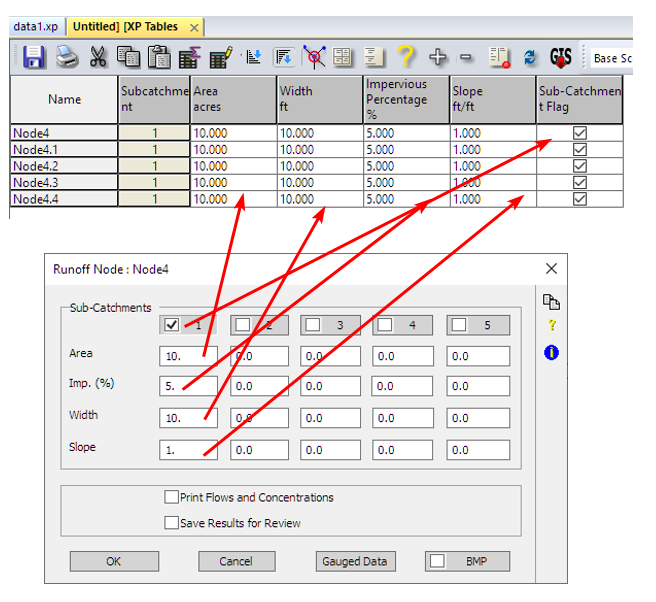{.ea .ll .lm height="602" style="box-sizing: inherit;vertical-align: middle;width: 656px;max-width: 100%;height: auto;" width="656"}

 

 

======================================================================

======================================================================

# How to install older versions of XPSMM?

{
    "title": "How to install older versions of XPSMM?",
    "aid": "kA04U000000UNn4SAG_en_US_1.html",
    "software": "XPSWMM",
    "topic": "other",
    "summary": "This guide explains the challenges and workarounds for installing an older version of XPSWMM. Due to changes in dependencies such as Sentinel Drivers and C++ redistributables, the older software version may conflict with modern system libraries. The article recommends removing newer installations of XPSWMM, C++ redistributables, and resetting the Sentinel driver state before installing the older version. It also cautions that these removals might affect other programs that depend on the same libraries, necessitating reinstallation of those dependencies afterwards."
}

- Product: XPSWMM
- Topic: other

## Summary
This guide explains the challenges and workarounds for installing an older version of XPSWMM. Due to changes in dependencies such as Sentinel Drivers and C++ redistributables, the older software version may conflict with modern system libraries. The article recommends removing newer installations of XPSWMM, C++ redistributables, and resetting the Sentinel driver state before installing the older version. It also cautions that these removals might affect other programs that depend on the same libraries, necessitating reinstallation of those dependencies afterwards.

## Text

Installing an older version of XPSWMM can be challenging because it might rely on old versions of the Sentinel Drivers and third party libraries such as C++ redistributables.\

 

Due to the constact changes in Sentinel Drivers, Microsoft C++, and changes to the Windows operating systems - there is no guarantee old program will work.\

\

However, through out experiences, there are a few things you can try to make it work. The idea is to remove all the dependencies from your system, then install XPSWMM, in hope it will be able to install an older version of the required libraries.

-   remove all XPSWMM version newer than the one to be installed

-   remove all the C++ redistributals

-   remove the Sentinel driver to a clean state

-   then install the older XPSWMM first, laying in the later applications.

However, removing these could cause problems for other programs relying on the removed libraries. and you might need to reinstall them to fix the problem.\

\

{#Picture_x0020_18}

======================================================================

