# Timestep_log_file_reader

The timestep log is very useful When debugging an InfoWorks ICM model, however, the log file usually will have thousands of lines and extracting the useful information can be a challenge.

The “timestep_log_file_reader.ipynb” can extract the count tables showing the nodes and links with trouble in calculation into an Excel spreadsheet.

Here are a few example tabs,

- 93-Unconverged link depth

- 98-Unconverged nodes coun

- 1084-Link depth fail coun

The tab name starts with the line no, then the name of that table.

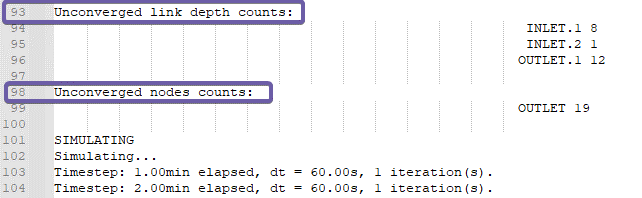

The first few tables are for initializations, and the following tables are for the simulation.

To use this tool,

- step 1 turn on timestep log in the RUN

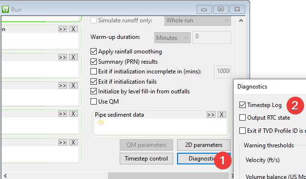

- step 2 run the simulation

- step 3 export the log to a file

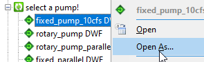

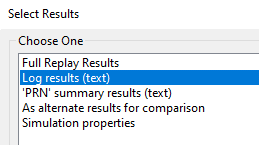

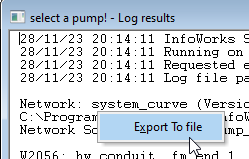

- step 4 set up the log path, and the excel_path in the notebook and run the cell

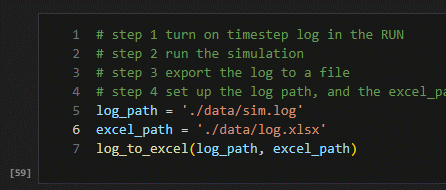

You will have a spreadsheet with all the count tables, and ordered by the count.

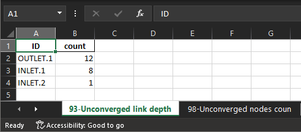

# batch_plot_event_file

For models with many nodes receiving inflows, or outfall nodes with boundary level conditions, it can get tedious reviewing the time series.

The “batch_plot_event_file.ipynb” provides a quick way to batch plot each time series as a figure so that you can quickly check them.

To plot the figures,

1.  export the event file as an “CSV” file

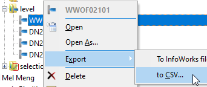

2.  open the exported csv file and prepare it as a generic csv file. In the exported csv file, the time series data can be found at the end, row 11 is the header, and the following rows are the values. We need to replace the column header in row 11 with actual profile name listed in row 9 and 10,

    1.  copy the profile names

    2.  select the column header

    3.  use paste special to transpose the profile names as column header

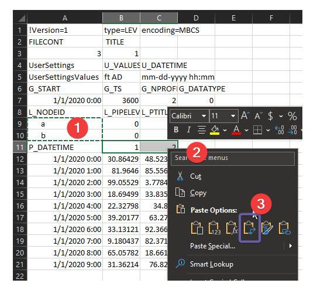

3.  delete the rows above the header, we’ll have a generic csv file.

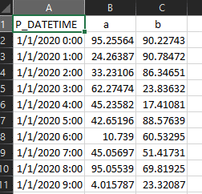

4.  run the notebook after updating the csv_path to the generic csv file, and the folder for the folder,

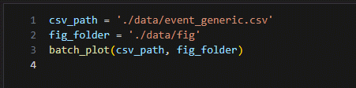

5.  each profile will have a figure saved in the figure folder

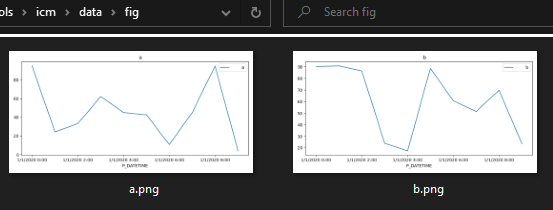
