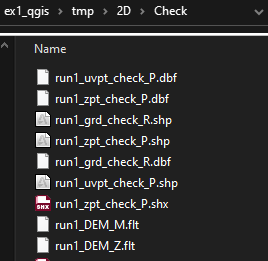

# Introduction

For XPSWMM 2D models with a lot of manual terrain modifications, it is important to review the engine processed 2D grid to make sure all the modifications are correctly applied.

With the help of the Tuflow plugin, QGIS is a great tool for the task. In this article we will go through a few examples to learn,

- Setup the XPSWMM model to generate check files as shapefiles

- Install QGIS and the Tuflow plugin

- Compare the 2D grid and the DEM

# 

# Setup the XPSWMM model to generate check files as shapefiles

In this exercise, you’ll use QGIS to compare the input DEM, and the 2D engine created 2D surface.

1.  Open the **“./data/model/starter_model.xp”**

2.  **Add background, “./data/gis/Aerial_Photo_M02.jpg”**

3.  Add DTM, **“./data/gis/DEM.asc”**

4.  Change the 2D settings to generate check files.

5.  Change the GIS output files to shapefiles.

6.  Save the model as run1.xp

7.  Run the model, ignore the initialization error.

8.  Go to the model folder “./2D/Check”, you should see a long list of files. Next, we will review these files in QGIS.

# Install QGIS and the Tuflow plugin

Follow the instruction links to install [QGIS](https://www.qgis.org/en/site/) and [Tuflow](https://wiki.tuflow.com/index.php?title=TUFLOW_QGIS_Plugin) QGIS plugin.

# Load the 2D grid and the DEM into QGIS

1.  Start QGIS, and load the DTM file, “./data/gis/DES.asc”.

2.  Load the check files using the Tuflow plugin

# Compare the 2D grid and DEM profile

1.  Keep only the DEM and “run1_grd_check_R” turned on, and open the “Elevation Profile”

2.  Double click on DEM layer to turn on “Represents elevation surface”

3.  Double click the “run1_grd_check_R” layer to set the elevation

4.  Now you can use the elevation profile tool to cut cross sections.

5.  Change the DEM style to hill shade to highlight steep slopes.

6.  Study how the 2D grid is representing the culvert area. The highlighted cell represents the average elevation mostly of the bank, therefore, it is much higher than the DEM. Let’s try using a finer grid.

# Comparing 1m vs 6m grid

Using a finer grid should help capture the DEM, you will create a new model with 1m grid size, then compare the 2D check files for the grid.

1.  Save the XPSWMM model as run2.xp

2.  Change the 2D grid size from 5m to 1m

3.  Save the model, then run the model

4.  The check grid file for this model will be named in the same folder with a prefix of “run2”.

5.  Drag the grid file for run2 to QGIS, and setup the elevation with the same settings as the run1 grid, now we can compare the profiles. As you can see the green lines (1m) are tracking the DEM much better than the red lines (5m)

