# Introduction

XPSWMM represents the 2D surface using 2D grids, a Minecraft like scheme to build a very blocky world. As a result, important details that form the flow paths can be lost in that translation. Breaklines can help capture such ground features, you can add ridges such as “levee” to block the flow path, or gullies such as “ditches” to guide the flow path.

In XPSWMM, break lines can be thick or thin

- Thick breaklines will raise both the sides and the bottom of the cell, for example elevated wide roads (shown in Fig.2, points on sides and center indicate the raised elevations to match the break line)

- Thin breaklines only changes the elevation of the sides of a cell, for example, level walls. (shown in Fig.3, only the sides are raised.)

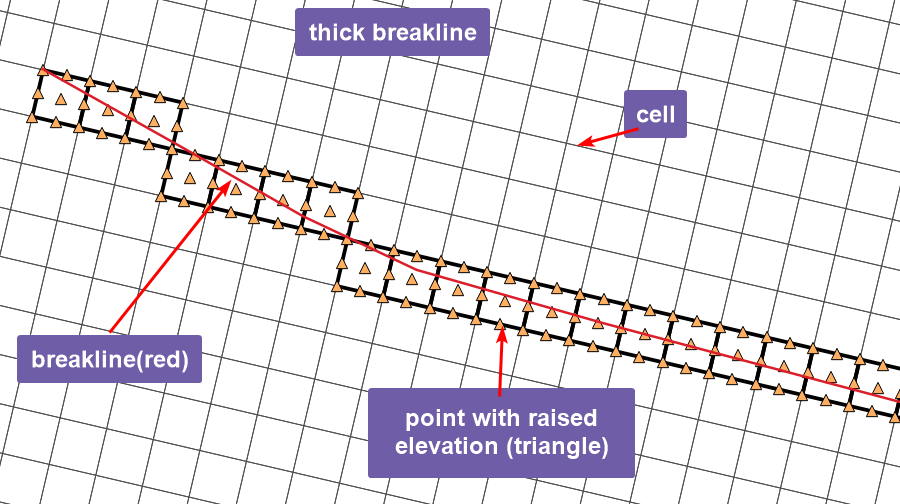

Figure Thick breakline example

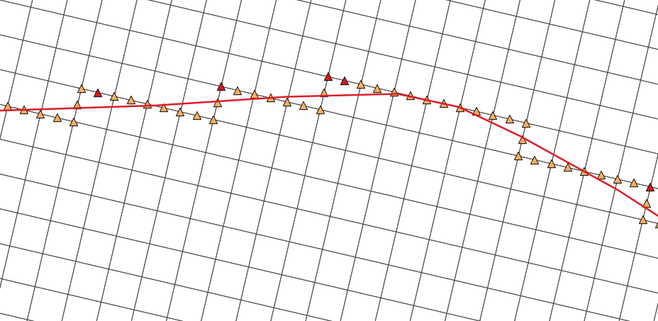

Figure Thin breakline example

You can create thin breaklines inside XPSWMM, but for thick breaklines, you have to manually create the shapefiles and use flags to define it.

# Use the breakline tool in XPSWMM to create thin breakline

1.  Use the starter model from [Ex1 QGIS](https://github.com/mel-meng/hhnote/tree/main/workflow/data/dtm/ex1_qgis),

2.  After adding DTM, save it as “breakline.xp”

3.  Turn on contour lines to identify the top of the road

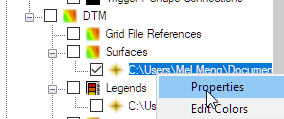

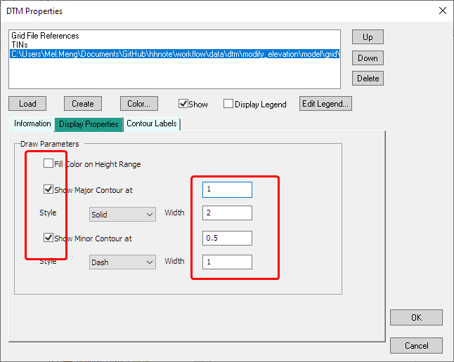

4.  Draw the center line of the road.

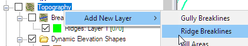

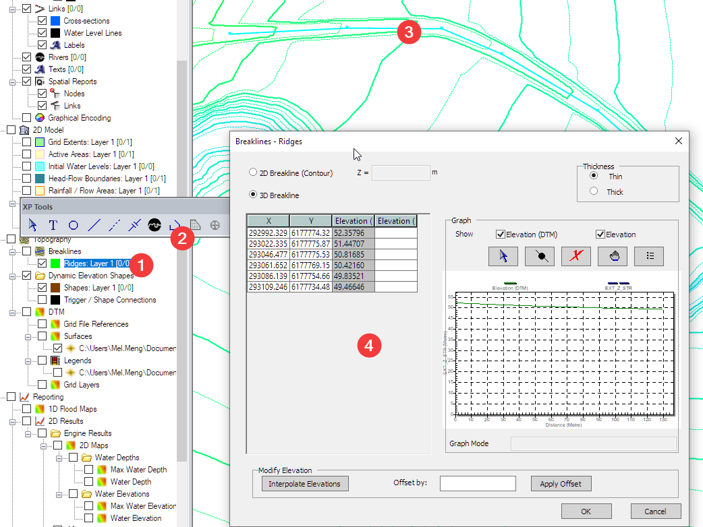

Style the line to show vertex.

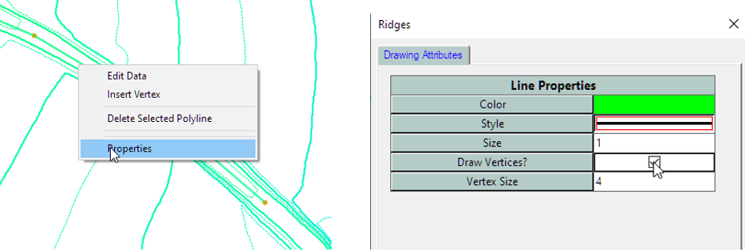

5.  Check the breakline profile.

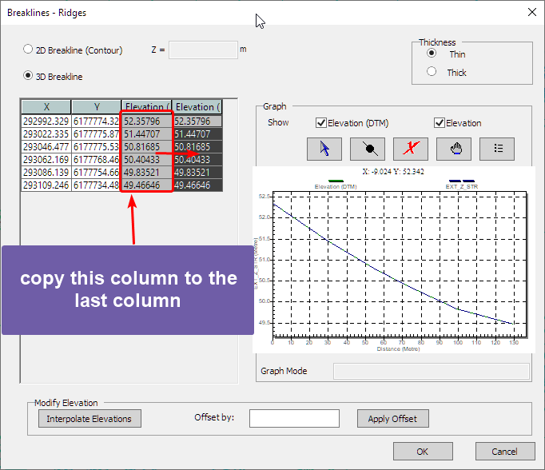

6.  For example, you can tell if a vertex is off the high point.

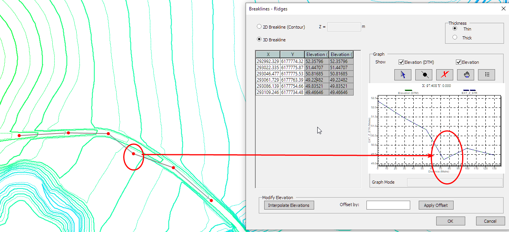

7.  Save the model and run it.

# Review thin breakline results

Refer to [Ex1 QGIS](https://github.com/mel-meng/hhnote/tree/main/workflow/data/dtm/ex1_qgis) on loading the check files into QGIS and then compare the elevation of the 2D and DTM.

1.  Export the breakline from XPSWMM, as a polyline shapefile file

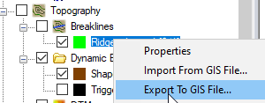

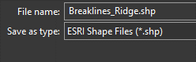

2.  Start QGIS load the breakline exported from XPSWMM

3.  Load the check files from folder using Tuflow Plugin, and only keep the following layers

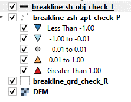

4.  In the map we can see the processed 2D grid translated the breakline into changes to sides of the cells

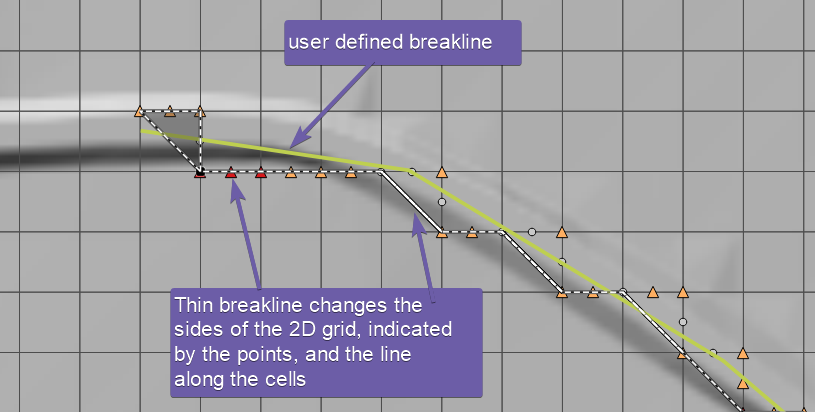

5.  Next, we’ll check the values of the sides in the profile. Update the elevation of the breakline_zsh_zpt_check_P

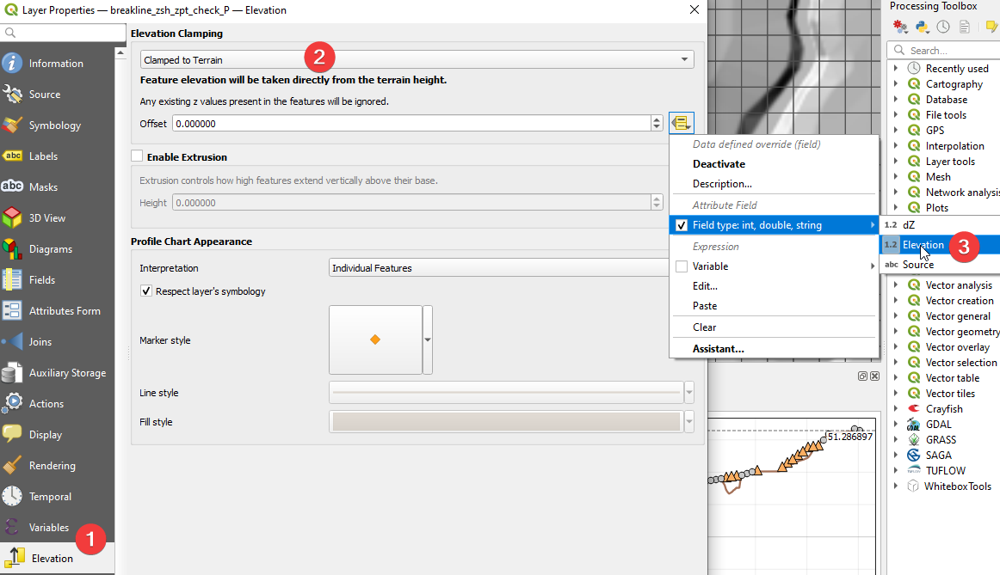

6.  Refer to [Ex1 QGIS](https://github.com/mel-meng/hhnote/tree/main/workflow/data/dtm/ex1_qgis) to update the elevation for the grd_check_r layer and the DEM layer.

7.  View the elevation profile

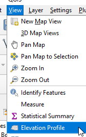

8.  Compare the elevations: (1) click the select line tool (2) click the breakline (3) review the profile

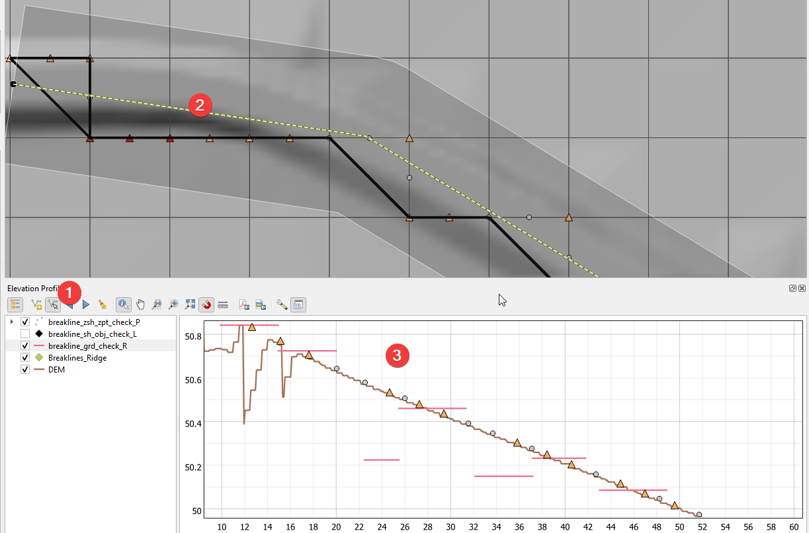

9.  Add a 5m buffer to include the points along the sides in the profile

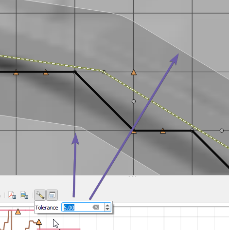

10. As the figure shows, although the cell elevation is not changed, the sides are elevated to match the breakline.

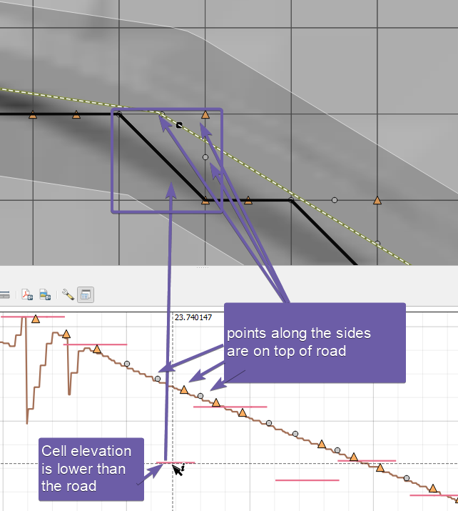

# Use the asc_to_asc tool to add thick breakline

Tuflow has a free [asc_to_asc](https://wiki.tuflow.com/index.php?title=ASC_to_ASC#Extract_Breaklines_from_DEM) tool that can extract breaklines from an existing line. You can find the tool from the [download](https://www.tuflow.com/downloads/) page or the tutorial [dataset](https://wiki.tuflow.com/index.php?title=Tutorial_Introduction).

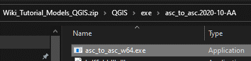

The asc_to_asc tool is a command line tool,

- Create the breaklines as shapefiles

- Run the asc_to_asc tool to generate the breakline and elevation point shapefiles

- Add the geometry commands in XPSWMM to reference the breakline shapefiles.

## Create the breakline shapefile

The asc_to_asc tool has strict requirement on the geometry and attribute settings for the input breakline shapefile, use the breakline_template.shp (./data/gis/breakline_template.shp) as a template, you can redefine the projection to fit your project, and then start digitizing or copy the polyline from another file. It has the following fields.

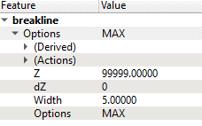

Refer to Table 6-8 2D Z-Shape (2d_zsh) Attribute Descriptions in the [Tuflow Classic/HPC Manual](https://www.tuflow.com/downloads/) for more information.

- Z=99999, not used by this tool but used by Tuflow.

- dZ=0, means no adjustment of the height

- Width=5, means it is a thin line, and it will get the exact Z from DEM at the location. If it is greater than 0, then the tool will search around the point using the width as a radius for the highest point

- Options=MAX, this is a ridge breakline used to raise the elevation.

It is important to set the Width the same as your grid size for the thick breakline to work.

For simplicity, you can save the asc_to_asc.exe, DEM and breakline to the same folder.

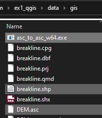

In the command line window,

- Change to the folder where the tool and all the data are located: chdir “folder path”

- Run the asc_to_asc tool: asc_to_asc_w64.exe -brkline breakline1.shp DEM.asc

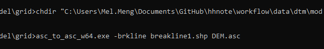

It will generate two files which can be used as the input for the breakline,

- breakline1_brkline_P.shp: the point layer with elevation extracted

- breakline1_brkline_L.shp: the line layer showing the line

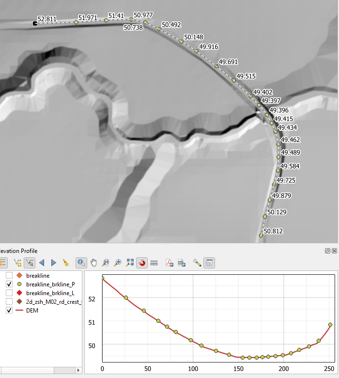

## Setup XPSWMM flags for thick breakline

Once the line and point layers are ready, we can enter the XPSWMM flags.

1.  Enter the control file and geometry control file commands. (3) will export all the check files in shapefiles format, (4) will use the layers to enforce thick breaklines

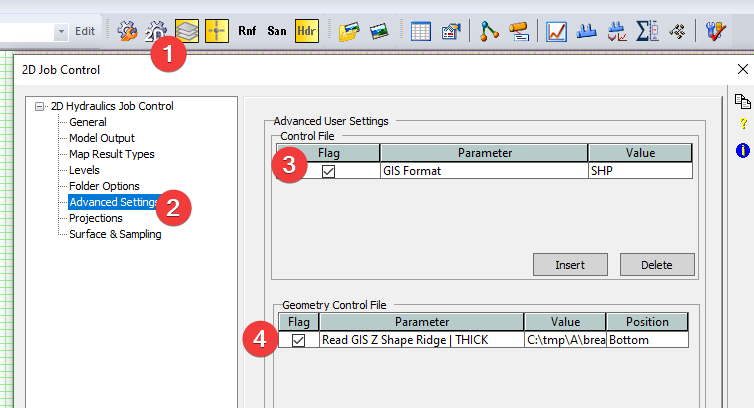

For the value in (4), XPSWMM has limit on the length of the value, you need to keep the path short. As shown here, the first is the breakline layer, and the second is the point layer.

**C:\tmp\A\breakline_brkline_L.shp\|C:\tmp\A\breakline_brkline_P.shp**

2.  Save the model and run it.

3.  Refer to [Ex1 QGIS](https://github.com/mel-meng/hhnote/tree/main/workflow/data/dtm/ex1_qgis) to load the check files, and compare the elevations. As shown below both the sides and the cell elevations are raised.

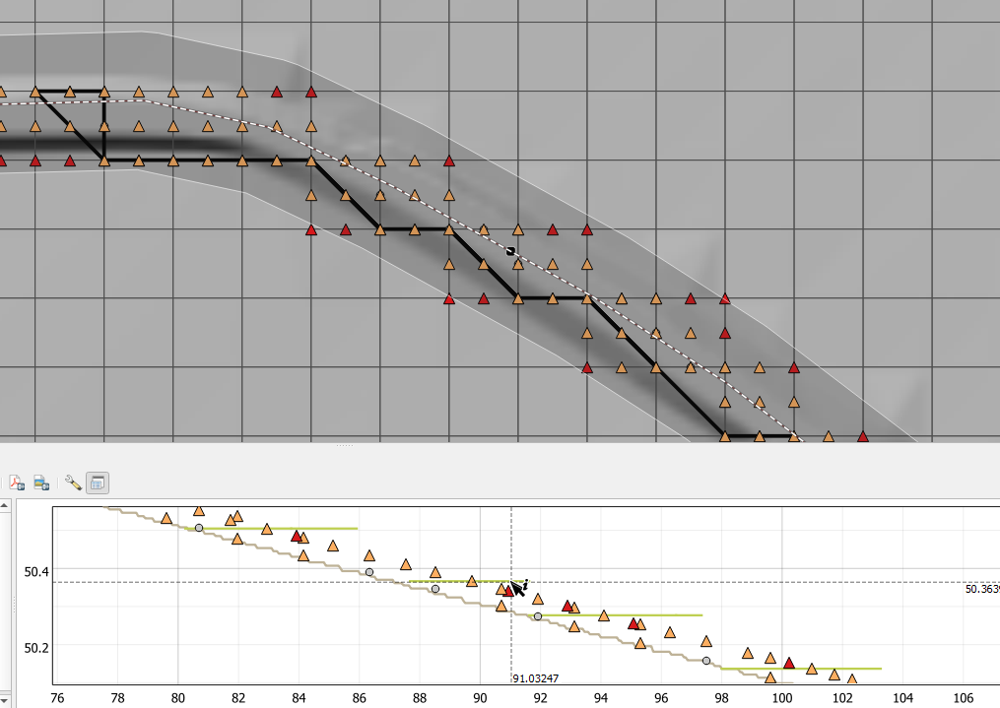

# Use elevation shape in XPSWMM

There are other terrain editing tools inside XPSWMM such as fill areas and elevation shapes to apply changes to an area.

1.  Create a new elevation shape layer

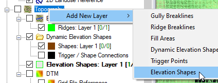

2.  Select the layer, then draw a polygon, and set the new elevation.

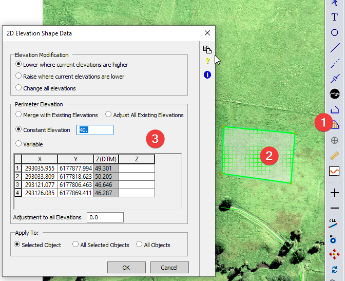

3.  Refer to [Ex1 QGIS](https://github.com/mel-meng/hhnote/tree/main/workflow/data/dtm/ex1_qgis) to load the check files, and compare the elevations. As shown below the area is lowered to 40m.

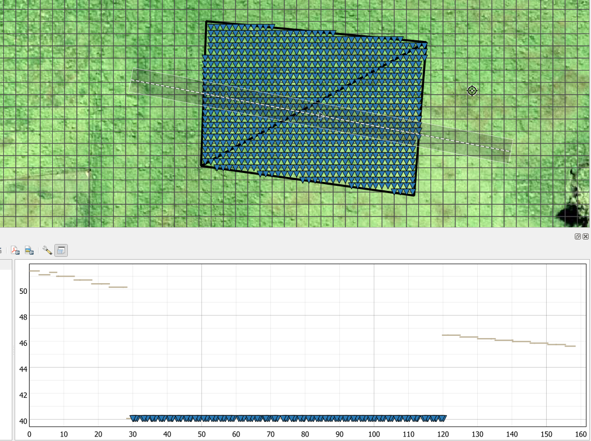
