# Introduction

When developing a model in InfoWorks ICM for a proposed condition, you often need to update ground model to include the proposed pond, roads, and housing units.

For smaller-scale projects, the process involves exporting the ground model as a grid, importing it into Civil3D, implementing the necessary changes, and then exporting it as a LandXML file. This file can subsequently be imported into InfoWorks ICM.

However, for larger-scale projects that span an entire watershed, it's not feasible to manage a city-level terrain model in Civil3D. Instead, you need to clip the terrain to the area of change when working in Civil3D. This updated, clipped terrain is then merged with the existing terrain before being imported into InfoWorks ICM.

In this article, we'll provide a step-by-step guide through this workflow. For large area, a raster grid is commonly used to represent the surface, therefore, that will be the common format between Civil3D and InfoWorks ICM.

- Export ground model to a raster format

- Clip the grid to the study area

- Update the surface in the study area(s)

- Update existing surface with updates

- Prepare the grid for InfoWorks ICM

- Import the updated raster grid back to InfoWorks ICM

# Terminologies

A few quick notes about the terminologies,

- [DSM/DTM/DEM](https://gisgeography.com/dem-dsm-dtm-differences/): digital surface/terrain/elevation model, the meaning can be ambiguous depending on the context.

- TIN (triangular irregular network): TIN is a common vector format to represent surface.

- Grid: Another common format is using raster image to represent surface, each pixel has the elevation. It might also be called DEM, raster.

- InfoWorks ICM

  - [Ground model](https://help.autodesk.com/view/IWICMS/2024/ENU/?guid=GUID-E82F1771-B363-4D48-B9D6-DA941A9ECBF1): the database object that represents the ground surface.

  - [Ground model (TIN)](https://help.autodesk.com/view/IWICMS/2024/ENU/?guid=GUID-89AC3DE1-23BA-43C5-8BDC-7D02012507F2) is a vector format that represents surface as triangles.

  - [Ground model (grid)](https://help.autodesk.com/view/IWICMS/2024/ENU/?guid=GUID-898B8CA5-7F0A-4C56-A13D-E687DE8A198F) is a raster format that represents surface as an image.

- Civil3D

  - [LandXML](https://help.autodesk.com/view/CIV3D/2022/ENU/?guid=GUID-71B3BF08-9735-4FEE-905A-30ACD3D0BC42): LandXML is an exchange format for Civil3D objects, often used for surfaces and pipe networks when building InfoWorks ICM models.

  - [Surfaces](https://help.autodesk.com/view/CIV3D/2022/ENU/?guid=GUID-84BF7EAC-6DF4-447E-A0DB-82C03EA2F584): the surface Civil3D creates is TinSurface and can be exported as LandXML, and GridSurface can be imported from raster sources, and it is usually called “DEM” in Civil3D

# Export ground model from InfoWorks ICM

For grid ground model, it can be exported as an \*.asc raster file. However, for TIN ground model, it can only be exported as an InfoWorks ICM format.

Therefore, if you need to use the same terrain from the InfoWorks ICM model in Civil3D, you need to find the source file if it is in TIN format.

# Clip the terrain model to the study area

1.  Open the DEM in QGIS

2.  Zoom to the study area

3.  Export the current extent to a new grid

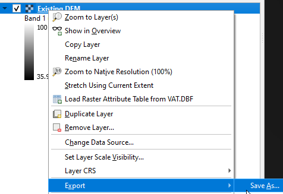

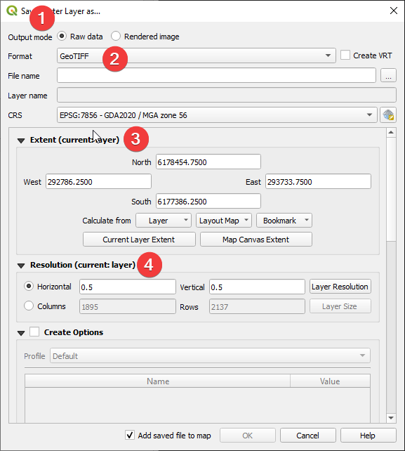

# Update the surface in the study area(s)

Refer to [Civil3D](https://help.autodesk.com/view/CIV3D/2023/ENU/?guid=GUID-39D75138-F0CC-4EFF-9792-ACAE85ACEE82) help for more information on working with [DEM](https://help.autodesk.com/view/CIV3D/2023/ENU/?guid=GUID-DF4F9A8E-5C48-4596-98A1-61DEE11D0BE1) and [TIN](https://help.autodesk.com/view/CIV3D/2023/ENU/?guid=GUID-6AFA8635-EAF2-4AE0-8309-A89AAE53C31D) surfaces.

# Update existing surface

The [r.patch](https://grass.osgeo.org/grass78/manuals/r.patch.html) tool does this job by replacing the "null" cells in the first image with the values from the second image, as illustrated in the figure. For this to work,

- All the raster images should be identical in size

- the order of the raster images matters, the updated raster should be on top of existing raster

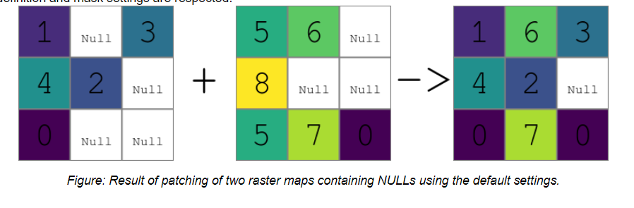

## Resize the updated image to the same as the existing surface

The updated raster is only a clip of the existing surface, we need to resize it to the same extend and size as the existing surface.

1.  Search the raster calculator in the processing tool

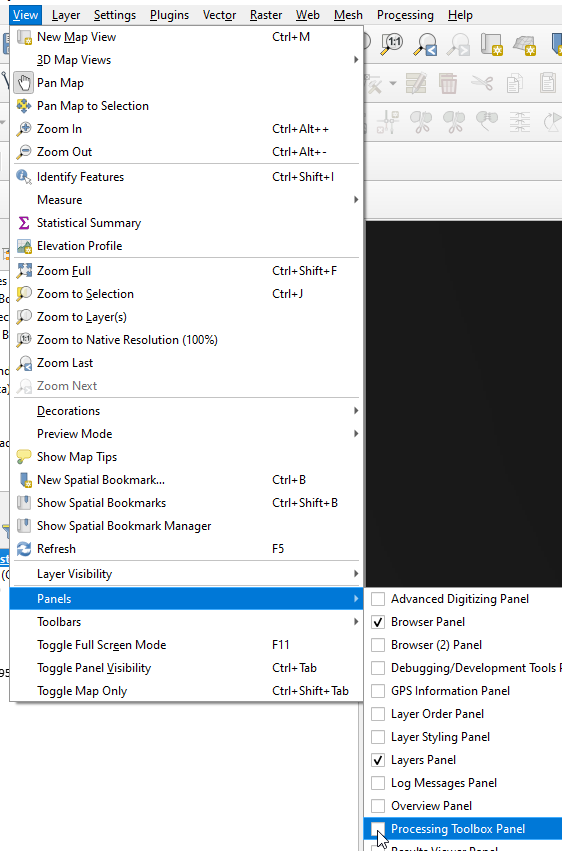 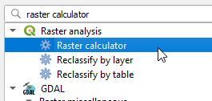

2.  Enter the expression, and the reference layer as shown in the following figure

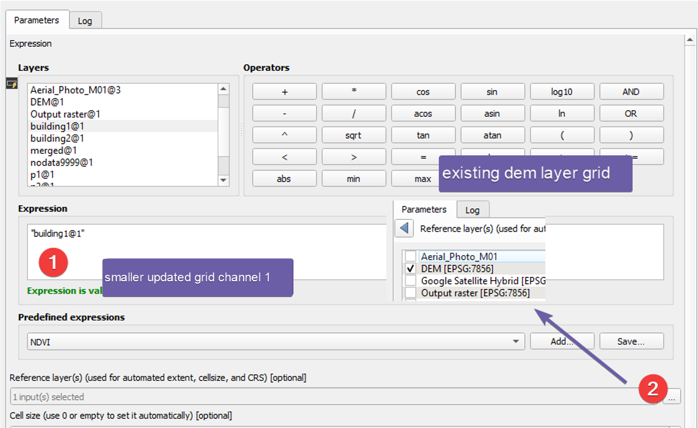

3.  Use the r.patch tool under Grass to patch the layers together. It is important to rearrange the order of the layers so that the existing surface is at the bottom

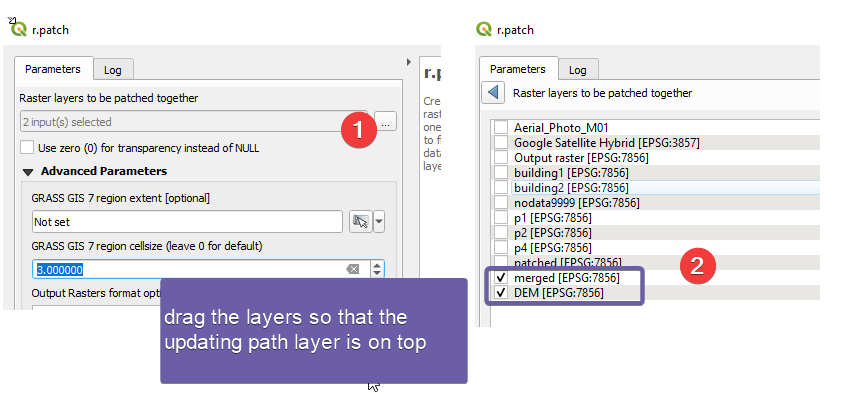

# Prepare the grid for InfoWorks ICM

InfoWorks ICM only accepts grid with numeric values, therefore, we need to make sure nodata values are not set as NAN.

1.  To check how nodata values are saved in the raster, double click the layer in QGIS

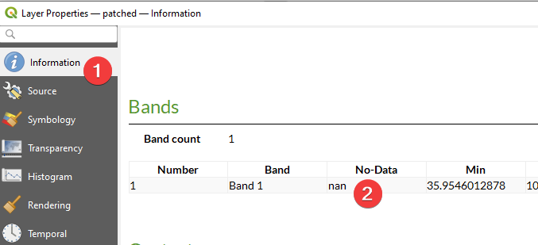

2.  To review where the nodata values are on the map, change the Transparency settings.

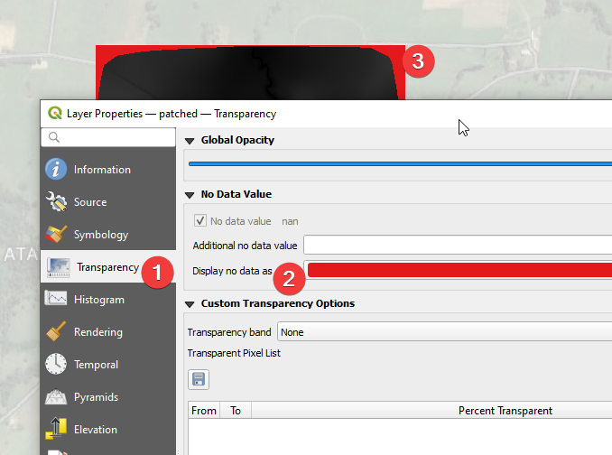

3.  To change the nodata values to numbers, we need to first fill the nodata values as a number, and then save the raster and mark that value as nodata.

4.  Use the fill nodata cells tool to set the nodata cells with a number

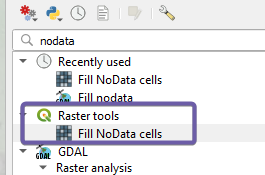

5.  Set nodata as 9999 (any number that will not be used for actual elevation.)

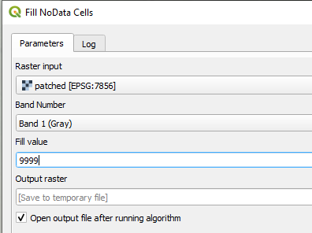

6.  Check the new layer properties, it should be 9999 now.

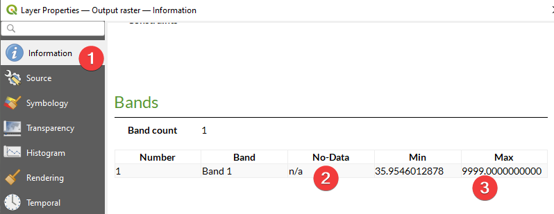

7.  Export the layer as a new raster file, and Set 9999 as no data using the “Translate” tool

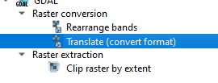

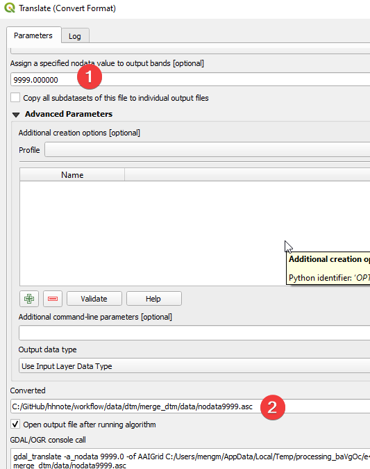

8.  Review the results. No-data should be a number.

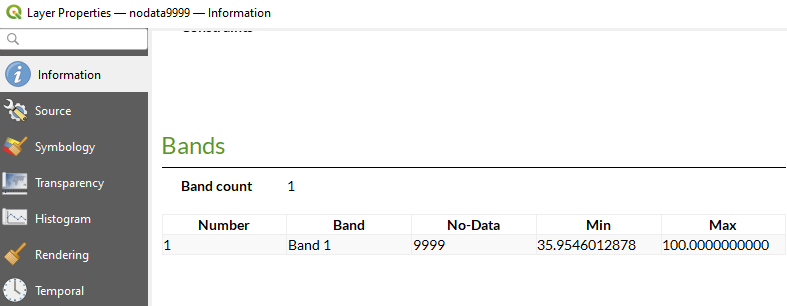

# Import the updated raster grid back to InfoWorks ICM

Refer to the [help](https://help.autodesk.com/view/IWICMS/2024/ENU/?guid=GUID-898B8CA5-7F0A-4C56-A13D-E687DE8A198F) for more details.

# Conclusion

By following the steps outlined in this guide, you can update part of your ground models in Civil3D, and then import an updated ground model merged in QGIS.
