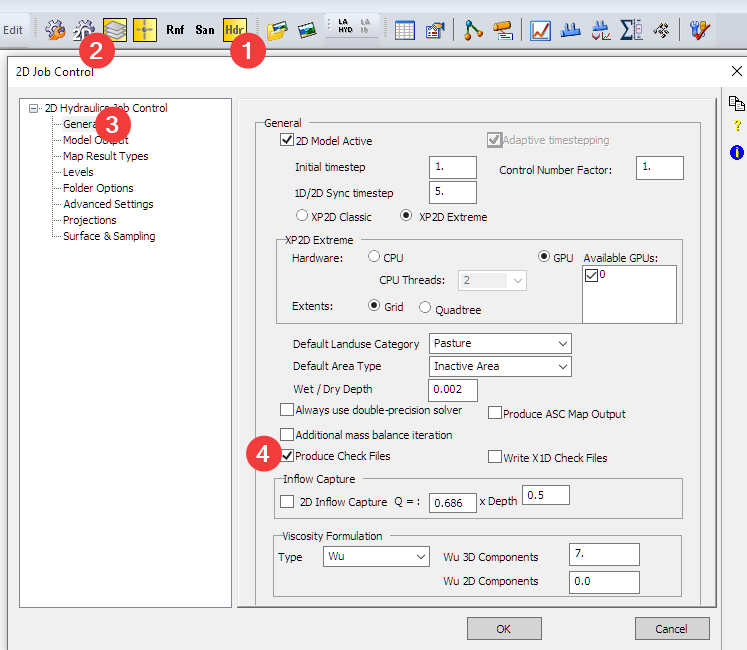
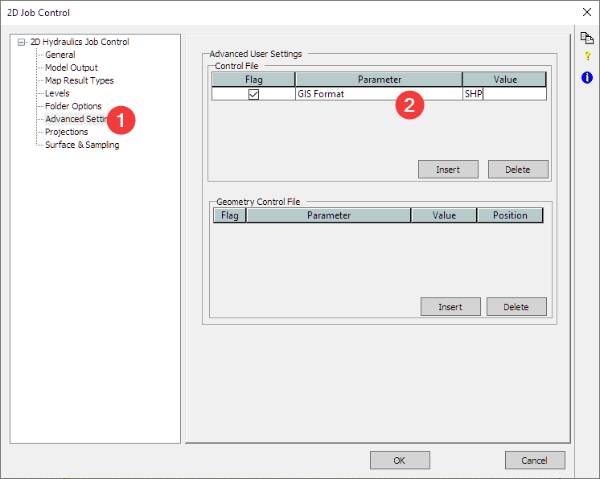
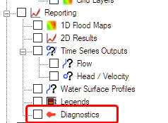
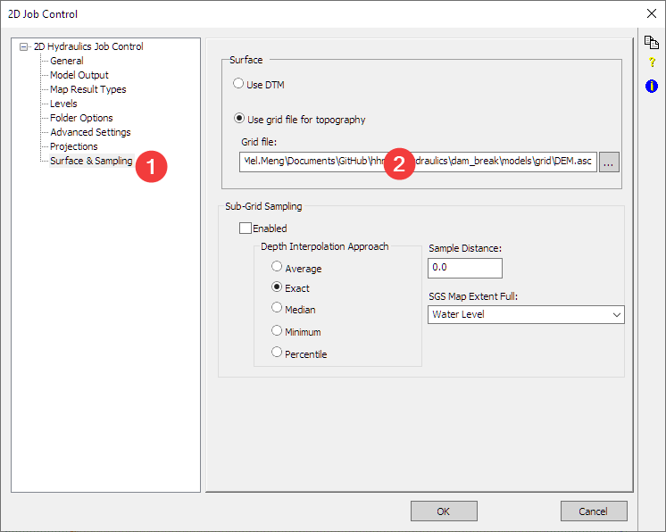
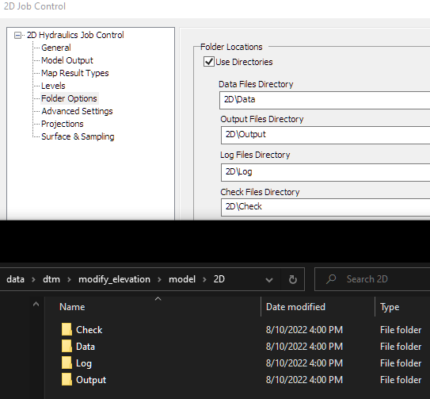
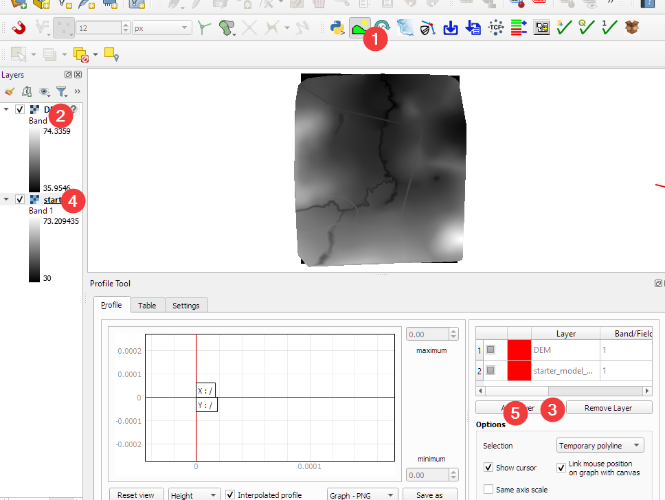
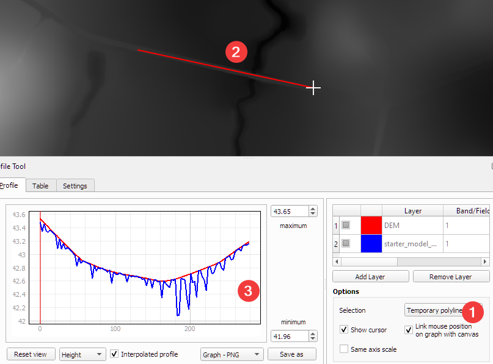
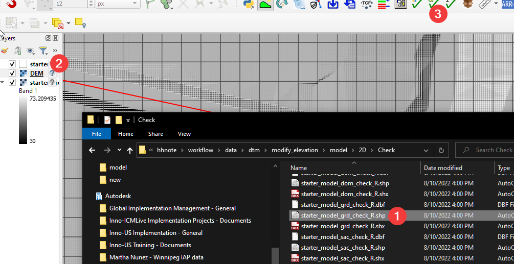
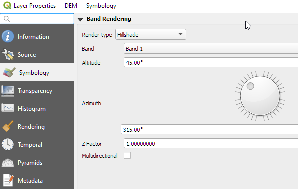
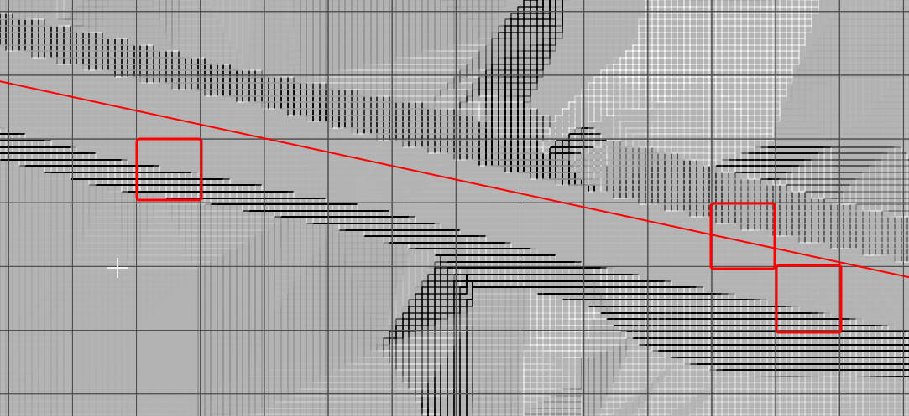

# Exercise 1 Compare 2D grid with DEM

In this exercise, you’ll use QGIS to compare the input DEM, and the 2D engine created 2D surface.

1.  Open the **“./data/model/starter_model.xp”**

2.  Change the 2D settings to generate check files.

3.  Change the GIS output files to shapefiles.

NOTE: this will break the diagnostics, which uses the \*.mif format. If you need to check the diagnostics, remove this line.

4.  Update the dem path.

5.  Run the model to generate the check files. You can stop the simulation once it starts. All the 2D related files are saved in the 2D folder defined in the 2D settings.

-   Check: all the check files

-   Data: all the Tuflow 2D model input and control files

-   Log: logs, and diagnostic files

-   Output: results

6.  Start QGIS, and load the DTM file.

7.  Load the 2D engine generated surface, it is in the “Check” folder with the name \*\_DEM_Z.flt.

8.  Open the profile tool and load both dem layers

9.  You can change the color of each layer, and compare the profile of the street

As shown in the profile, red is the raw DEM, and blue is the 2D engine generated surface. Due to the resampling of the grid, we can see the 2D generated surface is not as smooth as the raw input (red). Therefore, we’ll need to create a breakline to ensure the high points of the roads are correctly represented.

10. To get better understanding why this happens, you can load the grid check file showing the 2d Grid. (1) drag the \*\_grd_check_r.shp to QGIS (2) select the layer (3) click on the style button to apply Tuflow style.

11. Change the DEM layer style to hillshade.

As shown below, many cells are sitting on the slope of the road, as a result, the average elevation of the cell is much lower than the top of the road.

