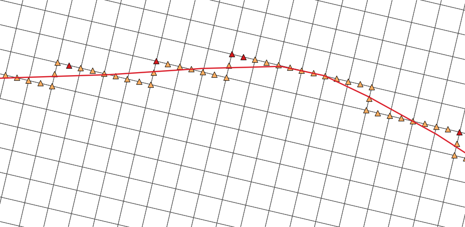

# Introduction

Modifying the elevation of an existing DTM is a common task when modeling a 1d/2d model in XPSWMM to ensure correct flow paths. For more advanced manipulation of the surface, it is important to review the surface after the changes, you’ll need specialized GIS tools outside of XPSWMM for this task.

**NOTE:** in this article, DTM (digital terrain model), topo, surface are used interchangeably, the data representing the surface water flows on. DTM and topo usually refers to the source data, and surface sometimes implies the calculated results.

In this article you’ll learn how to install these tools, and use them to ensure the desired changes are made to the surface.

You will need to install:

-   Install [QGIS](https://www.qgis.org/en/site/)

-   Install [Tuflow](https://wiki.tuflow.com/index.php?title=TUFLOW_QGIS_Plugin) QGIS plugin

-   Install [Profile](•%09https:/www.youtube.com/watch?v=UD0Oumv5y1w&ab_channel=HansvanderKwast) QGIS plugin

This tutorial is based on [Module 02](https://wiki.tuflow.com/index.php?title=Tutorial_M02) on the Tuflow website. You will add 3 break lines to represent the roads.

# 2D Grid

The 2D engine sees the world as cells (or cubes in 3D). It is a fixed grid with rectangle cells defined by the user, which is very similar to how Minecraft models the world. For more details, refer to the [Tuflow Manual](https://www.tuflow.com/downloads/). The actual surface your 2D model uses can be very different from your DTM, therefore, you’ll need GIS tools to compare your 2D surface with the DTM for models with more complicated terrain.

Figure Minecraft models the world as blocks

As shown in Figure 6-1 from the manual, each cell has 4 points, and each point will have an elevation sampled from the underlying topo data.

-   ZC: the center point of the cell, it represents the bottom of the cell

-   ZU/ZV: controls how water moves between cells, you can use breakline to raise the elevation of the sides of the cell to act like fences

The goal of manipulating the 2D surface is to change the values of the elevation at the ZC, ZV and ZU points, so that water will flow through your intended path.

# Breaklines

There two types of breaklines,

-   Thin breaklines only changes the elevation of the sides of a cell, for example, level walls.

-   Thick breaklines will raise both the sides and the bottom of the cell, for example elevated wide roads

Figure Thick breakline example

Figure Thin breakline example

You’ll complete the following exercises,

-   Exercise 1 Compare 2D grid with DEM (TODO: add link)

-   Exercise 2 Create Breakline (TODO: add link)

# Data files

Data files can be found in the “data” folder,

-   Aerial_Photo

-   grid: topo data and related shapefiles

-   model: XPSWMM model files
