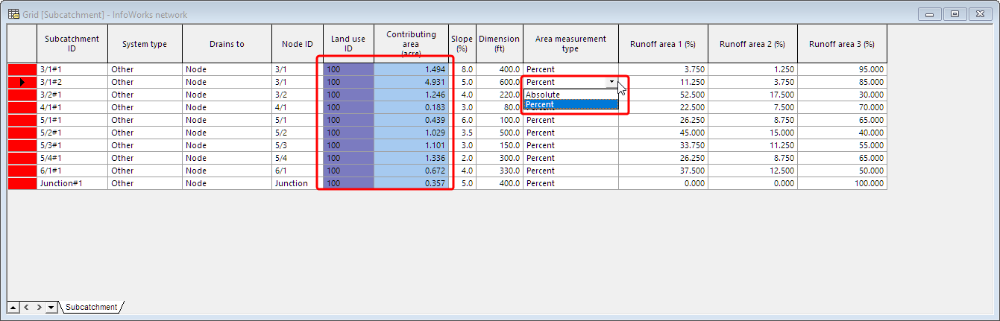

# Introduction

Finding a piece of information quickly in the huge data grid in ICM can be challenging. Especially if you are new to ICM.

The good news is that you can quickly load a customized grid view from a previously saved SQL query to fit your own modeling needs.

In this article, you’ll learn to create custom SQL queries,

-   Setup customized grid view with full editing support for SWMM5 runoff method

-   Setup customized SWMM5 style hydrology results summary

# Customized workflow

Setting up SWMM5 runoff method in ICM can be quite complicated for new users. So we simplified the workflow using SQL queries. You can download the model from Github.

1.  Open the network

2.  Drag step 100 to the GeoPlan

Then you have a fully functional grid for subcatchment to make changes with only the fields that matters for the SWMM5 hydrology,

You can get more instructions from the query description.

Similarly, you can edit runoff and landuse

After running the model, you can create a SWMM5 style subcatchments.

1.  Drag the results into GeoPlan

2.  Drag the 400 query into GeoPlan

3.  Review the results, it is the same as the SWMM5 subcatchments report

# Conclusion

With ICM SQL queries, you can build customize modeling building workflows which can greatly simplify the steps involved setting up SWMM5 hydrology in ICM.
