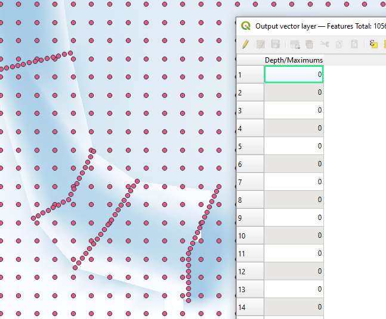

# Introduction

[QGIS](https://docs.qgis.org/3.28/en/docs/user_manual/working_with_mesh/mesh_properties.html) offers native support for XPSWMM 2D results files, allowing you to access simulation results in their raw format without the need for conversions. This capability provides several benefits, including:

- The ability to use advanced visualization styles and animations for mesh in QGIS.

- An expanded range of options for converting results to other GIS formats.

In this article, you will learn,

- Load XPSWMM 2D results into QGIS

- Rendering maximum values in the map

- Play animation of the simulation

- Export the results to raster format

- Export the results to vector format

# Load XPSWMM 2D results into QGIS

XPSWMM saves the 2d results in two files,

- \*. [2dm](https://www.xmswiki.com/wiki/SMS:2D_Mesh_Files_*.2dm): saves the mesh, and the terrain data

- \*.[xmdf](https://en.wikipedia.org/wiki/XMDF): saves the time series

To load the results into QGIS,

1.  Load the \*.2dm file into QGIS. Drag the file into QGIS.

2.  Load the \*.xmdf into the \*.2dm mesh

# Rendering maximum values in the map

## Max. Depth

1.  Select max. depth as the value to show

2.  Select the color ramp and make it transparent

# Play animation of the simulation

1.  Set depth as the contours (fill), and velocity as the vector

2.  Set the depth style

3.  Set the velocity style

4.  Turn on the time control

5.  Play the animation

6.  You can explore more vector styles

# Export the results to raster format

1.  Turn on the processing toolbox

2.  Locate the Mesh tools

## Export max. water depth as raster

1.  Open “Rasterize mesh dataset”

2.  Set up the parameters for the tool

## Export max. water contour lines

1.  Open the “Export contours” tool

2.  Set up the parameters

3.  Turn on the contour line layer

# Export the results to vector format

1.  Open the “Export mesh vertices” tool

2.  Setup the parameters

# Conclusion

In conclusion, working with XPSWMM 2D results in QGIS provides benefits such as advanced visualization styles, animation capabilities, and options for converting results to other GIS formats. By following the steps outlined in this article, you can easily load XPSWMM 2D results into QGIS, render maximum values on the map, play animations of the simulation, and export the results to raster or vector formats. This integration enhances the analysis and visualization capabilities for water management and flood modeling projects.
