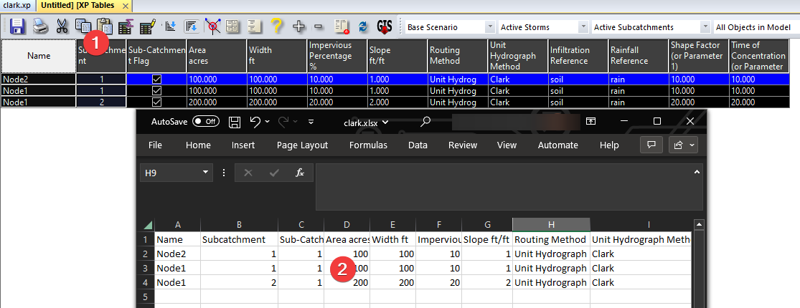

# Introduction

When building large hydrology models, you might find it easier to prepare the subcatchments input parameters in GIS or CAD software. Two commonly used methods to get external data into XPSWMM are “import from GIS” and “GIS Link”. Most users are familiar with the “import from GIS”, but the “GIS Link” tool is a more suitable tool as it can help us to confirm the required data format and correct matching fields.

In this article we’ll use Clark hydrology as an example to illustrate a complete import workflow.

- Use XPTables to match the fields

- Use “GIS Link” to confirm the correct data format

- Use “GIS Link” to import the subcatchments attributes to existing nodes

- Use “Import from GIS” to import the polygons for the matching subcatchment

# Clark Hydrology

The Clark hydrology method is one of the less used methods XPSWMM supports, finding the right data format and matching field can feel overwhelming even for experienced users. As shown in the figure below, the first step is to identify the field names that matches all the UI elements.

# Map the fields using XPTable

The best way to establish the mapping is using an XPtable.

1.  Go to XPTables

2.  Create sub catchment table

3.  Map the fields found in the UI

4.  There are hundreds of parameters, and it could take some time and effort to locate the correct parameter. One trick is to get the internal field name. You can get the name of a UI element by hovering your mouse over it. And you can check the field name in XPTable using the “Info” button.

# Create a GIS Link

The next step is to figure out the right data format for each field. For example, the dropdown list values found in the XPTables uses index instead of the full label, and we need to find what the index is for “Unit Hydrograph” and “Clark Hydrology”. We will need to recreate the same XPTables in “GIS Link”, then we can export a sample table to check the correct values, and then use the same link we can import the data back into XPSWMM.

1.  Create an excel table, and paste the XPTable into a tab

2.  Create a new GIS link to that table

 

3.  We’ll do both import and export. To keep things simple, we only update on existing objects only.

4.  For the object, it should be “Node”, and the mapping is very similar to the XPTable dialogs.

5.  Once we finished setting it up, we can export the data to the excel table.

6.  As shown below, we can see the routing method and unit hydrograph index values are 4 and 7. And that is the value we should use when we import the data back.

# Prepare the import table

The next step is to populate the excel table for import. When a node has more than one subcatchment, importing subcatchments into XPSWMM might not work correctly. Make sure in your import table, each node has only one subcatchment. Using the exported values from “GIS Link”, prepare the import table accordingly.

# Import the subcatchments into XPSWMM from the excel table

First, make sure all the nodes to be imported are added to the XPSWMM model.

Next, we use the GIS Link tool to import the results into XPSWMM. This should updates all the nodes with the right Clark hydrology information.

# Import from a different spreadsheet

You might want to only import part of your model each time. Instead of recreating a new “GIS Link”, you can use the “Configure..” tool to connect to a different excel table.

# Import the polygon of the subcatchment

The last step is to add the polygons of the subcatchments using the “Import from GIS” tool. You should have the “node”, “subcatchment no” values populated before importing the subcatchment layer.

1.  Import subcatchment from GIS

2.  Select the polygon, and it should have the following fields.

3.  The node name is the node it drains to, and the catchment number is the position from 1 to 5.

This will import the matching polygons for the subcatchments.

# Conclusion

By combining the “GIS Link” and “Export to GIS” tools, you can quickly confirm the correct data format the matching field names to prepare and import subcatchments data into XPSWMM from external GIS and table sources.
