QGIS elevation profile tool offers powerful tools to compare surface results saved vector format, making it a handy tool for comparing InfoWorks ICM results saved in the 2D elements polygons.

# Export 2D Results as Shapefiles

- From InfoWorks ICM, export the **maximum results** of the 2D elements as a **shapefile**.

- The shapefile includes these key fields:

  - **GNDLV2D**: Ground level of the element.

  - **Depth2d**: Water depth above the element.

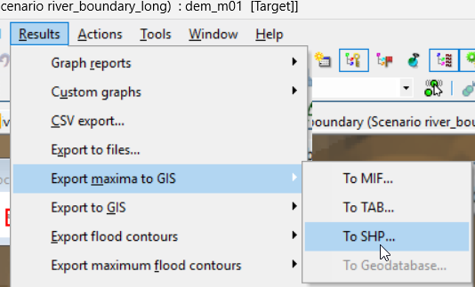

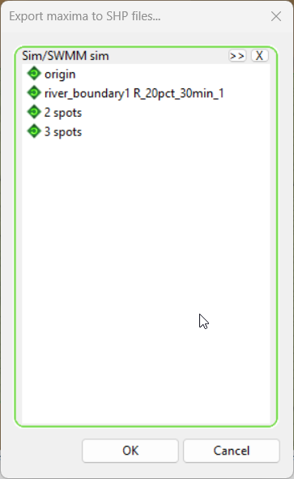

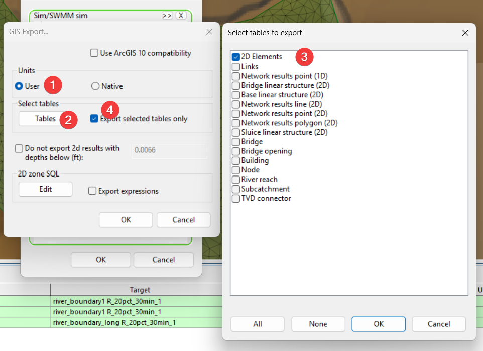

# Style 2D elements in QGIS

**Step 1: Load the DEM (Digital Elevation Model)**

1.  Open QGIS and navigate to your **data folder**.

2.  Drag the DEM file into the QGIS workspace.

3.  Double-click the DEM layer → **Symbology** tab.

4.  Change **Render type** to **Hillshade**.

5.  For smoother visuals, set **Resampling** to **Bilinear**.

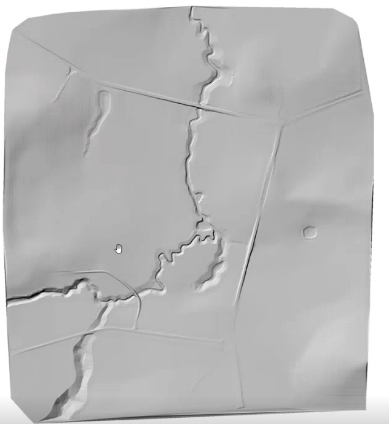

**Step 2: Add the 2D Model**

1.  Load the shapefile for the full model into QGIS.

2.  Confirm it covers the intended area.

3.  Change the name to something more meaningful, go to **Layer Properties → Source** and set the correct model reference.

> 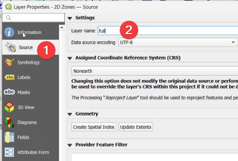

**Step 3: Style the 2D Zones**

1.  In **Symbology**, choose **Graduated** style.

2.  Set **Value** to Depth2D.

3.  Select a **Blue color ramp** and click **Classify**.

4.  Adjust **Transparency** to ~50% so the hillshade remains visible.

5.  Click **Apply**.

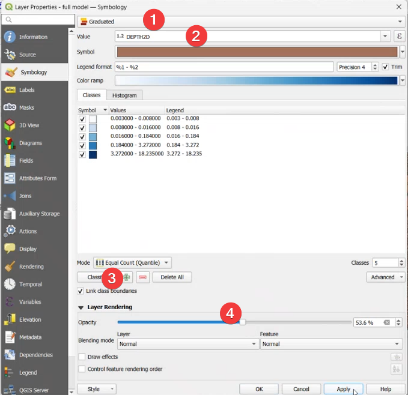

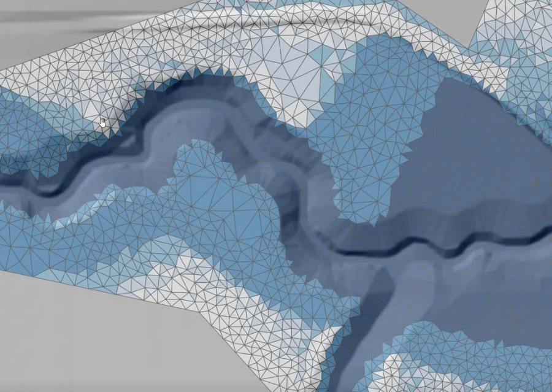

**Step 4: Save the Style**

1.  In the **Style** panel, click **Save Style**.

2.  Save as a QGIS style file (\*.qml) for reuse.

3.  Ensure you only save **Symbology** settings.

**Step 5: Add Velocity Vectors**

1.  Open **Processing Toolbox** → search for **Centroid**.

2.  Run the **Centroid** tool on the full model layer.

3.  Save as a new point layer (or temporary layer).

4.  Rename the layer for clarity.

**Step 6: Apply Vector Field Styling**

1.  Load a pre-defined style or create one:

    - Use **Vector Field Marker** for arrows.

    - Configure **Polar coordinate system** and **Radians** for direction.

2.  Apply the style to visualize flow direction and velocity.

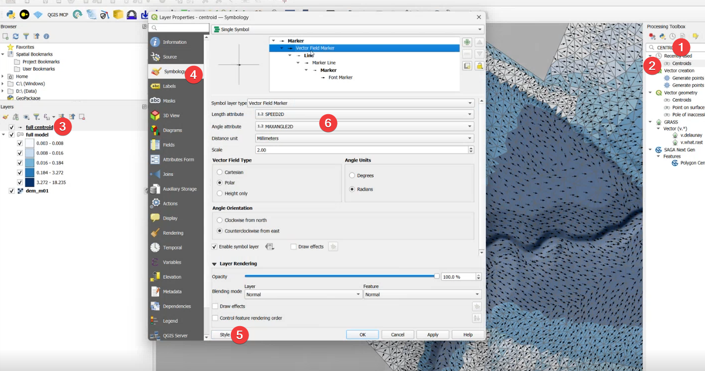

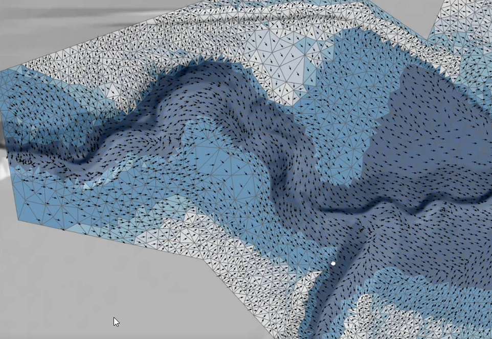

# Configure Elevation Properties for 2D Elements

For each 2D zone layer:

1.  **Open Layer Properties → Elevation**

2.  Set:

    - **Clamping**: *Clamp to Terrain*

    - **Offset Field**: GNDLV2D (ground level)

    - **Elevation Binding**: *Centroid*

3.  **Enable Extrusion**:

    - Check the *Enable Extrusion* box.

    - For **Height**, use the *Depth2D* field (this represents water depth).

Repeat these steps for both scenario layers.

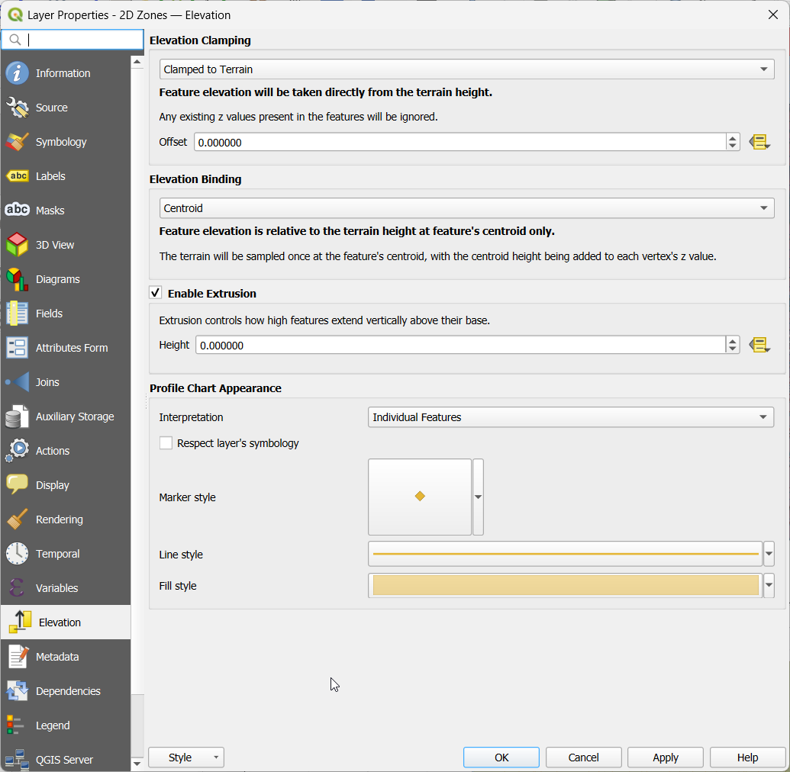

Offset:

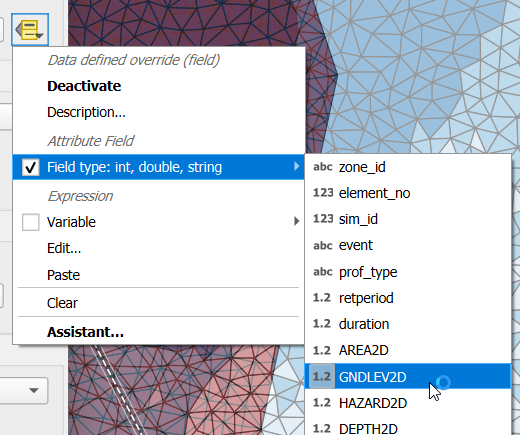

Extrusion

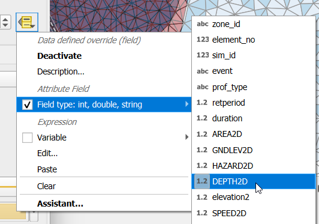

# Use the Elevation Profile Tool

Once elevation properties are set:

1.  Go to **View → Elevation Profile**.

2.  In the toolbar, select **Capture Curve Tool** (polyline icon).

3.  Draw a profile line across the area of interest.

4.  The elevation profile will display:

    - **Bottom**: Ground elevation.

    - **Top**: Water surface elevation.

    - **Bar height**: Represents water depth (inverted bar chart style).

This visualization makes it easy to compare water levels and ground elevations between scenarios.

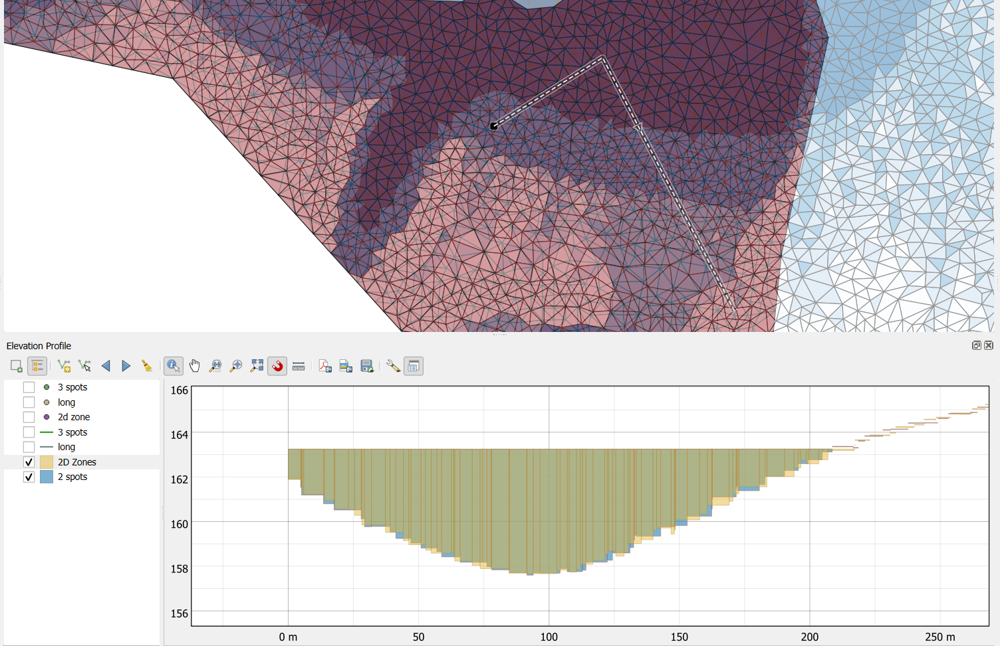

# Elevation Profile for Centroid

Using the centroid layer, you can plot continuous lines of the water surface instead of bars:

1.  For the centroid layer:

    - Open **Layer Properties → Elevation**.

    - Set **Clamping** to *Clamped to Terrian*.

    - For **Offset**, use the water surface elevation field *elevation2*.

2.  In the profile plot:

    - Change interpretation from *Individual Features* to *Continuous Surface* for a smooth line.

    - If left as *Individual Features*, points will display instead.

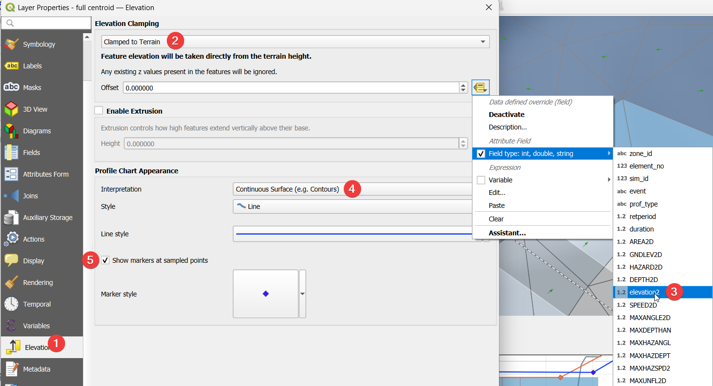

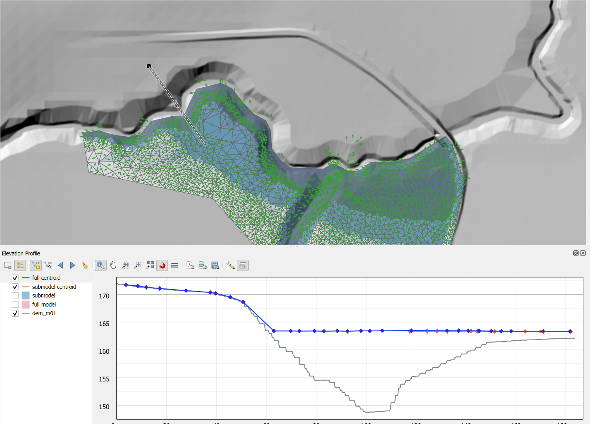

# Appendix

## Repo Structure

This directory contains a QGIS-based workflow for comparing 2D hydraulic modeling elements between a full model and a submodel, typically used for validating InfoWorks ICM 2D simulation outputs.

**Directory Structure**

2d_element_compare/

├── readme.docx \# Documentation file

├── data/

│ ├── 2d elements comparison.qgz \# QGIS project file

│ ├── dem_m01.asc \# Digital Elevation Model

│ ├── style/ \# QGIS symbology styles

│ │ ├── depth2d_blue_ramp_polygon.qml

│ │ ├── elevation_2d_element_centroid.qml

│ │ ├── elevation_2d_element_centroid_ws_line.qml

│ │ ├── elevation_2d_element_polygon.qml

│ │ ├── hillshade_for_dem.qml

│ │ └── max_velocity_arrow_point.qml

│ └── 2d_elements/

│ ├── full/ \# Full model shapefiles

│ │ ├── 2D Zones.shp/.dbf/.shx/.prj

│ │ └── centroid.shp/.dbf/.shx/.prj/.cpg

│ └── submodel/ \# Submodel shapefiles

│ ├── 2D Zones.shp/.dbf/.shx/.prj

│ └── centroid.shp/.dbf/.shx/.prj/.cpg

**File Descriptions**

**Root Level Files**

| **File**    | **Description**                                                            |
|-------------|----------------------------------------------------------------------------|
| readme.docx | Documentation explaining the workflow and how to use the comparison tools. |

**data/ Directory**

| **File**                   | **Description**                                                                                                                                                                                                   |
|----------------------------|-------------------------------------------------------------------------------------------------------------------------------------------------------------------------------------------------------------------|
| 2d elements comparison.qgz | **QGIS Project File** – The main workspace that loads all layers (DEM, 2D zones, centroids) with pre-configured symbology for visual comparison of full model vs. submodel 2D elements.                           |
| dem_m01.asc                | **Digital Elevation Model (DEM)** – An ESRI ASCII Grid raster file containing terrain elevation data. Grid specs: 1895 × 2137 cells, ~1.64m cell size, origin at (960584.81, 20267015.26), NODATA value of -9999. |

**data/style/ Directory (QGIS Style Files)**

| **File**                                  | **Purpose**                                                                                                                                                |
|-------------------------------------------|------------------------------------------------------------------------------------------------------------------------------------------------------------|
| depth2d_blue_ramp_polygon.qml             | Graduated blue color ramp for 2D depth (DEPTH2D field) on polygon layers. Five classes ranging from 0.003m to 18.2m with quantile classification.          |
| elevation_2d_element_centroid.qml         | Elevation profile style for centroid points. Uses GNDLEV2D (ground level) as Z-offset and DEPTH2D for extrusion height. Orange line symbology.             |
| elevation_2d_element_centroid_ws_line.qml | Water surface line profile style for centroids. Uses elevation2 field for Z-offset with DEPTH2D extrusion. Orange coloring for continuous surface display. |
| elevation_2d_element_polygon.qml          | Elevation profile style for 2D zone polygons. Pink/magenta symbology with GNDLEV2D Z-offset and DEPTH2D extrusion for 3D profile visualization.            |
| hillshade_for_dem.qml                     | Hillshade rendering style for the DEM raster. Azimuth: 315°, altitude angle: 45°, z-factor: 1. Creates terrain shading for better visualization.           |
| max_velocity_arrow_point.qml              | Vector field arrow symbology for velocity visualization. Uses SPEED2D for magnitude and MAXANGLE2D for direction. Displays arrows at centroid locations.   |

**data/2d_elements/ Directory (Shapefiles)**

Two parallel sets of shapefiles exist for comparison:

**Full Model (full/)** – 2D elements from the complete hydraulic model.

**Submodel (submodel/)** – 2D elements from a smaller extracted portion of the model.
