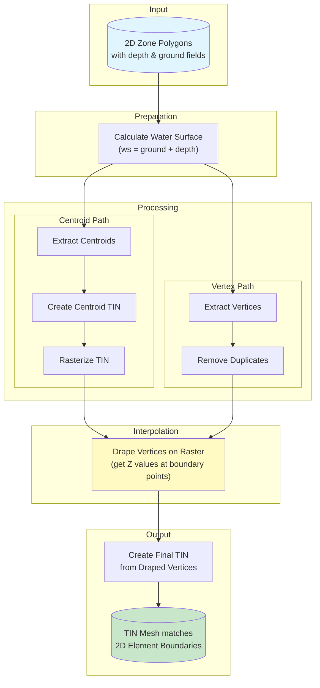

# 2D Zone Polygon to TIN Mesh Tool

A QGIS Python tool that converts 2D zone polygons (with depth/elevation attributes) into TIN (Triangulated Irregular Network) mesh surfaces that precisely match the original 2D element boundaries.

## Why TIN Mesh?

TIN mesh offers an ideal balance between efficiency, accuracy, and visual quality:

| Representation | Storage | Accuracy | Smoothness |
|----------------|---------|----------|------------|
| **Raw 2D Elements** | Compact | Exact cell values | Blocky/stepped appearance |
| **Raster** | Large files | Resolution-dependent | Pixelated at boundaries |
| **TIN Mesh** | Efficient | Exact at vertices | Smooth interpolated surface |

### The Challenge

When creating a TIN surface from 2D zone data, the mesh must align with the original polygon boundaries. Simply triangulating polygon centroids creates a mesh with different edges than the original elements, leading to misalignment between surface representation and simulation geometry.

### How This Tool Solves It

The tool extracts both centroids (for attribute values) and vertices (for mesh geometry) from the input polygons, then interpolates values at vertex locations to create a TIN that matches the original element boundaries.

For a detailed comparison with TUFLOW's triangulation method, see [TUFLOW vs 2D Zone Elements](tuflow_vs_2d_elements.md).

## How It Works



### Processing Steps

| Step | Description |
|------|-------------|
| **1. Prepare Layer** | Calculate water surface elevation (ground level + depth) |
| **2. Extract Centroids** | Get center points of each polygon with attribute values |
| **3. Extract Vertices** | Get all polygon boundary vertices, remove duplicates |
| **4. Create Centroid TIN** | Build initial TIN from centroids for interpolation |
| **5. Rasterize** | Convert centroid TIN to raster for continuous surface |
| **6. Drape Vertices** | Sample raster values at each vertex location |
| **7. Create Final TIN** | Build mesh from vertices with interpolated Z values |

## Requirements

- **QGIS 3.x** (tested with QGIS 3.28+)
- QGIS Processing framework (included with QGIS)
- MDAL provider for mesh support (included with QGIS)

## Installation

1. Download repo to a local folder
2. Open QGIS with your 2D zone data loaded (sample data included in `data/2d/2D Zones.shp`)
3. Open the Python Console (`View` → `Panels` → `Python Console`)
4. Open `polygon_to_tin.py` and run the script.
5. You can also run it in the console.

```python
# Method 1: Execute file directly
exec(open('C:/path/to/polygon_to_tin.py').read())

# Method 2: Import and run
import sys
sys.path.append('C:/path/to/folder')
from polygon_to_tin import run_polygon_to_tin
run_polygon_to_tin()
```

## Input Data Requirements

Your polygon layer should have:

- **Polygon geometry** - representing 2D zone elements
- **Numeric depth field** - water depth values per element
- **Numeric ground level field** - ground/bed elevation per element
- **Valid, non-overlapping polygons** - for accurate triangulation

## Usage

### 1. Launch the Tool

Run the script to open the dialog interface.

### 2. Configure Input Parameters

| Parameter | Description |
|-----------|-------------|
| **2D Zone Layer** | Select the polygon layer containing your 2D zone elements |
| **Depth Field** | Field containing water depth values (e.g., `depth2d`, `DEPTH`) |
| **Ground Level Field** | Field containing ground elevation (e.g., `gndlev2d`, `GROUND`) |
| **Additional Field** | (Optional) Create an extra TIN for another numeric field |
| **Raster Resolution** | Cell size for intermediate raster (default: 1.0 units) |
| **Output Folder** | Directory where TIN files (.2dm format) will be saved |

### 3. Run Processing

Click **Run** to execute. The tool will:

1. Create a **depth TIN** - showing water depth values
2. Create a **water surface TIN** - showing water surface elevation (ground + depth)
3. (Optional) Create an **additional TIN** for the specified field

### 4. View Results

TIN meshes are automatically added to your QGIS project and saved to the output folder.

## Output Files

The tool creates `.2dm` mesh files in the specified output folder:

| File | Description |
|------|-------------|
| `depth.2dm` | TIN mesh with depth values |
| `water_surface.2dm` | TIN mesh with water surface elevation |
| `[field_name].2dm` | Additional TIN if optional field specified |

## Tips

- **Resolution**: Use a smaller raster resolution (e.g., 0.5) for more accurate vertex interpolation in areas with high value variation
- **Large datasets**: Processing time increases with polygon complexity; start with a subset to test
- **Visualization**: Apply mesh styling to color-code by depth or make surfaces semi-transparent

## Troubleshooting

| Issue | Solution |
|-------|----------|
| No polygon layers found | Ensure polygon layers are loaded in your QGIS project |
| Field not found | Verify the depth/ground fields contain numeric values |
| Empty TIN output | Check that polygons have valid geometry and non-null attribute values |
| Processing fails | Review the QGIS log panel for detailed error messages |
