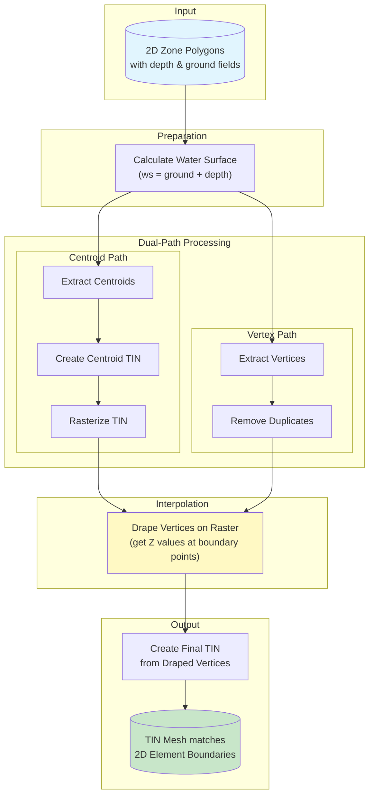

# TUFLOW vs 2D Zone Elements: Surface Interpolation Methods

This document compares TUFLOW's triangulation method for generating smooth raster surfaces with the approach used in this tool for 2D zone polygon meshes.

## Introduction

Both TUFLOW and hydraulic models using 2D zone elements face the same challenge: computational cells store single values (depth, water surface elevation, etc.) at cell centers, but visualization and analysis often require smooth, continuous surfaces.

The solution in both cases is **triangulation with interpolation** - splitting cells into triangles and interpolating values across them.

## TUFLOW's Triangulation Method

### Grid Structure

TUFLOW uses a **staggered Arakawa C-grid** with values stored at different locations within each cell:

```
    ZH──────ZV──────ZH
    │               │
    │               │
   ZU      ZC      ZU
    │               │
    │               │
    ZH──────ZV──────ZH
```

| Location | Description |
|----------|-------------|
| **ZC** | Cell Center - where simulation values are computed |
| **ZH** | Cell Corner (vertex) - shared by 4 adjacent cells |
| **ZU/ZV** | Cell Sides (mid-edge) - shared by 2 adjacent cells |

### Corner Value Calculation

For result data (depth, velocity, etc.), corner values are derived from neighboring cell centers. TUFLOW provides several interpolation methods:

- **Method C** (default): Interpolates/extrapolates from cell centers to corners for smooth transitions
- **Method B**: Alternative method with additional handling for thin breaklines and steep gradients

The `Interpolate ZHC` command linearly interpolates both cell center (ZC) and cell corner (ZH) elevations from the mid-side values (ZU and ZV).

### 4-Triangle Cell Splitting

For raster output generation, the **TUFLOW to GIS utility** employs a specific approach:

> "The TUFLOW to GIS utility uses the same approach as TUFLOW for interpolating a raster. That is, each cell is split into 4 triangles with a common vertex at the cell centre."
> — [TUFLOW Wiki: TUFLOW_to_GIS](https://wiki.tuflow.com/TUFLOW_to_GIS)

```
    Corner────────Corner
      │ \   2   / │
      │  \     /  │
      │   \   /   │
      │ 1  \ /  3 │
      │     C     │
      │    / \    │
      │   /   \   │
      │  /  4  \  │
    Corner────────Corner
```

The center vertex (C) value is calculated as the **average of the four corner values**:

> "The elevation of this central vertex is calculated as the average of the four surrounding DEM elevations."
> — [TUFLOW Wiki: Topography Guidance](https://wiki.tuflow.com/Topography_Guidance)

### Linear Interpolation

For any point within a triangle, its value is determined by **linear interpolation** from the three vertices of that triangle. This produces a smooth, continuous surface across the cell.

## 2D Zone TIN Method (This Tool)

### Mesh Structure

2D zone elements from hydraulic models like ICM use **irregular meshes** - typically triangular or polygonal cells rather than regular grids. Key characteristics:

- Cells may be triangles, quadrilaterals, or other polygons
- Vertices are shared between varying numbers of adjacent cells (not always 4)
- Only centroid values are available from simulation results

### The Challenge

Unlike TUFLOW's regular grid where each corner is predictably shared by exactly 4 cells, TIN meshes have:
- Irregular vertex connectivity
- Variable numbers of cells sharing each vertex
- No fixed spatial relationship between vertices and cell centers

### The Solution: Dual-Path Interpolation

This tool uses a **dual-path approach**:

1. **Centroids** provide the attribute values (depth, water surface)
2. **Vertices** define the mesh structure to match original polygon boundaries




### Vertex Value Calculation

Instead of averaging exactly 4 neighbors (like TUFLOW), this tool:
1. Creates a Delaunay TIN from all cell centroids
2. Uses linear interpolation within that TIN to determine vertex values
3. This effectively creates a **spatially-weighted average** of nearby cell centers

## Comparison

| Aspect | TUFLOW (Regular Grid) | 2D Zone TIN (This Tool) |
|--------|----------------------|-------------------------|
| **Cell geometry** | Square cells | Triangles/polygons |
| **Grid type** | Structured (regular) | Unstructured (irregular) |
| **Corner topology** | Always 4 neighbors | Variable neighbors |
| **Center value** | Direct simulation result | Direct simulation result |
| **Corner/vertex value** | Average of 4 cell centers | TIN interpolation from centroids |
| **Triangulation** | Fixed 4-triangle split | Delaunay from vertices |
| **Within-triangle interpolation** | Linear | Linear |

### Conceptual Equivalence

Both methods achieve the same goal through analogous approaches:

- **TUFLOW**: Corner value = average of 4 neighboring cell centers → split into 4 triangles → linear interpolation
- **This Tool**: Vertex value = TIN interpolation from nearby centroids → triangulate from vertices → linear interpolation

The TIN-based interpolation is a generalization of TUFLOW's fixed 4-neighbor averaging that works for irregular mesh topologies.

### Result Quality

Both methods produce smooth surfaces because:
1. Cell center values are preserved (as centroid or center vertex values)
2. Boundary/corner values are interpolated from neighbors
3. Linear interpolation within triangles creates continuous gradients

The TUFLOW method's 4-triangle split with the center as a common vertex ensures each cell is independently interpolated. The TIN method achieves similar results through Delaunay triangulation of vertices with interpolated values.

## Potential Improvements

### Direct TIN Sampling

The current workflow converts the centroid TIN to a raster before sampling vertex values:

```
Centroid TIN → Raster → Sample at Vertices
```

This intermediate rasterization step exists because **no existing QGIS Processing tool directly samples Z values from a TIN surface at arbitrary point locations**. Ideally, the workflow would be:

```
Centroid TIN → Sample at Vertices (direct)
```

Direct TIN sampling would:
- Eliminate the raster resolution parameter and its impact on accuracy
- Reduce processing time by skipping rasterization
- Provide exact linear interpolation values from the TIN triangles

A future improvement could implement direct TIN interpolation using barycentric coordinates within each triangle, similar to how QGIS's "Drape" algorithm works for 3D geometries but applied to 2D mesh surfaces.

## References

1. **TUFLOW Wiki: TUFLOW_to_GIS**
   - URL: https://wiki.tuflow.com/TUFLOW_to_GIS
   - Description: Documentation of the TUFLOW to GIS utility and its triangulation approach

2. **TUFLOW Wiki: Topography Guidance**
   - URL: https://wiki.tuflow.com/Topography_Guidance
   - Description: Guidance on how TUFLOW handles topography and elevation interpolation

3. **TUFLOW Docs: TGC Commands**
   - URL: https://docs.tuflow.com/classic-hpc/manual/2025.1/TGCCommands-1.html
   - Description: Documentation of Interpolate ZC, ZHC, and ZUV commands

4. **TUFLOW Docs: Map Output Corner Interpolation**
   - URL: https://docs.tuflow.com/classic-hpc/manual/2025.2/Map-2.html
   - Description: Documentation of Method B and Method C corner interpolation options

