QGIS offers better tooling to compare 2D flood modeling results from different scenarios, such as before and after development, or between a full model and a simplified cut-out.

It involves exporting 2D depth data from ICM to a raster, visualizing and analyzing them in QGIS, and quantifying differences to ensure model consistency and validate changes.

# Export Flood Depth Data from ICM

Use the "Export Maximum Flood Contours" tool in ICM to export your scenario results as ASCII grid files. Select the relevant model runs and specify the DEM and theme as needed. 

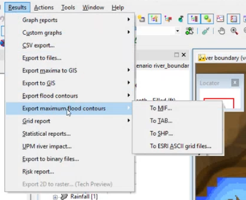

> **1. Open ICM and Select Your Model Run**
>
> Navigate to the results section and choose the scenario/run you want to export.
>
> **2. Access the Export Tool**
>
> Go to "Export Maximum Flood Contours" under the results menu. This tool allows you to export the maximum flood depth as a raster (ASCII grid). 
>
> 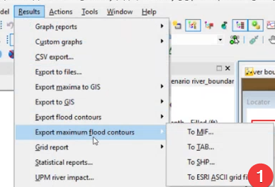
>
> **3. Specify Export Settings**
>
> Select the model run(s) you want to export.
>
> Choose the DEM file to use as the ground reference.
>
> Select the appropriate theme (usually "flood") for the export. If you don’t have a theme, refer to the note section on how to create one.
>
> 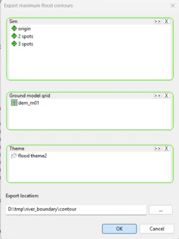
>
> **4. Save the Exported Raster**
>
> Set the export location by choosing a folder for the output files.
>
> Confirm the export settings and click OK to start the export. 
>
> **5. Verify Exported Files**
>
> Check the designated folder for the newly created ASCII grid files, named according to the scenario/run.
>
> Note: **Creating the Flood Theme**

- Go to the theme properties in ICM. 

> 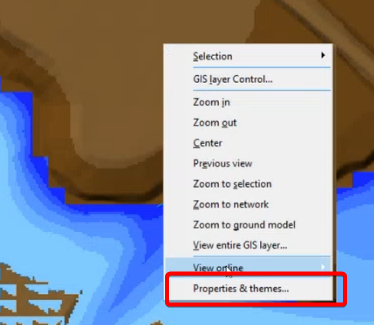

- Check the box for "flood" to enable flood visualization.

- Click the "Edit" button to adjust theme settings.

> 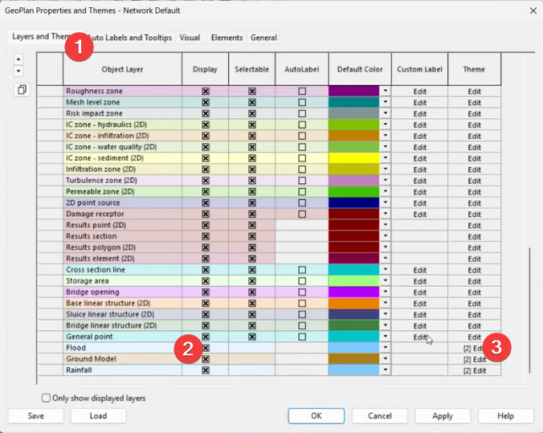

- Add or modify values as needed for your analysis. 

- Click "OK" to confirm your changes.

> 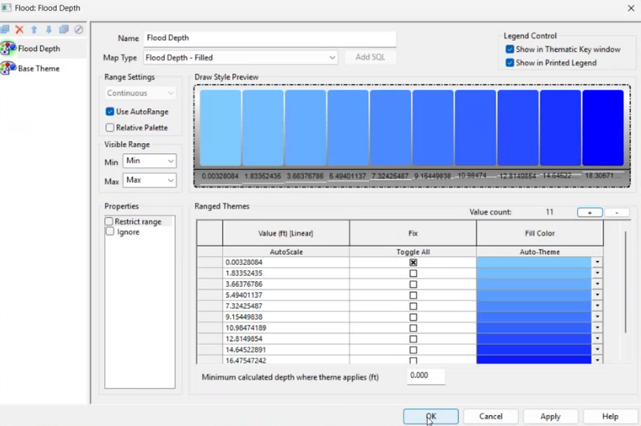

- Hit the "Save" button to save the theme to the database object. 

> 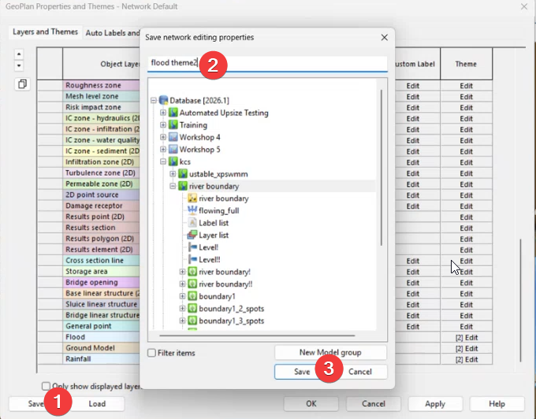

- Choose the appropriate folder and name for the theme, then save. 

- Uncheck unnecessary items if you only want to save the theme. 

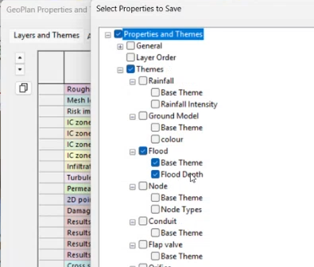

# Comparing 2D results in QGIS

Open QGIS and drag the ASCII grid files into the workspace. Set the correct projection if possible.

## Visualize Water Depth

Water depth is commonly visualized as a blue color ramp.

- Open QGIS and load the exported ASCII grid (raster) files by dragging them into the workspace.

- Turn off all layers except the one you want to visualize.

- Right-click the raster layer and go to "Properties."

- Under the "Symbology" tab, change the style from "contour" to "singleband pseudocolor" or another color map for better visualization of depth.

- Adjust the color ramp and transparency as needed to highlight depth differences. 

- Apply the changes to see the depth visualization on the map. 

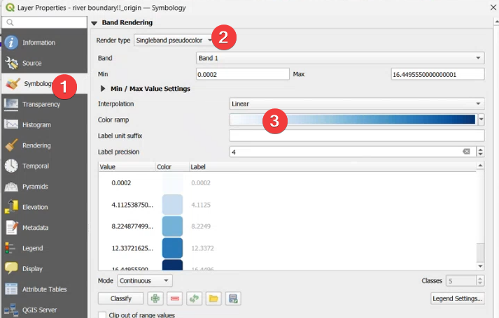

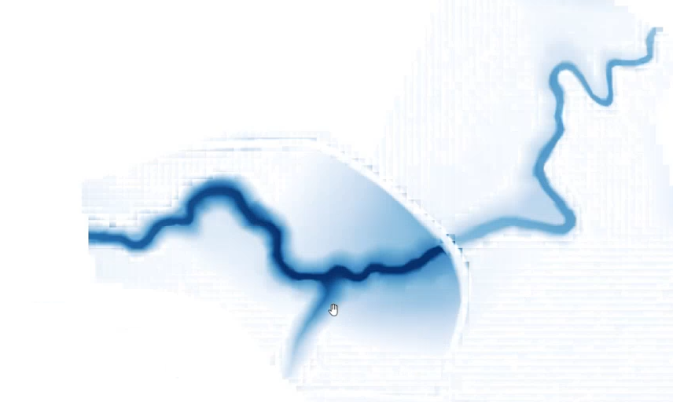

## Compare Depth Elevation Profiles

Use the elevation profile tool in QGIS to draw lines and compare water depth across scenarios. 

- Define the depth raster as an elevation surface in QGIS.

  - Select the depth raster layer in QGIS.

  - Open the layer properties.

  - Set the raster type to "Elevation" to treat the depth values as elevation data.

> 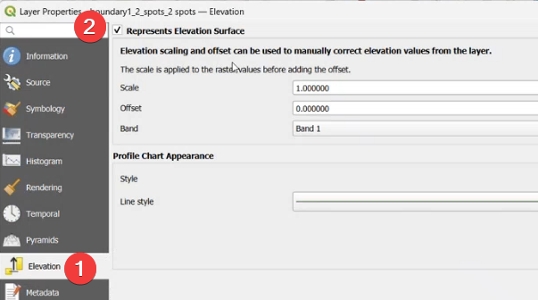

- Use the "Elevation Profile" tool from the menu (View \> Elevation Profile).

- Draw a line across the area of interest to generate the profile. 

- Review the resulting graph to compare depth values along the drawn line for different scenarios. 

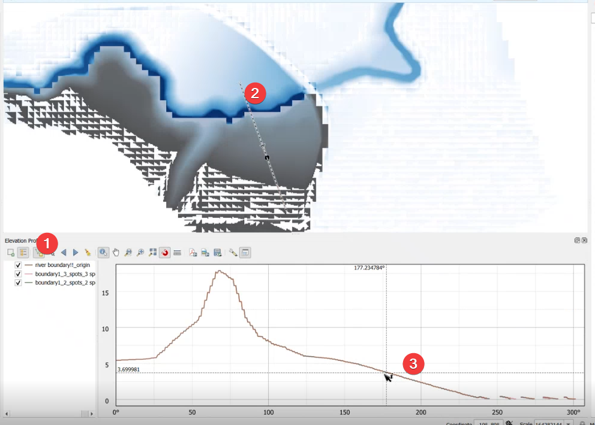

# Calculate Depth Differences

Use the Raster Calculator in QGIS to subtract one scenario’s depth grid from another, creating the difference map. 

- Open QGIS and load both depth grid raster layers for the scenarios you want to compare. 

- Go to the menu and select "Raster" \> "Raster Calculator."

- In the Raster Calculator dialog, enter the expression to subtract one scenario’s raster from the other (e.g., \`Scenario2 - Scenario1\`). 

- Specify the output file name and location for the difference map. 

- Click "OK" to run the calculation and generate the new difference raster layer. 

- Add the resulting difference map to your QGIS project for visualization and further analysis. 

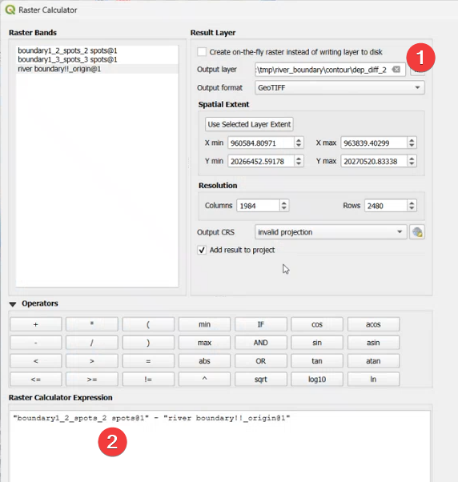

## Style the Difference Map

Apply discrete color ramps to highlight areas where differences are within acceptable thresholds (e.g., between -0.1 and 0.1). 

- Select the difference raster layer in QGIS. 

- Open the layer properties and go to the "Symbology" tab. 

- Choose "Discrete" as the renderer type. 

- Create three categories: less than -0.1, between -0.1 and 0.1, and greater than 0.1.

- Assign colors: blue for negative values, green for values between -0.1 and 0.1, and red or black for positive values. 

- Delete any unnecessary categories, ensuring only the three main categories remain. This step can be tricky,

  - Click the "Remove" button (a minus sign) to keep only 3 categories.

  - Repeat for each unwanted category but avoid deleting the records immediately next to your first and last categories.

  - Ensure only your three main categories remain with the correct range.

> 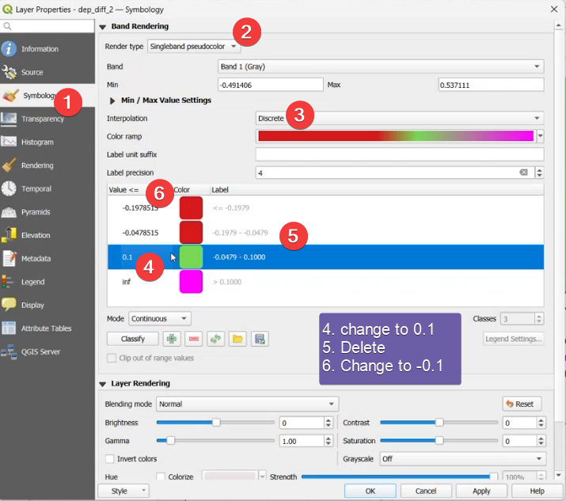
>
> 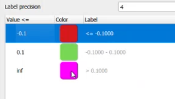
>
> You can check the results using the elevation view tool.
>
> 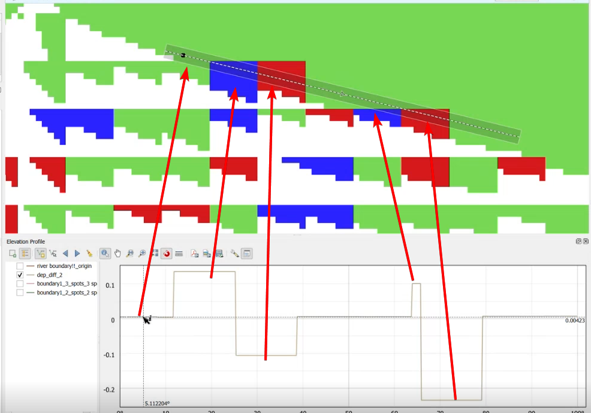

# Convert Depth to Water Surface Elevation

Add the DEM to the depth grid using the Raster Calculator to get water surface elevation.

- Export your DEM (Digital Elevation Model) to an ASCII grid file if you don't already have it. 

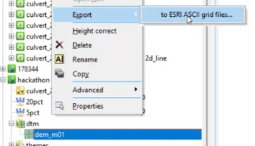

- Load the DEM into QGIS as a raster layer. 

- Confirm the DEM values are correct by checking elevation profiles. 

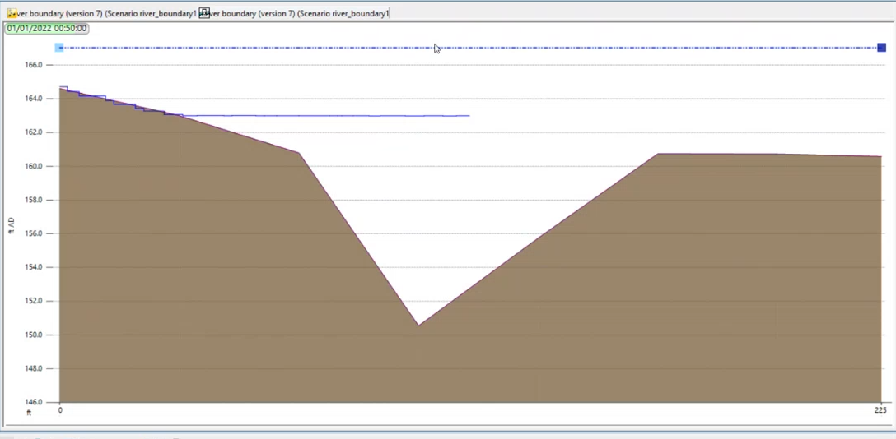

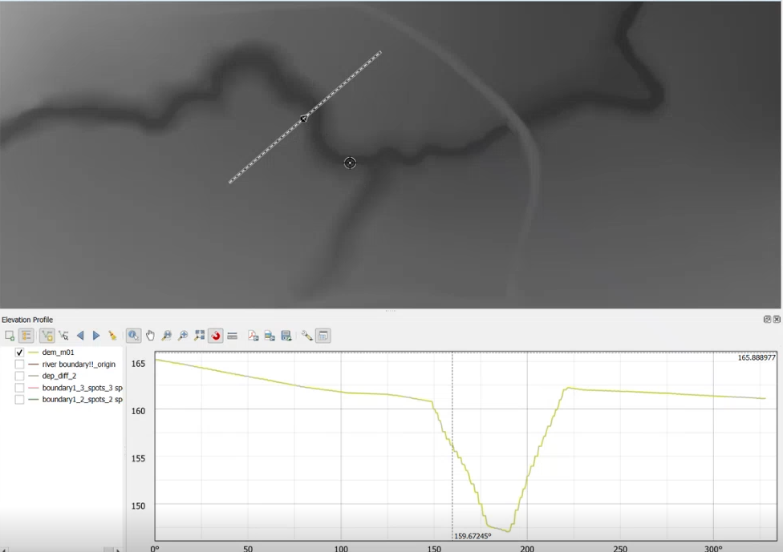

- Open the Raster Calculator tool.

- In the Raster Calculator, enter the expression: \`\[DEM\] + \[Depth\]\` (replace with your actual layer names). 

- Set an output file name (e.g., "WaterSurfaceElevation").

- Click OK to run the calculation and create the new water surface elevation raster. 

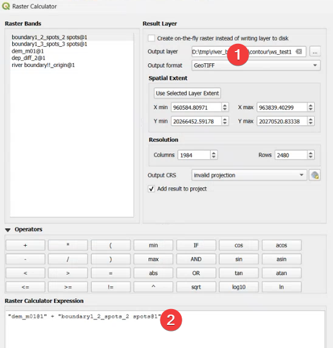

- Style the resulting layer as desired (e.g., hillshade or color ramp) to visualize the water surface elevation.

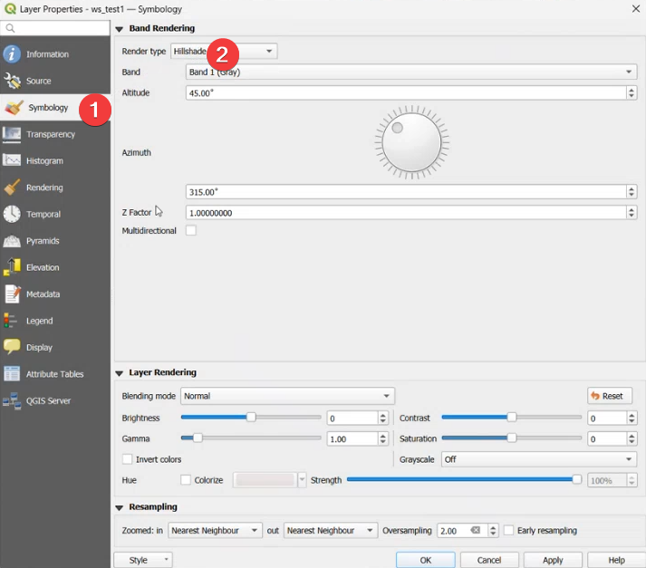

# Validate and Interpret Results

We can visually check the difference map to quickly identify major differences. For more detailed analysis we can use advanced raster analysis.

# Reference

[qgis 2d flood contour compare-20251203_103654-Meeting Recording.mp4](https://myshare.autodesk.com/:v:/r/personal/mel_meng_autodesk_com/Documents/Recordings/qgis%202d%20flood%20contour%20compare-20251203_103654-Meeting%20Recording.mp4?csf=1&web=1&e=QigzKM&nav=eyJyZWZlcnJhbEluZm8iOnsicmVmZXJyYWxBcHAiOiJTdHJlYW1XZWJBcHAiLCJyZWZlcnJhbFZpZXciOiJTaGFyZURpYWxvZy1MaW5rIiwicmVmZXJyYWxBcHBQbGF0Zm9ybSI6IldlYiIsInJlZmVycmFsTW9kZSI6InZpZXcifX0%3D)
