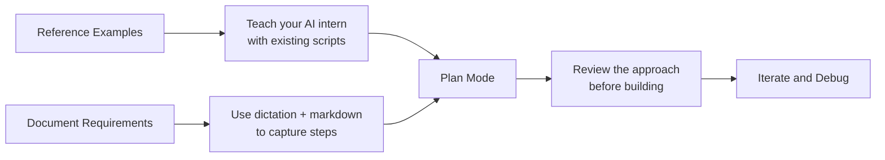

# Conclusion: AI-Assisted Ruby Scripting for InfoWorks ICM

## Key Takeaways
- **3-4 hours of Ruby coding → 20-30 minutes** with AI assistance
- **You don't need to be a Ruby expert** — just a domain expert
- **AI is your translator:** You speak ICM, AI speaks Ruby
- **Plan first, build fast** — measure twice and cut once
- **Every iteration you learn** — deepen the understanding of the problem, and the solution

## The Workflow

## Mindset Shift
| Your Job | AI's Job |
|----------|----------|
| Know the manual steps (you already do this) | Translate them into working code |
| Describe what the output should be | Handle the syntax and boilerplate |
| Test and give feedback | Learn from your examples and corrections |

**If you can explain it, you can automate it.**

## Get Started
- [ ] Download example scripts from [GitHub](https://github.com/innovyze/Open-Source-Support)
- [ ] Install [Cursor](https://cursor.com)
- [ ] Document your manual workflow
- [ ] Start a conversation

---

**Narration:**

So let's wrap up what we just did. In about an hour, we went from having no Ruby script to a fully working exporter that handles nodes and links with proper naming conventions. Remember, what used to take 3 to 4 hours of manual Ruby coding now takes 20 to 30 minutes once you're comfortable with the workflow. And the workflow itself is pretty straightforward. First, give the AI examples to learn from. Second, document your requirements clearly. Third, use plan mode to review before building. And fourth, iterate and debug just like you would with any code. The key insight here is the shift in mindset. Your job is not to write the code. Your job is to understand your system so deeply that you can guide the AI to write it for you. Scripting really is for everyone in the age of AI.

