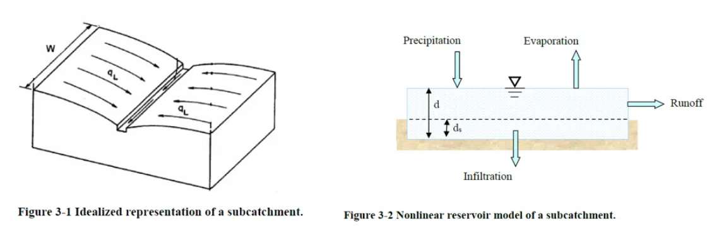
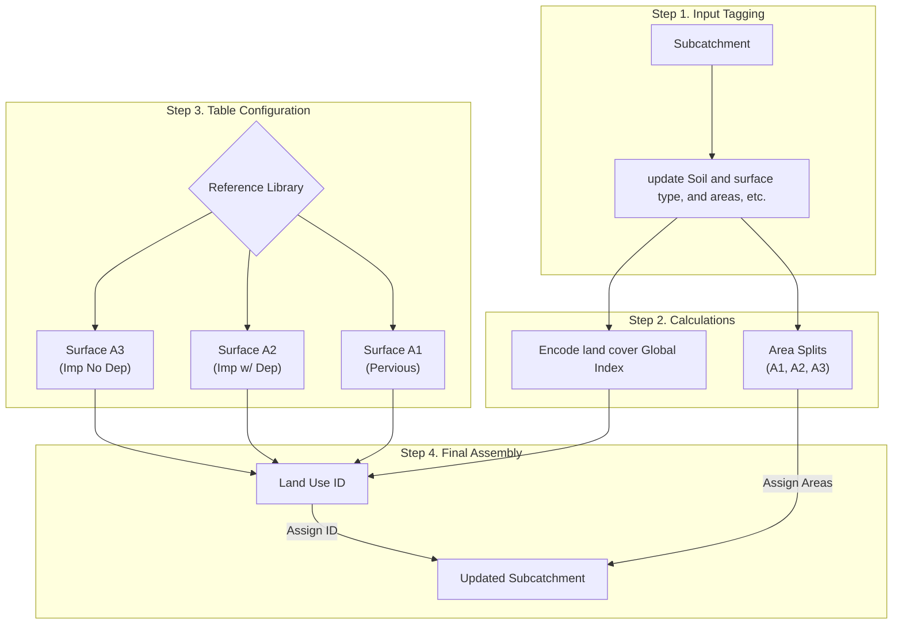

#  Manual SWMM Runoff Hydrology Setup Tutorial

This tutorial explains how to set up subcatchment runoff hydrology in InfoWorks ICM manually. By walking through this process, you will understand the underlying "Land Cover" philosophy and see why script automation is highly recommended for larger projects.

---

##  Prerequisites

Before starting this tutorial, ensure you have:
1.  **InfoWorks ICM** installed and open.
2.  Access to the **Reference Library** ([reference_tables.md](resources/reference_tables.md)) which contains the standard physical parameters for soils and land covers.
3.  A basic understanding of the **Subcatchment Grid** in InfoWorks ICM.

---

##  The Philosophy: Land Cover Abstraction

Managing runoff hydrology for hundreds of subcatchments is a daunting task because of the sheer volume of physical parameters required (Infiltration rates, Manning's n, depression storage, etc.). If you try to manage these individually for every subcatchment, the workload becomes unmanageable and error-prone.

###  Practical Analogies

To understand how InfoWorks ICM views your subcatchment with SWMM Runoff hydrology, think of these analogies:

1.  **The Equivalent Rectangle**: InfoWorks ICM doesn't care about the complex polygon shape of your subcatchment. It treats every subcatchment as an **equivalent rectangle** with a specific width and length. Water rains uniformly on this rectangle and flows towards the "outlet" edge.
2.  **The Non-Linear Reservoir**: Think of each surface as a reservoir with a "lip" (the depression storage). Water must fill up this storage and rise above the lip before any runoff actually leaves the surface.

*Figure 1: Visualizing the Equivalent Rectangle (1) and Non-Linear Reservoir (2) concepts.*

3.  **The Three Surface Types**:
    *   **A1 (Pervious)**: Think of **Grass or Woods**. This is the only surface where water can "soak" into the ground (Infiltration).
    *   **A2 (Impervious w/ Depression)**: Think of a **Flat Parking Lot**. It's paved, but because it's flat, puddles form in low spots before the water starts flowing away.
    *   **A3 (Impervious WITHOUT Depression)**: Think of a **Steep Roof**. As soon as water hits the shingles, it runs off immediately into the gutters.

###  The Logic Flow

The following diagram shows how raw "Tags" on a subcatchment are transformed into a complex hydraulic model:

---

##  Step 1: Tagging the Subcatchment (Input)

In InfoWorks ICM, you don't enter Manning's n or Infiltration rates directly into the subcatchment grid. Instead, you "tag" the subcatchment with the IDs from your library.

### Subcatchment Field Mapping

The following mapping shows which standard InfoWorks ICM fields are repurposed to store our runoff hydrology "Tags".

| InfoWorks ICM Field Name | Logical Role (Runoff Hydrology) |
| :--- | :--- |
| **user_text_1** | **Soil/Infiltration ID** |
| **user_text_2** | **Pervious Landcover ID** |
| **user_text_3** | **Impervious Landcover ID** |
| **user_text_4** | **Land Use Description** |
| **user_number_1** | **Total Impervious %** |
| **user_number_2** | **% of Imp. area with no depression** |

###  Walkthrough Example: `TEST_SUB`

For this tutorial, we will configure a single subcatchment with the following data:

*   **ID**: `TEST_SUB`
*   **Area**: `1.5` acres
*   **Total Impervious % (user_number_1)**: `40.0` %
*   **% of Imp. no depression (user_number_2)**: `10.0` %
*   **Soil ID (user_text_1)**: `11` (Reference: Horton Rates 3.0, 0.5, 4.0)
*   **Pervious ID (user_text_2)**: `6` (Reference: Manning 0.15, Storage 0.1 in)
*   **Impervious ID (user_text_3)**: `4` (Reference: Manning 0.013, Storage 0.05 in)

---

##  Step 2: Performing the Calculations

To set up InfoWorks ICM manually, you must calculate the specific areas and unique IDs for the engine.

### 1. Area Split Formulas
Every subcatchment's **Contributing Area** is divided into three functional components:
- **A1 (Pervious)**: `Area * (100 - imp_pct) / 100`
- **A2 (Imp w/ Dep)**: `Area * (imp_pct / 100) * (1.0 - (imp_no_dep_pct / 100.0))`
- **A3 (Imp no Dep)**: `Area * (imp_pct / 100) * (imp_no_dep_pct / 100.0)`

####  `TEST_SUB` Calculation:
Applying the formulas to our 1.5-acre subcatchment:
- **A1 Area**: `1.5 * (100 - 40) / 100 = 0.90 acres`
- **A2 Area**: `1.5 * 0.4 * (1 - 0.1) = 0.54 acres`
- **A3 Area**: `1.5 * 0.4 * 0.1 = 0.06 acres`

### 2. Runoff Surface Index Formulas
Indices are **Global IDs** derived purely from your **Land Cover** and **Soil** IDs.
- **Pervious (A1)**: `"3#{soil_rid}#{perv_rid}"` (e.g., Soil 11 + Perv 6 = Index `3116`)
- **Impervious w/ Depression (A2)**: `100 + imp_rid` (e.g., Imp 4 = Index `104`)
- **Impervious WITHOUT Depression (A3)**: `200 + imp_rid` (e.g., Imp 4 = Index `204`)

####  `TEST_SUB` Calculation:
- **Index A1**: `3` + `11` + `6` = **`3116`**
- **Index A2**: `100 + 4` = **`104`**
- **Index A3**: `200 + 4` = **`204`**
- **Land Use ID**: Concatenate indices = **`3116104204`**

---

##  Step 3: Configuring the Tables

Now you must manually populate the InfoWorks ICM tables to support your tags. This is where the complex parameter mapping happens.

### Unit Conversions
You should use US customary units when working the runoff hydrology. 
- **Depression Storage**: Source tables list storage in **Inches**. InfoWorks ICM requires **Feet**.
  - **Formula**: `Value in InfoWorks ICM = Inches / 12`
- **Infiltration Rates**: Stay as **in/hr**.

### 1. Surface A1 (Pervious)
*Maps Soil and Pervious Landcover parameters.*

| Source (Reference Table) | InfoWorks ICM Grid Field | Transformation / Unit |
| :--- | :--- | :--- |
| `pervious.manning_n` | **Runoff Routing Value** | None (Dimensionless) |
| `pervious.depression_storage` | **Initial Loss Value** | **`/ 12`** (Inches to Feet) |
| `infiltration.horton_f0` | **Initial Infiltration** | None (in/hr) |
| `infiltration.horton_finf` | **Limiting Infiltration** | None (in/hr) |
| `infiltration.horton_k` | **Decay Factor** | None (1/hr) |

####  `TEST_SUB` Action:
1.  **Infiltration (Horton) Table**: Create ID `3116`. Enter rates: `3.0`, `0.5`, `4.0`.
2.  **Runoff Surface Table**: Create ID `3116`.
    *   Set **Runoff Volume Type**: `HortonSWMM`
    *   Set **Surface Type**: `Pervious`
    *   Set **Initial Loss Value**: `0.1 / 12 = 0.00833`
    *   Set **Runoff Routing Value**: `0.15`

### 2. Surface A2 (Impervious with Depression)
*Maps Impervious Landcover parameters.*

| Source (Reference Table) | InfoWorks ICM Grid Field | Transformation / Unit |
| :--- | :--- | :--- |
| `impervious.manning_n` | **Runoff Routing Value** | None (Dimensionless) |
| `impervious.depression_storage` | **Initial Loss Value** | **`/ 12`** (Inches to Feet) |
| (N/A) | **Infiltration Model** | Set to `None` |

####  `TEST_SUB` Action:
1.  **Runoff Surface Table**: Create ID `104`.
    *   Set **Runoff Volume Type**: `Fixed`
    *   Set **Surface Type**: `Impervious`
    *   Set **Initial Loss Value**: `0.05 / 12 = 0.00416`
    *   Set **Runoff Routing Value**: `0.013`

### 3. Surface A3 (Impervious WITHOUT Depression)
*Maps Impervious Landcover parameters but forces zero storage.*

| Source (Reference Table) | InfoWorks ICM Grid Field | Transformation / Unit |
| :--- | :--- | :--- |
| `impervious.manning_n` | **Runoff Routing Value** | None (Dimensionless) |
| (Fixed Value) | **Initial Loss Value** | **`0.0`** (Forced zero) |

####  `TEST_SUB` Action:
1.  **Runoff Surface Table**: Create ID `204`.
    *   Set **Runoff Volume Type**: `Fixed`
    *   Set **Surface Type**: `Impervious`
    *   Set **Initial Loss Value**: `0.00`
    *   Set **Runoff Routing Value**: `0.013`

---

##  Step 4: Final Assembly

The last step is to link your new surfaces to the subcatchment via the Land Use Definition.

### 1. Create Land Use Definition
In the **Land Use** table:
1.  Create ID `3116104204`.
2.  Set **Runoff Index 1** = `3116` (Pervious)
3.  Set **Runoff Index 2** = `104` (Imp w/ Dep)
4.  Set **Runoff Index 3** = `204` (Imp no Dep)

### 2. Update Subcatchment
Finally, update the **Subcatchment** grid for `TEST_SUB`:
1.  Set `Land Use ID` = `3116104204`.
2.  Set `Area Absolute 1` = `0.90`
3.  Set `Area Absolute 2` = `0.54`
4.  Set `Area Absolute 3` = `0.06`

---

##  Conclusion: The Manual Cost

To set up **one** subcatchment correctly, you performed **5 calculations**, converted units for **3 surfaces**, and manually touched **4 secondary tables**.

If you have 500 subcatchments with 50 different combinations of soils and surfaces, the risk of a typo or a unit conversion error (forgetting to divide by 12) is nearly 100%.

**Recommendation**: Use the `generate_hydrology_tables_ui.rb` script. It performs all these calculations and table updates automatically based on your initial "Tagging" of the subcatchment runoff hydrology fields in InfoWorks ICM.

