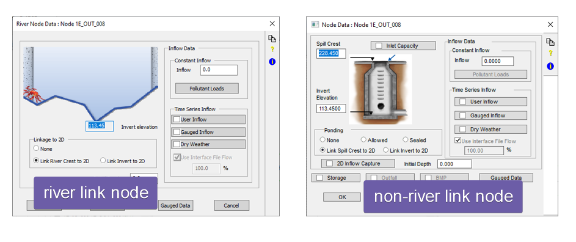
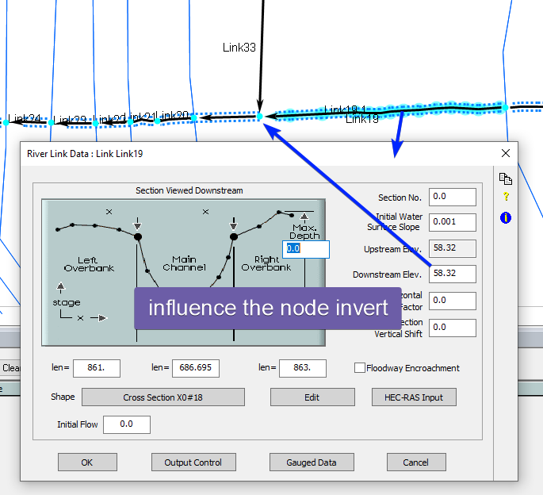
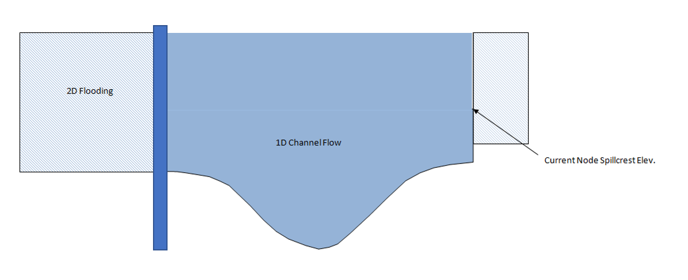

# Introduction

SWMM/XPSWMM is a widely used software that utilizes a node-link scheme for modeling drainage networks, particularly for underground pipe systems. While this scheme works well for such networks, it becomes challenging when modeling open channels or culverts since these objects do not have physical nodes in the real world.

In this article, we will explore the appropriate approach to model open channels and culverts in SWMM/XPSWMM and discuss common mistakes to avoid.

# River Representation

In SWMM/XPSWMM, an open channel is internally represented using a special pipe that resembles a frictionless channel instead of a circular pipe. Each channel consists of an upstream node (1) and a downstream node (2), similar to other manhole nodes in the model. These nodes have an area and a shaft. To represent the shape of the channel, it is common practice to cut a cross section in the middle of the channel (3). Instead of specifying a diameter (4), the size of the channel is inferred from the cross section (5).

# Setup the node elevations

Since rivers do not have physical nodes, it is necessary to conceptualize nodes as a workaround to fit the river into the node-link modeling scheme. However, from the perspective of the model engine, these nodes are treated as real node with volume, behaving in the same way as any other manhole node. Nonetheless, this approximation introduces only a minor error since, for a typical river, the flow through the nodes is much higher compared to the node storage.

A more significant limitation is the prevention of the river "pipe" from flowing full. Once the river link becomes pressurized, it no longer behaves as free open channel flow. To illustrate this situation, let's consider a culvert: when the water level rises above the culvert's top and overflows onto the road, we expect open channel flow in the river channels, pressurized flow inside the culvert, and weir flow over the top of the road.

To ensure that the river channels do not become pressurized, follow these steps:

- Set the cross sections for the upstream and downstream channels higher than the maximum water elevation so that the river channel remains unpressurized.

- This requires setting the ground elevation of the inlet and outlet nodes for the culvert above the high watermark.

A common mistake is defining the channel at the level of the culvert's crown. In such cases, once the water level rises above the culvert, the channels behave as pressurized closed pipes, and the water depth inside the channel will not exceed the defined depth.

# XPSWMM River Links

As mentioned earlier, node elevations can be inferred directly from river link inverts and the cross-section shape. XPSWMM provides river links that offer a streamlined user interface to handle all the parameters that can be inferred. You can easily convert any natural-shaped links into river links and vice versa.

For river links node, the spill crest and invert elevations are inferred from the river link cross section height.

When dealing with a simple river stretch, the river link user interface performs well in correctly inferring the elevations. However, when working with forks or confluences, XPSWMM may sometimes struggle to calculate the correct elevations, requiring manual adjustments.

In the case of a confluence link connected to the river (which is not a river link), consider the following:

- The node invert and ground elevation at the confluence are automatically set by XPSWMM, and you cannot override the values in the profile window of Link33.

- The inverts and ground elevation set at the confluence are determined by the inverts of the connected river links and the height of the link's natural shapes.

> A common complication arises when the automatically calculated inverts for the confluence nodes do not match those of the non-river link. This can result in the confluence invert being higher or lower than the non-river link invert, or the ground elevation being lower than the non-river link pipe crown. You have two choices:

- If you choose to keep the river links, follow these steps:

  - Modify the inverts of the connected river links to adjust the confluence invert.

  - Adjust the shape of the connected links to modify the ground elevation of the confluence node. Remove high points from the shape to lower the ground elevation or add additional high points to increase the ground elevation.

- Alternatively, you can convert the river links to non-river links and manually enter the node elevations to match the profile of your river and non-river links.

# Common mistakes

## Converting a 1D unsteady state model

When importing models from other sources, such as FEMA flood study models, they are often in the form of steady-state models. Converting such models into XPSWMM poses several challenges:

- The river model in XPSWMM is an unsteady state model. Instead of routing a constant flow through the river, you need to input a hydrograph to accurately estimate the flooding process with realistic storage on the overbanks.

- In steady-state models, overbanks are typically modeled as part of the cross section but marked as ineffective. While this approach is appropriate for steady-state models, it is not suitable for unsteady state models.

- To model an unsteady state model correctly, the main channel should be represented as a 1D river, and the overbank storage area should be modeled either as 1D storage or 2D surface.

As shown in the example below, the FEMA model cross section extended all the way to the possible inundated areas in the steady state model. Once converted into XPSWMM, we should only keep the main channel (1) for the 1D river model, and model the overbank areas (2) and (3) either as storage or 2D surfaces.

## Overflow through the banks

When the river overflows through the banks, it is crucial to ensure that the channel remains unpressurized. To achieve this, ensure that the cross section and the node's spill elevation are higher than the high watermark.

# Conclusion

By avoiding these common mistakes and following the recommended practices outlined in this article, you can effectively model rivers in SWMM/XPSWMM while maintaining accurate and reliable results.
