# Introduction

InfoWorks is a powerful platform with thousands of functions. Ruby scripting is a great way to automate repeated or tedious modeling tasks.

However, getting started with Ruby scripting can feel quite intimidating.

If your job involves moving a lot of data in and out of ICM on a regular basis, you should seriously think about learning ruby scripting.

If most of your tasks can be done within ICM, and you just occasionally will need to create some customized tables, SQL might be a better and easier tool to start.

The good news is that even if you are not interested in learning Ruby scripting, you should be able to use a script someone else developed after reading this article, it is quite simple.

# Run a Ruby script

Most of the time, you don’t need to write your own script from scratches. For InfoWorks ICM, you can find lots of scripts from [Github](https://github.com/innovyze/Open-Source-Support/tree/main/01%20InfoWorks%20ICM/01%20Ruby).

Say we would like to export the node and conduit tables using the ODEC (open data export center) with just a click of a button, this can be easily done using an existing Ruby script.

If you go to the [0012 - ODEC Export Node and Conduit tables to CSV and MIF](https://github.com/innovyze/Open-Source-Support/tree/main/01%20InfoWorks%20ICM/01%20Ruby/0012%20-%20ODEC%20Export%20Node%20and%20Conduit%20tables%20to%20CSV%20and%20MIF), there is a nice readme document showing how it works.

1.  Download the script and the configuration file to your computer.

    1.  You can download the whole repo as a zip file

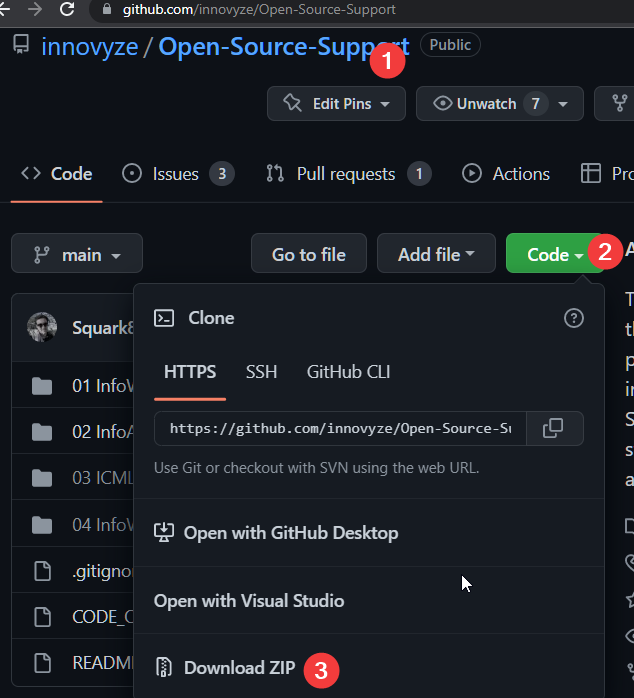

2.  If you only want to download the individual files, you need to click the file, then show it as raw text file before save it to your local computer.

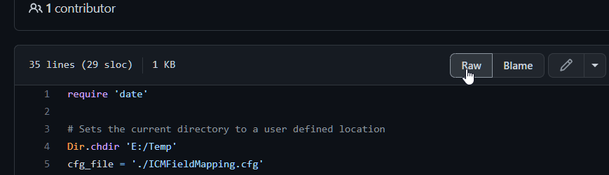

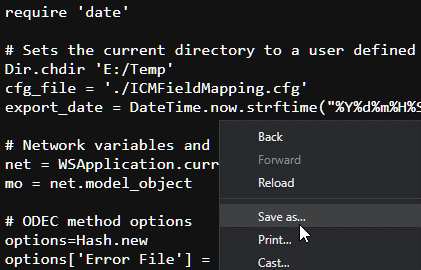

2.  Update the script to match your folder location. The \*.rb file is just a text file, open it and you’ll see line 4 is hard coded with the folder where the \*.cfg file is and where the exported data will be saved. Change that to your folder where you downloaded the script and the cfg file.

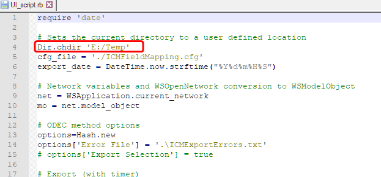

3.  Add a button to run the script

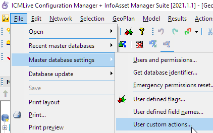

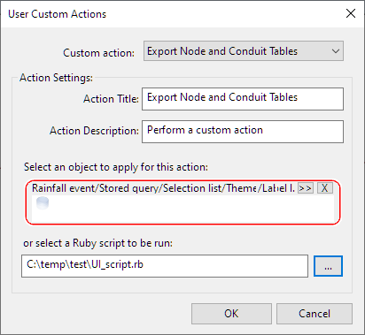

4.  Run the script. Open a network, click the custom action button, and see the results.

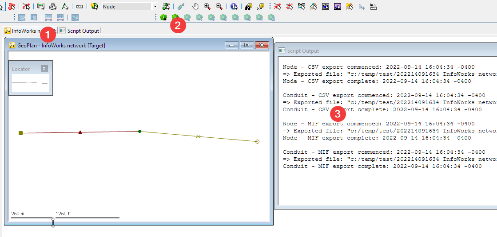

Not too bad for the investment of 5min.

# Modify a script

Most of the time you’ll need to modify the script a little bit to meet your own needs. Like what we did in the previous step changing the folder path.

Like this one, the developer made it easy with a readme file. So we know if you need to export different set of columns, we just need to run the ODEC, and then save our own copy of the cfg file to replace the one we downloaded.

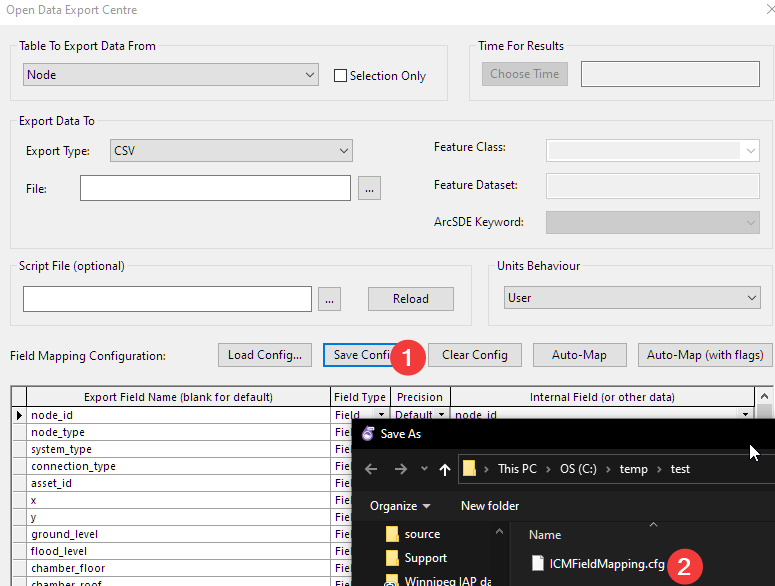

Another place to find clues are from the \*.rb source code.

In Ruby, comments are the lines start with “#”. If you use a text editor like Notepad++, it will recognize ruby and highlight comments usually in green color.

When a Ruby developer share the code with the community, usually he/she will leave the variables the user needs to change at the top of the script like this one, or by the end of the script if it starts with function definitions. Scan through the comments for clues to make changes.

# Add new function to the script

In order to add new function to the script, you’ll need to have some basic programming experiences. And you might need to take one introductory Ruby courses so that you can understand the basic structure of the language.

Another important reference is the API document for Ruby. You need to download it from the [support portal](https://innovyze.force.com/support/s/infoworks-icm-with-mapxtreme).

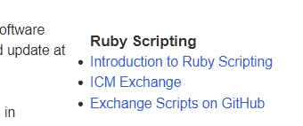

The API is documented in the “ICM Exchange” link.

Say we would like to export the land use table, and a review of the code shows that,

Line 30: calls the ODEC to export a table. The function is “odec_export_ex”, and we need to figure out for land use

-   What is the table name,

-   What is the configuration

-   Everything else probably we can use the same settings as other tables

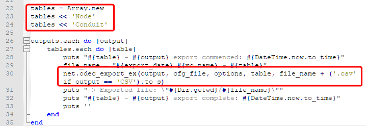

To answer that question, we need to search the API document. And we found it on pg74

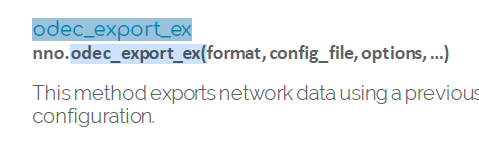

And after a little reading, we found how to name the table.

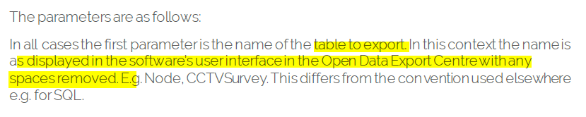

For “land use” it should be “Landuse”, and for the configuration file, we’ll need to manually add that to the configuration file.

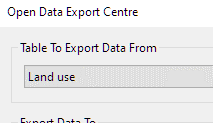

# Conclusion

Getting started with Ruby scripting can take as little as 5 minutes to use an existing script. To roll out your own script it will take some programming skills and studying the API documents.
