# Introduction

Large hydrologic models built with XPSWMM using the LA method can sometimes run into database corruption problems that stop the hydrology component from working. Instead of having to rebuild complex models by hand, this guide shows practical steps you can take: by extracting the hydrology parameters from XPSWMM and using the HydroCalc tool, you can create hydrographs and keep your project moving. These hydrographs can be imported back into XPSWMM for routing in the hydraulics model. This method also works for InfoWorks ICM users, since the hydrographs can be used as inflow objects.

The steps are:

- Extract LA hydrology parameters into a table from XPSWMM

- Prepare the table in HydroCalc’s input CSV format

- Run HydroCalc and convert the output CSV files to XPSWMM’s gauged inflow CSV format

- Set up gauged inflow in the XPSWMM routing model

# Extracting LA hydrology parameters

1.**Enable LA Hydrology Procedure**

- Go to application settings, access the config section, and turn on the LA hydrology procedure. Save changes and restart the application for the change to take effect.

> 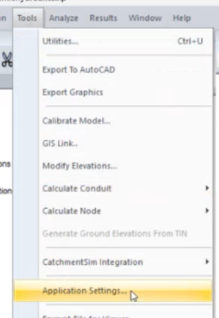 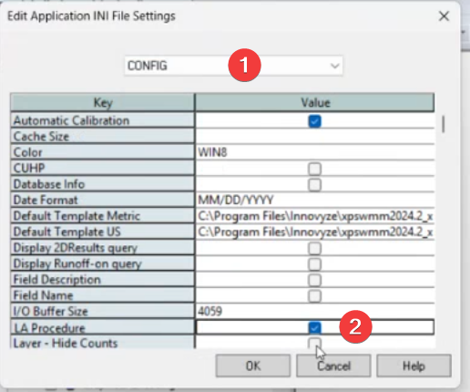

2. **Access the New Toolbar**

- After enabling, a new toolbar will appear. Open your project file to confirm the LA hydrology options are available. 

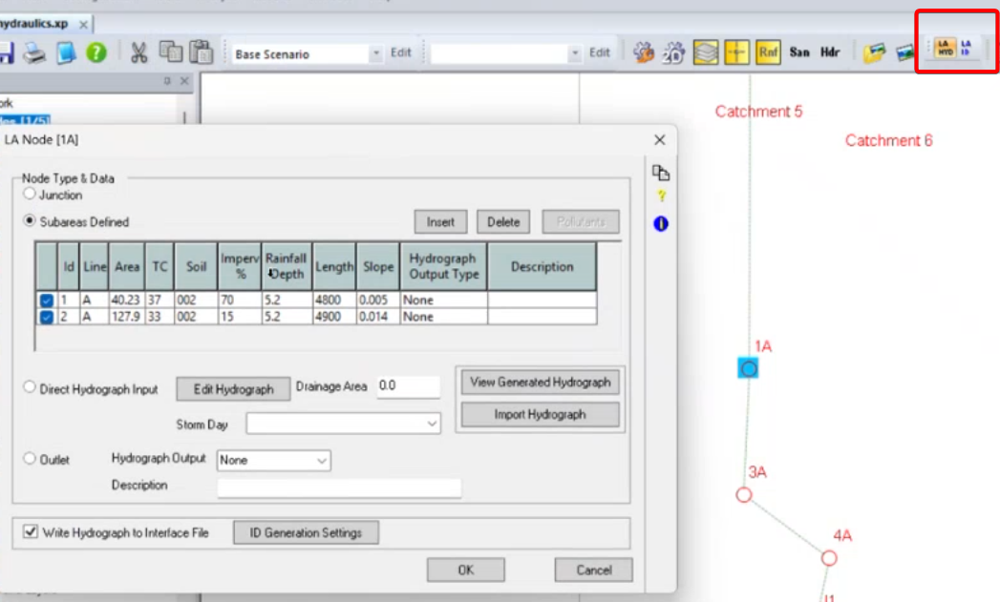

3. **Review Sub Areas and Routing**

- Click on the relevant nodes to view sub areas. Note that LA hydrology can route flow through links, but for most LA hydrology models using XPSWMM, routing is handled in XPSWMM hydraulics layer, therefore, all the links in RNF layer are disabled. 

4. **Extract Subareas Data**

- We need to extract all the subareas into a table, which will be the input for the HydroCalc tool. You can manually open each node, and copy the subareas rows into a spreadsheet.

- A more efficient way is to use XPTables:

1.  Open the XP table list

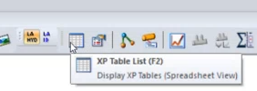

2.  Add a new table.

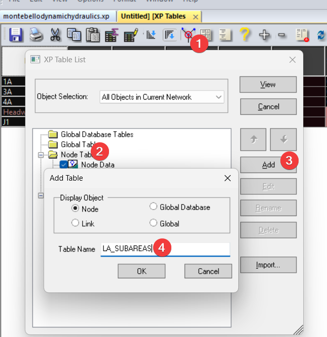

3.  For each sub area, enter required details such as ID, area, time of concentration (TC), soil type, impervious area, rainfall depth, and slope.

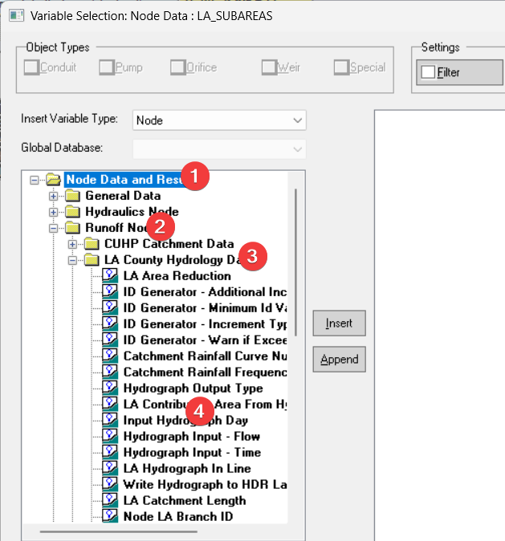

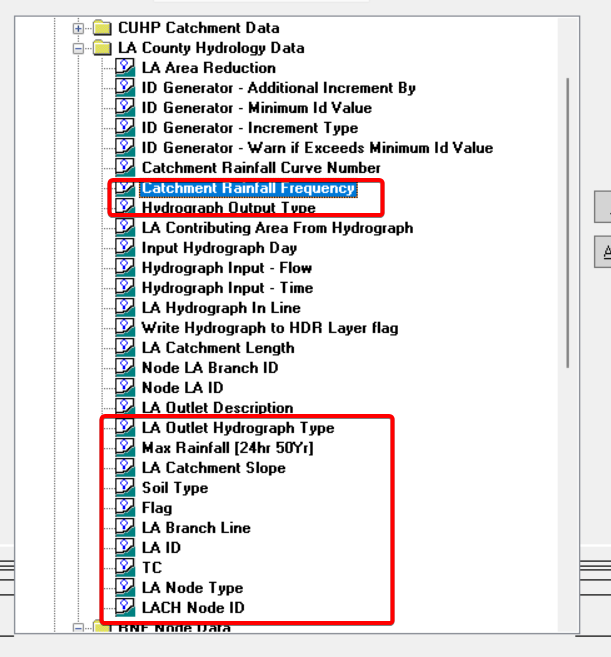

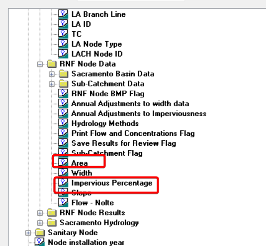

4.  You can also import the XPTable definition from the xpx file in the repo (data/xpx/ LA XPTables.xpx).

5.  Copy the rows with flag checked to a spreadsheet.

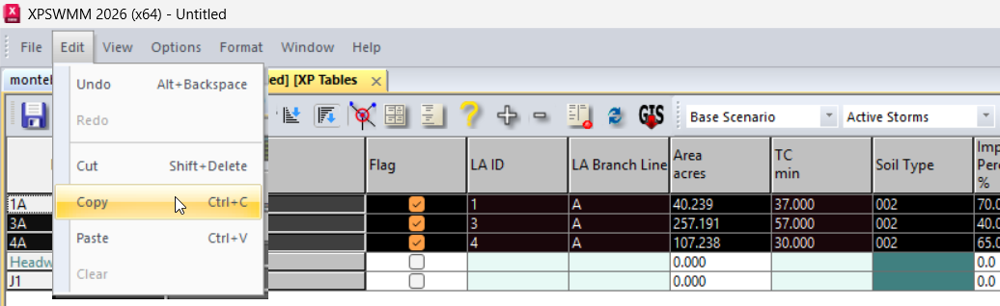

5. **Manually extract additional subareas for nodes**

- For nodes with more than 1 subareas, only the first row will show in the XPTable, you need to manually extract the additional data.

> 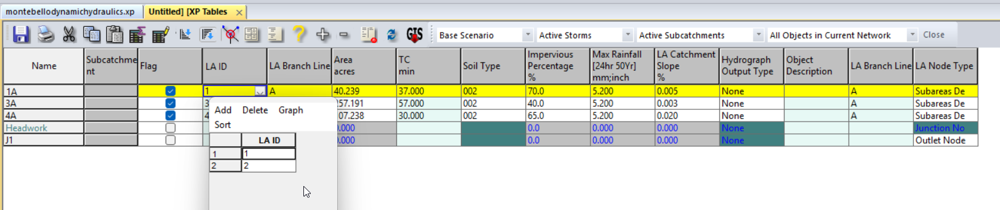

# Prepare Data for Hydrocalc

Download Hydrocalc from [LA County hydrology study](https://pw.lacounty.gov/ldd/lddservices/hydrologystudy.shtml), unzip the file and install it. You’ll find the sample_input_file.csv, which shows the data fromat.

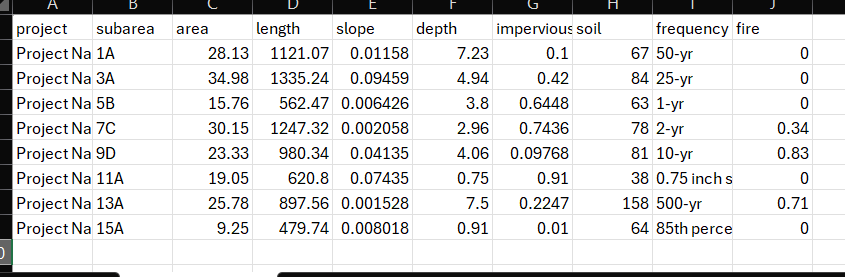

We need to map the XPSWMM subareas to the sample table.

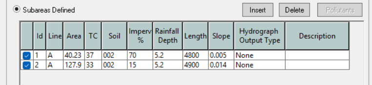

The mapping to the XPSWMM subareas are:

- project: enter the name of your project

- subarea: {id}{Line}

- area: {Area}

- length: {Length}

- depth: {Rainfall Depth}

- impervious: {Imperv}/100

- soil: {soil}

- frequency: 50-yr (verify your model setting)

- fire: 0 (verify your model setting)

<!-- -->

- When saving the csv file in Excel, , choose the ‘CSV’ option, not the ‘CSV UTF-8’ option.

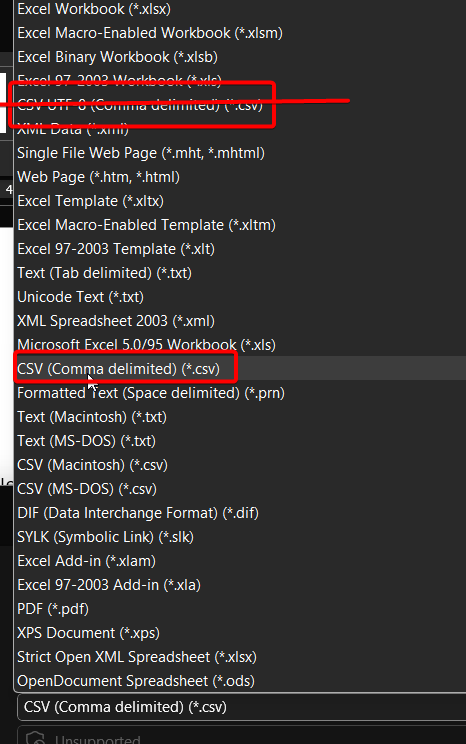

- When the encoding is wrong, it shows in the UI as corrupted characters.

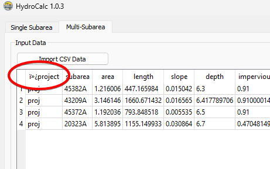

# Generate the hydrographs

- Use HydroCalc to generate the hydrographs, each subarea will have a hydrograph saved in a csv file.

> 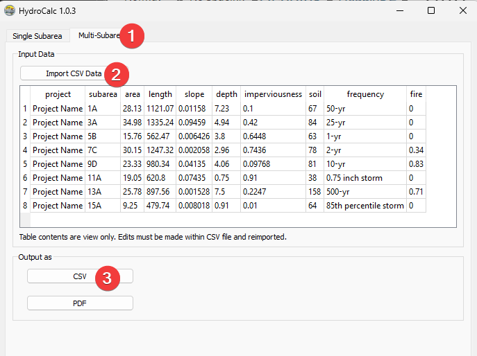

# Merge the hydrograph CSV files

Refer to the README.md in the repo source folder (source/README.md) for installation details. Once python and the denpenencies are installed run the command below to generate the gauged_inflow.csv for XPSWMM.

| uv run hydrocalc.py --csv_folder data/proj_a/CSV_Results --subarea_csv data/proj_a/proj_a.csv --output_folder data/proj_a/output --start_date "2023-01-01 00:00" --resample_interval 1 --check-plot "all" |
|-----------------------------------------------------------------------------------------------------------------------------------------------------------------------------------------------------------|

**What each part means:**

| **Part**                             | **Description**                                                                      |
|--------------------------------------|--------------------------------------------------------------------------------------|
| uv run hydrocalc.py                  | Runs the script using uv                                                             |
| --csv_folder data/proj_a/CSV_Results | Folder containing your hydrocalc CSV files (e.g., proj - 64.csv)                     |
| --subarea_csv data/proj_a/proj_a.csv | Your mapping file that lists which project goes with which subarea                   |
| --output_folder data/proj_a/output   | Where to save the results                                                            |
| --start_date "2023-01-01 00:00"      | When the time series starts (use your actual storm event date)                       |
| --resample_interval 1                | Resample to 1-minute intervals (optional, default is 1)                              |
| --check-plot "all"                   | Generate comparison plots for all subareas (optional, use "64,87" for specific ones) |

**Result:** The tool creates gauged_inflow.csv in your output folder, ready to import into XPSWMM.

**IMPORTANT**: HydroCalc might generate different results from XPSWMM, you need to check the results to make sure everything looks reasonable.

# Setup XPSWMM Model to Route Gauged Inflow

- Locate the \`gauge inflow.csv\` file in your output folder after running the script; this file contains time series data in long format with columns for date, time, flow, and station. 

> 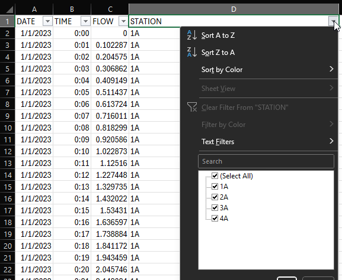

- Open your model in XP SWMM and switch to Hydraulics mode to load the data directly. 

- Set the model start time to match the CSV data (e.g., January 1st, 2023), and turn off the LACH method in configuration since you will not use the built-in inflow method.

> 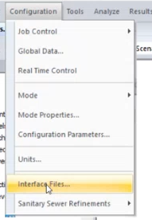 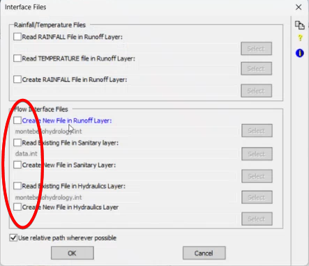
>
> 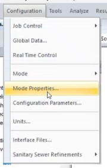 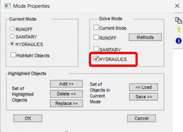

- Ensure node names in your model match the station names in the CSV; if a node has multiple sub-areas, manually combine their time series or adjust nodes for a one-to-one match. 

> 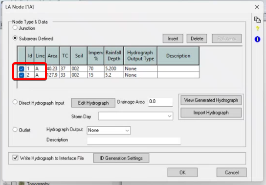

- In the Hydraulics layer, double-click a node, enable the "gauge inflow" option, and specify the CSV file path. Use a relative path by copying the CSV into the model folder to avoid path length issues. 

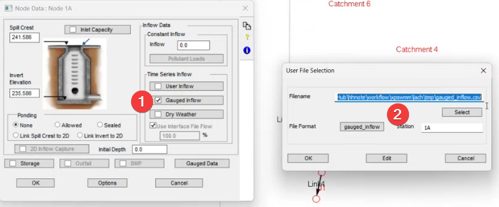

- Enter the station name (matching the node name) to filter the correct time series from the CSV. 

- Set up the file format to match the CSV structure: date, time, flow, station. Ensure column order and formats are correct. 

> 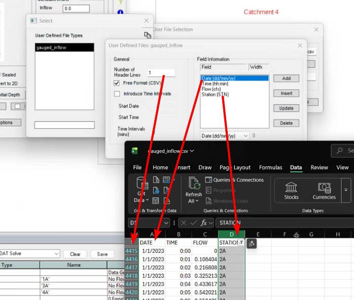

- Use the edit and graph options to check that the data loads and displays correctly for the node. 

> 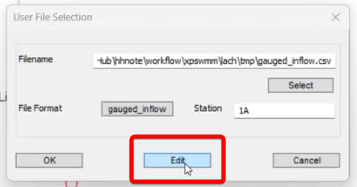
>
> 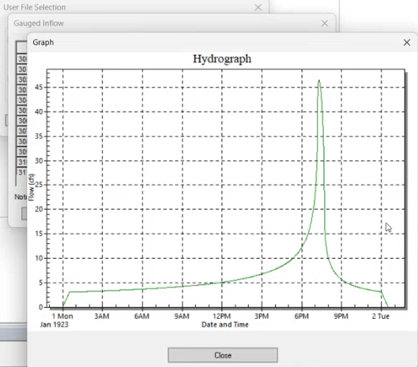

- For multiple nodes, open the XP Tables list, add the "gauged input data" fields, and use copy-paste to quickly assign file paths, station names, and enable flags. 

> 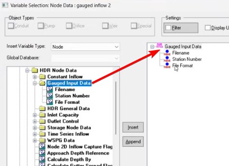
>
> 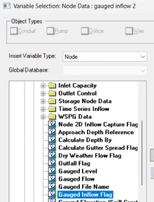
>
> 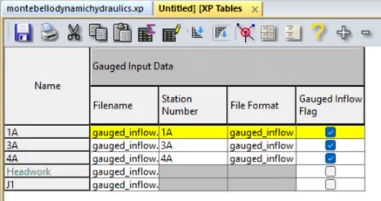

- Editing tips for XPTables,

  - Use the block editing tool to set the filename for the whole column

> 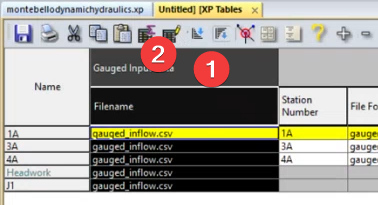
>
> 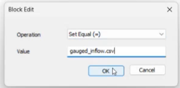

- Copy the table to Excel, update the station number field, then copy and paste it back to XPTable

<!-- -->

- Save your changes and run the model. Check the results to confirm inflow data is correctly applied.

# Repository Structure

lach/

├── readme.md              # This documentation

├── data/

│   ├── hydrocalc/         \# HydroCalc reference files

│   │   └── sample_input_file.csv

│   └── xpx/               \# XP Tables definitions

│       └── LA XPTables.xpx

├── media/                 \# Images for documentation

├── model/                 \# Sample XPSWMM model

│   └── montebellodynamichydraulics.xp

└── source/                # Python tool for merging hydrographs

    ├── README.md          # Tool installation and usage

    ├── hydrocalc.py       \# Main script

    ├── pyproject.toml     \# Python dependencies

    └── data/proj_a/       \# Sample project with example data
